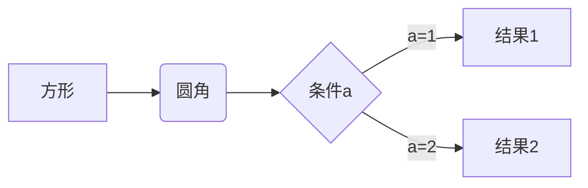
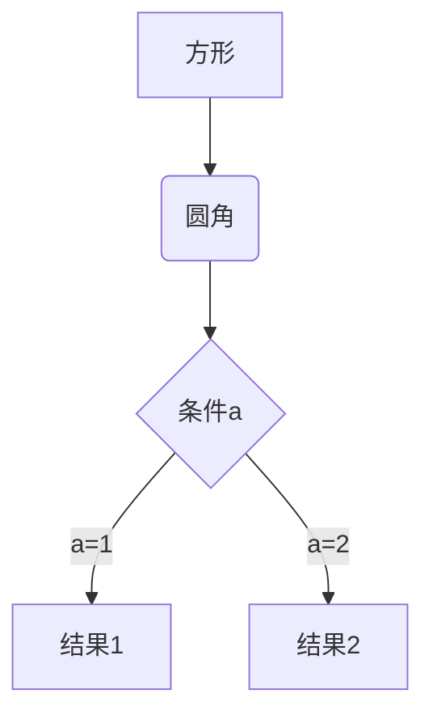
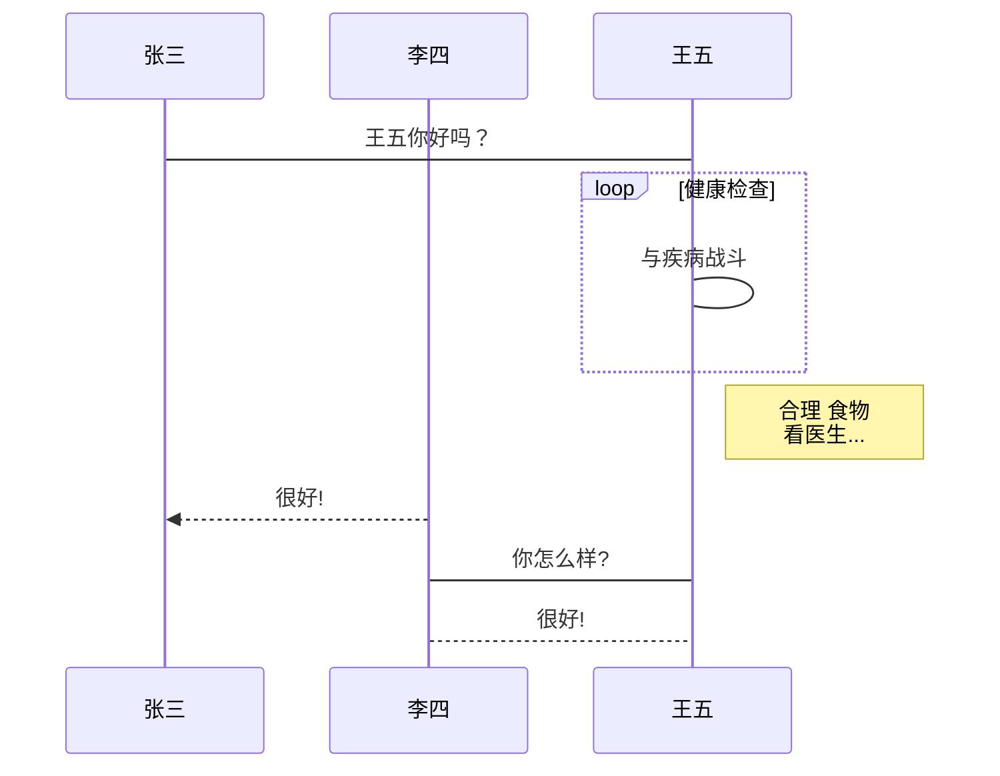
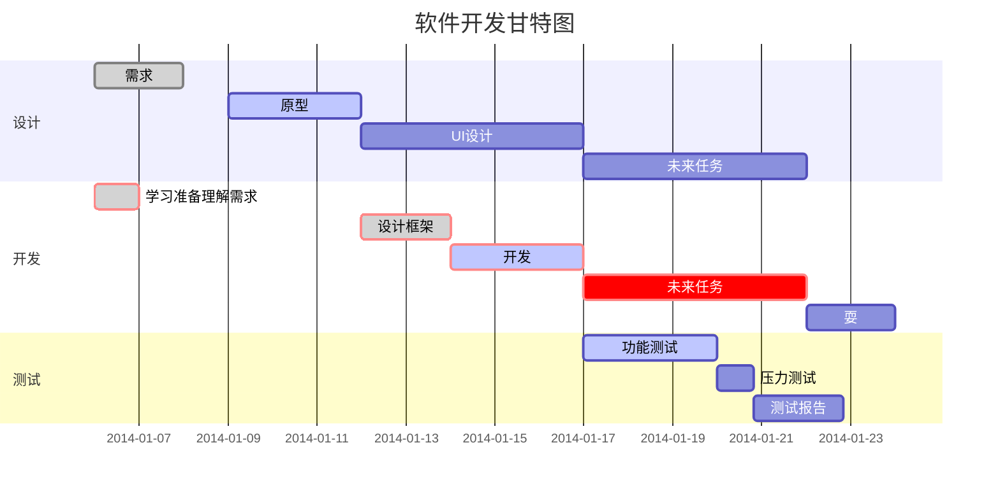
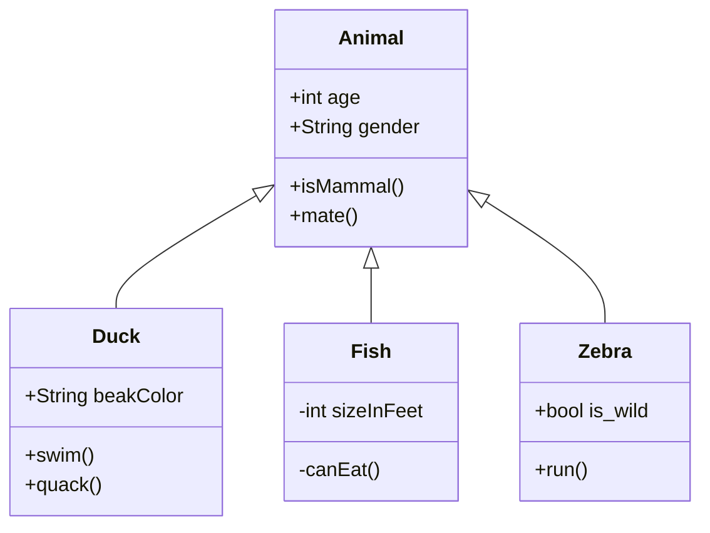
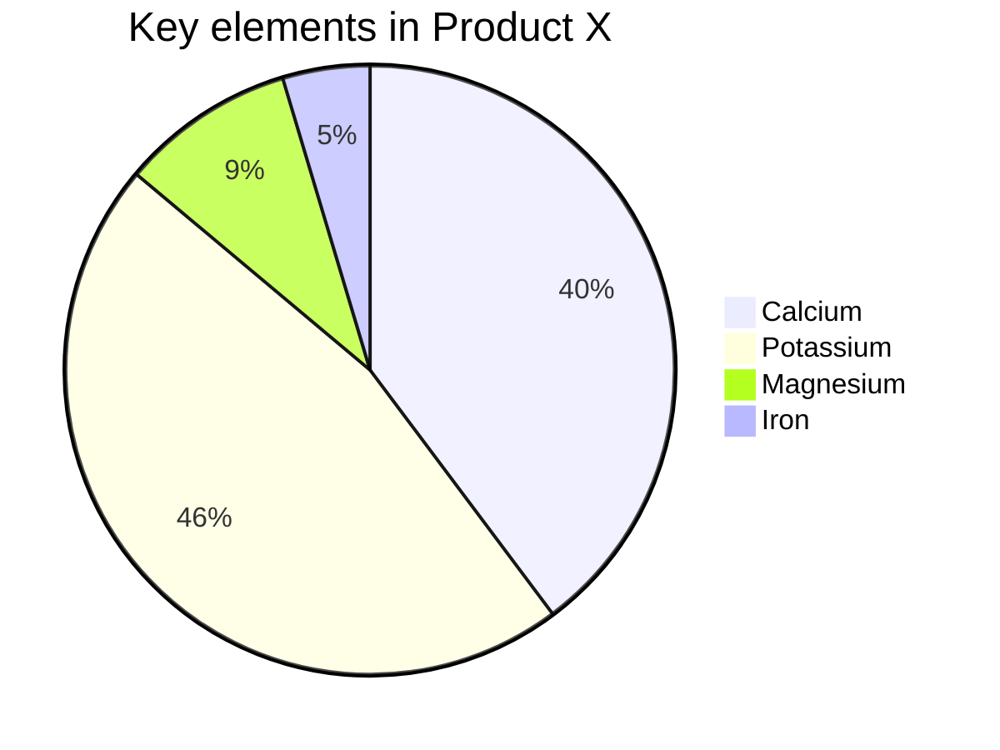

# study record

## git

### 分支操作

1. 创建分支
    `git branch "Branch Name"`
  - 查看所有分支记录
    `git branch -a`
  - 删除分支
    `git branch -D "Branch Name"`
  - 删除远程连接分支
    `git push origin --delete "Branch Name"`
2. 切换分支
    `git checkout "Branch Name"`
3. 上传
  - 单独上传 切换到需要上传的分支进行上传
  - 合并上传
    - 合并分支 需切换到主分支
    `git merge "Branch Name"`
    - 合并分支 增加日志
    `git merge "Branch Name" -m "log Name`


### 日常使用

1. 创建仓库
2. Git Bash Here
  - 创建本地仓库
    `git init`
3. 添加文件至暂存区
    `git add <fliename>`
    `git add .`
  - 查看暂存区状态 项目提交仓库后无法查看
    `git status`
4. 配置本地仓库
    `git config --global user.email "you@example.com"`
    `git config --global user.name "Your Name"`
5. 创建项目至本地仓库
    `git commit -m "log name"`
  - 查看日志列表
    `git log`
6. 项目更新/拉取远程代码合并
    `git pull`
    `git pull --rebase origin master`
  - 克隆项目
    `git clone "Project Address"`
7. 本地仓库同步至远程服务器
  - 连接远程
    `git remote add origin "Remote Address"`
  - 删除之前的远程仓库链接
    `git remote rm origin`
  - 上传项目
    `git push -u origin master`
  - 强制提交 会覆盖远程文件
    `git push -f origin master`


### 项目版本

1. 查看当前版本

   `git show`

2. 回到上个版本

   `git reset --hard HEAD^`

3. 查看所有版本号

   `git reflog`

4. 回退到指定版本

   `git reset --hard "reflog vesion"`


### 其他命令

1. 查看当前文件与暂存区文件区别
    `git diff`
2. 回撤所有文件
  - 如果已经向暂存区添加了项目，必须先回撤在撤销
    `git checkout --.`
  - 回撤add 取消暂存区文件
    `git reset HEAD.`
  - 回撤指定文件到上一个版本
    `git checkout --"fileName"`
3. 生成SSH密钥
    `ssh-keygen -t rsa -C "you@example.com"`
4. 查看密钥
    ```cat ~/.ssh/id_rsa.pub```
5. .gitignore文件 限制上传文件/文件夹


## javascript

### 递归思路

```js
const arr = [1, 2, 3, 4, 5, 6, 7, 8, 9, 10]

function sum (list, i = 0) {
  if (i === list.length) return 0
  return list[i] + sum(list, i+1)
}

console.log('sum', sum(arr)); // 55
```


### 斐波那契

```js
// Todo: 斐波那契 [1，1，2，3，5，8，13，21，34，55，89]
class Fibonacci {
  first (i) {
    if (i < 2) return 1
    const arr = [1, 1]
    for (let j = 2; j <= i; j++) {
      arr[j] = arr[j - 1] + arr[j - 2]
    }

    return arr[i]
  }

  two (i) {
    if (i < 2) return 1
    let num1 = 1, num2 = 1, num3
    for (let j = 2; j <= i; j++) {
      num3 = num1 + num2
      num1 = num2
      num2 = num3
    }

    return num3
  }
}

console.log(new Fibonacci().first(9)); // On ==> 55
console.log(new Fibonacci().two(9)); // O1 ==> 55
```

## 奇思妙想

### `1:1` 透明图片

```html

```

## 自我介绍

面试官你好，我叫xxx，我上一家公司是做花艺相关的项目。在公司中，我负责前后端的开发工作。
在上一家公司中，我收获了不单再技术方面的提升，还有与同事、客户、供应商的协调沟通能力的提升。

技术方面，从毕业之后一直从事前端方面的工作，Pc端、移动端和小程序方面都有相关的项目经验，对数据结构与java语言有一定程度的了解，能有效的与后端人员沟通。
我性格方面比较温和，平时相处中比较外向，喜欢和朋友们聚在一起玩。在代码开发中，我会比较沉浸，会全心全意的投入进去。以上就是我的自我介绍，谢谢。

## Markdown 高级语法

### 书写一个质能守恒公式[^LaTeX]

$$E=mc^2$$


### 画一个图

#### 横向流程图源码样例


#### 竖向流程图源码样例


#### 标准流程图源码样例

```flow
st=>start: Start
op=>operation: Your Operation
cond=>condition: Yes or No?
e=>end
st->op->cond
cond(yes)->e
cond(no)->op
st=>start: 开始框
op=>operation: 处理框
cond=>condition: 判断框(是或否?)
sub1=>subroutine: 子流程
io=>inputoutput: 输入输出框
e=>end: 结束框
st->op->cond
cond(yes)->io->e
cond(no)->sub1(right)->op
```

#### 标准流程图源码样例（横向）

```flow
st=>start: 开始框
op=>operation: 处理框
cond=>condition: 判断框(是或否?)
sub1=>subroutine: 子流程
io=>inputoutput: 输入输出框
e=>end: 结束框
st(right)->op(right)->cond
cond(yes)->io(bottom)->e
cond(no)->sub1(right)->op
```
#### UML时序图源码样例

```sequence
对象A->对象B: 对象B你好吗?（请求）
Note right of 对象B: 对象B的描述
Note left of 对象A: 对象A的描述(提示)
对象B-->对象A: 我很好(响应)
对象A->对象B: 你真的好吗？
```
#### UML时序图源码复杂样例

```sequence
Title: 标题：复杂使用
对象A->对象B: 对象B你好吗?（请求）
Note right of 对象B: 对象B的描述
Note left of 对象A: 对象A的描述(提示)
对象B-->对象A: 我很好(响应)
对象B->小三: 你好吗
小三-->>对象A: 对象B找我了
对象A->对象B: 你真的好吗？
Note over 小三,对象B: 我们是朋友
participant C
Note right of C: 没人陪我玩
```
#### UML标准时序图样例


#### 甘特图样例



#### 类图样例



#### 饼图样例




[^LaTeX]: 支持 **LaTeX** 编辑显示支持，例如：$\sum_{i=1}^n a_i=0$， 访问 [MathJax][4] 参考更多使用方法。