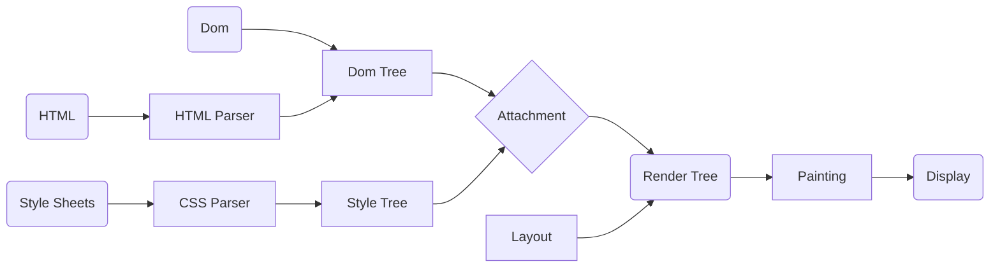

# Javascript

## 浏览器渲染机制

<table border="1">
  <thead>
    <tr>
      <th colspan="3">浏览器</th>
    </tr>
  </thead>
	<tr>
    <td rowspan="9">浏览器进程</td>
    <td>主进程(Browser Process)</td>
    <td>负责浏览器界面的显示与交互。各个页面的管理,创建和销毁其他进程。网络的资源管理、下载等。</td>
	</tr>
  <tr>
    <td>第三方插件进程(Plugin Process)</td>
    <td>每种类型的插件对应一个进程,仅当使用该插件时才创建。</td>
  </tr>
  <tr>
    <td>GPU进程(GPU Process)</td>
    <td>最多只有一个,用于 3D 绘制等</td>
  </tr>
  <tr>
    <td rowspan="6">渲染进程(Renderer Process)</td>
    <td>称为浏览器渲染进程或浏览器内核,内部是多线程的。主要负责页面渲染,脚本执行,事件处理等。 浏览器会给每个标签页开启一个新的渲染进程，以保证标签页之间互不影响。</td>
  </tr>
  <tr>
    <td>
      <code>JS引擎线程</code>
    </td>
  </tr>
  <tr>
    <td>
      <code>事件触发线程</code>
    </td>
  </tr>
  <tr>
    <td>
      <code>定时触发器线程</code>
    </td>
  </tr>
  <tr>
    <td>
      <code>异步http请求线程</code>
    </td>
  </tr>
  <tr>
    <td>
      <code>GUI渲染线程</code>
    </td>
  </tr>
</table>

> 浏览器渲染流程
>
> 1. 网络线程获取 HTML文件，生成一个渲染任务传递给渲染主线程的消息队列
> 2. 然后在事件循环机制的作用下，渲染主线程取出渲染任务开始渲染
>   - 渲染流程的阶段：HTML解析、样式计算、布局、分层、绘制、分块、光栅化、绘制
> 3. 解析 HTML 文件，构建 DOM 树，同时浏览器会启动预解析线程负责下载 CSS 文件
>   - 如果主线程解析到 script 位置，会停止 HTML 解析
>   - Js 会阻塞 HTML 的原因，Js 代码可能会操作 DOM 树，所以需要先下载 Js 文件并且执行 Js 代码
> 4. CSS 文件下载完成，解析 CSS 文件成 CSSOM 树，并开始样式计算`层叠、继承`，然后结合 DOM 树合并成 RenderObject 树
> 5. 布局 RenderObject 树 （Layout/reflow），负责 RenderObject 树中的元素的尺寸，位置等计算 `display: none;的元素不会出现在 RenderObject树中`
>   - reflow 就是重新计算布局树，重新计算位置和大小
>   - reflow 是异步的，但如果在 reflow 后读取则会强制先同步
> 6. 分层 Layer，堆叠上下文有关的属性 `z-index、opacity、transform`
>   - `will-change 样式可以影响分层<渲染效率卡顿时可以尝试使用>`
> 7. 绘制 RenderObject 树 （paint），绘制页面的像素信息
>   - 完成绘制后，合成线程会将整个视图分块，然后启动多个分块线程进行操作
> 8. 浏览器将默认的图层和复合图层交给 GPU 进程，GPU 进程将每个块变成位图，然后合成线程绘制出页面，之后合成线程会将指引`quead`信息重新交给 GPU， GPU在将信息传递给硬件设备(显卡)，最终完成屏幕显示 `处理图层(优先处理靠近视口的块) > 每秒绘制页面60次`
>   - `transform`效率高的原因就是它与主线程无关，它发生在合成线程内



> 排队<事件循环>
>
> 消息队列[message queue] >>> 任务、任务(渲染主进程)、任务(其他线程)、任务(其他线程)
> 1. 渲染主线程会进入无限循环
> 2. 每一次循环会检查消息队列是否存在任务。如果有，则取出第一个任务执行，执行完一个后进入下一次循环；如果没有，则进入休眠
> 3. 其他所有线程（包括其他进程的线程）可以随时向消息队列添加任务。新任务会加到消息队列的末尾。在添加任务的时候，如果主线程是休眠状态，则会将其唤醒以继续循环拿取任务。

**如何理解 JS 的异步**
> JS是单线程的语言，这是因为他运行在浏览器的渲染主线程中，而渲染主线程只有一个。
> 渲染主进程本身需要承担大量的工作，包括渲染页面、执行JS
> 如果使用同步的方式，就可能导致主线程产生阻塞，消息队列中的很多其他任务就无法得到执行。
> 这样一来，会导致繁忙的主线程白白消耗时间，另一方面也会导致页面无法及时更新，给用户带来卡死现象。
> 对此，浏览器采用异步的方式来避免。具体就是在某些任务发生时，比如计时器、网络请求、事件监听，主线程会将这些任务交给其他的线程去处身立即结束任务的执行，转而执行后续的任务。当其他线程完成时，再将事先传递的回调函数包装成任务，加入到消息队列的末尾，等待主线程的调度执行。
> 在这种模式下，浏览器永不阻塞，从而最大限度的保证了单线程的流畅运行。

## 事件循环(Event Loop)机制

    浏览器是一个多进程多线程的应用程序

> 事件循环就是消息队列，就是浏览器主线程的工作方式。
> 浏览器会开启一个无限for循环，每次循环从消息队列中取出一个任务执行，而其他线程只需要在适合的时候将任务加入队列末尾即可。
> 过去把消息队列简单分为宏队列和微队列，这种说法目前已经无法满足复杂的浏览器环境了，取而代之的是一种更加灵活的处理方式。
> 根据W3C官方解释，每个任务又不同的类型，同类型任务必须在一个队列，不同任务可以属于不同的队列。不同任务队列有不同的优先级，在一次事件循环中，由浏览器自行决定取哪一个队列，但浏览器必须有一个微队列，作为最高的优先级，必须先调度执行。

- 执行栈
  - 当执行某个函数、用户点击一次鼠标，Ajax完成，一个图片加载完成等事件发生时，只要指定过回调函数，这些事件发生时就会进入任务队列中，等待主线程读取,遵循先进先出原则。
- 主线程
  - 当遇到一个异步事件后，并不会一直等待异步事件返回结果，而是会将这个事件挂在与执行栈不同的队列中，我们称之为任务队列(Task Queue)。
  - 当主线程将执行栈中所有的代码执行完之后，主线程将会去查看任务队列是否有任务。如果有，那么主线程会依次执行那些任务队列中的回调函数。

> 异步任务分为 宏任务（macrotask） 与 微任务 (microtask)，不同的API注册的任务会依次进入自身对应的队列中，然后等待 Event Loop 将它们依次压入执行栈中执行。
>
> - 宏任务(macrotask)：
>    - script(整体代码)、setTimeout、setInterval、UI 渲染、 I/O、postMessage、 MessageChannel、setImmediate(Node.js 环境)
> - 微任务(microtask)： `优先`
>   - Promise、 MutaionObserver、process.nextTick(Node.js环境）

> Event Loop(事件循环)中，每一次循环称为 tick, 每一次tick的任务
>
> - 执行栈选择最先进入队列的宏任务(通常是script整体代码)，如果有则执行
> - 检查是否存在 Microtask，如果存在则不停的执行，直至清空 microtask 队列
> - 更新render(每一次事件循环，浏览器都可能会去更新渲染)
> - 重复以上步骤

> 任务类型
>
> - 同一个类型的任务必须在一个队列，在一次事件循环中，浏览器可以根据实际情况从不同队列中取出任务
> - 浏览器必须准备一个微队列，微队列中的任务优先所有其他任务执行

> Js中的计时器不能做到精确计时
> 1. 计算机硬件没有原子钟，无法精确计时
> 2. 操作系统的计时函数本身就存在偏差，Js的计时器最终调用时操作系统的函数
> 3. setTimeout嵌套超过五层就会使用4ms
> 4. 计时器的回调函数只能在主线程空闲时运行，带来了偏差

```javascript
setTimeout(function () {
    console.log(1);
}, 0);
new Promise(function(resolve,reject){
    console.log(2)
    resolve(3)
}).then(function(val){
    console.log(val);
})
console.log(4);
// 输出 2 4 3 1
```

> Promise的三种状态
>
> 1. resolve
> 2. reject
> 3. Pending

```javascript
Promise.resolve().then(() => {
  console.log(1)  //1
}).catch(() => {  //无报错不执行
  console.log(2)
}).then(() => {
  console.log(3)  //3
})//resolved状态
// 输出 1 3

Promise.resolve().then(() => {
  console.log(1)  //1
  throw new Error('erro1')  //rejected状态
}).catch(() => {  //resolved状态
  console.log(2)  //2
}).then(() => {
  console.log(3)  //3
})//resolved状态
// 输出 1 2
```

## 浏览器垃圾回收策略

> 在 JavaScript 内存管理中有一个概念叫做`可达性`，就是那些以某种方式可访问或者说可用的值，它们被保证存储在内存中，反之不可访问则需回收

- 标记清除算法
- 引用计数算法

## 闭包

> - 闭包就是每次调用外层函数时，临时创建的函数作用域对象。
> - 因为内层函数作用域链中包含外层函数的作用域对象，且内层函数被引用，导致内层函数不会被释放，同时它又保持着对父级作用域的引用，这个时候就形成了闭包。

- 实现块级作用域
- 保存内部状态 `缓存cache`
- 函数柯里化 `Fn(1)(2)(3)`
- 单例模式 `避免了重复的实例化`
- 模拟私有属性

> 闭包的过度使用造成内存泄露，我们在调用闭包返回的函数时，函数同时使用闭包外层的变量，导致该变量无法被释放，造成内存泄露。

**解决方案**
  - 减少闭包中引用的外部变量，只保留必要的变量
  - 及时释放无用的引用 `返回的函数调用后，把外部的引用关系置空`

## JSON(parse、stringify)

- `JSON.parse()` 方法用来解析JSON字符串，构造由字符串描述的JavaScript值或对象。
- `JSON.stringify()` 方法是将一个JavaScript值(对象或者数组)转换为一个 JSON字符串，如果指定了replacer是一个函数，则可以选择性的替换值，或者如果指定了replacer是一个数组，可选择性的仅包含数组指定的属性。
  - 布尔值、数字、字符串的包装对象在序列化过程中会自动转换成对应的原始值。
  - 所有以 `symbol` 为属性键的属性都会被完全忽略掉，即便 replacer 参数中强制指定包含了它们。
  - 属性为函数或者undefined，则会被忽略。
  - 转换值如果有toJSON()方法，该方法定义什么值将被序列化。
  - 非数组对象的属性不能保证以特定的顺序出现在序列化后的字符串中。
  - undefined、任意的函数以及 symbol 值，在序列化过程中会被忽略（出现在非数组对象的属性值中时）或者被转换成 null（出现在数组中时）。函数、undefined被单独转换时，会返回undefined，如JSON.stringify(function(){}) or JSON.stringify(undefined).
  - 对包含循环引用的对象（对象之间相互引用，形成无限循环）执行此方法，会抛出错误。
  - NaN和Infinity格式的数值及null都会被当做null。
  - 仅会序列化可枚举的属性。

## js 继承

    继承的本质就是复制，即重写原型对象，代之以一个新类型的实例。

- 原型链继承
  - 原型链方案存在的缺点：多个实例对引用类型的操作会被篡改。
  ```js
    function SuperType () { this.property = true }
    SuperType.prototype.getSuperValue = function () {
      return this.property
    }
    function SubType () { this.subproperty = false }

    // 创建SuperType的实例，将实例赋值给SubType.prototype
    SubType.prototype = new SuperType()
    SubType.prototype.getSubValue = function () {
      return this.subproperty
    }
    let instance = new SubType()
    console.log(instance.getSuperValue()) // true
  ```

- 借用构造函数继承
  - 只能继承父类的实例属性和方法，不能继承原型属性/方法
  - 无法实现复用，每个子类都有父类实例函数的副本，影响性能
  ```js
    function SuperType () { this.color = ['red', 'green', 'blue'] }
    function SupType () { SuperType.call(this) } // 继承自SuperType

    let instance1 = new SubType()
    instance1.color.push('black')
    console.log(instance1) // ['red', 'green', 'blue', 'black']
    let instance2 = new SubType()
    console.log(instance2) // ['red', 'green', 'blue']
  ```

- ES6类继承extends

## ES6

- let和const关键字
- 函数参数默认值
- 箭头函数
- 模板字符串
- 扩展操作符
- 解构赋值
- 对象字面量简化
- 类
- 模块化
- Promise
- Symbol
- Map/WeakMap和Set/WeakSet数据结构
- 迭代器（Iterator）和for...of
- 生成器（Generator）
- Proxy
- Reflect
- 数组对象扩展 `from、find、findIndex、fill、values、entries`
- 字符串对象扩展 `includes、startsWith、endsWith`
- Math对象扩展 `Number.isNaN、Number.parseInt、Number.parseFloat`
- Object对象扩展 `Object.is、Object.assign、Object.getPrototypeOf、Object.setPrototypeOf`
- 正则对象扩展 `i、`

## ES7

- Array.prototype.includes()方法
- 指数操作符 `Math.pow(2, 3) === (2 ** 3)`

## ES8

- async/await
- Object.entries
- Object.values

## ES9

- for await...of
- Promise.finally() `不管是结果是resolved还是rejected，都会调用finally`
- 正则表达式扩展 `命名捕获组`

## ES10

- 数组扁平化 `Array.prototype.flat()`
- catch 绑定 `不需要通过 catch 语句的参数来引用error`

## ES11

- 全局对象`globalThis`，无论在node还是window下都可使用
- BigInt
- 可选链操作符 `?.`
- 空值合并操作符 `??`
- import()
- Promise.allSettled() `与 Promise.all() 不同的是，即使其中的某个 Promise 被拒绝（rejected），Promise.allSettled() 仍会等待所有 Promise 对象都被解决，然后返回一个包含每个 Promise 对象结果的数组。`

## ES12

- 数值分隔符 `1_000_000`
- 逻辑赋值运算符 `||=、&&=、??=`
- String.prototype.replaceAll()
- Promise.any()


## JS优化

1. 减少DOM操作数量
2. 避免使用with语句、eval函数，避免引擎难以优化。
3. 尽量使用原生方法，执行效率高。
4. 将js文件放到文件页面底部，避免阻塞页面渲染
5. 使用事件委托，减少事件绑定次数。
7. 合理使用缓存，避免重复请求数据。