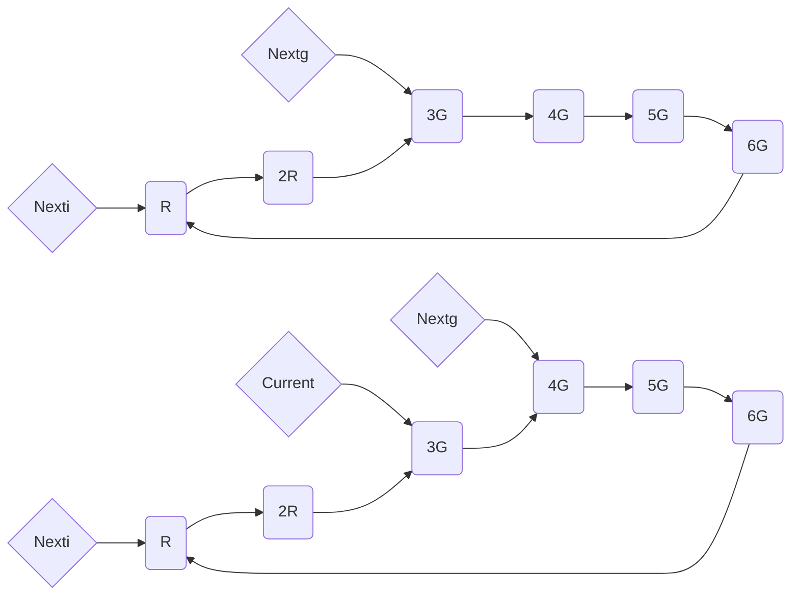
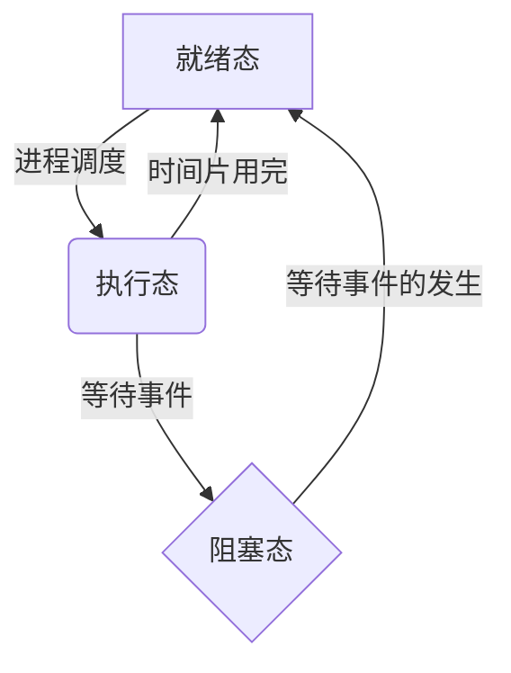

# 操作系统概论

## 操作系统简介

### 什么是操作系统

- 操作系统是覆盖在裸机上的`第一层`软件，编译程序、数据库管理系统及其他应用程序都运行在操作系统之上，操作系统为这些软件提供运行环境。
- 在计算机专业领域，接口分为`硬件接口`和`软件接口`，硬件接口如USB接口、串口和并口，软件接口如C语言中的函数`prinft()`。

> 操作系统必须完成的两个目标
>
> 1. 与硬件部分相互作用，为包含在硬件平台上的所有底层可编程部件提供服务。
> 2. 为运行在计算机系统上的应用程序（即所谓用户程序）提供执行环境。

- 现代计算机系统的一个重要特点就是`支持多任务`，既允许在同一个系统内同时驻留多个应用程序
- 操作系统所管理的资源主要包括`处理机`、`内存`、`设备`和`文件`，在网络操作系统中还包括`网卡`、`宽带`等

> 操作系统的主要功能
>
> 1. 处理机管理。在单处理机系统中执行多个程序流，必须由操作系统的处理机调度程序来管理处理机的分配，以使多个程序共享处理机，从宏观上看多个程序能同时顺利执行。在多处理机系统中，也需要操作系统对多个处理机在多任务的情况下进行有效的管理。
> 2. 内存管理。在多任务系统中，内存不再是独占资源，而是可能被多个应用程序共同占用。如何为多个应用程序分配内存并使不同程序的地址空间互不干扰，如何在程序执行完毕之后回收其所占内存，以及完成逻辑地址到物理地址的转换，都是操作系统内存管理程序要完成的功能。
> 3. 设备管理。设备管理主要完成接受用户的I/O请求，为用户分配I/O设备、管理I/O缓存和驱动I/O设备等功能。
> 4. 文件管理。计算机系统把大量需要长时间保留的数据信息以文件的形式存放在外存储设备中（如硬盘、光盘、磁带和U盘），操作系统通过自己的文件管理程序完成外空间的分配、回收、文件的按名存取、文件的组织、共享与保护等功能。

### 操作系统的发展

- 操作系统的发展从时间顺序上经历了从`无操作系统系列`到`单道批处理系统`、`多道程序系统`（多道批处理系统、分时系统）的发展过程。随着计算机应用领域的扩大，计算机体系结构的多样化，有出现了`微机操作系统`、`网络操作系统`、`实时操作系统`、`嵌入式操作系统`和`物联网操作系统`。
- 第一代计算机（1945~1955）使用`电子管`作为主要电子器件，用插件版上的硬件连线或穿孔卡片表示程序，没有用来存储的内存，无操作系统。
- 第二代计算机（1955~1965）使用的主要电子器件是`晶体管`，开始使用`磁性存储设备`，内存容量增加，计算机运算速度提高，出现了早起的单道批处理系统。
- 操作员在专门用于计算的、性能较高的计算机上装入早期的操作系统，也称`监视系统`，它能自动从磁带读入作业并使之运行，把作业运行结果写入专门存放输出结果的磁带上。
- 随着电子技术的发展，计算机采用集成`电路芯片`作为主要的电子器件，IBM360使第一个采用小规模集成电路芯片的主流机型。
- `实时系统`是支持实时计算的系统。

> 批处理系统、分时系统、实时系统的特点
>
> 1. 单道批处理系统的特点。单道批处理系统内存中只有一道作业，可以自动成批处理作业，其特点包括自动性、顺序性、单道性。
> 2. 多道批处理系统的特点。在多道批处理系统中，用户所提交的作业都先存放在外存中并排列成一个队列，该队列被称为“后备作业队列”。与单道批处理系统相比，多道批处理系统支持多道程序驻留内存，CPU可以不再空闲等待I/O。多道批处理系统的特点包括多道性、无序性、调度性、复杂性。多道批处理系统的优点是能提高CPU、内存和I/O设备的利用率和系统的吞吐量。多道批处理系统的缺点是系统平均周转时间长，缺乏交互能力。周转时间是指从作业被提交给系统开始到作业完成为止的时间。
> 3. 分时系统的特点。分时操作系统允许多个用户通过终端同时使用计算机，分时系统的特点包括多路性、独立性、及时性和交互性。分时系统的优点是向用户特供了人机交互的方便性，使多个用户可以通过不同的终端共享主机。
> 4. 实时系统的特点。实时系统主要用于实时控制和实时信息处理领域。实时系统必须能及时响应外部事件的请求，在规定的时间内完成对该事件的处理，并控制所有实时任务协调一致地运行。与分时系统相比，实时系统的特点包括多路性、独立性、及时性、交互性、可靠性。

- 分时系统的实现需要解决两个关键问题，即`及时接收`和`及时处理`。
- 主机操作系统是运行在大型主机上的操作系统，主要提供三类服务：`批处理`、`事务处理`和`分时处理`。
- 批处理系统处理不需要交互式用户干预的周期作业，`保险公司的索赔处理`或者`连锁商店的销售报告`通常以批处理的方式完成。
- `事务处理系统`负责大量的小请求。
- `分时系统`允许多个远程用户同时在计算机上工作，执行命令或处理作业。
- `嵌入式系统`的概念出现在20世纪70年代，是宿主于非计算机设备中的计算机系统。嵌入式操作系统是运用于嵌入式设备中的操作系统。

### 操作系统的特征

- 现代操作系统都支持多任务，具有`并发`、`共享`、`虚拟`和`异步`特征。

### 操作系统的功能

- 内存管理的主要任务是`为多道程序的运行提供良好的环境`，方便用户使用内存，提高内存的利用率，以及从逻辑上扩充内存以实现虚拟存储。
- 内存管理应具有`内存分配`、`内存保护`、`地址映射`和`内存扩充`功能。

> 内存保护的任务
>
> 1. 使操作系统内核空间不会被用户随意访问，以保证系统的安全和稳定。
> 2. 确保每道用户程序都在自己的空间中运行，互不干扰。

- CPU执行程序过程中访问内存时，需要把程序的逻辑地址转变为物理地址，这个转换的过程称为`地址映射`。
- 为了能从逻辑上扩充内存，系统必须具有内存扩充机制，以实现`请求调入功能`和`置换功能`。
- 进程管理功能主要包括`进程的描述与组织`、`进程控制`、`进程同步`、`进程通信`及`进程调度`。

> 设备管理应该具有的功能
>
> 1. 缓冲管理。管理各种缓冲区。
> 2. 设备分配。分配用户I/O所需要的设备。
> 3. 设备处理。由设备驱动程序来实现CPU与设备控制器之间的通信。
> 4. 设备独立性和虚拟设备。设备独立性功能使应用程序独立于物理设备。

- 目录包括`文件名`、`文件属性`及`文件的地址`等信息。
- 操作系统提供给程序员的接口是`系统调用`。

### 操作系统的体系结构

- `明确清晰的软件体系结构`是一种贯穿软件系统整个生命周期的主线，是软件设计成功的基础和关键，也是对软件大型化、复杂化趋势的一种很好的应对决策。
- `单体内核`是操作系统中最早、最常见的体系结构。
- 具有单体内核结构的典型操作系统有`UNIX系统`、`MS-DOS`、`Linux`、`Mac OS X`和`BSD`等系统。

> 层次结构的基本思想
>
> 将操作系统分解为多个小的、容易理解的层，系统功能被隔离在不同的层中，每一层提供对系统功能的部分抽象，然后采用单向调用的顺序，形成一连串彼此连续的对系统功能的“抽象串”，最终形成对整个系统的完整抽象。

- 分层结构最经典的例子是`Dijkstra 的 THE系统`，它是20世纪60年代在TechnischeHofeschool Eindhoven上开发的。
- 微内核技术是操作系统发展的一个里程碑，它的核心思想是`核心功能外移`。

> 微内核结构用一个水平分层结构代替传统的纵向分层结构的好处
>
> 1. 只要接口规范，操作系统可以方便地增加或者删除服务功能，系统具有良好的灵活性。
> 2. 服务器进程运行在独立的用户进程空间中，如果某个服务器出现问题，不会引起系统其他服务器甚至是系统的崩溃，可靠性好。
> 3. 微内核体积小，便于测试、管理和维护，而且修改服务器的代码也不会影响系统其他部分。
> 4. 由于微内核技术实现了基于客户/服务器体系结构的操作系统，完全适宜于网络环境及分布式计算模型。

### 指令的执行

- 一个单一指令需要的处理称为`指令周期`，一个指令周期可以划分成两个步骤，分别是`取值周期`和`执行周期`。
- 在每个指令周期开始时，处理器从`存储器`中取一条命令。

> 处理器解释指令并执行要求的动作的分类
>
> 1. 处理器与存储器之间的指令或数据传送操作。
> 2. 处理器与I/O设备之间的指令或数据传送操作。
> 3. 算数运算操作或逻辑运算操作。
> 4. 控制操作，即修改指令的执行顺序的操作。

- 程序执行的过程是`反复取指令和执行指令`的过程
- 指令执行的结果就是`使寄存器或内存单元的值发生变化`，指令执行的过程也就是存储体内容不断变化的过程。
- 取指令和执行指令是由`硬件`完成的，不同硬件的体系结构支持不同的指令集合，为某一种硬件平台开发的操作系统不能直接在另一种体系结构的硬件上运行。

## 进程管理

### 进程的描述

- 操作系统中最核心的概念是`进程`，操作系统的其他所有内容都是围绕进程展开的。

> 程序并发执行的特点
>
> 1. 程序的顺序执行。早期误操作系统及单道批处理系统的计算机中，程序的执行方式都是典型的顺序执行。先进入内存的程序先执行，在一个程序执行完毕之前，不能执行其他程序。程序中的指令也是依照程序的控制流依次执行，一条指令执行完毕之前不能开始执行另一条指令。程序顺序执行时具有以下特点：
>    - 顺序性。处理机的操作，严格按照程序所规定的顺序执行，即只有前一操作结束后，才能执行后继操作。
>    - 封闭性。程序是在封闭的环境下运行的。程序一旦开始运行，其结果不受外界因素的影响。
>    - 可再现性。只要程序执行时的环境和初始条件相同，当程序多次重复执行时，其执行结果相同。
> 2. 程序的并发执行。程序并发执行是指在同一时间间隔内运行多个程序。一个程序执行结束之前，可以运行其他程序。对用户而言，看到的是计算机同时运行多个程序。程序并发执行的确切含义是从宏观上，用户看到多个程序同时向前不间断地推进。而从微观上，任意时刻一个CPU上只有一个程序在执行。在现代单CPU或多CPU的计算机中，支持多任务及支持多用户多任务的操作系统都能够有效管理和支持程序的并发执行。多道程序系统和分时系统都允许用户程序在计算机系统中并发执行，程序并发执行具有以下几个特点：
>    - 间断性。每个程序在CPU上运行，都是时断时续的。当请求某种资源的程序数量大于被请求的资源数量时，就必然有因申请不到资源而暂停执行的程序。当其他程序释放资源后，该程序才可能继续执行。资源的有限使并发执行的程序呈现执行过程的间断性。
>    - 失去封闭性。程序在并发执行时，由于它们共享资源或者合作完成同一项任务，系统的状态不再是只有正在执行的某一个程序可以“看见”和改变。
>    - 不可再现性。程序在并发执行时，由于失去了封闭性，也将导致其失去执行结果的可再现性。同一个程序在输入完全的情况下多次运行，可能出现不同的运行结果。

> 进程的特征
>
> 1. 并发性。多个进程实体能在一段时间间隔内同时运行。并发性时进程和现代操作系统的重要特征。
> 2. 动态性。进程是进程实体的执行过程。进程的动态性表现在因执行程序而创建进程、因获得CPU而执行进程的指令、因运行终止而被撤销的动态变化过程。
> 3. 独立性。在没有引入线程概念的操作系统中，进程是独立运行和资源调度的基本单位。
> 4. 异步性。异步性是指进程的执行时断时续，进程什么时候执行、什么时候暂停都是无法预知的，呈现一种随机的特征。
> 5. 结构特征。进程实体包括`用户正文段`、`用户数据段`和`进程控制块`。

> 进程与程序的区别
>
> 1. 程序是静态的，进程是动态的。程序是存储在某种介质上的二进制代码，进程对应了程序执行的过程，系统不需要为一个不执行的程序创建进程，一但进程被创建，就处于不断变化的动态过程中，对应了一个不断变化的上下文环境。
> 2. 程序是永久的，进程是暂时存在的。程序的永久性是相对于进程而言的，只要程序的拥有者不去删除它，程序可以永久地存在于磁盘、U盘等外存储介质中。进程因程序的执行而被创建，因程序执行的结束而被撤销，有一个相对短暂的生命期。
> 3. 程序与进程的存在实体不同。程序是指令的集合，而进程是包括了正文段、用户数据段和进程控制块的实体。

> 进程与程序的联系
>
> 1. 进程是程序的一次执行，进程总是对应至少一个特定的程序，执行程序的代码。
> 2. 一个程序可以对应多个进程。同一个程序可以在不同的数据集合上运行，因而构成若干个不同的进程。几个进程能够并发地执行相同的程序代码，而同一个进程能顺序地执行几个程序。

- 不同操作系统进程控制块中包含的描述信息部完全相同，一般操作系统中的进程控制块中通常包含`进程标识符信息`、`处理机信息`、`进程调度信息`和`进程控制信息`。

> 进程控制块中保留的处理机状态信息
>
> 1. 通用寄存器
> 2. 指令计数器
> 3. 程序状态字PSW
> 4. 用户栈指针

- 进程的3中基本状态：`就绪态`、`执行态`和`阻塞态`。
- 进程状态不能有阻塞态直接变为`执行态`，进程状态由阻塞态变为就绪态的过程称为`唤醒过程`，由执行态变为阻塞态的过程称为`阻塞过程`。

### 进程的控制

> 需要创建新的进程的情况
>
> 1. 用户登录。在交互式系统中，当一个新用户登录系统时会创建进程。
> 2. 作业调度。当把位于外存储器中的作业调入内存准备运行时，操作系统会为作业的运行创建进程，
> 3. 提供服务。操作系统可以创建一个程序，代表用户程序执行某种功能，使用户无需等待。
> 4. 应用请求。当用户发出执行某程序的命令，或者用户程序在执行中基于并行的要求在程序中显式调用进程创建的系统调用时，都会引起进程的创建。

- 在Linux系统中，除了`0号进程（swapper进程）`外的其他进程都是由其父进程创建的。
- 与进程创建密切相关的函数有`execve()`，与其对应的系统调用是sys_execve()，主要功能是使进程执行新的程序代码。

> 操作系统可能进行进程的阻塞和唤醒操作的情况
>
> 1. 请求系统服务
> 2. 启动某种操作
> 3. 新数据尚未到达。对于一个计算进程，如果新的输入数据还没有到达，计算进程需要阻塞等待。
> 4. 无新工作可做。发送消息之后等待时。

> 进程唤醒的过程
>
> 1. 将进程从阻塞队列中移出
> 2. 将进程状态由阻塞态改为就绪态
> 3. 将进程插入就绪队列

> 进程被终止的情况
>
> 1. 当进程正常执行完毕，调用终止进程的系统调用，请求操作系统删除该进程。
> 2. 一个进程调用适当的系统调用，终止另外一个进程。通常，操作系统规定只允许父进程通过这种方式终止其子进程。

- 如果选择硬盘启动，计算机会检查硬盘的`0柱面0磁道1扇区`，如果发现该扇区以`0xAA5`结束，则BIOS认为它是引导扇区，一但发现引导扇区，BIOS会执行程序将其装入到内存地址0000 : 7e00处，然后跳转到该地址处执行这段引导程序代码，开始加载操作系统。

### 操作系统内核

- 资源管理包括`进程管理`、`存储器管理`和`设备管理`。

> 中断的类型
>
> 1. 同步中断（内部中断或异常）。同步中断是当指令执行时由CPU控制单元产生的，之所以称为同步模式因为只有在一条指令终止执行后CPU才会发出中断，如除法出错、调试、溢出和浮点出错等。
> 2. 异步中断（外部中断）。异步中断是由其他硬件设备随机产生的。在Intel微处理器手册中，把同步中断和异步中断分别称为异常（Exception）和中断（Interrupt）。Linux中采用这种分类，有时也用术语”中断信号“来表示这两种类型 的中断（同步中断及异步中断）。

- 大部分PC中有两个时钟源，分别微`实际时钟（RTC）`和`OS时钟`。RTC时钟也称CMOS时钟，是一块时钟芯片，靠`电池`供电，为计算机提供计时标准，是最原始、最底层的数据。OS时钟产生于PC主板上的定时/计数芯片，在开机时有效，由`操作系统`控制。
- `系统调用`是系统程序与用户程序之间的接口。
- 在类UNIX系统中，系统调用多使用`C语言提供的库函数`作为接口

> 系统调用的类型
>
> 1. 进程控制类系统调用。创建、撤销进程；获得、改变进程属性。
> 2. 文件操纵类系统调用。创建文件、删除文件、打开文件、关闭文件和读/写文件。
> 3. 设备管理类系统调用。请求、释放设备。
> 4. 通信类系统调用。打开、关闭连接，交换信息。

### 进程同步

> 同步机制应遵循的准则
>
> 1. 空闲让进
> 2. 忙则等待
> 3. 有限等待
> 4. 让权等待

- `自旋锁`是用来在多处理器环境中工作的一种特殊的锁。如果内核控制路径发现自旋锁”开着“，就是相应的整型信号量的值`大于0`，就获取锁并继续自己的执行。相反，如果内核控制路径发现锁由运行在另一个CPU上的内核控制路径”锁着“，即整型信息号量的值`等于0或者小于0`，就反复执行一条紧凑的循环指令，知道锁被释放。
- 整型信号量的值只能由`wait`和`signal`操作改变。
- 管程是一个由`过程`、`变量`和`数据结构`等组成的集合，他们组成一个特殊的模块或软件包。
- 一个管程过程，可以用在某条件变量上执行`wait`操作，将调用管程的进程阻塞并插入该条件的阻塞队列；用在条件变量上执行`signal`操作，唤醒在该条件上阻塞的进程。

### 进程通信

> 共享存储系统的类型
>
> 1. 基于共享数据结构的通信方式
> 2. 基于共享存储区的通信方式

- 在消息传递系统中，根据源进程向目标进程传递消息方式的不同，可分为`直接通信方式`和`间接通信方式`。
- `管道文件`存在于外存中，其中的信息没有固定的长度，能用于进程间大量的信息通信。
- 消息缓冲区是一个结构型数据结构，通常包括`发送进程标志符`、`消息长度`、`消息正文`和`指向下一个消息缓冲区的指针`
- 消息缓冲队列需要被当作临界资源，在发送原语和接收原语中对消息缓冲队列的访问需要进行`互斥与同步`。

### 线程

- 线程在运行中呈现间断性，有`就绪`、`阻塞`和`执行`3种基本状态。
- 线程的视线可以分为两类，即`用户级线程`和`内核级线程`。

> 引起线程终止的原因
>
> 1. 正常结束
> 2. 异常结束
> 3. 外界干预

> 线程终止的过程
>
> 1. 根据被终止线程的标识符，从TCB集合中检索出该线程的TCB，从中读出该线程的状态。
> 2. 若被终止线程正处于运行状态，应立即终止该线程的执行，并置调度标志为真，用于指示该线程被终止后应重新执行线程调度程序。
> 3. 将被终止线程的TCB从所在队列（或链表）中移出，等待其他程序来搜集信息。

> 用户线程的阻塞过程
>
> 1. 停止该线程的执行，将该线程的状态改为阻塞态。
> 2. 将该线程控制块插入相应的线程阻塞队列。
> 3. 将该线程所属进程的状态改为阻塞态。
> 4. 将该线程所属的进程的进程控制块插入相应的进程阻塞队列。
> 5. 将控制传递给进程调度程序，重新进行进程调度。

> 用户线程的唤醒进程
>
> 1. 将该线程所属进程的状态由阻塞改为就绪。
> 2. 将该线程所属进程的进程控制块从进程阻塞队列中移出。
> 3. 将该线程所属进程的进程控制块插入进程就绪队列。
> 4. 将该线程状态由阻塞改为就绪。
> 5. 将该线程的线程控制块从线程阻塞队列中移出。
> 6. 将线程的线程控制块插入线程就绪队列。

> 内核线程的阻塞过程
>
> 1. 停止该线程的执行，将该线程的状态改为阻塞态。
> 2. 将该线程控制块插入相应的线程阻塞队列。
> 3. 将控制传递给线程调度程序，重新进行线程调度。

> 内核线程的唤醒过程
>
> 1. 将该线程状态由阻塞态改为就绪态。
> 2. 将该线程的线程控制块从线程阻塞队列中移出。
> 3. 将该线程的线程控制块插入线程就绪队列。

## 进程调度与死锁

### 进程调度的功能与时机

- 进程调度功能是由`操作系统内核的进程调度程序`完成，在Linux内核中，进程调度功能的视线从`调用内核函数schedule()`开始。进程调度的功能是按照某种策略和算法从就绪态进程（在Linux中是可执行进程）中为当前空闲的CPU选择在其上运行的新进程。

> 进程调度的时机
>
> 当一个进程运行结束、进程阻塞、中断返回、在支持抢占式调度的系统中有比当前运行进程优先级更高的进程到来、当前运行进程的时间片用完时，系统都会通过执行进程调度程序重新进行进程调度。

### 进程调度算法

> 选择调度方式和算法的若干准则
>
> 1. 周转时间短
> 2. 响应时间快
> 3. 截止时间的保证
> 4. 系统吞吐量高
> 5. 处理机利用率好

- 优先权调度算法的一个主要问题是`无穷阻塞`，或称饥饿问题。
- 低优先权进程无穷等待问题的解决方案之一是`老化技术`。

> 多级反馈队列算法的设计要考虑的问题
>
> 1. 就绪队列的数量
> 2. 根据进程优先权确定进程应该进入哪一个就绪队列的算法
> 3. 用以确定进程何时转移到较高优先队列的算法
> 4. 用以确定进程何时转移到较低优先队列的算法
> 5. 用以确定进程在需要服务时应该进入那个队列的算法

### 实时系统中的调度

- 实现实时调度的基本条件有：`提供必要的调度信息`、`系统处理能力强`、`采用抢占式调度机制`和`具有快速切换机制`。

> 为了实现实时调度，系统可能需要为调度程序提供的信息
>
> 1. 就绪时间，是一个实时任务成为就绪态的起始时间。
> 2. 开始截止时间和完成截止时间。
> 3. 处理时间，指一个实时任务从开始执行直到完成所需要的时间。
> 4. 资源要求。关于任务执行所需要的资源信息。
> 5. 优先级。根据实时任务紧迫程度的不同，可以给实时任务赋予不同的优先权，使较高优先权先获得系统资源，尽快得到执行。系统中实时进程的优先权不能动态降低。

- 快速切换机制应具有的能力包括`对外部中断的快速响应能力`、`快速的进程切换能力`。
- `松弛度`用来表示一个实时进程的紧迫程度。

### 进程切换

> 进程切换的步骤
>
> 1. 保存包括程序计数器和其他寄存器在内的CPU上下文环境。
> 2. 更新被替换进程的进程控制块。
> 3. 修改进程状态，把执行态改为就绪态或阻塞态。
> 4. 将被替换进程的进程控制块移动就绪队列或阻塞队列。
> 5. 执行通过进程调度程序选择的新进程，并更新该进程的进程控制块。
> 6. 更新内存管理的数据结构。
> 7. 恢复被调度程序选中的进程的硬件上下文。

### 多处理器调度

- 对处理器系统有多种不同的分类方式，根据处理器的耦合程度，可以把多处理器系统分为`紧密耦合多处理器系统`和`松弛耦合多处理器系统`；根据处理器结构是否相同，可以把多处理器系统分为`对称多处理器系统`和`非对称多处理器系统`。
- 紧密耦合的多处理器系统通常通过`高速总线或高速交叉开关`实现多个处理器之间的互连，它们共享主存储器系统和I/O设备，并要求将主存储器划分为若干个独立访问的存储区模块，以便多个处理器能够同时对主存进行访问。
- 在对称多处理器系统中，静态分配方式的优点是`进程调度的开销小`，缺点是`不能动态平衡各处理器的负载，使系统存在各处理器忙闲不均的情况`。
- 动态分配的基本特征就是`每个进程经过多次调度，每次获得的不一定是同一个处理器`。
- 自调度算法的优点是`易移植`和`有利于提高CPU的利用率`。
- 自调度方式的缺点是`瓶颈问题`、`低效性`和`线程切换频繁`。
- 专用处理器的优点是`加速了应用程序的运行速度`、`避免了进程的切换`。

### 死锁

- 产生死锁的原因是`竞争共享资源且分配资源的顺序不当`。

> 产生死锁的必要条件
>
> 1. 互斥条件。互斥条件指一个进程在访问资源的过程中，其他进程不能访问该资源。
> 2. 请求和保持条件。进程已经保持了至少一个资源，由提出了新的资源要求，而新请求的资源已经被其他进程占用，此时进度阻塞但又对已经获得的资源保持不放，使得其他进程无法使用被保持的资源。
> 3. 不剥夺条件。进程已经获得的资源不能被剥夺，只能由进程自己释放。
> 4. 环路等待条件。在发生死锁时，必然存在一个进程申请资源的环形链。

- 处理死锁的基本方法有：`预防死锁`、`避免死锁`、`检测并解除死锁`和`忽略死锁问题`。
- 预防死锁可以通过摒弃`请求和保持条件`、`不剥夺条件`和`环路等待条件`之一来实现。
- 摒弃环路等待的方法是指`进程必须按规定的顺序申请资源`。
- 解除死锁的途径有两个：一是`终止处于死锁状态的进程`，二是`抢占死锁进程占有的资源`。

> 在采用终止部分进程的方式时需要考虑的因素
>
> 1. 进程的优先级是什么？
> 2. 进程已执行了多久？进程在完成其指定任务之前还需要多长时间？
> 3. 进程使用了多少资源？分别是什么类型的资源？这些资源是否容易被抢占？
> 4. 进程需要多少资源才能完成？
> 5. 需要终止多少进程才能解除死锁？
> 6. 进程是交互的还是批处理的？

## 内存管理

### 存储器的层次结构

- `CPU寄存器`保存最常用的数据。
- 如果程序需要的数据是存放在CPU寄存器中的，程序执行期间在`零`个周期内就可以访问到它们。
- 程序的执行遵循`局部性`原理

> 关于程序执行的局限性原理的几个论点
>
> 1. 程序在执行时，除了少部分的转移和过程调用指令以外，在大多数情况下是顺序执行的。
> 2. 过程调用将会使程序的执行轨迹由一部分内存区域转移到另一部分内存区域。
> 3. 程序中存在很多循环结构，它们虽然由少数指令构成，但多次执行。
> 4. 程序中往往包括许多对数据结构的处理

- 局限性原理表现为`时间和空间`的局限性。

### 程序的链接和装入

- 链接程序要解决的问题是`将编译后的目标模块装配成一个可执行的程序`。
- 根据链接进行的时间和现实方法的不同，可以把链接分为`静态链接`和`动态链接`。
- `静态链接`是在程序运行前，用链接程序将目标模块链接成一个完成的装入模块。
- 静态链接程序的任务一是`对逻辑地址进行修改`，二是`变换外部调用符号`。
- 采用动态链接的优点是`节省内和外存空间，方便了程序开发`。
- 多数系统允许操作系统将`用户进程`放在屋里内存的任意位置。
- 根据形成在内存中物理地址的时机不同，把程序的装入方法分为`绝对装入方式`、`可重定位装入方式（静态重定位）`和`动态运行时装入`方式。
- 在程序装入时对目标程序中的指令和数据地址的修改过程称为`重定位`。

> 可重定位方式的两个特点
>
> 1. 编译程序使目标模块的起始地址从 0 开始
> 2. 程序装入时，装入程序根据内存的使用情况将装入模块转入到内存的某个为止，并对模块进行重定位。

- 一个进程在被换出之前所在的内存为止与后来被人从外存重新调入内存时所在的位置不同，在这种情况下，地址映射必须延迟到进程执行时再进行，把这种装入方式称为`动态运行时装入`。

### 连续分配存储管理方法

- 连续分配是指操作系统分配内存时，为每个进程分配一块`物理地址连续`的内存空间。
- 连续分配方式有`单一连续区分配方式`、`固定分区分配方式`和`动态分区分配方式`3中类型。
- 在单用户、单任务操作系统中较常用的方法是`设置一个基址寄存器和一个界限寄存器`。
- `基址寄存器`中存放程序在物理内存中的最小地址，界限寄存器中存放装入用户区程序的地址范围。

> 有些单用户、单任务的操作系统没有设置存储器保护机制的原因
>
> 1. 节省硬件
> 2. 单任务单用户系统中，用户独占机器，对系统的破坏只可能是用户自己造成的，后果也不严重，不会影响其他用户程序的执行，而且操作系统容易重装和再次启动。

- 使用`固定分区`分配内存利用率低，难以提高系统的多道程序度。
- 动态分区分配是根据`进程的实际需要`，为进程分配大小合适的内存区域。
- 系统中用户分区的数量和大小都是`动态变化的`。
- 动态分区分配算法包括`首次适应算法`、`循环首次适应算法`和`最佳适应算法`。
- 循环首次适应算法的优点是`空间区分均匀`、`查找开销较小`，缺点是`容易使系统缺乏大空闲区`。
- 最佳适应算法的优点是`避免了大材小用，能提高内存利用率`，缺点是采用最佳适应算法`容易留下难以利用的小空闲区`。

### 基本分页存储管理方式

- 把进程离散地存储在内存中物理地址不连续的区域中，这种内存管理方式称为`离散内存管理方式`。
- 根据离散内存管理分配内存空间的基本单位的不同，将其分为3种不同的管理方式：`分页存储管理`、`分段存储管理`和`段页式存储管理`。
- 将一个进程的逻辑地址空间分成若干个大小相等的片，称为`页`。
- 将物理内存空间分成与页大小相同的若干个存储块，称为`页框或页帧`。
- 在为进程分配内存时，以`页框`为单位将进程中的若干页分别装入多个可以不相邻接的页框中。
- 进程的最后一页一般装不满一个页框，而形成了不可利用的碎片，称为`页内碎片`，是一种内部碎片。
- 页表是系统为进程建立的数据结构，页表的作用是`实现从页号到页框号的映射`。

> 影响页大小设计的因素
>
> 1. 管理内存的开销。选择较小的页，会导致进程被划分为较多的页，页表过长，占用大量内存空间。同时，进程的缺页率和置换率都会比较高，内存管理的时间开销相对大。
> 2. 内存的利用率。选择较小的页，有利于提高内存的利用率，但存在（1）所述的缺点，选择较大的页，可克服（1）所述的缺点，但页内碎片大，空间利用率低。

- `快表`也称转换后援缓冲（TLB），是为了提高CPU访存速度而采用的专用缓存，用来存放最近被访问过的页表项。
- TLB是`关键的快速内存`。TLB的条目由两部分组成：`键`和`值`。键部分对应`页号`，值部分对应`页所在的页框号`。

> 引入TLB之后的地址变换过程
>
> 1. CPU产生分页的逻辑地址页号和页内偏移后，将该逻辑地址的页号提交给TLB。
> 2. 查找TLB，如果找到页号，则把该页所在的页框号用于形成物理地址。否则（TLB失效）查找内存页表，从内存页表中找到相应的页表项，读取页所在的页框号，以形成物理地址。
> 3. 如果所查找的页表项不在TLB中，在访问完内存页表后，要把找到的页表项中的页号和页框号写到TLB中。如果TLB中的条目已满，系统会根据某种策略（如最近最少使用替换）选择一个TLB中的条目，用刚访问的页表项信息替换选中的这个TLB条目。

- 当系统支持的逻辑空间很大时，意味着系统允许每个进程的逻辑地址空间`很大`。
- 使用两级页表的系统，当进程切换时，要运行的进程的页目录表起始地址被写入CPU寄存器，可以称之为`页表寄存器`。

> 在两级页表的寻址中，地址映射的过程如下
>
> 1. 对于给定的逻辑地址A，由硬件从中分离处页目录号p1、页号p2和页内地址d。
> 2. 由页表寄存器的值和页目录号p1，从存放页目录的页框中找到页表所在的页框号。`页表所在的页框号在内存中的地址 = 页目录起始地址 ＋ p1 × 页表项长度`，从该地址指示的物理内存单元中读取页表所在的页框号。
> 3. 由页表所在的页框号和页号p2，从存放页表的页框中找到进程页所在的页框号。`进程页所在的页框号在内存中的地址 = 页表的其实地址 + p2 × 页表项长度`。`页表的起始地址 = 页表所在的页框块号 × 页框大小`。
> 4. `A的物理地址 = 进程页所在的页框号 × 页框大小 + 页内地址d`

- `空闲页框链表`可以按地址递增的顺序排序，每个结点中包括页框的地址信息、指向后面结点的指针和指向前面结点的指针。

### 基于分页的虚拟存储系统

- `虚拟存储器`是指具有请求调入功能和置换功能，能从逻辑上对内存容量进行扩充的一种存储器系统。
- 虚拟存储技术实现的基本思想是`☞把进程的一部分装入内存`。

> 虚拟内存技术能带来的好处
>
> 1. 提高内存利用率。因为虚拟存储技术允许只把进程的一部分装入内存，原则上尽量把必须或常用部分装入内存，
> 2. 提高多道程序度。因为只把每个进程的一部分装入内存，因此可以在内存中装入更多的进程。
> 3. 把逻辑地址空间和物理地址空间分开，是程序员不用关心物理内存的容量对编程的限制。

> 虚拟存储系统的主要特征
>
> 1. 离散性。离散性是指进程可以分散地存储在物理内存中。
> 2. 多次性。多次性是指不必把进程一次性全部装入内存，可以先将执行当前进程所必须的部分代码和数据装入内存，其余部分等进程运行需要时再装入，卡伊将进程分多次装入内存。
> 3. 对换性。对换性是指在内存中的进程可以换出，以腾出内存空间存入外存中的进程。
> 4. 虚拟性。虚拟性是指虚拟存储系统为用户提供了比实际物理内存大的逻辑内存空间，是程序员不必再编程时受物理内存空间大小的限制。虚拟性是实现虚拟存储系统的最重要的目标。

- 页表是支持请求分页系统最重要的数据结构，其作用是记录描述页的`各种数据`，包括在现实逻辑地址到物理地址映射时需要的页号与页框号的对应关系。除了页号和页框号之外，页表中增加了`请求换入和页置换使需要的数据`。

> 缺页异常机构的具体过程
>
> 缺页异常机构的主要作用是`在访问内存过程中发现缺页产生缺页异常信号，使CPU中断当前控制流的执行，转区执行操作系统的缺页异常处理程序，完成请求调页。`具体过程如下。
>
> 1. 分页硬件通过页表完成逻辑地址到物理地址的映射时，通过检查页表中的状态位P，判断当前被访问的页是否在内存中。如果不在，则产生缺页异常信号。
> 2. 执行操作系统的缺页异常处理过程。现在内存中为请求调入的页找一个空闲页框。然后，调度磁盘操作，把需要的页装入找到的空闲页框中。
> 3. 修改页表，更新已经调入页的存在位、在内存中的页框号、访问位和保护位等字段的值。
> 4. 重新开始执行因缺页而中断的指令。

- 采用平均分配算法为进程分配页框的缺点是`算法不考虑进程规模，可能使大津城分配到的页框与小进程一样多`。
- `FIFO`是最简单的页置换算法。
- 计算机系统要提供足够的硬件来支持LRU算法是比较困难的，许多系统在实现时都采用`LRU的近似算法`，如附加引用位算法、简单的Clock算法和改进型Clock算法等。
- 引起系统抖动的主要原因是`系统中的进程数量太多，每个进程能分配到的页框太少，以至于进程运行中频繁请求调页`。

> 抖动的预防
>
> 1. 采用局部置换策略
> 2. 在CPU调度程序中引入工作集算法
> 3. 挂起若干进程

### 分段存储管理

- 在使用分段存储管理的系统中，程序员使用二维的逻辑地址，一个数用来表示`段`，另一个数用来表述`段内偏移`。
- 在分段的存储管理方式中，进程的地址空间被划分成若干个段。每个段定义了一组逻辑信息，每个段的大小由`相应的逻辑信息组的长度`确定，段的大小不一样，每个段的逻辑地址从`0`开始，采用一段连续的地址空间。

> 若已知逻辑单元的地址为s : d，求相应物理地址的步骤如下
>
> 1. 以段号 s 作为索引，从段表中找到段号为 s 的段表项
> 2. 从找到的段表项中读出 s 段的基地址和段大小
> 3. 如果 d <= 段大小，则将段基址与段内偏移 d 相加，得到与逻辑单元 s : d 相应的物理单元地址

> 分页和分段的主要区别
>
> 1. 页是按物理单位划分的，分页的引入是为了提高内存的利用率和支持虚拟存储。而段时按逻辑单位划分的，一个段含有一组意义相对完整的信息。引入分段的目的是为了方便程序员编程。
> 2. 页的大小是固定的。而段的大小不固定，取决于用户编写的程序和编译器。
> 3. 分页的地址空间时一维的，程序员给出的地址只是一个助记符，已知的逻辑地址是一个数。分段的地址空间时二维的，程序员在标识一个逻辑地址时需要给出两个数：一个是段号，一个是段内偏移。

> 地址变换过程
>
> 在段页式存储管理系统中，逻辑地址于分段系统的逻辑地址相同，由段号 s 和段内偏移地址 d 构成，地址变换过程如下。
>
> 1. 以段号 s 作为索引，找到段 s 的段表项，得到该段页表的起始地址。
> 2. 通过分页机制从段内偏移 d 中分离出页号 p 和页内偏移 w。
> 3. 以段内页号 p 作为索引，从段 s 的页表中搜索页号 p 对应的页表项。
> 4. 从页表项中得到页所在的页框号。
> 5. 由页框号于页内偏移 w 得到某逻辑地址对应的物理地址。

### Linux的伙伴系统

- `Linu的伙伴系统`算法把所有的空闲页框分组为11个块链表，每个块链表分别包含大小为1、2、4、8、16、32、63、128、256、512和1024个连续的页框。对1024个页框的最大小请求对应着`4MB大小的连续页框`。每个块的第一个页框的物理地址是`该块大小的整数倍`。
- 内核试图把大小为 b 的一对空闲伙伴合并为一个大小为`2b`的单独块。

> 两个块称为伙伴需要满足的条件
>
> 1. 两个块具有相同搞得大小，记作 b。
> 2. 他们的物理地址是连续的，起始地址是2b的整数倍。

## 文件系统

### 文件

- 多数操作系统都支持文件名用`圆点`隔开分为两部分。圆点后面的部分称为`文件扩展名`。
- `无结构字节序列文件`也称为流式文件，操作系统不知道也不关心文件内容是什么，操作系统所见到的就是字节，其任何含义由使用该文件的程序自行理解。在`UNIX`和`Windows`系统中都采用这种方式。
- 在固定长度记录序列模型中，构成文件的基本单位是`具有固定长度的记录`，每个记录都有其内部结构。把文件作为记录序列的中心思想是：`读操作返回一个记录，而写操作重写或追加一个记录`。
- 在树形文件结构中，基本操作是`获取具特定关键字的记录`。
- 常用的文件存取方式有两种：`顺序存取`和`随机存取`。
- `随机存取`又称直接存取，即可以以任意顺序读取文件中的字节或记录。

> 常用的文件操作
>
> 1. CREATE。该操作完成创建文件的功能，并设置文件的一些属性。
> 2. DELETE。当不再需要某个文件时，删除该文件并释放磁盘空间。
> 3. OPEN。在使用文件之前，必须先打开文件。OPEN调用的目的是将文件属性和文件的地址信息装入主存，便于在对文件的后续访问中能快速存取文件信息。
> 4. CLOSE。当存取结束后，不再需要文件属性和地址信息，这是应该关闭问价以释放内部表空间。很多系统限制进程打开文件的个数，以鼓励用户关闭不再使用的文件。
> 5. READ。从文件中读取数据。一般地，用户可以指定从那个文件的第几个字节开始读取多少个字节的内容。
> 6. WRITE。往文件中写数据，写操作一般从写函数的参数指定的文件位置开始。
> 7. APPEND。该操作是WRITE调用的限制形式，它只能在文件末尾添加数据。
> 8. SEEK。对于随机存取文件，要指定从何处开始取数据。通常的做法是用SEEK系统调用把当前位置指针指向文件中特定的位置。SEEK调用结束后，就可以从该位置开始读写数据了。
> 9. GETATTRIBUTES。该操作用于获取文件属性。
> 10. SETATTRIBUTES。某些属性是可由用户设置的，文件创建以后，用户可以通过系统调用SETATTRIBUTES来修改它们。
> 11. RENAME。该操作用于修改已有文件的文件名。

### 目录

- 目录文件有两种常见的结构：`属性放在目录项中放在i结点中`。
- 文件目录的组织和管理是文件管理的一个重要方面，包括`单层目录`、`两级目录`和`树形目录`。
- 使用两级目录的优点是`解决了文件的重名问题和文件共享问题，查找时间降低`，缺点是`增加了系统的存储开销`。
- 把两级目录的层次关系加以推广，就形成了`多级目录`，又称`树形目录`。
- 树形目录的优点是`便于文件的分类，层次结构清晰，便于管理和保护，解决了重名问题，查找速度加快`。缺点是`查找一个文件按路径名逐层检查，由于每个文件都放在外存中，多次访问磁盘会影响速度，结构相对复杂`。
- 用目录树组织文件系统时，需要有某种方法指明文件名。常用的方法有两种：`绝对路径名`和`相对路径名`。

### 文件系统的实现

- 实现文件存储的常用方式有`连续分配`、`使用磁盘链接表的分配`、`使用内存的链接表分配`和`i一结点`。

> 连续分配方式的优点
>
> 1. 实现简单，记录每个文件用到的簇仅需存储两个数字即可：第一块的磁盘地址和文件的块数。给定第一块的簇号，就可以找到任何其他块的簇号。
> 2. 读操作性能好，在单个操作中就能从磁盘上读取整个文件。只需要寻找一次第一个块，之后不再需要寻道和旋转延迟，所以数据以磁盘全带宽的速率输入。

- 连续分配方式也有十分明显的缺点：`随着时间的推移，磁盘会变得零碎`。
- 使用磁盘链接表的分配方式的优点是`可以充分利用每个簇，不会因为磁盘碎片（除了最后一块的内部碎片）而浪费存储空间，管理也比较简单`。缺点是`随机存取相当缓慢`。
- 相对路径的查找与绝对路径的查找方式相同，只不过是从`当前工作目录开始查找`而不是从根目录开始。
- 一般簇大小是`2的整数次幂`个连续的扇区。

## I/O设备管理

### I/O系统的组成

- I/O系统的结构分为`微机I/O系统`和`主机I/O系统`两大类。
- I/O系统可采用四级结构，包括`主机`、`通道`、`控制器`和`设备`。

> I/O设备的分类
>
> 1. 按传输速率分类
>    1. 低速设备。如键盘和鼠标，传输速率为几个~几百个字节/秒。
>    2. 中速设备。如打印机，传输速率为数千个~数万个字节/秒。
>    3. 高速设备。如磁带机、磁盘机、光盘机，传输速率为几十万~几兆字节/秒。
> 2. 按信息交换的单位分类
>    1. 块设备。数据的存取以数据块为单位，如磁盘。块设备在块中保存信息，块的大小通常是固定的，并且一次只传送一块，通常可以通过块号访问数据。
>    2. 字符设备。传送字节流没有使用块结构。终端、打印机、通信端口和鼠标等都是字符设备。
> 3. 按设备的共享属性分类
>    1. 独占设备。独占设备必须作为临街资源以互斥方式访问的设备。在一个进程没有使用完毕之前，其他任何进程不能访问该设备，直到设备被释放。
>    2. 共享设备。共享设备是允许多个进程共同访问的设备，如磁盘是典型的共享设备。
>    3. 虚拟设备。虚拟设备是通过某种虚拟技术把一台物理设备变成若干个逻辑设备，从用户的角度看，多个用户拥有各自的设备，可以随时向设备发出访问请求并得到系统应答。

> 设备控制器的功能
>
> 1. 接收和识别命令
> 2. 数据交换
> 3. 设备状态的了解和报告
> 4. 地址识别
> 5. 数据缓冲
> 6. 差错控制

### I/O控制方式

- 输入/输出方式有早期的`程序轮询控制`方式。在中断机制被人引入计算机系统后，输入/输出控制采用`中断控制`方式。
- 采用`轮询控制`方式，主机试图发送I/O控制命令之前，先通过反复检测设备控制器状态寄存器的忙/闲标志位，若设备“忙”，主机继续检测该标志位，直到该位为“空闲”，主机发送I/O指令。
- 现代计算机系统广泛采用`中断控制`方法完成对I/O的控制。
- 采用中断控制方式的I/O工作模式是CPU执行进程中，发出输入/输出请求，若此时I/O设备忙，则进程`阻塞等待`。
- 中断控制的工作方式能是CPU与I/O设备在某些时间段上并行工作，提高CPU的`利用率`和`系统的吞吐量`。
- DMA控制需要特殊结构的设备控制器，DMA控制器的逻辑组成包括3部分：`主机与DMA的接口`、`DMA与设备的接口`、`I/O控制逻辑`。

### 缓冲管理

> 引入缓冲区的主要原因
>
> 1. 处理数据流的生产者与消费者之间的速度差异
> 2. 协调传输数据大小不一致的设备

- 操作系统提供的最简单的缓冲类型是`单缓冲区`。
- 当一个进程网一个缓冲区中传输数据（或从这个缓冲区中读取数据）时，操作系统正在清空（或填充）另一个缓冲区，这种技术称为`双缓冲`。

> 循环缓冲的组成
>
> 1. 多个缓冲区
>    1. 空缓冲区R：生产者进程下一个可用的空缓冲区。
>    2. 已装满数据的缓冲区G：用于指示消费者进程下一个可用的装有产品的缓冲区。
>    3. 现行工作缓冲区C：消费者进程正在使用的工作缓冲区。
> 2. 多个指针
>    1. Nextg：用于指示消费者进程下一个可用的装有数据的缓冲区。
>    2. Nexti：用于指示生产者进程下一个可用的空缓冲区。
>    3. Current：用于指示进程正在使用的工作缓冲区。

- 缓冲池的4种工作缓冲区有`收容输入数据的缓冲区`、`提取输入数据的缓冲区`、`收容输出数据的缓冲区`和`提取输出数据的缓冲区`。

### 设备分配

> 每张设备控制表包含的信息
>
> 1. 设备类型
> 2. 设备标识符
> 3. 设备状态：忙/闲
> 4. 指向控制器表的指针
> 5. 重复执行的次数或时间
> 6. 设备队列的队首指针

> 为了使系统有条不紊地工作，系统在分配设备时应考虑一下3个因素
>
> 1. 设备的固有属性
> 2. 设备分配算法
> 3. 设备分配时的安全性

- 设备独立软件完成的主要功能有`执行所有设备的公有操作`和`向用户层软件提供统一的接口`。
- SPOOLing系统的组成包括`输入井和输出井`、`输入缓冲区`和`输出缓冲区`、`输入进程SPi和输出进程SPo`、`请求I/O队列`。

### I/O软件原理

> 设备管理软件的功能
>
> 1. 实现I/O设备的独立性
> 2. 错误处理
> 3. 异步传输
> 4. 缓冲管理
> 5. 设备的分配和释放
> 6. 实现I/O控制方式

- I/O中断处理程序的作用是`将发出I/O请求而被阻塞的进程唤醒`。
- 设备驱动程序是I/O进程与设备控制器之间的通信程序，其主要任务是`接受上层软件发来的抽象的I/O请求，把它们转换为具体要求后，发送给设备控制器，启动设备去执行`。

> 设备无关I/O软件的功能
>
> 1. 设备命名，将设备名映射到相应的驱动程序
> 2. 设备保护，为设备设置合理的访问权限
> 3. 提供独立于设备的快大小
> 4. 为块设备和字符设备提供必要的缓冲技术
> 5. 块设备的存储分配
> 6. 分配和释放独立设备
> 7. 错误处理

### 磁盘管理

- 磁盘格式化完成后，一般要对磁盘`分区`。
- 对磁盘可以从不同的角度进行分类，最常见的有：将磁盘分成`硬盘`和`软盘`、`单片盘`和`多片盘`、`固定头磁盘`和`活动头（移动头）磁盘`等。
- 目前常用的磁盘调度算法有`先来先服务`、`最短寻道时间优先`及`扫描`等算法。
- `SSTF`算法虽然能获得较好的寻道性能，但却可能导致某个进程发生“饥饿”现象。
- `SCAN`算法即能获得较好的寻道性能，又防止了“饥饿”现象，故被广泛用于大、中、小型机器和网络中的磁盘调度。

> 提高磁盘I/O速度的方法
>
> 1. 提前度
> 2. 延迟写
> 3. 优化物理块的分布
> 4. 虚拟盘
> 5. 磁盘高速缓存

## 模拟测试记录

- 操作系统中的`脱机用户接口`是为批处理作业的用户提供的
- 动态可扩展结构模型的典型代表是`Harvard大学的VINO操作系统`
- 在进程控制块中，`指令计数器`存放了CPU要访问的下一条命令的地址
- 在Linux中，IDT的每一项对应一个中断或异常向量，每个表项由`8`各字节组成
- 可编程间隔定时器的构建部分包括`晶振、计数器、保持寄存器`
- 打开、关闭连接、交换信息等属于`通信类`系统调用
- `并发`是指两个或多个事件在同一时间间隔内发生
- 资源共享有两种方式，即`互斥共享、同时共享`
- 操作系统提供给程序员的接口是`系统调用`
- 一个单一指令需要的处理称为`指令周期`
- `可再现性`是指只要程序执行时的环境和初始条件相同，当程序多次重复执行时，其执行结果相同。
- `进程标识符`用于唯一标识一个进程
- 计算机的很多活动都是由`定时测量`来驱动的
- `时钟驱动程序`也称时钟中断程序，每一次产生时钟中断信号，操作系统内核就要执行时间驱动程序
- `管程`是描述共享资源的数据结构和在数据结构上的共享资源管理程序的集合
- `线程控制`是线程实体中最基本的功能，`线程通信`是指线程之间的信息交换

> 操作系统的主要功能
> 1. 处理机管理
> 2. 内存管理
> 3. 设备管理
> 4. 文件管理

> 多道批处理系统的优缺点
> 优点：能提高CPU、内存和I/O设备的利用率和系统的吞吐量
> 缺点：系统平均周转时间长，缺乏交互能力

> 与分时系统相比，实时系统具有哪些特点
> 1. 多路性
> 2. 独立性
> 3. 及时性
> 4. 交互性
> 5. 可靠性

> 创建新进程的情形
> 1. 用户登录
> 2. 作业调度
> 3. 提供服务
> 4. 应用请求

> 在什么情况下进程会被终止
> 1. 当进程正常执行完毕，调用终止进程的系统调用，请求操作系统删除该进程
> 2. 一个进程调用适当的系统调用，终止另一个进程

- Linux2.4内核给用户进程分配的时间片大小一般为`50ms`
- 在存储器的层次中，最高层的是`寄存器`
- 逻辑地址为十进制的5236，系统页大小为4KB，该逻辑地址所在的页号P为`INT(5246/4096) = 1`
- Linux伙伴系统算法把所有空闲页框分组为`11`个块链表
- `相应时间`是指用户提交一个请求开始直到首次产生响应的时间为止的一段时间
- `短进程优先（SPF）`的调度算法是从就绪队列中选择估计运行时间最短的进程，将处理机分配给它，使它立即执行并一直执行完毕，或发生某事件而被阻塞放弃处理机时，再重新调度
- 低优先权进程无穷等待问题的解决方案之一是`老化（Aging）`技术
- 根据处理器的耦合程度，可以把多处理器系统分为`紧密耦合多处理器系统、松弛耦合多处理系统`
- 根据处理器结构是否相同，可以把处理器系统分为`堆成多处理器系统、非对称多处理器系统`
- `自调度算法`是当前多处理器系统重男最常用的调度方式之一，也是最简单的一种调度方式
- 由于多个进程竞争共享资源而引起的进程不能向前推进的僵死状态称为`死锁`
- `摒弃环路等待`的方法是指进程必须按规定的顺序申请资源
- `饥饿`是进程长时间不能获得所需要的资源而不限等待的状态
- `存储器系统`是一个具有不同容量、层本和访问时间的存储设备的层次结构
- 将一个用户的源程序变为一个可在内存中执行的程序，通常要经过`编译、链接、装入`三个阶段
- 使用空闲分区链可以动态的为每一个空闲分区建立一个结点，每个结点包括`分区大小、分区起始地址、指向前一个空闲结点的指针、指向后一个空闲结点的指针`
- `页表`的作用是实现从页号到页框号的映射
- TLB的条目由两部分组成，`键、值`
- `全局置换`是指置换发生时，从系统中所有进程的内存中选择被淘汰的页
- `简单Clock`算法在选择一个换出页时，不考虑该页被修改的情况，而选择最近即没有被访问过由没有被修改过的页换出，能大大提高页置换的效率
- 多道程序度太高，是运行进程的大部分时间都用于进行页的换入、换出，而几乎不能完成任何有效工作的状态称为`抖动`
- 通常情况下，每个进程有一个段表，段表由段表项构成。每个段表项包含`段号、段基址、段长`三个部分

> 进程调度算法
> 进程调度算法是指从就绪态进程中选择一个或几个进程，为其分配CPU，使其进入执行态的算法。也就是说进程调度算法要决定把CPU分配给就绪态队列中的那个进程。进程调度由操作系统内核中的进程调度程序完成。

> 产生死锁的必要条件
> 1. 互斥条件
> 2. 请求和保持条件
> 3. 不剥夺条件
> 4. 环路等待条件

> 银行家算法的基本思想
> 一个进程提出资源请求后，系统先进行资源的试分配。然后检测本次的试分配是否使系统处于安全状态，若安全则按试分配方案分配资源，否则不分配资源。

> 什么是死锁定理？它的作用是什么？
> 死锁定理：S为死锁状态的充分条件是当且仅当S状态的资源分配图时不可完全简化的
> 死锁定理用于检测系统所处的资源分配状态S是否为死锁状态

> 可重定位方式的特点
> 1. 编译程序是目标模块的起始地址从0开始
> 2. 程序装入时，装入程序根据内存的使用情况将装入模块装入到内存的某个位置，并对模块进行重定位
> 3. 重定位后，目标模块的起始地址不再为0，而是一个非0的地址

- `正规文件`包含用户信息，一般分为ASCII文件和二进制文件
- MS-DOS使用的磁盘分配方式是`使用内存的链表分配`
- FAT文件系统的版本包括`FAT-12、FAT-16、FAT-32`
- 在UNIX系统中，`READDIR`操作的功能是以标准格式返回打开目录的下一级目录项
- `打印机、鼠标、通信端口`属于字符设备
- DMA控制器的逻辑组成包括`主机与DMA接口、DMA与设备接口、I/O控制逻辑`
- 系统分配设备时因考虑的因素`设备的固有属性、设备的分配算法、设备分配时的安全性`
- `ASCII文件`的明显优势是可以显示和打印，也可以用通常的文本编辑器进行编辑
- 常用的文件存取方式：`顺序存取、随机存取`
- `GETATTRIBUTES`操作用于获取文件属性
- 文件系统通常以`2^n`个连续扇区为单位对文件进行磁盘空间的分配，分配给文件的连续扇构成的磁盘块称为`簇`
- Linux的Ext2文件系统的一个i结点包括`15`个地址项，每个地址项存32位地址
- `缓冲区`是用来保存两个设备之间或设备与应用程序之间传输数据的内存区域
- 操作系统提供的最简单的缓冲类型是`单缓冲区`
- 系统设备表是系统范围的数据结构，其中记录了系统中全部的设备情况。每一个设备占一个表目，其中包括`设备类型、设备标识符、设备控制表、设备驱动程序入口地址`
- `设备无关性`的基本含义是应用程序独立于具体使用的物理设备
- `磁盘存储器`不仅容量大，存取速度快，而且可以实现随机存储，是存放大量程序和数据的理想设备
- `传输时间`是指把数据从磁盘读出或向磁盘写入数据所经历的时间

> 什么是ASCII文件
> ASCII文件有多行正文组成，在某些系统中每行用回车符结束，某些则用换行符结束。而有些系统还同时采用回车符和换行符，如MS-DOS。各行长度不必相同。

> 目录文件常见的结构有哪些
> 1. 属性放在目录项中
> 2. 属性放在i结点中

> 什么是独占设备
> 独占设备是必须作为临界资源以互斥方式访问的设备。在一个进程没有使用完毕之前，其他任何进程不能访问该设备，直到设备被释放

> 设备控制表中包含哪些信息
> 1. 设备类型
> 2. 设备标识符
> 3. 设备状态：闲/忙
> 4. 指向控制器的指针
> 5. 重复执行的次数和时间
> 6. 设备队列队首指针

> 目前有哪些常用的磁盘调度算法
> 1. 先来先服务
> 2. 最短寻道时间优先
> 3. 扫描

> 文件结构有哪几种
> 1. 无状态字节序列
> 2. 固定长度记录序列
> 3. 树形结构

- 操作系统负责管理计算机的`资源`
- 在`多道程序系统`中，地址空间中的逻辑地址和内存中的物理地址是不一致的
- 操作系统内核的支撑功能包括`中断处理、原语操作、时钟管理`
- 选择调度方式和算法的准则包括`响应时间快、截止时间的保证、系统吞吐量高`
- 在存储器的层次结构中，L3层的是`主存储器`
- 在UNIX和Windows系统中都采用的文件结构是`无结构字节序列`
- 在CP/M的目录项结构中，最后`16`个域记录了簇号
- 计算机的所有功能最终都是由`硬件`的操作来实现的
- `并发性`是进程和现代操作系统的重要特征
- 进程调度信息包括`进程状态信息、进程优先级、进程调度所需要的其他信息`
- `异步中断`是由其他硬件设备随机产生的
- 每一个线程都由一个数据结构表示，包括他的`基本状态、标识、记账信息`
- `截止时间`是指某一个任务必须开始执行的最迟时间，或必须完成的最迟时间
- 程序的执行遵循`局部性`原理
- 把进程离散地存储在内存中物理地址不连续的区域中，这种内存管理方式称为`离散性内存管理方式`
- 在分页系统中，页的大小是由机器的`体系结构`和`操作系统`共同决定的
- 在请求分页系统中，从分配给进程的页框数量上来看，可以采用`固定分配`和`可变分配`策略
- 用目录树组织文件系统时，需要有某种方式指明文件名。常用的方法有两种：`绝对路径名、相对路径名`
- `虚拟设备`是通过某种虚拟技术把一台物理设备变成若干逻辑设备，从用户的角度看，多个用户拥有各自的设备，可以随时向设备发出访问请求并得到系统应答
- `中断控制`的工作方式使CPU与I/O设备在某些时间段上并行工作，提高CPU的利用率和系统搞得吞吐量

> 简述目前微内核结构的操作系统的主要方向
> 1. 向通用操作系统的方向发展。主要代表是美国微软公司研制的Windows NT操作系统和我国自行研制的COSIX V2.3
> 2. 嵌入式操作系统方向。由于大多数嵌入式系统要求系统的规模比较小，而微内核结构正好满足这个需求，从而覆盖了几乎整个嵌入式系统的应用领域。典型的代表是卡内基梅隆大学研制的Mach系统、WindRiver公司的Vxworks等

> 简述用户线程阻塞过程
> 1. 停止该线程的执行，将该线程的状态改为阻塞态
> 2. 将该线程控制块插入相应的线程阻塞队列
> 3. 将该线程所属进程的状态该为阻塞态
> 4. 将该线程所属进程的控制块插入相应的进程阻塞队列
> 5. 将控制传给进程调度程序，重新进行进程调度

> 在为调度程序确定时间片大小时，通常要考虑那几个因素
> 1. 系统对响应时间的要求
> 2. 就绪队列中进程的数目
> 3. 系统的处理能力

> 请以采用动态分区链管理空闲分区的情况为例，描述内存回收的流程
> 1. 释放一块连续的内存区域
> 2. 如果被释放区域与其他空闲区相邻，则合并空闲区
> 3. 修改空闲分区链

> 控制器控制表中包含哪些字段
> 1. 控制器标识符
> 2. 控制器状态
> 3. 与控制器相连接的通道表指针
> 4. 控制器队列的队首指针
> 5. 控制器队列的队尾指针

- 操作系统所管理的资源包括`处理机、内存、设备`
- 多道批处理系统的特点`多道性、复杂性、调度性`
- 操作系统内核的资源管理功能有`设备管理`
- 采用动态链接的优点是`节省内存和外存空间、方便程序开发`
- 段的大小不固定，取决于`用户编写的程序`和`编译器`
- `使用磁盘链表的分配`是指没每个文件构造簇的链接表，每个簇开始的几个字节用于存放下一个簇的簇号，簇的其他部分存放数据，每个文件可以存放在不连续的簇中
- 典型的共享设备是`硬磁盘`
- `设备管理`主要完成接受用户的I/O请求、为用户分配I/O设备、管理I/O缓存和驱动I/O设备等
- 实时系统主要用于`实时控制、实时信息处理`领域
- 进程控制信息包括`程序和数据的地址、进程同步和通信机制、资源清单、链接指针`
- `硬件上下文`就是中断返回恢复中断程序的执行时，需要写回CPU寄存器的值
- `系统空间`是指含有一切系统核心代码的地址空间
- 在基于`共享数据结构`的通信方式中，要求诸进程公用某些数据结构，以实现进程间的数据信息交换
- `吞吐量`是指单位时间内完成的作业数
- 总的来说，局部性原理表现为`时间、空间`的局部性
- 在程序装入时对目标程序中的指令和数据地址修改的过程称为`重定位`
- 根据离散内存管理分配内存空间的基本单位的不同，将其分为三种不同的管理方式：`分页存储管理、分段存储管理、段页式存储管理`
- 快表也称`转换后援缓冲`，是为了提高CPU访问速度而采用的专用缓存，用来存放最近被访问过的页表项
- `页表`是支持请求分页系统最重要的数据结构，其作用是记录描述页的各项数据
- I/O系统的结构分为`微机I/O系统、主机I/O系统`两大类
- 当一个进程往缓冲区中传送数据（或从这个缓冲区中读取数据）时，操作系统正在清空（或填充）另一个缓冲区，这种技术称为`双缓冲`
- `旋转延迟时间`是指将指定扇区移动到磁头下面所经历的时间

> 什么是UPCALL技术
> UPCALL技术是指在微内核操作系统中通过核心层到用户层服务的调用方式来实现扩展的技术

> 用户线程的唤醒过程
> 1. 将改线程所属进程的状态由阻塞态改为就绪态
> 2. 将该线程所属进程的进程控制块从进程阻塞队列中移出
> 3. 将该线程所属进程的进程控制块插入进程就绪队列
> 4. 将该线程状态由阻塞态改为就绪态
> 5. 将该线程的线程控制块从线程阻塞队列中移出
> 6. 将该线程的线程控制块插入线程就绪队列

> 成组调度的优点
> 1. 减少线程的切换，改善系统性能。如果一组相互合作的线程或进程能并行执行，则能有效的减少进程（线程）阻塞情况的发生，从而减少线程的切换，使系统性能得到改善
> 2. 减少调度开销。因为每次调度都可以解决一组线程的处理器分配问题，因而可以显著减少调度频率，从而减少调度开销

> 虚拟存储技术实现的基本思想
> 只把进程的一部分装入内存中。进程执行过程中，CPU访问内存时如果发现访问的内容不在内存中，则通过异常处理将所需要的内容存外存中调入内存。也就是说现将进程的一部分装入内存其余部分什么时候需要，什么时候请求系统装入，这就是请求调入。如果在请求系统装入进程在外存的某一部分时，没有足够的内存，则由操作系统选择一部分内存中的进程内容换出到外存，以腾出内存空间把当前需要装入的内容调入内存，这就是置换

> ASCII文件优势
> 可以显示和打印，也可以用通常的文本编辑器进行编辑。另外，如果程序以ASCII文件作为输入和输出，就很容易把一个程序的输出作为另一个程序的输入

- 分层结构最经典的例子是`Dijkstra的THE系统`
- 调度信息包括`就绪时间、处理时间、资源要求`
- 设备控制器的功能包括`数据缓冲、数据交换、差错控制`
- `互斥共享`是指任意时刻一种资源只能被一个进程访问，当一个进程访问资源时，其他进程必须等待，直到资源被进程访问完毕，释放访问权
- `进程`是允许并发执行的程序在某个数据集合上的运行过程
- `外部不可屏蔽中断`是由紧急事件引起的中断，如硬件故障
- `系统调用`是系统程序与用户程序之间的接口
- `间接通信方式`是指进程之间的通信需要通过用于暂存信息的共享数据结构来实现
- `对称多处理器`属于同构的多处理器系统，其中所包含的各处理单元，在功能和结构上都是相同的
- 程序执行的`时间局部性`是指如果程序中的某条指令一但执行，则不久后该指令可能再度执行；如果某个数据结构被访问，不久以后该数据结构可能再次被访问
- `固定分区分配`将用户内存空间划分为若干个固定大小的区域，在每个用户区中可以装入一道用户程序
- `快表`是为了提高CPU访存速度而采用的专用缓存，用来存放最近被访问过的页表项
- `局部置换`是指发生置换时，只从请求调页进程本身的内存页中选择一个被淘汰的页，以腾出内存页框，装入请求调入的页
- `段表`是由操作系统维护的用于支持分段存储管理地址映射的数据结构
- `随机存取`又称直接存取，即可以以任意顺序读取文件中的字节或记录
- 一个物理记录存储在一个扇区上，磁盘上存储的物理记录数目是由`扇区数、磁道数、磁盘面数`所决定的
- `磁盘高速缓冲`是指内存的一块存储空间，用来暂存从磁盘中读出来的一系列盘块中的信息

> 简述调用创建新进程的系统调用来创建进程的步骤
> 1. 申请空白的PCB
> 2. 为新进程分配资源
> 3. 初始化进程控制块
> 4. 将新进程插入就绪队列

> 简述操作系统通过系统调用完成进程终止的步骤
> 1. 从进程PCB中读取进程状态
> 2. 若进程正在执行，则终止进程的执行
> 3. 若进程有子进程，在大多数情况下需要终止子进程
> 4. 释放资源
> 5. 将终止进程的PCB移出

> 静态链接程序的任务
> 1. 对逻辑地址进行修改
> 2. 变换外部调用符号

> 抖动的预防方式
> 1. 采用局部置换策略。当进程发现缺页后，仅在进程自己的内存空间范围内置换页，不允许从其他进程获得新的页框
> 2. 在CPU调度程序中引入工作集算法。只有当每个进程在内存中都有足够大的驻留集时，才能再从外存中调入新的作业
> 3. 挂起若干进程。为了预防抖动，挂起若干进程，腾出进程占用的空间

> 什么是虚拟设备
> 通过某种虚拟技术把一台物理设备变成若干逻辑设备，以用户的角度看，多个用户拥有各自的设备，可以随时向设备发出访问请求并得到应答

- 根据形成在内存中物理地址的时机不同，把程序装入分为三类`绝对装入方式、可重定位装入方式、动态运行时装入方式`
- 在一些处理商业数据的大型计算机中获得广泛使用的文件结构是`树形结构`
- I/O系统可能采用的四级结构包括`设备、控制器、主机`
- 设备控制器的逻辑构成包括`设备控制器与处理机接口、设备控制器与设备接口、I/O逻辑`
- `共享`是指系统中的资源可供内存中多个并发执行的进程共同使用
- `同步中断`指令执行时由CPU控制单元产生
- `时间片轮转调度算法`是现代分时系统中广泛使用的进程调度算法
- 在采用空闲分区链作为数据结构时，`首次适应算法`要求空闲分区链以地址递增的顺序链接

> 操作系统在什么情况下可能进行进程的阻塞或唤醒
> 1. 请求系统服务
> 2. 启动某种操作
> 3. 新数据尚未到达
> 4. 无新工作可做

> 引起中断的原因
> 1. 人为设置中断
> 2. 程序性事故
> 3. 硬件故障
> 4. I/O设备
> 5. 外部事件

> 银行家算法分为几个过程
> 1. 进行资源的试分配过程
> 2. 对试分配后系统安全状态做安全检测的过程。
> 经安全性检测，若试分配后系统状态安全，则分配资源。
> 若不安全每周二阻塞申请资源的进程，暂不分配资源

> 动态分区分配算法的原理
> 系统初始只用一个大空闲区，当进程请求空闲时，由系统根据进程所需要的空间大小划分出一片空闲区分配给进程，系统运行一段时间后，内存的空闲区可能散布在不连续的区域。系统维护一个记录当前空闲分区情况的数据结构，当进程请求内存时，系统从所有空闲区中找到大小和数量是变化的，空闲区的大小和数量也是变化的。

> I/O通道
> 一种特殊的处理机，它具有执行I/O指令的能力，并通过执行通道程序来控制I/O操作。
> 简单来说，通道就是大型主机系统中专门用于I/O的专用计算机，引入通道能够使CPU从控制I/O的任务中解脱，使CPU与I/O并行工作，提高CPU的利用率和系统的吞吐量

- 如果进程在CPU上运行的时间片递减为0，系统将该进程状态变为`就绪态`
- 进程之间的高级通信机制包括`共享存储器系统、消息传递系统、管道通信系统`
- `数据寄存器（DR）`用于暂存DMA传输中要输入或输出的数据
- 多道程序系统必须具有`作业调度、进程调度`功能
- `进程控制块`中记录了操作系统所需要的、用于描述进程情况及控制进程运行所需的全部信息
- 每一线程都有一个数据结构表示，包括它的`基本状态、标识、记账信息`
- 基本分页的逻辑地址结构包括`页号、页内偏移量`
- `I/O中断处理程序`的作用是将发出I/O请求而被阻塞的进程唤醒

> 进程被唤醒的过程
> 1. 将进程从阻塞队列中移出
> 2. 将进程状态由阻塞态改为就绪态
> 3. 将进程插入就绪队列

> 系统调用与一般函数调用的区别
> 1. 系统调用运行在系统态，一般函数调用运行在用户态
> 2. 系统调用与一般函数调用的执行过程不同。系统调用执行时，当前进程被中断，由系统找到相应的系统调用子程序，并在系统态下执行，执行结果返回进程
> 3. 系统调用要进行“中断处理”，比一般函数调用多了一些系统开销

> 短进程优先调度算法缺陷
> 1. 对长进程不利。如果系统中不断有短进程到来，长进程可能长时间得不到调度
> 2. 不能保证紧迫进程的及时处理，因为该算法不考虑进程紧迫度
> 3. 进程的长短根据用户的估计而定，故不一定能真正做到短进程优先

> 虚拟存储技术的好处
> 1. 提高内存利用率
> 2. 提高多道程序度
> 3. 把逻辑地址空间和物理地址空间分开，是程序员不用关心物理内存的容量对编程的限制

> 对于面向块的设备的单缓冲方案
> 输入数据被传送进入系统缓冲区。当传送完成时，进程把该块移到用户空间，并立即请求另一块系统缓冲区。用户进程可以在下一块数据正在读入系统缓冲区时处理用户区中的那块数据，相对于没有系统缓冲的情况，能提高速度

- `循环首次适应算法`的优点是空闲区分布均匀、查找开销小
- 分段机制的逻辑地址是`二维`的
- CPU执行程序过程中访问内存时，需要把程序的逻辑地址变为物理地址，这个转换过程称为`地址映射`
- `整型信号量`是表示共享资源状态且只能由特殊的原子操作改变的整型量
- 产生死锁的原因是：`竞争共享资源且分配资源顺序不当`

> 内存扩充的任务
> 借助于虚拟存储技术，从逻辑上扩充内存容量，是系统能够像用户提供比物理内存更大的存储容量

> 线程的实质
> 是把进程的任务划分成更小、具有独立功能的单位，以线程的形式来并发执行，以提高程序并发执行的程度

> 解除死锁的途径
> 1. 终止处于死锁状态的进程
> 2. 抢占死锁进程占有的资源

> 内存回收的任务
> 释放被占用的内存区域，如果被释放的内存空间与其他空闲分区在地址上存在相邻，还需要合并空间

> DMA控制器中设计了哪几类寄存器
> 为了实现主机与设备控制器之间成块数据的传递，设计了
> 1. 命令/状态寄存器（CR）
> 2. 内存地址寄存器（MAR）
> 3. 数据寄存器（DR）
> 4. 数据计数器（DC）

- `主机操作系统`主要提供三类服务：批处理、事务处理和分时处理
- 典型的独占设备`打印机`
- 线程控制包括`创建新线程、终止线程、线程调度、线程切换`，以及线程由于某个事件的发生而被阻塞与该事件发生后线程被唤醒
- `动态分配`的基本特征就是每个进程经过多次调度，每次获得的不一定是同一个处理器
- 进程的最后一页一般装不满一个页框，而形成不可利用的碎片，称为`页内碎片`

> 层次结构的基本思想
> 将操作系统分解为多个大小的、容易理解的层，系统功能被隔离在不同的层中。每一层提供对系统功能的部分抽象，然后采用单向调用的顺序，形成一连串彼此连续的队系统功能的“抽象串”，最终形成对整个系统的完整抽象

> 实现实时调度的基本条件
> 1. 提供必要的调度信息
> 2. 系统处理能力强
> 3. 采用抢占式调度机制
> 4. 具有快速切换机制

> 什么是静态链接
> 在程序运行前，用链接程序将目标模块链接成一个完成的装入模块

> 引入缓冲区的主要原因
> 1. 处理数据流的生产者与消费者之间的速度差异
> 2. 协调传输数据大小不一致的设备

## 计算机网络体系结构

> 网络协议
>
> 1. 网络协议：计算机网络中进行数据交换而建立的规则、标准或约定的集合称为网络协议。
> 2. 网络协议主要由单个要素组成：
>    - 语义：涉及用于协调与差错处理的控制信息
>    - 语法：涉及数据及控制信息的格式、编码以及信号电平等
>    - 定时：涉及速度匹配和排序等

> 计算机网络采用分层结构的理由、层次结构的好处、层次结构的要点、层次划分的规则
>
> 1. 计算机网络是一个十分复杂的系统。讲一个复杂系统分解为若干个容易处理的子系统，然后“分而治之”逐个加以解决，这种结构化设计方法时工程设计中常用的手段。分层就是系统分解的最好方法之一。
> 2. 层次结构的好处
>    - 使每一层实现一种相对独立的功能。每一层不必知道下一层是如何实现的，只要知道下层通过层间接口提供的服务是什么及本层向上一层提供什么样的服务，就能独立地设计。
>    - 每一层次的功能相对简单且易于实现和维护。
>    - 若某一层需要作改动或被替代时，只要不去改变它和上、下层的接口服务关系，则其他层次都不受影响。
>    - 有利于交流、理解和标准化。
> 3. 计算机网络各层次结构模型机其协议的集合，称为网络的体系结构。计算机网络都采用层次化的体系结构要点。由于计算机网络设计多个实体间的通信，其层次结构一般以垂直分层模型来表示。这种层次结构的要点为：
>    - 除了在物理介质上进行的实通信之外，其余各对等实体之间的都是虚通信。
>    - 对等层的虚通信必须遵循该层的协议。
>    - n 层的虚通信是通过 n/n+1 层间接口处 n-1 层提供的服务以及 n-1 层的通信来实现的。
> 4. 层次结构的划分，一般遵循以下原则：
>    - 每层的功能应是明确的，并且是相互独立的。
>    - 层间接口必须清晰，跨越接口的信息量应尽可能少。
>    - 层数应适中。

> OSI的三级抽像以及OSI的具体内容
>
> OSI包括了体系结构、服务定义和协议规范三级抽象。OSI的体系结构定义了一个七层模型，用以进行进程间的通信，并作为一个框架来协调各层标准的制定；OSI的服务定义了描述了各层标准的制定；OSI的服务定义描述了各层提供的服务，以及层与层之间的抽象接口和交互用的服务原语；OSI各层的协议规范，精确地定义了应当发送何种控制信息及用何种过程来解释该控制信息。

> OSI/RM的结构及每一层的功能
>
> 1. 物理层的功能。物理层定义了为了建立、维护和拆除物理链路所需的机械的、电气的、功能的和规程的特性，其作用是使原始的数据比特流能在物理介质上传输。具体设计接插件的规格，“0”、“1”信号的电平表示，收发双方的协调等内容。
> 2. 数据链路层的功能。在数据链路层中，比特流被组织成数据链路协议数据单元（通常称为帧），并以其为单位进行传输，帧中包括地址、控制、数据及校验码等信息。数据链路层的主要作用是通过校验、确认和反馈重发等手段，将不可靠的物理链路改造成对网络层来说无差错的数据链路。
> 3. 网络层的功能。在网络层中，数据以网络协议数据单元（通常称为组）为单位进行传输。网络层关心的是通信子网的运行控制，主要解决如何使数据分组跨越通信子网从源传送到目的地的问题，这就需要再通信子网中进行路由的选择。
> 4. 传输层的功能。传输层是第一个端到端，也即主机——主机的层次。传输层要处理端到端的差错控制和流量控制问题。
> 5. 会话层的功能。会话层是进程——进程的层次，其主要功能是组织和同步不同主机上各种进程的通信（也成对话）。会话层负责在两个会话层实体之间进行对话连接的建立和拆除。
> 6. 表示层的功能。表示层为上层用户提供共同的数据或信息语法表示变换。数据压缩/恢复和加密/解密也是表示层可提供的表示转换功能。
> 7. 应用层的功能。应用层是开放系统互连环境的最高层。网络环境下不同主机间的文件传送访问和管理（FTAM）、传送标准电子邮件的稳点处理系统（MHS)、使不同类型的终端和主机通过网络交互通过网络交互访问的虚拟终端协议（VTP）等都属于应用层的范畴。

> 面向连接服务和无连接服务的特点
>
> 1. 面向连接服务的特点：
>    - 数据传输过程必须经过建立连接、维护连接和释放连接的三个过程；
>    - 在数据传输过程中，每个分组不需要携带目的节点的地址；
>    - 面向连接数据传输的收发数据顺序不变，因此传输的可靠性好，但需要通信开始前的链接开销，协议复杂，通信效率不高。
> 2. 无连接服务的特点：
>    - 每个分组都要携带完整的目的节点的地址。各分组在通信子网中是独立传送的；
>    - 无连接服务中的数据传输过程不需要经过建立连接、维护连接和释放连接的三个过程；
>    - 无连接服务中的目的节点接收到的数据分组可能出现乱序、重复与丢失现象。其可靠性不好，但因其忽略了建立连接的开销和许多保证机制，因此通信协议相对简单，效率较高。

> TCP/IP协议的特点
>
> 1. 开放的标准协议，可以免费使用，并且独立于特定的计算机硬件与操作系统。
> 2. 独立与特定的网络硬件，可以运行在局域网、广域网，更适用与互联网中。
> 3. 统一的网络地址分配方案，使得整个TCP/IP设备在网络中都具有唯一的地址。
> 4. 标准化的高层协议，可以提供多种可靠的用户服务。

> TCP/IP参考模型
>
> TCP/IP参考模型分为四个层次，从上到下为：应用层、传输层、互联层、主机——网络层。其中应用层与OSI应用层相对应，传输层与OSI传输层相对应，互联层与OSI网络层相对应，主机——网络层与OSI数据链路层及物理层相对应。在TCP/IP参考模型中，对OSI表示层、会话层没有对应的协议。

> OSI/RM与TCP/IP参考模型的比较
>
> 1. OSI和TCP/IP参考模型有很多共同之处，两者都以协议栈的概念为基础，而且两个模型中都采用了层次结构的概念，各个层的功能也大体相似。
> 2. 不同之处：
>    - OSI模型有七层，而TCP/IP只有四层，它们都有网络层（或者称互联层）、传输层和应用层，但其他的层并不相同。
>    - 在于无连接的和面向连接的通信范围有所不同。OSI模型的网络层同时支持无连接和面向连接的通信，但是传输层上只支持面相连接的通信。TCP/IP模型的网络层只有一种模式即无连接通信，但是在传输层上同时支持两种通信模式。

