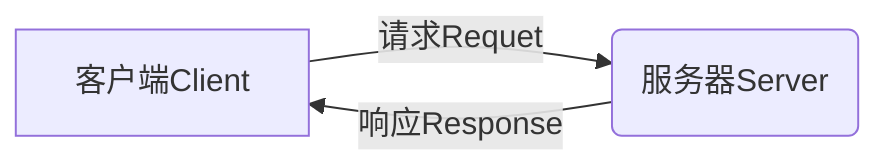
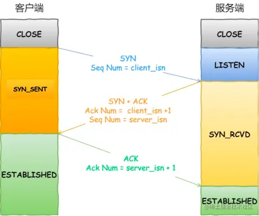
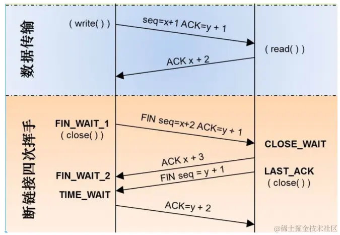
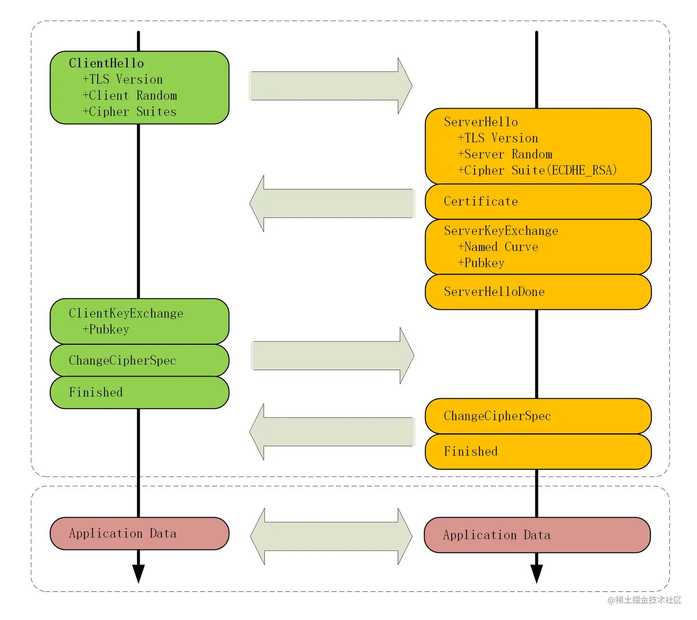

# 网络分层模型和应用协议

## 分层模型

### 五层网络模型

- 应用层 `HTTP、FTP、DNS、SMTP、P0P3`
- 传输层 `TCP、UDP`
- 网络层 `IP、路由器`
- 数据链路层 `MAC、交换机`
- 物理层 `光纤、双绞线、同轴电缆、集线器`

### 四层、五层、七层

- 四层网络模型：`应用层、运输层、网络层、数据链路层`
- 五层网络模型：`应用层、运输层、网络层、数据链路层、物理层`
- 七层网络模型：`应用层（表示层、会话层）、传输层、网络层、数据链路层、物理层`

## 应用层协议

### URL

    URL【Uniform Resource Locator 统一资源定位符】**统一资源定位符，用于定位网络服务

> http://a.com:80/news/detail?id=1#t1
>
> 协议[scheam]：http
> 域名[domain]：a.com
> 端口[port]：80
> 路径[path]：/news/detail
> 参数[query]：id=1
> 锚点[hash]：t1

- 当协议是`http`端口号为`80`时，端口可省略
- 当协议是`https`端口号为`433`时，端口可以省略
- scheam、domain、path是必须的

```html
<!-- 浏览器会先补全地址 / 再访问地址
<a src="https://www.baidu.com"></a> -->
<!-- 更优 浏览器直接访问地址 -->
<a src="https://www.baidu.com/"></a>
```

### HTTP

- 传递消息的模式
- 传递消息的格式



- 请求：请求、请求头、请求体
- 响应：响应、响应头、响应体

### HTTP和HTTPS的区别

- HTTP：是互联网上应用最为广泛的一种网络协议，是一个客户端和服务器端请求和应答的标准（TCP），用于从WWW服务器传输超文本到本地浏览器的传输协议，它可以使浏览器更加高效，使网络传输减少。
- HTTPS：是以安全为目标的HTTP通道，简单讲是HTTP的安全版，即HTTP下加入SSL层，HTTPS的安全基础是SSL，因此加密的详细内容就需要SSL。
  - HTTPS协议的主要作用可以分为两种：一种是建立一个信息安全通道，来保证数据传输的安全；另一种就是确认网站的真实性。

1. https协议需要到ca申请证书，一般免费证书较少，因而需要一定费用。
2. http是超文本传输协议，信息是明文传输，https则是具有安全性的ssl加密传输协议。
3. http和https使用的是完全不同的连接方式，用的端口也不一样，前者是80，后者是443。
4. http的连接很简单，是无状态的；HTTPS协议是由SSL+HTTP协议构建的可进行加密传输、身份认证的网络协议，比http协议安全。

### 网络安全

> 跨站脚本攻击（XSS）
>
> - 是一种代码注入攻击。攻击者通过在目标网站上注入恶意脚本，使之在用户的浏览器上运行。利用这些恶意脚本，攻击者可获取用户的敏感信息如 Cookie、SessionID 等，进而危害数据安全。
>   1. 反射型的 XSS 的恶意脚本存在 URL 里，存储型 XSS 的恶意代码存在数据库里。
>   2. 反射型 XSS 攻击常见于通过 URL 传递参数的功能，如网站搜索、跳转等。
>   3. 存储型XSS攻击常见于带有用户保存数据的网站功能，如论坛发帖、商品评论、用户私信等。
>   4. 而基于DOM的XSS 攻击中，取出和执行恶意代码由浏览器端完成，属于前端 JavaScript 自身的安全漏洞，其他两种 XSS 都属于服务端的安全漏洞。

**XSS防范措施**
1. 输入过滤
2. 改成纯前端渲染，把代码和数据分隔开。对 HTML 做充分转义。
3. 避免使用`.innerHTML、.outerHTML、document.write()`
4. DOM 中的内联事件监听器，如 `location、onclick、onerror、onload、onmouseover` 等，`<a>` 标签的 `href` 属性，JavaScript 的 `eval()、setTimeout()、setInterval()` 等，都能把字符串作为代码运行。
5. 使用 W3C 提出的 CSP (Content Security Policy，内容安全策略)，定义域名白名单
   1. 内容安全策略（CSP），通过它可以明确的告诉客户端浏览器当前页面的哪些外部资源可以被加载执行，而哪些又是不可以的。
   2. Content-Security-Policy 配置好并启用后，不符合 CSP 的外部资源就会被阻止加载。
   3. Content-Security-Policy-Report-Only 表示不执行限制选项，只是记录违反限制的行为。它必须与report-uri选项配合使用。
6. 设置 Cookie 的 HttpOnly 属性，禁止JavaScript读取cookie
7. 验证码：防止脚本冒充用户提交危险操作

> 跨站请求伪造（CSRF）
>
> 攻击者诱导受害者进入第三方网站，在第三方网站中，向被攻击网站发送跨站请求。利用受害者在被攻击网站已经获取的注册凭证，绕过后台的用户验证，达到冒充用户对被攻击的网站执行某项操作的目的。

**CSRF防范措施**
1. 同源检测 `Origin Header、Referer Header`
2. CSRF Token
3. 给 Cookie 设置合适的 SameSite `SameSite=strict 则表示完全禁用第三方站点请求头携带 Cookie`

> 点击劫持（ClickJacking）
>
> 通过视觉欺骗的手段来达到攻击目的手段。往往是攻击者将目标网站通过 iframe 嵌入到自己的网页中，通过 opacity 等手段设置 iframe 为透明的，使得肉眼不可见，这样一来当用户在攻击者的网站中操作的时候，比如点击某个按钮（这个按钮的顶层其实是 iframe），从而实现目标网站被点击劫持。

**点击劫持防范措施**
1. X-FRAME-OPTIONS 属性，此属性控制页面是否可被嵌入 iframe
2. HTTP严格传输安全(HSTS)是一种安全功能，web服务器通过它来告诉浏览器仅用HTTPS来与之通讯，而不是使用HTTP。
3. 开启HSTS，添加HSTS标头有性能优势。如果有人试图通过HTTP访问您的站点，而不是发出HTTP请求，它只是重定向到HTTPS版本。

> CDN劫持
>
> 网络上有很多黑客为了让用户能够登录自己开发的钓鱼网站，都会通过对CDN进行劫持的方法，让用户自动转入自己开发的网站。而很多用户却往往无法察觉到自己已经被劫持。其实验证被劫持的方法，就是输入任何网址看看所打开的网页是否和自己输入的网址一致，

**CDN劫持防范措施**
1. 使用SRI来解决CDN劫持，是指浏览器通过验证资源的完整性（通常从 CDN 获取）来判断其是否被篡改的安全特性。通过给 link 标签或者 script 标签增加 integrity 属性即可开启 SRI 功能


# 浏览器能力

## 用户代理

    浏览器代替用户完成http请求(`用户代理 user agent`)

- 自动发出请求的能力
  - 用户在地址栏输入了URL地址，并回车 `GET`
  - 用户点击了页面中的a元素 `GET`
  - 用户在页面中输入了表单数据，并提交了表单 `GET/POST`
  - 解析HTML元素link、script、img、video `GET`
  - 当用户刷新页面 `GET`
- 自动解析响应的能力
  - 识别响应码
  - 根据响应结果做不同的处理

**注意**
1. GET请求不会带请求体
2. GET请求传递消息量有限
3. GET请求只能传递ASCII数据 `encodeURLComponent`
4. GET请求会被浏览器缓存，POST请求不会被浏览器缓存（刷新页面会出现提示）


### 从URL输入到页面展示

1. 在地址栏输入相应的 URL，浏览器补全 URL 地址，并对地址中非 ASCII字符进行编码
2. 浏览器查找域名对应的 IP 地址【DNS 域名解析】
   - 查找浏览器缓存 `<浏览器会缓存 DNS 记录一段时间>`
   - 查找系统缓存 `<从 C 盘的 hosts 文件查找是否有存储的 DNS 信息>`
   - 查找路由器缓存
   - 查找 ISP DNS 缓存 `<从网络服务商（比如电信）的 DNS 缓存信息中查找>`
3. 浏览器根据 IP 地址与服务器建立联系 `<浏览器就将用户发起的 HTTP/HTTPS 请求发送给服务器>`
4. 浏览器与服务器通信 `<服务器返回了 HTML 字符串/对应的资源给浏览器，此时，浏览器将会对其进行解析、渲染并最终绘制网页>`
5. 丢弃旧的页面，解析 HTML `<浏览器会将接收到的 HTML 文档进行解析，请求 link链接 解析 CSS 形成 CSSOM，解析 DOM 树，请求 script链接 形成 JS 对象模型。>`
6. 布局和绘制 `<浏览器会根据渲染树的布局信息计算每个元素的位置和大小，然后将其绘制到屏幕上。>`
7. JavaScript 执行 `<如果 HTML 中包含 JavaScript 代码，则浏览器会执行这些代码，从而实现交互效果、动画效果等。>`


### HTTPS 通信

> **TCP 握手**
>
> 一开始，客户端和服务端都处于 close 状态。
> 先是服务端监听某个端口，此时服务端处于 listen 状态。
> 这个时候客户端就可以发送连接请求报文了。



- 第一次握手
  - 客户端会主动发送连接请求报文，随机初始化序列号为 x，并把 SYN 标志位设置为 1，表示 SYN 报文。
  - 客户端发送 SYN 报文后，客户端进入 syn_sent 状态。
- 第二次握手
  - 服务端收到 SYN 报文后，服务端会发送 SYN-ACK 报文，用于对客户端发送的 SYN 报文进行应答。
  - 服务端会随机初始化序列号为 y，确认序列号设置为 x + 1，并把 SYN 标志位、ACK 标志位设置为 1。
  - 服务端发送 SYN-ACK 报文后，服务端进入 syn_receive 状态。
- 第三次握手
  - 客户端收到 SYN-ACK 报文后，客户端会发送 ACK 报文，用于对服务端发送的报文进行应答。
  - 客户端会将序列号设置为 x + 1，确认序列号设置为 y + 1，ACK 标志位设置为 1。
  - 客户端发送 ACK 报文后，客户端处于 established 状态。
  - 当服务端收到 ACK 报文后，服务端进入 established 状态。

> **TCP 挥手**
>
> TCP的四次挥手是为了结束已建立的连接，确保双方都能正确地关闭连接并释放资源.



- 第一次挥手
  - 客户端发送一个带有FIN（结束）标志的数据包，表示自己已经没有数据要发送了，请求关闭连接。
- 第二次挥手
  - 服务器接收到客户端的结束请求后，会发送一个带有ACK（确认）标志的数据包作为响应，表示已收到客户端的结束请求。
- 第三次挥手
  - 服务器发送一个带有FIN标志的数据包，表示自己也没有数据要发送了，请求关闭连接。
- 第四次挥手
  - 客户端接收到服务器的结束请求后，会发送一个带有ACK标志的数据包作为确认，表示已收到服务器的结束请求。

> **TLS 握手**
> 通信的双方在 TLS 握手的过程中协商 TLS 的版本号、密码套件，交换随机数、数字证书和密钥参数，最终通信的双方协商得到会话密钥。（"Hello" 消息交换随机数，"Key Exchange" 消息交换 "Pre Master Secret"）



- 浏览器给服务器发送 "Client Hello" 消息，服务器给浏览器发送 "Server Hello" 消息。通信的双方协商 TLS 的版本号、密码套件，并交换随机数。
- 交换数字证书：服务器为了向浏览器证明自己的身份，服务器给浏览器发送 "server Certificate" 消息，以发送数字证书链，其中包含了两个证书。一个是 CA 机构颁发的数字证书，另一个是 CA 机构的数字证书。
- 服务器给浏览器发送 "Server Key Exchange" 消息，浏览器给服务器发送 "Client Key Exchange" 消息。通信的双方交换密钥参数（Client Params 和 Server Params），然后通信的双方就用 ECDHE 算法算出 "Pre Master Secret"。
- 通信的双方根据自己已知的参数（Client Random、Server Random 和 Pre Master Secret）算出主密钥 "Master Secret"，并使用主密钥拓展出更多的密钥（会话密钥），避免只用一个密钥带来的安全隐患。
- 浏览器给服务器发送 "Change Cipher Spec" 消息，服务器也给浏览器发送 "Change Cipher Spec" 消息。告诉对方：后续传输的都是对称密钥加密的密文。
- 浏览器给服务器发送 "Finished" 消息，服务器也给浏览器发送 "Finished" 消息。通信的双方把之前发送的数据做个摘要，再用对称密钥加密一下，让对方做个验证。
- 双方都验证成功，握手正式结束，之后就可以正常收发被加密的 HTTP 请求和响应了。

## AJAX

    在JavaScript中异步的向服务器发送请求并获取到相应结果，那么就是AJAX技术

| 功能                   | XMLHttpRequest | Fetch    |
| ---------------------- | -------------- | -------- |
| 基本请求能力           | true           | true     |
| 基本获取响应能力       | true           | false    |
| 监控请求进度           | true           | -        |
| 监控响应进度           | true           | true     |
| Service Worker是否可用 | -              | true     |
| 控制cookie的携带       | -              | true     |
| 控制重定向             | -              | true     |
| 请求取消               | true           | true     |
| 自定义referrer         | -              | true     |
| 流                     | -              | true     |
| API风格                | Event          | Promise  |
| 活跃度                 | 停止更新       | 不断更新 |

- 第三方库`原生限制上限`：Axios(xhr)、umi-request(fetch)
- Node环境api`http`

```javascript
// todo: XMLHttpRequest
const xhr = new XMLHttpRequest()
xhr.onreadystatechange = () => {
  if (xhr.readystate === 4) {
    if (xhr.status >= 200 && xhr.status < 300 || xhr.status === 304) {
      console.log(xhr.responseText)
    } else {
      console.log('xhr unsuccess')
    }
  }
}
function get () {
  xhr.open('GET', '/get', true)
  xhr.setRequestHeader('myHeader', 'headerInfo')
  xhr.send(null)
}

function post () {
  // input file >> var file = e.target.files[0]
  xhr.open('POST', '/upload', true)
  xhr.onload = function (e) {}
  xhr.onprogress = function (e) {
    var progress = Math.floor(e.loaded / e.total * 100)
  }

  // 流式读取
  const read = xhr.body.getReader()
  let data = []
  const decoder = new TextDecoder() // 文本解码器
  while(1) {
    const { done, value } = read.read()
    if (done) { break }
    decoder.decode(value)
    data.push(value)
  }

  const formData = new FormData()
  formData.append('avatar', file)
  xhr.send(formData)
  /* xhr.setRequestHeader('Content-Type', 'multipart/form-data; boundary=aaa')
  const arrayBuffer = new ArrayBuffer()
  arrayBuffer.appendString('--aaa\r\nContent-Disposition: form-data; name="avatar";\r\nContent-Type: image/jpeg\r\n\r\n')
  var reader = new FileReader() // 新建文件读取器
  reader.onload = function (e) {
    // var base64 = e.target.result
    arrayBuffer.appendString(e.target.result)
    arrayBuffer.appendString('\r\n--aaa--')
    const bf = arrayBuffer.toBuffer()
    xhr.send(bf)
  }
  reader.readAsArrayBuffer(file) // 读取为二进制数组 */
}
```

```javascript
// todo: fetch
async function json () {
  const response = await fetch('/json')
  // response.headers.get('content-type')
  // text、json、ArrayBuffer
  const data = await response.json()
}
async function post () {
  const response = await fetch('/post', {
    method: 'POST',
    headers: { 'Content-Type': 'application/json' },
    body: JSON.stringify(data)
  })
}
async function get () {
  const response = await fetch('/get')
  if (!response.ok) {}
  const body = await response.text()
}
```

## 跨域问题及解决方案

### 同源策略

> 同源策略是浏览器的安全机制，当一个源的文件和脚本，与另一个源的资源进行通信时，同源策略就会对这个通信做出不同程度的限制。`源 = 协议 + 域名 + 端口`
>
> 如果缺少同源策略，浏览器会很容易受到XSS、CSFR等攻击。所谓同源，指`协议`、`域名`、`端口`三者相同，其中有一个不同就是不同源。

**注意：下面几种情况不受同源策略限制**
1. 页面中的链接（例如页面中的a标签链接）
2. 重定向
3. 表单提交
4. 跨域资源的引入，但是js读不到其中的资源（script标签、img标签、link标签、iframe标签）

> 同源策略限制的内容
>
> 1. Cookie、LocalStorage、IndexDB等存储内容
> 2. DOM节点 `a元素跳转、加载css/js、图片、AJAX`
> 3. AJAX请求拦截
> 4. JS API `window.open、iframe`

> 简单请求 `除去简单请求就是复杂请求<预检请求>`
>
> - 请求方法时 `GET POST HEAD` 之一
> - 头部字段满足 CORS 安全规范 `浏览器默认自带的头部字段`
> - 如果时 Content-Type，必须是下列的值
>   - text/plain
>   - multipart/form-data
>   - application/x-www-form-urlencoded

> 预检请求
>
> - OPTIONS 请求
> - 真实请求

- 关于cookie `携带cookie`
  - 请求携带cookie
  ```js
  var xhr = new XMLHttpRequest()
  xhr.withCredentials = true

  fetch(url, {
    credentials: 'include'
  })
  ```
  - `Access-Control-Allow-Credentials: true`
- 跨域获取响应头
  - `Access-Control-Expose-Headers` 响应头白名单

- CORS
  - CORS需要浏览器和后端同时支持，IE8、IE9需要通过XDomainRequest来实现。
  - 浏览器会自动进行CORS，只要后端实现了CORS，就实现了跨域
  - 服务端设置Access-Control-Allow-Origin
  - 只要服务器明确表示允许，则校验通过；服务器明确拒绝或未声明，则校验失败


- JSONP **JSONP 请求一定需要对方的服务器支持**
  - 利用`scipt`标签没有跨域限制的漏洞，网页可以得到从其他来源动态生产的JSON数据
  - AJAX属于同源策略，与JSONP相反；JSONP兼容性好，但仅支持GET方法，具有局限性
  - jquery的jsonp，在发送AJAX请求时设置`dataType: jsonp`
  ```js
  /* callback
  '__callback__'+Math.random().toString(36).substr(2) + '__' + Date.now() */
  function jsonp({ url, params, callback }) {
    return new Promise((resolve, reject) => {
      let script = document.createElement("script");
      window[callback] = function (data) {
        resolve(data);
        document.body.removeChild(script);
      }
      params = [...params, callback];
      let arrs = [];
      for(let key in params) {
        arrs.push(`${key}=${params[key]}`);
      }
      script.src = `${url}?${arrs.join("&")}`;
      document.body.appendChild(script);
    })
  }
  ```

- nginx 反向代理
  - 实现原理类似于Node中间件代理，需要搭建一个nginx反向代理服务器，用于转发请求。支持所有的浏览器，支持session。

- node 中间件代理
  1. 接收客户端请求
  2. 将请求发送服务器
  3. 拿到服务器响应数据
  4. 将数据返回给客户端

- postMessage
  - H5中XMLHttpLevel2中的API，可以跨域操作的window属性之一
  - postMessage方法允许来自不同源的脚本采用异步方式进行有限的通讯，可以实现跨文本文档，多窗口，跨域传递信息
    1. 页面和其他打开的新窗口的数据传输
    2. 多窗口之间的信息传递
    3. 页面与嵌套的iframe的消息传递
    4. 上面三个场景的跨域数据传递
```js
otherWindow.postMessage(message, targetOrigin, [transfer])
```
> - message：要发送到其他window的数据
> - targetOrigin：通过origin属性来指定那些窗口能够接收消息事件，其值为字符串`*`表示无限制，如果目标窗口的协议、主机地址或者端口号有任意不匹配，就不会发送消息
> - transfer（可选）：Transferable对象，这些对象的所有权被转移给消息的接收方，发送方不保留所有权
```html
<!-- a.html -->
<iframe src="http://localhost:400/b.html" frameborder="0" id="iframe" onload="load()"></iframe>
<script>
	function load() {
		let frame = document.getElementById("iframe");
		frame.contentWindow.postMessage("iloveyou", "http://localhost:400");
		window.onmessage = function (e){
			console.log(e.data); //no
		}
	}
</script>

<!-- b.html -->
<script>
	window.onmessage = function(e) {
		console.log(e.data); // iloveyou
		e.source.postMessage("no", e.origin)
	}
</script>
```

- websocket
  - websocket是h5的一个持久化协议，实现了浏览器与服务器的全双工通信，其与HTTP都基于TCP协议
  - websocket是一种双向通信协议，在建立连接之后，websocket的server与client都能主动向对方发送或接收数据

- window.name + iframe
  - window.name属性值在不同的页面（甚至不同的域名）加载后依旧存在，并且可以支持非常的时间，大小为2MB。
  - 类似的还有 location+hash+iframe、document.domain+iframe

## 网络优化

1. 使用HTTP/2
2. 减少、合并HTTP请求，通过合并CSS、JS文件、精灵图等方式减少请求数量。
3. 压缩文件， 开启nginx，Gzip对静态资源压缩
4. 使用HTTP缓存，如强缓存、协商缓存
5. 使用CDN，将网站资源分布到各地服务器上，减少访问延迟