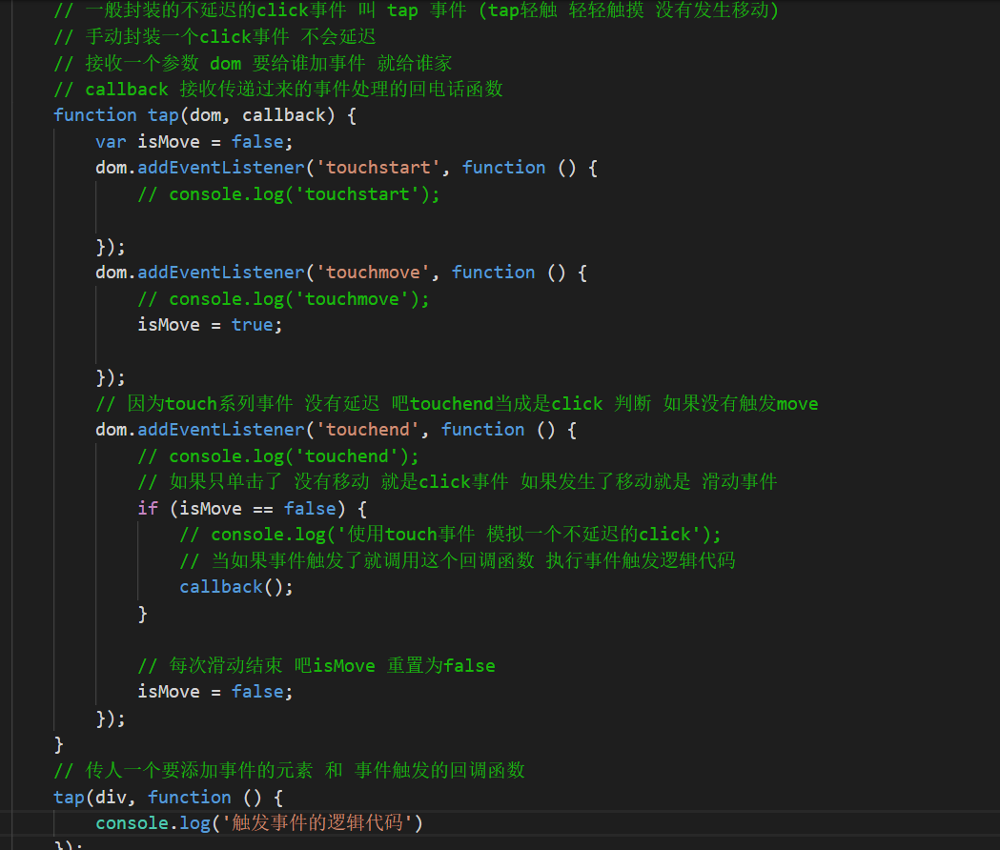

## 总结

1. 分类页面的布局
2. 分类页面的左右滑动使用swiper插件滑动效果(重点)
3. 移动端的滑动事件 (重点)
4. 分类左侧的点击吸顶
5. 移动端点击事件延迟和解决
6. 移动端的zepto库


## 实现分类页面的布局

    1. 整个页面使用上中下布局
    2. 上下分别固定定位在头部底部
    3. 给body设置padding-top 和 bottom 让main往中间挤不要让main和 头部底部重叠
    4. 设置头部的图标大小和背景定位


## 实现分类左右分类里面的内容的布局

    1. main父元素 flex 并且换行
    2. 分类左侧固定宽度
    3. 分类右侧flex:1;
    4. 分类左侧内容给a固定高度行高背景色居中
    5. 分类右侧商品列表的flex布局  给每个li 宽度33.33% 父元素 flex换行


## 使用swiper内容滚动插件

    1. 引入swiper
    2. 写内容滚动的标签结构
        <!-- Swiper -->
        <div class="swiper-container">
            <div class="swiper-wrapper">
                  <ul class="swiper-slide">
                      <li class="active"><a href="#">热门推荐</a></li>
                      省略了很多li
                  </ul>
            </div>
            <!-- 添加滚动条 -->
            <div class="swiper-scrollbar"></div>
        </div>
    3. 写样式 给swiper轮播图的容器设置高度和屏幕一样高 
            html,
            body {
                position: relative;
                height: 100%;
            }
            /* 设置容器高度和body 和html一样 和屏幕一样 */
            .swiper-container {
                width: 100%;
                height: 100%;
            }
            .swiper-slide {
                /* 设置子盒子的高度 由内容撑开 默认100% 不需要这个100% 让内容撑开 */
                height: auto;
            }
    
    4. 初始化swiper
       var swiper = new Swiper('.swiper-container', {
            //垂直方向滑动
            direction: 'vertical',
            //支持多个子元素一起滑动
            slidesPerView: 'auto',
            // 一次性滑动多个子元素
            freeMode: true,
            //添加滚动条
            scrollbar: {
                el: '.swiper-scrollbar',
            },
            //支持鼠标滚轮
            mousewheel: true,
        });

## 使用swiper插件实现分类左右滑动

 1. 引入swiper

    ```html
    <!-- 1. 引入swiper的css -->
    <link rel="stylesheet" href="./lib/swiper/css/swiper.css">
    <!-- 1. 引入swiper的JS -->
    <script src="lib/swiper/js/swiper.js"></script>
    
    ```

    ​    

2. 写内容滚动的标签结构

    ```html
    <div class="category-left">
        <!-- swiper大容器 -->
        <div class="swiper-container">
            <!-- 所有图片容器 -->
            <div class="swiper-wrapper">
                <!-- 每个图片容器 里面放我们需要滑动的内容 -->
                <div class="swiper-slide">
                    <ul>
                        <li class="active"><a href="javascript:void(0);">热门推荐</a></li>
                        <li><a href="javascript:void(0);">手机数码</a></li>
                        <li><a href="javascript:void(0);">家用电器</a></li>
                        <li><a href="javascript:void(0);">电脑办公</a></li>
                        <li><a href="javascript:void(0);">计生情趣</a></li>
                        <li><a href="javascript:void(0);">美妆护肤</a></li>
                        <li><a href="javascript:void(0);">个护清洁</a></li>
                        <li><a href="javascript:void(0);">汽车用品</a></li>
                        <li><a href="javascript:void(0);">京东超市</a></li>
                        <li><a href="javascript:void(0);">男装</a></li>
                        <li><a href="javascript:void(0);">男鞋</a></li>
                        <li><a href="javascript:void(0);">女装</a></li>
                        <li><a href="javascript:void(0);">女鞋</a></li>
                        <li><a href="javascript:void(0);">母婴童装</a></li>
                        <li><a href="javascript:void(0);">运动户外</a></li>
                        <li><a href="javascript:void(0);">内衣配饰</a></li>
                        <li><a href="javascript:void(0);">食品生鲜</a></li>
                        <li><a href="javascript:void(0);">酒水饮料</a></li>
                        <li><a href="javascript:void(0);">家具家装</a></li>
                        <li><a href="javascript:void(0);">家居厨具</a></li>
                        <li><a href="javascript:void(0);">箱包手袋</a></li>
                        <li><a href="javascript:void(0);">钟表珠宝</a></li>
                        <li><a href="javascript:void(0);">图书音像</a></li>
                        <li><a href="javascript:void(0);">玩具乐器</a></li>
                        <li><a href="javascript:void(0);">医药保健</a></li>
                        <li><a href="javascript:void(0);">宠物生活</a></li>
                        <li><a href="javascript:void(0);">礼品鲜花</a></li>
                        <li><a href="javascript:void(0);">农资绿植</a></li>
                        <li><a href="javascript:void(0);">生活旅行</a></li>
                        <li><a href="javascript:void(0);">奢侈品</a></li>
                        <li><a href="javascript:void(0);">全球购</a></li>
                        <li><a href="javascript:void(0);">国际名牌</a></li>
                        <li><a href="javascript:void(0);">艺术邮币</a></li>
                        <li><a href="javascript:void(0);">二手商品</a></li>
                        <li><a href="javascript:void(0);">特产馆</a></li>
                        <li><a href="javascript:void(0);">京东金融</a></li>
                        <li><a href="javascript:void(0);">拍卖</a></li>
                        <li><a href="javascript:void(0);">房产</a></li>
                    </ul>
                </div>
            </div>
        </div>
    </div>
    ```

    

3. 写样式 给swiper轮播图的容器设置高度和屏幕一样高 
        

   ```less
   /* 为了让main容器居中 不要和头部底部重叠在一起 给body设置一个上下padding 吧main挤到中间来 */
   body {
       padding: .45rem 0 0.5rem;
       height: 100vh;
   }
   
   /* 主体分类 */
   
   #main {
       display: flex;
       /* main继承body的高度 */
       height: 100%;
       .category-left {
           /* 继承main的高度 */
           width: .85rem;
           height: 100%;
           .swiper-container {
               /* 继承left的高度 */
               /* 设置容器高度和body 和html一样 和屏幕一样 */
               height: 100%;
               .swiper-slide {
                   /* 设置子盒子的高度 由内容撑开 默认100% 不需要这个100% 让内容撑开 */
                   /* 之前兼容轮播图效果 轮播图高度和父元素一样 写死100%高度 但是这是内容滚动不需要这个高度100% 覆盖成auto */
                   height: auto;
               }
           }
       }
   }
   ```

   

4. 初始化swiper

    ```js
    //   初始化分类左侧的滑动 限制了是初始化分类左侧的滑动效果  传人category-right里面的轮播图大容器选择器
    new Swiper('.category-left .swiper-container', {
        direction: 'vertical', // 垂直滚动
        // 可以支持多张轮播图显示 属性一定要加 内容滚动的距离如果不加无法计算
        slidesPerView: 'auto',
        freeMode: true, // 是否添加滑动的惯性
    
        // mousewheel: true,//支持鼠标滚轮
    });
    ```

    


## 移动端一些触摸事件

1. touchstart  手指触摸的时候触发
2. touchmove  手指移动的时候触发
3. touchend  手指触摸离开的时候触发
4. touchcancel 触摸意外中断会触发  触摸的时候遇到了优先级更高的事件
5. 事件对象TouchEvent对象
   1. touches 屏幕上手指对象  touchstart touchmove事件使用
   2. changedTouches 屏幕上手指改变的对象 在touchend事件使用
   3. 注意touches 和changedTouches 都是数组 想要拿到某个手指信息要 touches[下标] touches[0]

6.手指坐标位置信息

​     1. clientXY手指距离视口左上角的位置 使用clientX 或者 clientY比较多

​     2. pageXY手指距离页面左上角的位置

​     3. screenXY手指距离屏幕左上角的位置 

​     4. 通常移动端使用clientXY

  ​         1. e.touches[0].clientX

  ​         2. e.touches[0].clientY


## 分类页面左侧的点击吸顶效果

1. 需求
  1. 点击了左侧分类的菜单
  2. 位移到当前点击的分类菜单 到顶部的位置   
  3. 位移为 （-当前菜单索引*菜单高度）
  4. 位移的时候还需要添加过渡效果 慢慢的上去
  5. 当菜单需要位移的距离超过了最小位移的距离 默认为最小位移距离  
  6. 最小位移距离 父元素高度-子元素高度

2. 思路
  1. 给分类左侧添加点击事件
  2. 先给所有菜单都添加一个索引的属性
  3. 拿到当前点击菜单的索引  和 菜单高度
  4. 计算当前点击菜单的位移距离  ==  - 索引  * 高度
  5. 获取swiper-wrapper 给他设置这个位移距离  判断如果没有超过最大位移的距离就设置计算的距离 如果超过最大位移距离 设置为最大的位移距离
  6. 设置过渡效果
  7. 清除所有li的active位移  给当前点击的li添加active类名


## 移动端click事件的延迟问题

1. 在移动端手机里面 click事件是有一定延迟的 大概300ms  
    延迟的原因是手机端为了兼容双击操作 如果300ms以内点击2次就认为是双击事件 
    如果300ms以内只点击了一次就是单击操作
2. 解决方案 就是使用touch系列事件封装一个不延迟的click事件

## 解决延迟的原理使用移动端touch相关事件模拟一个click   (也就tap)

1. 因为touch事件在手机里面是不会延迟

2. 只是触发了touchstart和touchend但是没有触发touchmove  就认为是一个单击操作(单击事件)

3. 如果触发touchmove 表示手指不仅单击还触发移动 不是一个单击操作

4. 还可以添加事件判断 记录滑动开始的时间和滑动结束的时间进行相减判断 手指按下的时间有没有超过300ms 不超过才是单击操作

5. 封装一个tap函数解决点击事件延迟问题

   

   

## 使用fastclick包解决点击事件延迟问题

1. 引包引入fastclick

   ```html
   <script src="jd/lib/fastclick/fastclick.js"></script>
   ```

   

2. 给页面的body元素绑定fastclick 间接为所有元素绑定了

  ```js
  // 绑定fastclick 给body绑定 因为元素都在body里面 间接为所有元素都绑定了fastclick
  window.addEventListener('load', function() {
        new FastClick(document.body);
  }, false);
  ```

  

3. 后续就直接添加click就不会延迟了

   ```js
   // 绑定了fastclick后 添加事件的方式还是和之前一样加click事件  但是这个click已经不会延迟了
   div.addEventListener('click', function() {
        console.log('点击事件');
   });
   ```

   


## 移动端的js库 zepto

1. zepto: 是一个轻量级用来操作DOM元素的JS库 类似于jquery  所有方法用法都和jquery一样 只要会使用jquery就会使用zepto
2. 为什么要使用zepto: 轻量级  对移动端兼容性好一点
3. 可以把所有模块打包到一个zepto.js里面(使用node编译)
4. 在移动端如果使用了zepto千万不能再使用jquery 都是$会冲突
5. zepto: 是一个 移动端的jquery 和jquery几乎一样  除了更小之外别的都一样
6. 因为移动端使用jquery 比较冗余(jquery大) jquery是兼容各种浏览器（移动端不需要这么多兼容性） 
7. 有一个代替品zepto针对移动端的浏览器 开发的一个JS库 功能和写法和jquery都一模一样
8. zepto和 jquery的区别
   1. zepto小 只有10k  jquery 也有100k左右
   2. zepto兼容移动端一些函数 事件(封装了一些移动端特有事件)  jquery没有
   3. zepto是模块化的使用各种功能要引入各个模块 jquery只有一个模块
9. zepto库基本使用： 跟jquery一样 只有模块不一样  有些模块没在主包 单独引入一些其他模块


12. 也可以打包到一个文件引入一个打包好的zepto


## 上网的原理和移动端真机调试

1. 上网也是有真实的物理文件传输的
2. 2种上网方式
    1. 广域网 intel网  全球性的网 目前访问京东百度 使用域名 或者 ip访问 使用广域访问

    2. 局域网 内部的网 只能内部用 http://127.0.0.1:5500/day05/3-%E6%BA%90%E4%BB%A3%E7%A0%81/jd/index.html 本机ip内网ip 方式使用局域网的方式上网

       
3. 让网站能够在手机上访问
    1. 第一种方式
        1. 买一台广域网上的电脑(服务器电脑) 把项目部署到广域网的服务器上
        2. 使用广域网域名 或者 ip 去访问这个网站
    2. 第二种方式
        1. 让手机和电脑连接同一个局域网（电脑和手机连接同一个wifi）
            使用热点电脑开热点手机连接
            手机开热点电脑连接都可以
            数据线连接也可以

            

        2. 使用通过一个局域网的ip
            连接同一个wifi的那个ip地址
            192.168.137.1
            把之前的网址
            http://127.0.0.1:5500/day05/3-%E6%BA%90%E4%BB%A3%E7%A0%81/jd/index.html
            改成
            http://192.168.137.1:5500/day05/3-%E6%BA%90%E4%BB%A3%E7%A0%81/jd/index.html

            

        3. 注意有可能手机扫描打不开 原因可能是防火墙问题 把防火墙关闭即可  webstrome不行 使用vscode sublime之类

            


## 今日总结

1. 移动端的触摸事件 touchstart touchmove touchend touchcancel 

2. 移动点击事件的延迟： 原因是为了兼容双击 300ms以内点击2次就是双击操作1次就是单击

3. 解决延迟方案
    1. 封装一个tap事件 使用touchstart 和 touchmove touchend事件模拟 如果只触发了touchstart touchend 没有触发touchmove 认为是单击操作
    2. 使用zepto第三方的库里面的tap事件
    3. 使用fastclick包 专门解决问题

4. 移动端到底用什么点击事件： 一般全部使用tap事件  

5. 移动端的JS库zepto

   1. zepto: 是一个 移动端的jquery 和jquery几乎一样  除了更小之外别的都一样
   2. 因为移动端使用jquery 比较冗余(jquery大) jquery是兼容各种浏览器（移动端不需要这么多兼容性） 
   3. 有一个代替品zepto针对移动端的浏览器 开发的一个JS库 功能和写法和jquery都一模一样
   4. zepto和 jquery的区别
      1. zepto小 只有10k  jquery 也有100k左右
      2. zepto兼容移动端一些函数 事件(封装了一些移动端特有事件)  jquery没有
      3. zepto是模块化的使用各种功能要引入各个模块 jquery只有一个模块

6. zepto库基本使用： 跟jquery一样 只有模块不一样  有些模块没在主包 单独引入一些其他模块

   

7. 也可以打包到一个文件引入一个打包好的zepto

   

   


### 找bug技巧

1. 多看bug(见多识广)
2. 会找bug
  1. 页面结构bug   标签是否有结束 标签是否会多加结束  标签单词错误 标签嵌套错误
  2. 页面样式bug  
      1. 样式没出来 
        1. 样式文件没引入
        2. 样式生效没有（审查元素找到要设置样式的元素） 如果看不到 选择器选错 类名或者id写错
      2. 样式有但没有效果
        1. 样式属性是否写 属性前有感叹号属性错了 或者值
        2. 样式属性是否被覆盖或者继承 样式属性有没有中划线
      3. 自己不知道怎么写样式  居中（内容居中text-align:center）块居中margin:0 auto;
      4. 引入bootstrap会出的样式问题
        1. 没有引入包
        2. 类名错误
        3. 发现覆盖不了bootstrap选择器优先级不够
  3. 页面功能bug
    1. 功能没生效
      1. 文件没引入
      2. 依赖的文件没引入（jquery  zepto ）
      3. 是否定义函数 有没有被调用
      4. 代码是否报错 （单词错 赋值错 变量名。。）
      5. 看代码是否执行 （断点调试看看代码是否执行（事件没被触发 事件名错误 元素没获取到））
      6. 一些获取值的方式错误（兼容性问题 单词错误）
      7. 逻辑错误  (代码执行顺序是否符合你写的顺序 )
      8. 变量名重复 全局已经有变量 局部又用var
  4. 环境系统bug

3. 善于总结
  1. 出了bug记录下来 bug现象 bug原因 解决方案


## 移动web总结

1. 移动web开发的现状： 前端最热门的开发  市场大 需求大 工资高 代码少 兼容性少 容易学
2. 移动web的开发方式
    1. 响应式开发方式 一个页面适配多个终端
    2. 原生开发方式 单独PC和移动端都写一套代码
3. 响应式开发的原理： 媒体查询
   @media(width:值){
    //条件成立执行的代码
   }
    判断有3种
    width:值  等于这个值
    min-width:值 大于等于这个值  从小到大写 向下覆盖
    max-width:值 小于等于这个  从大到小写  向上覆盖

4. 响应式的开发框架
    bootstrap  最常用的
    MUI 
    AmazeUI 

5. bootstrap的使用
    1. 下载包
    2. 看懂文档 全局CSS样式（一些简单类名） 组件 （标签类名组合在一起的效果但是没有交互） 插件 （组件并带有交互）
    3. 找到需要的样式或者组件插件 复制结构
    4. 需要修改样式 审查元素找到样式对应的类名 覆盖 推荐外面使用id 方便覆盖

6. 容器   container 布局容器  居中  栅格系统 行和 列 row放到container里面 col放到行里面 
  列有4个档次 xs sm md lg
  一行最多分为12列  col-xs-1  col-xs-12

7. 导航条 轮播图 折叠菜单collapse  标签页 表单表格 媒体对象 弹出框 提示工具 模态框 按钮 响应式工具

8. 字体图标上传svg图标下载代码引入css使用类名   原理是使用CSS3 web字体 引入对应字体文件 使用图标对应的编码

9. 移动端基本概念  手机分辨率通常比真实宽高大2倍 图片都是按照分辨率来设计 页面CSS宽高是按照真实的宽高设置 使用图片和背景图要缩小一半来写 
10. 搭建jd首页布局 百分比布局 + flex布局
11. 顶部渐变效果 获取滚动条高度
12. 倒计时JS 获取时间计算 分别计算时分秒十位个位来显示倒计时
13. 轮播图使用swiper轮播图
14. 背景图背景图定位原点和背景图裁切
15. 分类左右2侧 flex布局
16. 分类左右2侧滑动使用swiper滑动
17.  swiper插件的使用
   1. 引入包 css
   2. 引入js
   3. 写页面结构
    <div class="swiper-container">
      <div class="swiper-wrapper">
        <div class="swiper-slide">
          内容或者图片
        </div>
      </div>
    </div>
    4. 如果滚动还需要设置样式
      .swiper-container{
          height:100%;
      } 
      body,html父元素等都要设置100%高度
      .swiper-slide 高度自动
    5. 对轮播图插件去初始化
        // 3. 初始化swiper的滑动
        var swiper = new Swiper('.swiper-container', {
         // 控制轮播图滚动的方向 horizontal水平 vertical 垂直
            direction: 'vertical',
           //可以支持多个swiper-slide 可以有多个轮播图
            slidesPerView: 'auto',
            //支持弹簧
            freeMode: true,
            //控制轮播图动画切换的速度  轮播图动画的时间
            speed: 300,
            //添加一个小手
            grabCursor: true,
            // 添加循环 无缝轮播图 
            loop: true,
            //添加自动轮播图 delay自动轮播的间隔时间
            autoplay: {
                delay: 1000,
                //到最后一张停止自动轮播图 但是loop了后就停不下来了
                stopOnLastSlide: true,
                // 是否要当触摸的时候禁止自动轮播图  ture就禁止 false不禁止
                disableOnInteraction: false,
            },
            // 给图片直接添加间距
            // spaceBetween : 100,
            // 如果需要分页器  小圆点
            pagination: {
                el: '.swiper-pagination',
            },
            // 如果需要前进后退按钮  左右箭头
            navigation: {
                nextEl: '.swiper-button-next',
                prevEl: '.swiper-button-prev',
            },
            //支持鼠标滚轮  只有PC能用
            mousewheel: true,
        });

18. 移动端点击事件 有300ms延迟 可以使用touch事件模拟click 也可以使用第三方包fastclick解决
19. 常见移动端滑动事件 touchstart touchmove touchend e事件源对象 e.touches所有手指 
   e.touches[0].clientX 手指在页面上水平位置 e.touches[0].clientY 垂直位置
20. 移动端zepto库 类似jquery 有jquery就不要使用zepto 不要同时引入2个包 $ 会冲突
21. rem: root element根元素 参照根元素html元素的字体大小 1html的字体大小16px 1rem=16px
22. rem的好处 相对html字体大小html字体大小不会随意变化 统一所有使用rem的大小 实现宽度和高度的和内容都自适应
23. 使用rem实现网页自适应的原理是通过媒体查询 或者JS来不断改变html的字体大小html字体大小改变 那么使用rem单位大小都会被改变
24. rem工具  http://alurk.com/ 使用 
    1. 打开工具 输入设计稿宽度(写代码屏幕的宽度375) 
      输入基础字体值(写代码屏幕的宽度375根元素的字体大小100)    
    2. 去掉后面的生成媒体查询等勾(因为我们已经使用JS改变根元素了)
    3. 点击转换把代码粘贴回来


## 找网站和扒网站

1. bootstrap官网的案例 http://expo.bootcss.com/
2. 妹子UI的官网的案例 http://amazeui.org/showcase/
3. 无忧网络官网的案例 http://www.cnitc.net
4. 招聘网站上的一些项目
5. 扒网站 
    1. 打开 TeleportUltraPortable.exe 程序
    2. 点击左上角的file > new project wizard
    3. 点击第二个单选按钮 Duplicate  
    4. 点击下下一步 输入要扒的网址 up里面是扒几层
    5. 一路下一步 保存到一个目录
    6. 点击中间上方的蓝色开始箭头开始扒 
    7. 扒完了在目录旁边出一个文件夹 就是网站的文件夹

## 前端学习路线

1. https://zwxs.github.io/FrontEndMaterial/synthesis.html

