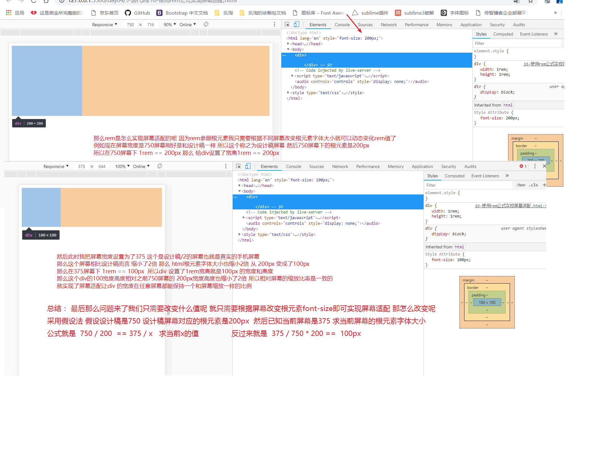
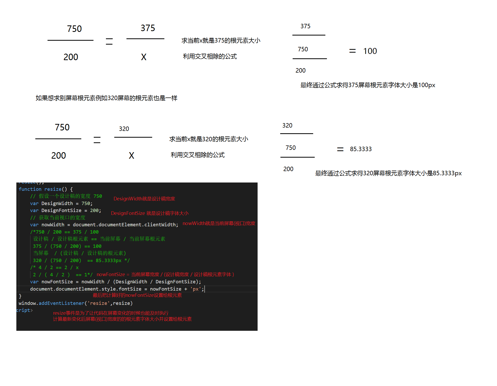

## 总结

1. 主体商品布局
2. 秒杀商品布局
3. 京东超市布局
4. 底部的布局
5. 移动端页面屏幕适配原理
6. 使用rem相对的单位来实现jd主页屏幕适配
7. 轮播图插件的使用
8. 顶部搜索的背景色渐变
9. 倒计时JS功能
10. 轮播图JS效果 插件的使用 ( swiper插件)
11. 上网的原理和移动端真机调试

##  轮播图布局

1. 暂时只添加一个图片 后面在做轮播图
2. 样式 给图片设置宽度百分百

## 导航条布局

1. 写一个列表 里面8个li 里面都有a  和 图片旁边有一个p段落
2. 样式 给ul设置flex布局同时支持换行  每个li宽度25% 里面的a转块设置居中 图片设置原图的一半
3. 设置ul的内边距padding  和 p的上下间距margin

## 主体商品布局

  1. 写一个main大容器包裹所有商品
  2. 在main里面添加一个秒杀商品容器      
  3. 再添加3个京东超市容器
  
  4. 给main设置一个背景色 和 padding:10px; 


## 秒杀商品布局

  1. 添加秒杀的标题title
  2. 添加秒杀的商品内容content
  3. 在title里面添加秒杀的图标 文字  倒计时 更多
  4. 在content 添加 ul li 里面添加a 图片 和价格

  5. 样式  
    1. 给标题里面的图标设置宽高为图片的一半
    2. 设置文字样式
    3. 设置倒计时的背景色和字体颜色 和中间2个: 背景色字体颜色 使用nth-child(3n)
    4. 设置右边的文字右浮动
    5. 设置间距
    6. 设置整体标题的高度行高居中 和底部边框
    7. 设置内容里面的ul flex布局 里面的每个li  flex:1;
    8. 设置内容里面的图片缩小一半
    9. 设置价格的颜色字体大小


## 京东超市布局

  1. 添加一个京东超市title
  2. 添加一个京东超市内容content
  3. 在title里面添加一个h4标题
  4. 在content内容里面添加 左left 右 right 容器
  5. 在左右容器里面 添加a a里面添加图片
  
  6. 样式 给京东超市title设置行高 左padding 再添加一个伪元素定位到左边
      给内容设置flex布局 左右容器flex:1;
      给a转块 图片100%

## 底部的布局

  1. 添加一个ul li 
  2. 在li里面添加a a 里面添加图片 图片地址使用(检测元素查看完整版网络地址)
  
  3. 样式 给ul设置flex布局  li 设置flex:1   里面a转块 文本居中  图片缩小一半设置宽高 


## 顶部搜索的背景色渐变

1. 需求： 在滚动条滚动距离在轮播图高度范围内的时候实现顶部搜索的背景色透明度渐变
    rgba(255,0,0,0)
    rgba(255,0,0,1)
    rgba的最后一个值透明度从0-1的变化
2. 思路： 计算当前的滚动条滚动到的距离的透明度的值
    1. 获取当前滚动条的距离 
    2. 获取当前轮播图的高度 
    3. 计算透明度 = 距离/高度
    4. 计算好后把透明度值 设置背景色的rgba里面把最后一个值改成计算的透明度


## 倒计时JS功能

1. 需求： 总时间2小时作为一个倒计时 把这个倒计时时间 设置到页面中显示 分别显示时分秒   每隔一秒倒计时总时间要--  页面时时更新
2. 思路
    1. 定义一个总时间(未来真实开发是从后台获取的) 暂时是前端写死
    2. 定一个定时器(每隔1秒执行一次) 让总时间每秒--
    3. 计算-- 完后的时间的 时 分 秒
    4. 把时分秒的十位和个位分别设置到每个span里面

## 轮播图JS效果 插件的使用 ( swiper插件)[https://www.swiper.com.cn]

  1. 下载swiper插件 
  2. 引包  注意引入CSS和JS2个包
      1. 引入swiper.css
      2. 引入swiper.js
  3. 写一个轮播图需要结构

      ```html
      <!-- 轮播图的大容器 装了所有内容图片小圆点按钮等 -->
      <div class="swiper-container">
          <!-- 轮播图的图片容器 装的是所有的轮播图项(一般是图片) -->
          <div class="swiper-wrapper">
              <!-- swiper-slide 每一个轮播项 -->
              <div class="swiper-slide">Slide 1</div>
              <div class="swiper-slide">Slide 2</div>
              <div class="swiper-slide">Slide 3</div>
          </div>
          <!-- 小圆点容器 -->
          <div class="swiper-pagination"></div>
          <!-- 左右箭头 -->
          <div class="swiper-button-prev"></div>
          <div class="swiper-button-next"></div>
          <!-- 滚动条容器 -->
          <div class="swiper-scrollbar"></div>
      </div>
      ```

      
      注意一定要使用官网的类名因为有样式的没有类名就有样式
  4. 给轮播图大容器设置样式 限制轮播图的宽高

        ```css
        .swiper-container {
            width: 600px;
            height: 300px;
        }  
        ```

        

  5. 添加一个JS代码去初始化轮播图  传入一些初始化的一些参数
        ```html
        <script>        
          var mySwiper = new Swiper ('.swiper-container', {
            direction: 'vertical', // 垂直切换选项
            loop: true, // 循环模式选项  
            // 如果需要分页器
            pagination: {
              el: '.swiper-pagination',
            },
            // 如果需要前进后退按钮
            navigation: {
              nextEl: '.swiper-button-next',
              prevEl: '.swiper-button-prev',
            },
            // 如果需要滚动条
            scrollbar: {
              el: '.swiper-scrollbar',
            },
          })        
        </script>
        ```

        


## swiper插件的一些常见参数

  1. 轮播图的方向

       ```js
       direction: 'vertical'  垂直
       direction: 'horizontal'  水平
       ```

  2. 自动轮播图

    ```js
    autoplay:{
       delay: 3000,//轮播图的延迟
       stopOnLastSlide: false,// 如果设置为true，当切换到最后一个slide时停止自动切换。（loop模式下无效）
       disableOnInteraction:true,//当用户滑动的时候禁止自动轮播图 不需要禁止就为false
    }
    ```

  3. 是否开启无缝轮播图
      loop: true,//是否开启无缝轮播图 开启无轮播图  如果不开 刷回去倒退回去
  4. 是否显示小圆点

     ```js
      pagination:{
          el: '.swiper-pagination',//如果需要显示小圆点就指定小圆点容器
     }
     ```

  5. 是否要左右箭头

       ```js
       navigation: {
            nextEl: '.swiper-button-next',
            prevEl: '.swiper-button-prev',
        },//指定左右箭头的容器
       ```

  6. 是否要支持滚动条

       ```js
       scrollbar: {
            el: '.swiper-scrollbar',
        },//指定滚动条的容器
       ```

       

## 修改轮播图的样式

  1. 如果需要修改图片大小 直接选中你的图片设置大小
  2. 如果要修改小圆点的样式 


## 使用swiper完成jd主页轮播图效果

  1. 引包 注意在我们的样式前面引入swiper.css 在我们的js前面引入swiper.js

  2. 写结构

        ```html
        <div class="swiper-container">
            <!-- 轮播图的图片容器 装的是所有的轮播图项(一般是图片) -->
            <div class="swiper-wrapper">
                <!-- swiper-slide 每一个轮播项 -->
                <div class="swiper-slide">
                    <a href="#">
                        
                    </a>
                </div>
                <div class="swiper-slide">
                    <a href="#">
                        
                    </a>
                </div>
                <div class="swiper-slide">
                    <a href="#">
                        
                    </a>
                </div>
                <div class="swiper-slide">
                    <a href="#">
                        
                    </a>
                </div>
                <div class="swiper-slide">
                    <a href="#">
                        
                    </a>
                </div>
                <div class="swiper-slide">
                    <a href="#">
                        
                    </a>
                </div>
                <div class="swiper-slide">
                    <a href="#">
                        
                    </a>
                </div>
                <div class="swiper-slide">
                    <a href="#">
                        
                    </a>
                </div>
            </div>
            <!-- 小圆点容器 -->
            <div class="swiper-pagination"></div>           
        </div> 
        ```

        

  3. 设置样式
      ```less
      #slide {
          img {
              width: 100%;
          }
          /* 修改小圆点样式 */
          .swiper-pagination-bullet {
              background-color: transparent;
              opacity: 1;
              border: 1px solid #fff;
              width: 8px;
              height: 8px;
              box-sizing: border-box;
          }
          .swiper-pagination-bullet-active {
              background-color: #fff;
          }
      }
      ```

      

  4. 初始化jd的轮播图

      ```js
      var mySwiper = new Swiper('#slide .swiper-container', {
          direction: 'horizontal', // 垂直切换选项
          autoplay: {
              delay: 1000, //轮播图的延迟
              stopOnLastSlide: false, // 如果设置为true，当切换到最后一个slide时停止自动切换。（loop模式下无效）
              disableOnInteraction: false //当用户滑动的时候禁止自动轮播图 不需要禁止就为false
          },
          loop: true, // 是否开启无缝轮播图 开启无轮播图  如果不开 刷回去倒退回去
          // 如果需要分页器
          pagination: {
              el: '.swiper-pagination',
          }      
      });
      ```

      

## 移动端页面屏幕适配

1. 为什么要适配屏幕： 手机屏幕很小 页面都是全屏 不同的大小的屏幕 展示内容不一样 
2. 希望页面在任何屏幕都保持一个等比例  希望每个屏幕看到的效果都是一样的
3. 手机小 页面文字 图片 所有内容 都比较小 
4. 手机大 页面文字 图片 所有内容 都比较大

## 使用相对的单位来实现屏幕适配

1. em : element 相对自身元素的字体大小 
   div自身字体大小16  1em=16px
   div自身字体大小20  1em=20px

2. rem : root element 相对根元素的字体大小 
    html元素的字体大小16px 1rem = 16px
    html元素的字体大小30px 1rem = 30px

3. 相对单位的概念就这个单位的值不是固定的 而是参照字体大小而变化而变化  

4. em 和 rem的区别和对比

    

    

    

    


## rem适配的原理

1. 页面中都把px写成rem相对单位 都相对根元素的字体大小

2. 不同屏幕改变根元素的字体大小的值

3. 使用媒体查询方式改变根元素大小值

    ```css
    @media(width:750px){
      html{
        font-size:200px;
      }
    }
    @media(width:375px){
      html{
        font-size:100px;
      }
    }
    ```

    

4. 使用JS方式来改变rem的值
           

     ```js
          // 假设一个设计稿的宽度 750
          var DesignWidth = 750;
          var DesignFontSize = 200;
          // 获取当前视口的宽度
          var nowWidth = document.documentElement.clientWidth;
          /*750 / 200 == 375 / 100
           设计稿 / 设计稿根元素 == 当前屏幕 / 当前屏幕根元素
           375 / (750 / 200) == 100
           当屏幕  / (设计稿 / 设计稿的根元素)
           320 / (750 / 200)  == 85.3333px */
          /* 4 / 2 == 2 / x
           2 / ( 4 / 2 )  == 1*/
          var nowFontSize = nowWidth / (DesignWidth / DesignFontSize);
          document.documentElement.style.fontSize = nowFontSize + 'px';
     ```

     5. 使用 vw单位来实现rem适配 (最简单 最先进 可能有兼容性) 如果有兼容性 引入上面js

        1. 先假设你写代码屏幕宽度  和 当前写带屏幕宽度根元素字体大小

        2. 如果使用2倍图 缩小2倍来大小 按照真实开发屏幕 375去写代码去调试 根元素 假设100

           在375屏幕vw值  100px / 375  * 100    26.66667vw

        3. 如果使用原图写代码 和设计稿原图一样大 750去调试 根元素 假设 100px

            在求750屏幕的vw值  100px / 750 * 100  13.33333vw


## 使用rem实现 jd页面的屏幕适配 （注意只有原生移动web才能使用rem  响应式开发不能使用）

1. 原理把页面的px转成rem单位

2. 根元素字体大小要随着屏幕变化而变化（等比例变化）

3. 根元素字体变化 页面使用rem单位的大小也会自动跟着变化

4. rem实现屏幕适配原理

   

5. rem 改变根元素的公式计算

   

## px转rem插件和工具使用

### 1. vscode 插件


### 2. px转rem本地工具  教学资料里面的tool.html


## 总结

  1. 首页布局 秒杀布局 秒杀标题使用伸缩布局两端对齐
    秒杀内容 flex布局 每个人flex:1
    not(nth-child(3n))排除伪类
    li~li 相邻后面的所有兄弟 排除第一个选择器
  2. 京东超市 使用伪元素添加 小红线  后面内容flex布局 边框 使用类名去加
  3. 底部 使用flex布局 每个flex:1
  4. 顶部滚动的时候背景色渐变： 当滚动的时候获取滚动的距离 / 轮播图高度计算透明度 设置rgba来实现的 如果 超出轮播图固定为1   滚动事件scroll 使用addEventListener方式添加  document.documentElement.scrollTop || document.body.scrollTop 使用短路运算符
  5. 倒计时效果： 假设了总时间(以后时间从后台获取)转成秒数  使用定时间--总时间  计算时分秒
    时： 总时间 / 60 / 60
    分:  总时间 % 3600 / 60
    秒:  总时间 % 60
    把时分秒十位个位显示到页面
    十位: 时 / 10
    个位: 时 % 10
  6. 轮播图： 使用swiper插件
    1. 引包 引入swiper.css 样式 在自己样式前面引入
      引入swiper.js 在自己js前面
    2. 写结构 轮播图结构 按照官方要求
    3. 写样式
    4. 初始化 
      1. 方向
      2. 循环
      3. 自动轮播图
      4. 小圆点
      5. 箭头
      6. 滚动条
      7. 效果
  7. 移动端屏幕适配(非常重要)
    1. 适配原理： 使用相对单位让元素宽高内容大小字体图片等全部使用相对单位 相对屏幕
    2. 使用rem单位来相对屏幕
      rem > html 字体大小 > vw视口 > 屏幕 
      最终rem > 屏幕
    3. 实现步骤
      1. 假设一个根元素font-size 推荐使用100px 1rem= 100px  只要以前px / 100即可好算
      2. 把100px转成的vw的值 100/标准屏幕 375 * 100(因为vw是百分比)  26.66667vw
      3. 把页面中之前使用px单位转成rem
        1. 使用tool.html这个工具 整个css转换 把转之前放左边 设置屏幕大小根元素大小 后面选项去掉转换即可
        2. 使用vscode即时转换工具 cssrem插件 设置根元素默认100px 写代码直接回车变成rem了