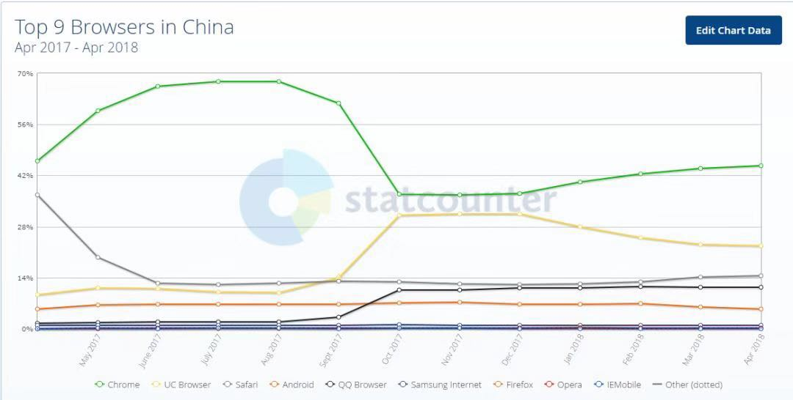

## 总结

1. 移动web的概念
2. 移动web开发方式和常见网页布局方式
3. 移动web开发的基本知识
4. 视口的概念和配置
5. 像素的概念和二倍图原理
6. CSS预处理器的概念
7. less预处理器的基本语法和编译
8. 移动京东的项目搭建
9. 公共样式的定义
10. 顶部通栏的布局
11. 轮播图的布局
12. 导航条的布局
13. 秒杀商品布局
14. 京东超市布局

## 移动web和git&电商全端课程介绍

### PC端的web  （用电脑的浏览器去访问的网站）

 	1. PC 端的京东  
 	2. PC端的百度
 	3. 淘宝等等
 	4. 网易云音乐

### 移动web (用移动端浏览器打开的网站)

​	1. 针对移动端(手机端的web开发)

### 移动web和PCweb区别

	1. 页面大小不一样 PCweb 大 针对电脑屏幕  移动web小 针对的是手机屏幕
	2. 页面的布局方式不一样 PCweb  元素大小都是固定宽高  移动web 元素宽高是动态的 rem 或者 % 全屏盛满整个页面 

### git

​	1. 项目源代码的管理工具

### 电商全端

​	1. 综合移动web+PC的web+node.js后台+mysql数据库的 项目(当然重点还是移动web的应用)


## 移动web的概念和发展历史

### 1. 什么是移动web (webApp) 

1. 运行在手机浏览器里面的web应用程序(网页) 虽然和网页是一样的 ， 但是现代的web特别是移动web已经不再是简简单单的网页了 而是实现了和APP一样的功能  所以现代的网页已经可以称之为应用程序了(所以移动web也叫webApp)

### 2. 移动端的浏览器

1. 在移动端，仅有四个独立的浏览器内核，分别为微软的Trident、火狐的Gecko、开源内核Webkit、Opera的Presto。
  目前微软的Trident在移动终端上主要为WP7、8系统内置浏览器。Opera的Presto内核主要为 Opera Mobile、OperaMini、欧朋浏览器以及欧朋HD Beta版。Webkit内核的适用范围则较为广泛，Android原生浏览器、苹果的Safari、谷歌Chrome(Android4.0使用) 都是基于Webkit开源内核开发的。

  ```
  兼容的前缀：
  1	-ms-
  2	-moz-
  3	-o-
  4	-webkit-
  ```

  

2. UC、Android内置、Chrome、Safari、QQ Browser都是webkit内核，从图上看占了绝大部分的市场份额。
  所以一定要伺候好-webkit-。 有的公司干脆只兼容-webkit-，别的兼容比如-ms-都不写


### 3. 移动web的发展历史

1. 从2014年HTML5正式定稿后移动web就迎来了飞速的发展 因为使用HTML5技术可以更方便 更快捷的开发现代web应用程序 
2. 而移动端的手机浏览器都是比较新的 HTML5在移动端的浏览器支持情况都比较好 
3. 所以HTML5主要应用就是在移动端 移动web
4. 直到2015 - 2016 - 2017 - 至今  移动web已经发展了很多年 各方面的技术都比较成熟稳定 网上的教程也比较完整成熟 所以现在的web已经到全民移动web的时代了


## 移动web开发方式

1. 响应式开发： 写一个页面同时适配多个终端
2. 原生的移动web开发： 分别针对每个端都写一套代码  PC端写一套代码 移动端写一套代码
    1. PC端一般使用固定宽高的布局
    2. 移动端全屏撑满整个页面 全屏100%  使用百分比布局（流式布局）
        目前最流行最先进的方式rem布局方式


## 移动端的布局方式

1. 百分比(流式)布局  （PC和移动端都能用）
2. flex伸缩布局  (PC和移动端都能用  广泛用在移动端)
3. rem布局      (移动端 相对单位相对根元素的字体大小)
4. 响应式布局 (用在网站同时兼容PC移动端的网站)
  注意以上布局方式不是每个页面只能使用这一种 你可以根据需求根据效果灵活搭配使用
  百分比+flex
  百分比+rem
  flex+rem
  百分比+flex+rem

能使用百分比就使用百分比  不能使用百分比使用rem 不能用rem用固定宽高

能用flex优先flex  不能使用flex 使用浮动  浮动也解决不了的就用定位


## 移动web开发的基本知识

### 1. 移动端的站点 以m开头

  1. m.jd.com
  2. m.taobao.com
    移动端页面结构
    搜索框
    轮播图
    导航条
    商品
    底部
    移动端页面的内容比较简单 样式也简单
    移动端页面核心： 用户体验（UI界面效果 加载速度快）  功能方便快捷  考虑各种手机屏幕适配

### 2. 视口

#### 1. 视口的概念: 

  ```
  移动前端中常说的 viewport （视口）就是浏览器中用于呈现网页的区域。视口通常并不等于屏幕大小，特别是可以缩放浏览器窗口的情况下。手机端与PC端视口存在差异，电脑端的视口宽度等于分辨率，而移动端的视口宽度跟分辨率没有关系,宽度默认值是设备厂家指定的。iOS, Android基本都将这个视口分辨率设置为 980px (视口在PC端就是默认窗口大小是不能改的改了也没用)
  ```

#### 2. 为什么手机端视口要设为980px?

  ```
  当年乔布斯设想：苹果手机如果在市场上火爆了，但是各个网站还没有来得及制作手机端网页，那么用户不得不用手机访问电脑版的网页，如何用小屏幕访问大屏幕的页面也同样可读呢？乔帮主就想着为手机固定一个视口宽度，让手机的视口宽度等于世界上绝大多数PC网页的版心宽度，就是980px。这样，用手机访问电脑版网页的时候，旁边刚好没有留白。不过页面缩放后文字会变得非常小，用户需要手动放大缩小才能看清楚，体验非常差
  ```

#### 3. 约束视口(手动修改视口大小)

为了解决移动端网页缩放问题 通过meta标签设置视口的默认值

```html
<!-- 快捷键 meta:vp-->
<meta name="viewport" content="width=device-width,initial-scale=1.0,user-scalable=no,minimum-scale=1.0,maximum-scale=1.0">
```

```
width=device-width 设置视口默认宽度 为设备的真实宽度
initial-scale=1.0 设置视口默认缩放比例 为 1
user-scalable=no 是否允许用户拖放 no不允许 yes允许
minimum-scale=1.0 最小缩放
maximum-scale=1.0 最大缩放
```

#### 4. 视口总结

这个视口的标签告诉浏览器怎么渲染网页。在这里，标签想表达的意思是：按照设备的宽度（device-width）来渲染网页内容。事实上，在支持这个标签的设备上给你看一看效果，你就明白了。

约束视口后

不错呀！用户体验大大改善！！！
此时如果用document.documentElement.clientWidth来测试浏览器屏幕宽度，你会发现当前视口宽度等于手机屏幕的宽度，约数后的视口宽度都是在320~480之间（手机竖直使用的时候）。
这个视口的尺寸，是手机厂商设置的，能够保证我们的文字比如16px，在自己的这个视口下清晰、大小刚刚合适。所以大屏幕的手机的约束视口 > 小屏幕手机的约束视口。这就能够保证我们的网页可以用px写字号、写行高。
**需要注意的是：约束之后的视口宽度，不是自己的分辨率！！每个手机的分辨率，都要比自己的视口宽度大得多得多！**
**最最重要的一句话：前端开发工程师，写代码丝毫不关心手机的分辨率，我们只关心视口**

#### 5. 视口相关单位

1. vw、vh、vmin、vmax 的含义
   1. vw、vh、vmin、vmax 是一种视窗单位，也是相对单位。它相对的不是父节点或者页面的根节点。而是由视窗（Viewport）大小来决定的，单位 1，代表类似于 1%。
      视窗(Viewport)是你的浏览器实际显示内容的区域—，换句话说是你的不包括工具栏和按钮的网页浏览器。
   2. 具体描述如下：
      vw：视窗宽度的百分比（1vw 代表视窗的宽度为 1%）
      vh：视窗高度的百分比（1vh 代表视窗的高度为 1%）
      vmin：当前 vw 和 vh 中较小的一个值
      vmax：当前 vw 和 vh 中较大的一个值
      单位的详解： https://www.cnblogs.com/lidongfeng/p/7243650.html
      vw、vh、vmin、vmax应用场景： https://blog.csdn.net/ZNYSYS520/article/details/76053961
2. %: 百分比 也是一个相对单位 但是百分比参照的是父元素 不一定和视口一样


### 3. 移动端的像素

1. 设备像素（Device Pixel）：物理分辨率像素，设备能控制显示的最小单位，我们常说的1920×1080像素 1334*750像素 分辨率就是用的设备像素单位
2. 设备独立像素（Device Independent Pixel）：真实像素 与设备分辨率无关的逻辑像素，代表可以通过程序控制使用的虚拟像素，是一个总体概念，包括了CSS像素
  
3. CSS像素（CSS Pixel）：视口像素 适用于web编程，指的是我们在样式代码中使用到的逻辑像素，是一个抽象概念，实际并不存在

4.  设备像素(物理分辨率像素) 设备独立像素(真实像素) CSS逻辑像素(视口像素)的关系
    1. PC端 因为通常PC端 分辨率 和 真实像素 和 视口像素 一样 所以 物理1px == 真实1px == CSS1px
    2. 移动端 因为移动端通常 分辨率 是 真实像素的 2倍 (视口通常设置和真实像素一样) 所以 物理2px = 真实1px ==  CSS1px
    3. 一般如果分辨率比真实像素 大 就表示这种屏幕是retina屏幕 (视网膜高清屏) 如果分辨率和真实一致表示普通屏幕


### 4. 移动端设计图 和 移动端二倍图的原理

  1. 移动端设计稿一般是按照分辨率设计的 （为了保证图片在分辨率里面不会失真）
  2. 但是分辨率是真实像素和CSS像素的2倍 所以 写代码的时候量设计稿的px 都要缩小一半来写CSSpx
  4. 例如量了750宽度 只能写375  量了80 只能写40（一般设计师会标好 也要按照标好的一半来写）

### 5. 后续3倍 4倍 解决方案都一样

1. 设计师会设计3倍图片 和设计稿   写页面的时候 缩小3倍来
    2倍设计稿 640px 常见设备 iphone 4 / 5   720px 常见设备 中低端安卓手机小米 三星  750px 常见设备 iphone 6 / 7 / 8   
    3倍 1125px 常见设备 iphonex     1080px 常见设备 3倍 高端安卓手机小米三星

### 6. 移动的其他知识  
    http://www.woshipm.com/pmd/176328.html
    http://www.cnblogs.com/jiangzilong/p/6700023.html


## CSS 预处理器

### 1. 为什么要有 CSS 预处理器

**CSS基本上是设计师的工具，不是程序员的工具**。在程序员的眼里，CSS是很头痛的事情，它并不像其它程序语言，比如说PHP、Javascript等等，有自己的变量、常量、条件语句以及一些编程语法，只是一行行单纯的属性描述，写起来相当的费事，而且代码难以组织和维护。

很自然的，有人就开始在想，能不能给CSS像其他程序语言一样，加入一些编程元素，让CSS能像其他程序语言一样可以做一些预定的处理。这样一来，就有了“**CSS预处器**（CSS Preprocessor）”。

### 2. 什么是 CSS 预处理器

- 是 CSS 语言的**超集**，比CSS更丰满。

CSS 预处理器定义了一种新的语言，其基本思想是：**用一种专门的编程语言，为CSS增加了一些编程的特性**，将CSS作为目标生成文件，然后开发者就只要使用这种语言进行编码工作。

通俗的说，**CSS预处理器用一种专门的编程语言，进行Web页面样式设计，然后再编译成正常的CSS文件**，以供项目使用。CSS预处理器为CSS增加一些编程的特性，无需考虑浏览器的兼容性问题，例如你可以在CSS中使用变量、简单的逻辑程序、函数等等在编程语言中的一些基本特性，可以让你的CSS更加简洁、适应性更强、可读性更佳，更易于代码的维护等诸多好处。

CSS预处理器技术已经非常成熟，而且也涌现出了很多种不同的CSS预处理器语言，比如说：**Sass（SCSS）、LESS**、Stylus、Turbine、Swithch CSS、CSS Cacheer、DT CSS等。如此之多的CSS预处理器，那么“我应该选择哪种CSS预处理器？”也相应成了最近网上的一大热门话题，在Linkedin、Twitter、CSS-Trick、知呼以及各大技术论坛上，很多人为此争论不休。相比过计我们对是否应该使用CSS预处理器的话题而言，这已经是很大的进步了。

到目前为止，在众多优秀的CSS预处理器语言中就属**Sass、LESS和Stylus最优秀**，讨论的也多，对比的也多。本文将分别从他们产生的背景、安装、使用语法、异同等几个对比之处向你介绍这三款CSS预处理器语言。相信前端开发工程师会做出自己的选择——我要选择哪款CSS预处理器。

### 3. less 的介绍

less 是一款比较流行的**预处理 CSS**，支持变量、混合、函数、嵌套、循环等特点。

- [官网](http://lesscss.org/)
- [中文网（less 文档）](http://lesscss.cn/)
- [Bootstrap网站的 less 文档](https://less.bootcss.com/)
- 推荐文章：<http://www.w3cplus.com/css/less>

### 4. less使用 在 demo.html中直接引用 less.js

- 做法一：写完 less文件后，将其编译为 css 文件，然后在代码中引用css文件。
- 做法二：在代码中直接用引用 less 文件。

产品上线后，当然是使用做法一，因为做法二会多出编译的时间。

平时开发或演示demo的时候可以用做法二。

这一段，我们讲一下做法二，其实是浏览器在本地在线地把 less 文件转换为 css 文件。

1.  在 less 官网下载 less.js 文件：


把下载好的文件放在工程文件的lib文件夹里：


2. 在 index.html 中引入 less.js 和我们自己写的  main.less。位置如下：

    ```
    	<!-- 1. 创建和引入less文件 页面中可以直接引入 但是不会像CSS一样执行 强调rel="stylesheet/less" -->
    	<link rel="stylesheet/less" href="demo.less">
    	<!-- 2. 引入一个less.js文件 编译器文件 用来编译less -->
    	<!-- 因为less虽然引入了但是代码不能被浏览器解析成样式 通过less.js 吧less代码 编译(在js代码里面临时去编译)成css代码浏览器才可以执行 -->
    	<script src="jd/lib/less/less.js"></script>
    	<!-- 3. 使用服务器打开页面 less.js里面会发送ajax 请求demo.less 吧代码编译成css代码 通过style标签嵌入到页面中 完成了less的编译 所以要注意引入顺序 因为less.js是用来编译demo.less的 所以先引入demo.less 再引入less.js -->
    ```

    


3. 使用服务器访问页面

    1. sublimeserver

       ​  

       

       

    2. vscode live server

       

       


我们可以在打开的网页中，通过控制台看到效果：


注意，我们要在服务器中打开 html 文件，否则，看不到效果。

less的编译原理

​	

这里也告诉了我们：

> 不提倡将 less 引入页面，因为 less 需要编译，因此你就需要再引入一个less.js, 多了一个HTTP 请求，同时当浏览器禁用了 js 你的样式就不起作用了，less 编译应该在服务端或使用 一些自动化工具自动编译。

参考链接：

- [知乎 | less文件如何引入页面](https://www.zhihu.com/question/26075208)


### 5. less 的语法

#### 1. 注释

less 的注释可以有两种。

第一种注释：模板注释

```less
  // 模板注释 这里的注释转换成CSS后将会删除
```

因为 less 要转换为 css才能在浏览器中使用。转换成 css 之后，这种注释会被删除（毕竟 css 不识别这种注释）。

第二种注释：CSS 注释语法

```less
/* CSS 注释语法 转换为CSS后让然保留 */
```

总结：如果在less中写注释，我们推荐写第一种注释。除非是类似于版权等内容，就采用第二种注释。

#### 2. 定义变量

我们可以把**重复使用或经常修改的值**定义为变量，在需要使用的地方引用这个变量即可。这样可以避免很多重复的工作量。

（1）在less文件中，定义一个变量的格式：

```less
/* 1. 定义变量
在less里面可以写高级代码 
语法使用@符号开头
变量名的命名规范和JS一样  中间可以有-
值可以是任意CSS里面能够写的值 px 颜色 单词等等 但是写值的时候和CSS一样带单位
@变量名:值; */
/* 变量都是全局变量  变量名不能冲突 */
/* 把全局变量单独提取到一个文件里面 */
@bgc: #ccc;
@w-100:200px;
@h-100:200px;
@border-color:hotpink;
```

（2）同时，在 less 文件中引用这个变量。

最终，less文件的完整版代码如下：

demo.less：

```less
.box1 {
    background-color: @bgc;
    width: @w-100;
    height: @h-100;
    margin-top: 10px;
    float: left;
}

```

我们将上面的less文件编译为 css 文件后（下一段讲less文件的编译），自动生成的代码如下：

demo.css：

```css
.box1 {
  background-color: #ccc;
  width: 200px;
  height: 200px;
  margin-top: 10px;
  float: left;
}
```

#### 3. 使用嵌套

在 css 中经常会用到子代选择器，效果可能是这样的：

```css
.container{
	width: 1170px;
	margin: 0px auto;	
	padding: 0 15px;
	height: 100px;	
}

.container .row{
	margin: 0px -15px;	
	height: 100px;	
}

.container .row .col{
	width: 33.33%;
	float: left;
}


.container .row .col a{
	color:red;
	text-decoration: none;
} 
```

上面的代码嵌套了很多层，写起来很繁琐。可如果用 less 的嵌套语法来写这段代码，就比较简洁。

嵌套的举例如下：

demo.less:

```less
.container{
	width: 1170px;
	margin: 0px auto;	
	padding: 0 15px;
	height: 100px;	
   >.row{
		margin: 0px -15px;	
		height: 100px;	
		>.col{
			width: 33.33%;
			float: left;
			>a{
				color:red;
				text-decoration: none;
				/* &在哪里面就表示谁 和JS this */
				/* 表示当前的a的hover */
				&:hover{
					color:green;
				}
				&::before{
					content:'伪元素';
				}
				&::after{
					content:'伪元素';
				}
				/* 交集选择器 */
				&.active{
					color:yellow;
				}
			}
		}
	}
}
```

将上面的less文件编译为 css 文件后，自动生成的代码如下：

demo.css

```css
/* less嵌套 可以像标签一样写嵌套 */
.container {
  width: 1170px;
  margin: 0px auto;
  padding: 0 15px;
  height: 100px;
}
.container > .row {
  margin: 0px -15px;
  height: 100px;
}
.container > .row > .col {
  width: 33.33%;
  float: left;
}
.container > .row > .col > a {
  color: red;
  text-decoration: none;
  /* &在哪里面就表示谁 和JS this */
  /* 表示当前的a的hover */
  /* 交集选择器 */
}
.container > .row > .col > a:hover {
  color: green;
}
.container > .row > .col > a:before {
  content: '伪元素';
}
.container > .row > .col > a:after {
  content: '伪元素';
}
.container > .row > .col > a.active {
  color: yellow;
}
```


#### 4. Mixin(自定义函数)

Mixin 的作用是把**重复的代码**放到一个类当中，每次只要引用类名，就可以引用到里面的代码了，非常方便。

（1）在 less 文件中定义一个类：（将重复的代码放到自定义的类中）

```less
/* 给自定义函数添加参数
变量在函数里面 表示一个形参 参数名称也是@符号
可以把一些重复使用样式封装成一个函数 还可以带参数 参数还可以设置默认值
参数可以有多个 多个使用特殊符号隔开 一般是逗号
 */
/* 把所有全局的函数 单独提取到了一个公共的文件 */
.bordertb(@size,@style){
	border-top: @size @style @border-color;
	border-bottom: @size @style @border-color;	
}
.bordertb(@size:5px,@style:solid){
	border-top: @size @style @border-color;
	border-bottom: @size @style @border-color;
}
```

上方代码中，括号里的内容@size是参数：这个5px参数的**默认值**。

（2）在 less 文件中引用上面这个类：

```less
.box1 {
    background-color: @bgc;
    width: @w-100;
    height: @h-100;
    margin-top: 10px;
    .bordertb();
    float: left;
}

.box2 {
    background-color: @bgc;
    width: @w-100;
    height: @h-100+100;
    margin-top: 10px;
    .bordertb(20px,dashed);
    float: left;
}

```


上方代码中，header 中的引用没有带参数，表示参数为缺省值； footer 中的引用带了参数，那就用这个参数。


#### 5. Import(引包)

在开发阶段，我们可以将不同的样式放到多个文件中，最后通过@import 的方式合并。意思就是，当出现多个 less 文件时，怎么引用它们。

这个很好理解， css 文件可以有很多个，less文件也可以有很多个。

（1）定义一个被引用的less文件，名为variables.less：

`variables.less:`

```less
/* 1. 定义变量
在less里面可以写高级代码 
语法使用@符号开头
变量名的命名规范和JS一样  中间可以有-
值可以是任意CSS里面能够写的值 px 颜色 单词等等 但是写值的时候和CSS一样带单位
@变量名:值; */
/* 变量都是全局变量  变量名不能冲突 */
/* 把全局变量单独提取到一个文件里面 */
@bgc: #ccc;
@w-100:200px;
@h-100:200px;
@border-color:hotpink;
```

（2）在 `demo.less` 中引用上面的 `variables.less`

`demo.less`：

```less
/* 4. 引包 一般在最前面 把别的less文件的代码引入到当前less文件里面执行
把一些公共的样式 变量放到公共的文件里面 */
/* 引入定义变量的less文件 */
@import 'variables.less';
/* 引入定义函数的less文件 */
@import 'mixins.less';
.box1 {
    background-color: @bgc;
    width: @w-100;
    height: @h-100;
    margin-top: 10px;
    .bordertb();
    float: left;
}
```

将 上面的demo.less编译为 demo.css之后，自动生成的代码如下：

```css
.box1 {
  background-color: #ccc;
  width: 200px;
  height: 200px;
  margin-top: 10px;
  border-top: 5px solid hotpink;
  border-bottom: 5px solid hotpink;
  border-top: 10px solid hotpink;
  border-bottom: 10px solid hotpink;
  float: left;
}
```

​	`demo.less`会自动使用 `variables.less`里面定义好的变量直接

#### 6. 内置函数

less 里有一些内置的函数，这里讲一下 lighten 和 darken 这两个内置函数。

demo.less:

```less
body {
  background-color: lighten(#000, 90%);   // 让黑色变亮 10%
  color: darken(#fff, 10%);               // 让白色变暗 10%
}
```

将 上面的 demo.less 编译为 demo.css 之后，自动生成的代码如下：

demo.css：

```css
body {
  background-color: #e6e6e6;
  color: #e6e6e6;
}


```

  ​    

### 6. less 的编译

less 的编译指的是将写好的 less 文件 生成为 css 文件。

less 的编译，依赖于 NodeJS 环境。因此，我们需要先安装 NodeJS。

#### 1.安装 Node.js

去 [Node.js](https://nodejs.org/zh-cn/)的官网下载安装包：

​	

使用本地下载好的nodejs

​	

双击一路 next 进行安装不要修改目录。

​	

在 cmd 命令行，输入`node -v`，可以查看 node.js 的版本。


#### 2. 安装 less 的编译环境


可以输入下面的命令安装less包：

```bash
    npm默认为国外的话不翻墙可能安装包很慢甚至安装不了推荐使用国内的 执行分别下面2段命令
    npm config set registry http://registry.npm.taobao.org/
    npm install -g less
```

#### 3. 将 less 文件编译为 css 文件

在 less 所在的路径下，输入 `lessc xxx.less`，即可编译成功。或者，如果输入 `lessc xxx.less > ..\xx.css`，表示输出到指定路径。

​      

#### 4. 使用vscode的Easy less插件


写完less代码保存自动会编译生成css文件


## 移动web项目实战移动jd项目

### 1. 搭建京东移动端项目

1. 创建jd项目文件夹
2. 打开1-教学资料 》 jd完整版 》 复制 image+lib文件夹 放到你自己的jd里面
3. 搭建页面 写视口 引包


### 2. 移动端JD项目


### 3. 搭建项目的结构

1. 创建一个jd的文件夹
2. 打开 1-教学资料 > jd完整版 把images和lib复制到你创建的jd项目
3. 进入jd文件夹创建index.html主页
4. 给页面添加视口
5. 页面引包
  创建项目需要的less文件夹  index.less
  和js文件夹  index.js
6. 项目初始样式（没有使用框架需要自己写样式初始化代码）
   创建一个base.less公共样式文件
   移动端常见的样式初始化：
      1. 移动端需要设置盒模型为border-box 防止页面出现水平滚动条

      2. 移动端要去除标签点击高亮

      3. 去除图片3px间隙
       移动端公共的样式
         1.浮动
         2.清除浮动

   其他的一些针对移动端兼容的样式  https://www.jianshu.com/p/cb2d8ca8cff2

### 4. jd头部布局

  1. 左边一个logo图标
  2. 中间一个from表单 里面一个search图标 和 Input输入框
  3. 右边一个登录链接

  4. 样式 给图标设置背景图 同时设置背景大小 使用flex左右2边固定 中间flex:1自适应
  5. 给左边的logo设置固定的宽度高度加padding 让内容到中间 同时设置背景图的定位原点为content-box 和背景图的裁切也为content-box
  6. 中间的表单设置input 宽度100% 高度30px 圆角15px 居中
  7. 给中间表单里面的搜索图标也添加精灵图定位在搜索框的上面
  8. 右边的登录链接设置固定宽高文字水平垂直居中即可


## 总结

1.  移动web： 在手机浏览器里面打开的网页  在App里面打开的一些网页(微信公众号 支付生活号  只要能分享的都是网页)

2. 移动端浏览器： 通常都是webkit内核的浏览器  兼容比较好 大胆的使用H5C3

3. 移动端的视口： 是浏览器显示网页的窗口  PC端和窗口一样大 并且随着窗口变化而变化  但是移动端默认不是和窗口一样大 是980  但是现在不需要这个980默认视口 需要手动修改能够和设备的真实宽高一样

   meta:vp 快速生成标准视口

4. 像素的概念： 物理(分辨率)像素 设备独立(真实)像素  CSS(逻辑)像素

   在PC端 3种像素一样 比例是 1:1:1

   在移动端 通常分辨率比真实像素大倍 甚至倍

   2倍 2:1:1

   3倍3:1:1

​       通过js属性查看设备的像素比(物理和真实像素比例)

​	 window.devicePixelRatio   简称dpr

5. 因为分辨率比真实像素大2倍 页面最终在分辨率显示 到分辨率网页整体会放大 设计稿是按照分辨率去设计的 写代码不能按照设计图来写代码 要按照真实像素(视口大小写代码)   使用移动端针对设计稿的大小所有都要/2  以后可能还有会/3  甚至/4

6. CSS 预处理器： 是比CSS更加强大的CSS 完全兼容CSS并且新增了高级写法 变量 嵌套 引包

7. less基本使用 

   1. 浏览器less.js方式使用

      1. 引入less文件 注意rel="stylesheet/less"

        <link rel="stylesheet/less" href="less/index.less"> 

      2. 引入一个less.js编译器文件

        <script src="lib/less/less.js"></script> 
      3. 使用服务器打开页面非file:// 

  8. 使用插件直接编译CSS引入css
    1. 安装easy less插件
    2. 保存less自动生成css 和之前一样引入css即可

9. less基本语法
  一些重复的值设置到变量里面 方便维护
  @变量名:值;
  嵌套 类似标签的嵌套一样写嵌套

  ```
  ul{
    li{
      a{
  
  	}
    }
  }
  ```

  引包
  @import 'less文件路径'   把多个less文件引到一个地方去编译去使用
  注释
  // 会被删除
  /**/ 会保留

10. 搭建jd项目 
11. 移动端样式初始化

   1. box-sizing:border-box; 防止元素设置padding border超出页面宽度出现横向滚动条
   2. -webkit-tap-highlight-color: transparent; 清除移动端点击的高亮背景色

12. 写jd主页优先使用id选择器作为容器 写页面大容器结构
13. 头部左中右布局 使用flex伸缩布局 左右2边宽度固定 中间flex:1自适应
14. 背景图的使用
   1. 背景图也是2倍图 也要缩小1半来写 不能写50% 参照的当前元素宽度50%应该设置的图片宽度50%
   2. 背景图默认背景图定位在padding区域 背景图不会受到padding影响位置 想要影响
     background-origin:content-box; 让背景图参照内容区域定位
     但是还有在padding区域还有背景图 还需要裁切
     background-clip:content-box; 裁切掉除了内容区域以外 背景图
15. 今天暂时写死宽高明天会讲自适应的布局