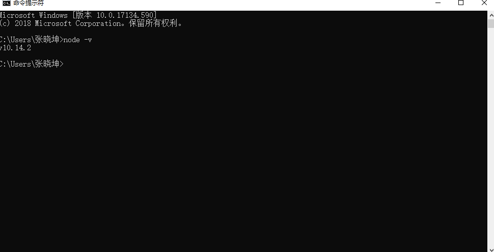
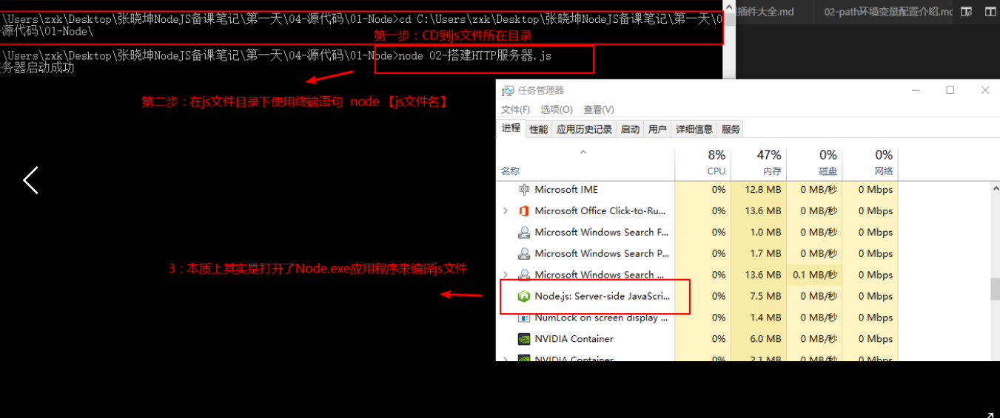
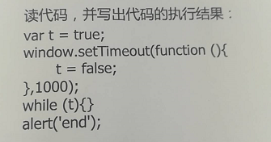

# 01-nodejs介绍

## 1.1-学习NodeJS的意义

* 1.了解客户端浏览器与服务端后台的交互过程，可以在以后的前端开发工作中与后台人员之间的沟通更加容易理解
  * 虽然以后工作中不一定用的上nodejs，但是通过对服务端开发的了解，能够让你在日常工作中与公司后台人员之间的沟通变得更加轻松
  * 
* 2.了解服务端开发的一些特性，可以在以后的工作中，当我们前端与后台交互出现bug问题时，能够更快速的定位bug是出现在自己的客户端还是别人的服务端。
  * 作为一名前端人员，如果对后台不了解，那么以后在与后台交互的开发中有可能明明是后台的问题，但是由于自身对后台的不了解再加上前期的经验不足，导致解决问题的时间增加（加班）。

* 3.了解服务端开发的过程，可以为以后的职业发展打下一定的基础（全栈工程师）


## 1.2-什么是nodejs


* 1.Node.js官网地址：<https://nodejs.org/en/>

* 中文:<http://nodejs.cn/api/>
  * 
* 1.Node 是一个构建于 Chrome V8引擎之上的一个Javascript运行环境
  * Node是一个运行环境，作用是让js拥有开发服务端的功能
* 2.Node使用事件驱动、非阻塞IO模型（异步读写）使得它非常的轻量级和高效
  * Node中绝大多数API都是异步（类似于ajax），目的是提高性能
* 3.Node中的`NPM`是世界上最大的开源库生态系统（类似于github）
  * NMP官网:<https://www.npmjs.com>


# 02-Node.js环境安装


## 1.1-如何确认当前电脑是否已经安装了Node环境


* 打开终端，输入 `node -v`,如果能看到版本号则说明当前电脑已经安装Node环境，如果提示`Node不是内部或外部命令`，则表示未安装
  * ***一旦安装了node，则会自动一并安装`npm`***





## 1.2-npm介绍与cnpm安装


* 1.npm
  * 全称node package manager
  * 官方推出的包管理工具
  * 不需要额外安装，安装node之后自带
  * 因为服务器不在国内，所以有时候安装特别慢，甚至无法成功
* 2.cnpm
  * 全称china node package manager
  * 非官方推出的包管理工具
  * 需要额外安装：`npm install -g cnpm --registry=https://registry.npm.taobao.org`
  * 国内安装特别快，不需要翻墙（如果特殊情况无法安装，也可使用npm）
  * 安装成功之后，通过`cnpm -v`查看


# ==03-如何运行Node.js程序==


## 1.1-如何运行Node.js程序


* 1.REPL：交互解释器

  * Node运行环境的另一种叫法，作用是解析执行js代码
  * 用法
    * 第一种方式：直接双击打开 node.exe,然后写js代码
    * 第二种方式：
      * 先在终端先执行node，进入node环境
      * 然后写js代码

* 2.使用终端命令`node [js文件路径]`开始运行js文件

  * （1）其实当我们在终端执行Node命令时，并不是我们终端去编译解释js代码，而是电脑会自动打开Node安装包中Node.exe应用程序来打开js文件
    * Node.exe是一个类似于终端的应用程序，没有界面(CLI程序：command-line interface，命令行界面)
    * Node.exe工作环境称之为REPL环境，也就是交互式解释器
  * （2）REPL才是真正解释执行我们js代码的解释器

  

  

  

  3.nodemon

  * node开发之友，当你的js文件发生变化的时候，nodemon会自动帮你启动node程序
  * 安装: `npm install -g nodemon`
  * 使用：`nodemon [js文件名]`


# 04-服务端js与客户端js区别


* 1.客户端JS由三部分组成
  * ECMAScript：确定js的语法规范
  * DOM：js操作网页内容
  * BOM：js操作浏览器窗口
* 2.服务端JS只有ECMAScript
  * 因为服务端是没有界面的
    * ==在nodejs中使用dom与bom的api程序会报错==

# 05-ES6语法新特性介绍

  

  ## 1.1-变量声明let与const

  

  ```javascript
  /* ES5语法变量特点 */
  
  // 1.变量会提升
  console.log(num);
  var num = 10;
  
  // 2.没有块级作用域
  for(var i = 1;i<5;i++){
      console.log(i);
  };
  
  // console.log(i);
  
  /* ES6新增两种变量声明方式（let与const），类似于var
      1.不会提升
      2.有块级作用域
  */
  
  // （1）如果打印undefined，说明提升了  （2）如果报错，说明没有提升
  // console.log(a);//报错
  // let a = 10;
  
  // (2)如果打印5，说明没有块级作用域  （2）如果报错，说明有块级作用域
  
  for(let j = 1;j<5;j++){
      console.log(j);
  };
  
  // console.log(j);
  
  /* let与const区别
      * 注意点：ES6中变量不能重复声明，否则会报错
  */
  
  //let声明：变量，允许修改
  let a = 10;
  a = 20;
  // let a = 30;//程序报错，不允许重复声明
  console.log(a);
  
  //const声明:常量，只可以声明的时候赋值一次，之后无法修改
  const b = 100;
  // b = 200;//程序报错
  console.log(b);
  ```

  

  ## 1.2-对象快速赋值

  

  ```javascript
  /* ES5对象赋值：如果属性名和变量名一致 */
  let name = '张三';
  let age = 18;
  let sayHi = function () {
      console.log('你好');
  };
  
  let person = {
      name:name,//属性名：属性值
      age:age,
      sayHi:sayHi
  };
  
  console.log(person);
  
  /* ES6新增对象快速赋值 */
  let person1 = {
      name,//等价于 name:name
      age,
      sayHi,
      play(){//等价于 play:function play(){}
          console.log('今晚吃鸡');
      },
  };
  
  console.log(person1);
  ```

  

  ## 1.3-箭头函数

  

  ```javascript
  /* 无参无返回函数 */
  
  // ES5
  let fn = function () {
      console.log('开工大吉');
  };
  fn();
  
  //ES6: 将function关键字使用 => 符号代替
  //注意点：形参小括号写在 箭头前面，无参时不能省略
  let fn1 = ()=>{
      console.log('开工大吉');
  };
  
  //如果函数体只有一行，可以省掉大括号
  fn1 = ()=> console.log('开工大吉');
  fn1();
  
  
  /* 有参有返回值 */
  //ES5
  let add = function(a,b){ 
      return a+b;
  };
  
  console.log(add(10,20));
  
  //ES6
  
  // let add1 = (a,b)=>{
  //     return a+b;
  // };
  // console.log(add1(100,200));
  
  // 如果函数体只有一行，可以省略{},但此时返回值必须要省略return
  // 如果形参只有一个，也可以省掉小括号
  add1 = a=> a+10;
  
  console.log(add1(100));
  ```

 

# ==06-fs文件模块(读写文件)==


## 1.1-readFile读取文件

```javascript
//1.导入文件模块

const fs = require('fs');

//2.读取文件

/**
 * 第一个参数：文件路径
 * 第二个参数：编码格式 （可选参数，默认为buffer二进制）
 * 第三个参数：读取回调操作（异步操作）
    * err:如果读取成功，err为null,  否则读取失败（一般文件路径错误或者找不到文件）
    * data:读取到的数据
 */
fs.readFile('./data/aaa.txt','utf-8',(err,data)=>{
    
    if(err){
        console.log(err);
        //抛出异常，throw的作用就是让node程序终止运行，方便调试
        throw err;
    }else{
        console.log(data);
    };
});

console.log('11111');

//3.同步读取文件(了解即可，几乎不用,一般在异步的api后面加上Sync就是同步)

let data = fs.readFileSync('./data/aaa.txt','utf-8');
console.log(data);

console.log('2222');
```


## 1.2-writeFile写入文件


```javascript
//1.导入文件模块
const fs = require('fs');

//2.写文件

/**
 * 第一个参数：文件路径
 * 第二个参数：要写入的数据
 * 第三个参数：文件编码 默认utf-8
 * 第四个参数： 异步回调函数
    * err:  如果成功，err为null.否则读取失败
 */
fs.writeFile('./data/bbb.txt','黑马程序员','utf-8',(err)=>{
    if(err){
        throw err;
    }else{
        console.log('写入成功');
    };
});
```


# 07-同步与异步区别


* 1.同步会阻塞线程，异步不会

* 2.同步有序执行，异步无序执行

* 3.同步没有回调函数，异步有回调函数

  

```javascript
//1.导入模块
const fs = require('fs');

/*js从上往下解析代码流程
    1.判断是同步还是异步
    2.如果是同步，则立即执行
    3.如果是异步，则不执行，而是放入事件循环中(Event Loop)
    4.所有代码解析完毕之后，开始执行事件循环中的异步代码

*/

/*异步操作
1.不会阻塞线程（性能高）
2.无序执行
3.有回调函数 
 */

//异步操作
// console.log('55555555');
// fs.readFile('./data/aaa.txt','utf8',(err,data)=>{
//     console.log('1111111');
    
//     if(err){
//         throw err;
//     }else{
//         // console.log(data); 
//     };
// });


// console.log('666666');
// fs.readFile('./data/aaa.txt','utf8',(err,data)=>{
//     console.log('222222');
    
//     if(err){
//         throw err;
//     }else{
//         // console.log(data); 
//     };
// });

// console.log('777777');
// fs.readFile('./data/aaa.txt','utf8',(err,data)=>{
//     console.log('333333');
    
//     if(err){
//         throw err;
//     }else{
//         // console.log(data); 
//     };
// });

// console.log('8888888');
// fs.readFile('./data/aaa.txt','utf8',(err,data)=>{
//     console.log('4444444');
    
//     if(err){
//         throw err;
//     }else{
//         // console.log(data); 
//     };
// });


//同步操作
/* 1.会阻塞线程（性能低）
    2.有序执行
    3.没有回调函数

 */
let data1 = fs.readFileSync('./data/aaa.txt','utf8');
console.log(data1);
console.log('11111');

let data2 = fs.readFileSync('./data/aaa.txt','utf8');
console.log('22222');
console.log(data2);

let data3 = fs.readFileSync('./data/aaa.txt','utf8');
console.log('33333');
console.log(data3);


let data4 = fs.readFileSync('./data/aaa.txt','utf8');
console.log('44444');
console.log(data4);

```


经典面试题




# ==08-http模块(搭建服务器)==


## 1.1-http模块搭建服务器

```javascript
//1.导入模块

const http = require('http');

//2.创建服务器
/*createServer 相当于安装了 phpStudy中的Apache
    参数：回调函数
        req:request  客户端请求的数据
        res:response 服务端响应的数据
 */
let server = http.createServer((req,res)=>{
    //服务端每收到一个客户端请求都会执行一次该回调函数，这个函数会执行多次

    //req.url:获取客户端请求的路径
    console.log('客户端请求的数据' + req.url);
    
});

//3.启动服务器（相当于点击了phpStuty的开启按钮）
/*
第一个参数：端口号
第二个参数：ip地址   默认不写，就是本机ip（127.0.0.1）
第三个参数 
 */
server.listen(3000,'127.0.0.1',(err)=>{
     console.log('服务器启动成功');
});
```


## 1.2-响应客户端请求


```javascript
//1.导入HTTP模块
const http = require('http');

//2.创建服务器
let server = http.createServer((req,res)=>{
    //服务器每收到一次请求都会调用一次这个函数
    //req:负责接收客户端请求
    //res:负责响应客户端请求
    
    /* 注意：服务器响应给客户端只能是两种数据类型： 一：文本  二：二进制  否则程序报错 */
    res.end('hello world');
});

//3.开启服务器
server.listen(3000,(err)=>{
    console.log('服务器开启成功'); 
});
```


## 1.3-根据不同请求响应不同数据


```javascript
//1.导入HTTP模块
const http = require('http');

//2.创建服务器
let server = http.createServer((req,res)=>{
    //服务器每收到一次请求都会调用一次这个函数
    //req:负责接收客户端请求
    //res:负责响应客户端请求
    
    console.log(req.url);//获取到的内容是127.0.0.1：3000后面的内容，url路径通常以'/'开头
    if(req.url == '/a'){
        res.end('hello world');
    }else if(req.url == '/login'){//

        //设置服务器响应头： 作用：服务端告诉客户端，我响应给你的数据是什么类型
        res.writeHead(200,{
            'Content-Type':'text/plain;charset=utf8'   //text/plain:普通文本
        });

        res.end('这是登录页');
    }else if(req.url == '/'){ //如果本次没有请求路径（127.0.0.1：3000），通常表示首页
        
        res.writeHead(200,{
            'Content-Type':'text/html;charset=utf8'   //text/html文本
        });
        res.end('<h1>这是首页</h1>');
    }else{
        //如果客户端请求了服务端无法识别的路径，一般响应404
        res.end('404 not found');
    };
});

//3.开启服务器
server.listen(3000,()=>{
  
    console.log('服务器开启成功');

})
```


## 1.4-http响应客户端HTML文件


```javascript
//1.导入http模块
const http = require('http');

const fs = require('fs');

//2.创建服务器
let server = http.createServer((req,res)=>{

    console.log(req.url);
    //一般情况下，如果返回的是文件二进制数据，浏览器会自动识别文件格式解析加载
    
    if(req.url == '/'){//  请求路径为/，返回首页
        fs.readFile('./data/index.html',(err,data)=>{
            if(err){
                throw err;
            }else{
                console.log(data);
                res.end(data);
            };
        });
    }else if(req.url == '/login.html'){
        fs.readFile('./data/login.html',(err,data)=>{
            if(err){
                throw err;
            }else{
                res.end(data);
            };
        });
    }else if(req.url == '/image.jpg'){
        fs.readFile('./data/image.jpg',(err,data)=>{
            if(err){
                throw err;
            }else{
                res.end(data);
            };
        });
    }else{
        res.end('404 not found');
    };
});

//3.开启服务器
server.listen(3000,(err)=>{
    console.log('服务器启动成功');
});
```


# 09-Nodejs使用第三方模块流程(以爬虫模块Crawler为例)

## 1.1-npm与cnpm介绍

* 1.npm
  * 全称node package manager
  * 官方推出的包管理工具
  * 不需要额外安装，安装node之后自带
  * 因为服务器不在国内，所以有时候安装特别慢，甚至无法成功
* 2.cnpm
  * 全称china node package manager
  * 非官方推出的包管理工具
  * 需要额外安装：`npm install -g cnpm --registry=https://registry.npm.taobao.org`
  * 国内安装特别快，不需要翻墙（如果特殊情况无法安装，也可使用npm）
  * 安装成功之后，通过`cnpm -v`查看


## 1.2-npm使用流程

* 1.初始化：在当前nodejs项目中执行终端命名: `npm init -y`
  * 作用：生成一个`pachage.json`文件，帮你记录当前项目安装了哪些第三方模块及对应的版本号
* 2.安装：在当前nodejs项目中执行终端命名: `npm install 模块名`
  * 安装之后，你的项目目录会新增两个文件`node_modules`与`package-lock.json`
    * node_modules:npm会自动将所有的第三方模块放入这个文件夹中。类似于前端的`lib文件夹`
    * package-lock.json：npm会自动记录第三方模块的下载地址，下一次安装或更新的时候直接从这个地址下载，速度更快(只是影响以后更新速度，不影响开发)


## 1.3-第三方模块使用流程（适合所有第三方模块）

*  1.进npm官网搜索模块:https://www.npmjs.com/
* 2.按照官方文档要求安装模块`npm install 模块名`
* 3.复制粘贴官网代码(别人作者提前写好的)


