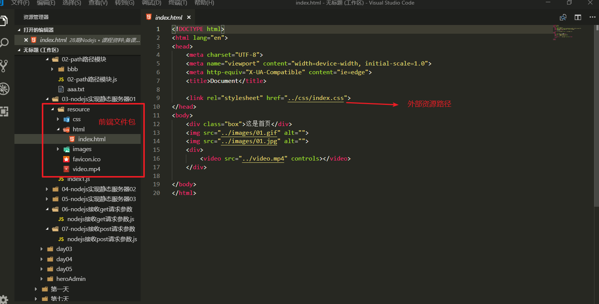
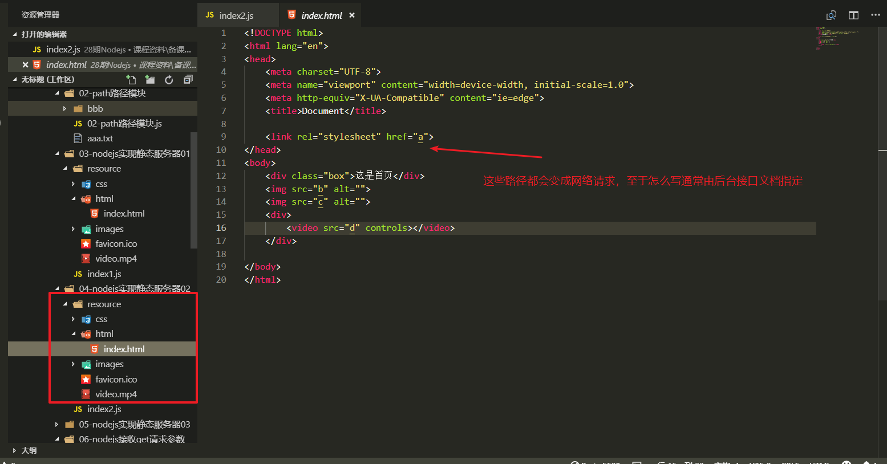
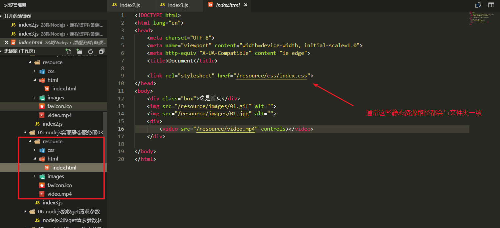
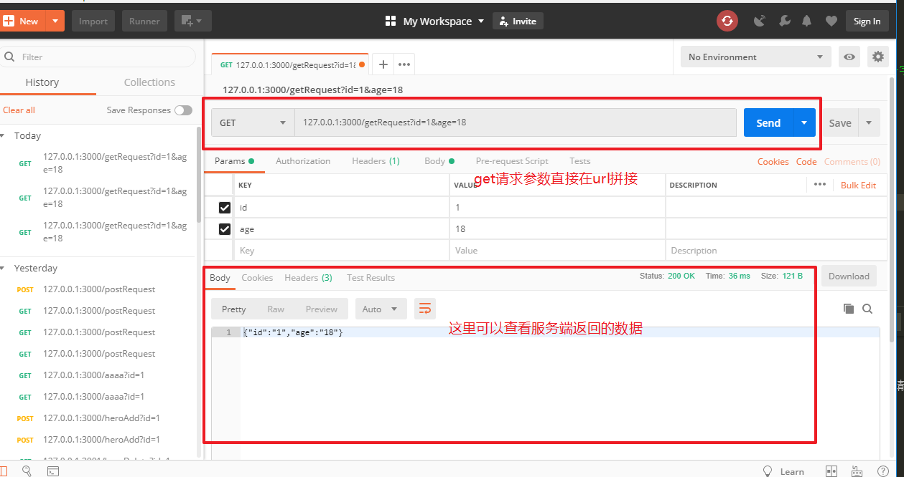
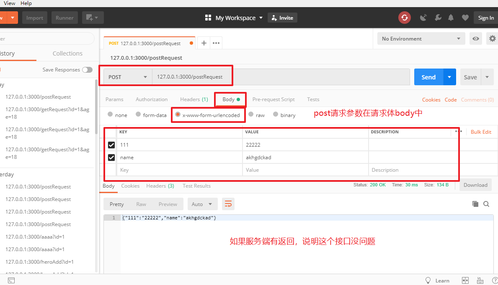
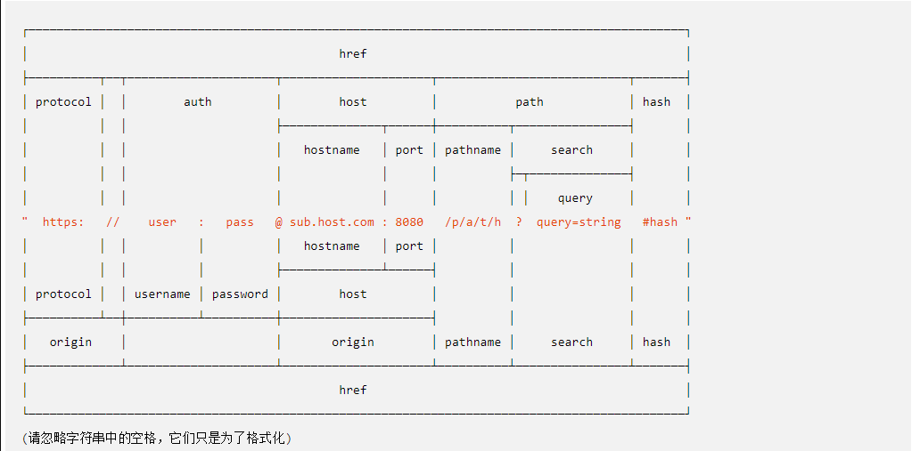

# 01-NodeJS中路径问题


* node中的相对路径： ./  不是相对于当前文件所在路径，而是相对于执行node命名的文件夹路径

  在服务端开发中，一般不要使用相对路径，而使用绝对路径

* 解决方案：在nodejs中，每一个js文件都有两个全局属性，它可以帮助我们获取到文件的绝对路径

  * __filename:当前js文件所在目录的绝对路径

  * __filema,e:当前js文件的绝对路径


```javascript
//1.导入文件模块

const fs = require('fs');

//2.读取文件


/*a.注意点： node中的相对路径： ./  不是相对于当前文件所在路径，而是相对于执行node命名的文件夹路径
在服务端开发中，一般不要使用相对路径，而使用绝对路径
  b.解决方案：在nodejs中，每一个js文件都有两个全局属性，它可以帮助我们获取到文件的绝对路径
    __filename:当前js文件所在目录的绝对路径
    __filema,e:当前js文件的绝对路径
*/
console.log(__dirname);
console.log(__filename);

/*2.如果想要获取当前文件夹下其他文件绝对路径，可以使用 __dirname属性来拼接
*/

var path = __dirname + '/aaa.txt';
console.log(path);

fs.readFile(path,'utf-8',(err,data)=>{
    
    if(err){
        console.log(err);
        //抛出异常，throw的作用就是让node程序终止运行，方便调试
        throw err;
    }else{
        console.log(data);
    };
});


```


# 02-path路径模块


```javascript
//1.导入路径模块
const path = require('path');

//2.合并路径

/*使用path模块拼接文件路径与  使用 '+'连接符拼接的好处
    1.会自动帮我们正确添加路径分隔符  '/',我们无需手动添加
    2.当我们路径格式拼接错误的时候，能自动帮我们转换正确的格式

*/

// path.join(路径1，路径2，路径3，……………………)
let filePath = path.join(__dirname,'aaa.txt');
console.log(filePath);

console.log(__dirname + '/aaa.txt');

let path1 = path.join(__dirname,'bbb','ccc.txt');
console.log(path1);

//获取上级目录   path.dirname(文件路径)
let path2 = path.dirname(path1);
console.log(path2);

let path3 = path.dirname(path2);
console.log(path3);

let path4 = path.dirname(path3);
console.log(path4);

```


# ==03-Nodejs实现静态资源服务器(WEB开发三个特点)==


## 1.1-WEB开发特点1：html中所有外部资源路径都会变成网络请求





```javascript
/*WEB开发特点1：html中所有外部资源路径都会变成网络请求
*/

//1.导入模块
//http模块
const http = require('http');
//fs文件模块
const fs = require('fs');
//path路径模块
const path = require('path');


//2.创建服务器
let server = http.createServer((req,res)=>{
    console.log(req.url);
    
    if(req.url == '/'){
        //读取文件响应给客户端
        fs.readFile(path.join(__dirname,'resource','html','index.html'),(err,data)=>{
            if(err){
                throw err;//如果读取失败，抛出异常
            }else{
                res.end(data);//如果读成功，响应给客户端
            }
        });
    }else if(req.url == '/css/index.css'){
        //读取文件响应给客户端
        fs.readFile(path.join(__dirname,'resource','css','index.css'),(err,data)=>{
            if(err){
                throw err;//如果读取失败，抛出异常
            }else{
                res.end(data);//如果读成功，响应给客户端
            }
        });
    }else if(req.url == '/images/01.gif'){
        //读取文件响应给客户端
        fs.readFile(path.join(__dirname,'resource','images','01.gif'),(err,data)=>{
            if(err){
                throw err;//如果读取失败，抛出异常
            }else{
                res.end(data);//如果读成功，响应给客户端
            }
        });
    }else if(req.url == '/images/01.jpg'){
        //读取文件响应给客户端
        fs.readFile(path.join(__dirname,'resource','images','01.jpg'),(err,data)=>{
            if(err){
                throw err;//如果读取失败，抛出异常
            }else{
                res.end(data);//如果读成功，响应给客户端
            }
        });
    }else if(req.url == '/video.mp4'){
        //读取文件响应给客户端
        fs.readFile(path.join(__dirname,'resource','video.mp4'),(err,data)=>{
            if(err){
                throw err;//如果读取失败，抛出异常
            }else{
                res.end(data);//如果读成功，响应给客户端
            }
        });
    }else if(req.url == '/favicon.ico'){
        //读取文件响应给客户端
        fs.readFile(path.join(__dirname,'resource','favicon.ico'),(err,data)=>{
            if(err){
                throw err;//如果读取失败，抛出异常
            }else{
                res.end(data);//如果读成功，响应给客户端
            }
        });
    }else{
        res.end('404 not found');
    };
});

//3.开启服务器
server.listen(3000,()=>{
        console.log('服务器启动成功');
});
```


## 1.2-WEB开发特点2：html中的url路径只是一个资源标识符


* 这个url由后台设计：实际开发中，后台人员会给你一份接口文档，会告诉你路径怎么写



```javascript
/*WEB开发特点2：html中的url路径只是一个资源标识符
    * 这个url由后台设计：实际开发中，后台人员会给你一份接口文档，会告诉你路径怎么写
*/

//1.导入模块
//http模块
const http = require('http');
//fs文件模块
const fs = require('fs');
//path路径模块
const path = require('path');


//2.创建服务器
let server = http.createServer((req,res)=>{
    console.log(req.url);
    
    if(req.url == '/'){
        //读取文件响应给客户端
        fs.readFile(path.join(__dirname,'resource','html','index.html'),(err,data)=>{
            if(err){
                throw err;//如果读取失败，抛出异常
            }else{
                res.end(data);//如果读成功，响应给客户端
            }
        });
    }else if(req.url == '/a'){
        //读取文件响应给客户端
        fs.readFile(path.join(__dirname,'resource','css','index.css'),(err,data)=>{
            if(err){
                throw err;//如果读取失败，抛出异常
            }else{
                res.end(data);//如果读成功，响应给客户端
            }
        });
    }else if(req.url == '/b'){
        //读取文件响应给客户端
        fs.readFile(path.join(__dirname,'resource','images','01.gif'),(err,data)=>{
            if(err){
                throw err;//如果读取失败，抛出异常
            }else{
                res.end(data);//如果读成功，响应给客户端
            }
        });
    }else if(req.url == '/c'){
        //读取文件响应给客户端
        fs.readFile(path.join(__dirname,'resource','images','01.jpg'),(err,data)=>{
            if(err){
                throw err;//如果读取失败，抛出异常
            }else{
                res.end(data);//如果读成功，响应给客户端
            }
        });
    }else if(req.url == '/d'){
        //读取文件响应给客户端
        fs.readFile(path.join(__dirname,'resource','video.mp4'),(err,data)=>{
            if(err){
                throw err;//如果读取失败，抛出异常
            }else{
                res.end(data);//如果读成功，响应给客户端
            }
        });
    }else if(req.url == '/favicon.ico'){
        //读取文件响应给客户端
        fs.readFile(path.join(__dirname,'resource','favicon.ico'),(err,data)=>{
            if(err){
                throw err;//如果读取失败，抛出异常
            }else{
                res.end(data);//如果读成功，响应给客户端
            }
        });
    }else{
        res.end('404 not found');
    };
});

//3.开启服务器
server.listen(3000,()=>{
  
     console.log('服务器启动成功');
    
})
```


## 1.3-WEB开发特点3：一般静态资源(html文件 css文件 图片 音视频)，url路径会与服务端文件夹路径一致


* 好处：服务端可以直接拼接url来响应对应资源，简化代码





```javascript
/*WEB开发特点3：一般静态资源(html文件 css文件 图片 音视频)，url路径会与服务端文件夹路径一致
    好处：服务端可以直接拼接url来响应对应资源，简化代码
*/

//1.导入模块
//http模块
const http = require('http');
//fs文件模块
const fs = require('fs');
//path路径模块
const path = require('path');


//2.创建服务器
let server = http.createServer((req,res)=>{
    console.log(req.url);
    
    if(req.url == '/'){
        //读取文件响应给客户端
        fs.readFile(path.join(__dirname,'resource','html','index.html'),(err,data)=>{
            if(err){
                throw err;//如果读取失败，抛出异常
            }else{
                res.end(data);//如果读成功，响应给客户端
            }
        });
    }else if(req.url.indexOf('/resource') == 0){//只要路径以/resource开头，直接拼接返回
        //读取文件响应给客户端
        fs.readFile(path.join(__dirname,req.url),(err,data)=>{
            if(err){
                throw err;//如果读取失败，抛出异常
            }else{
                res.end(data);//如果读成功，响应给客户端
            }
        });
    }else{
        res.end('404 not found');
    };
});

//3.开启服务器
server.listen(3000,()=>{

    console.log('服务器启动成功');
})
```


# ==04-接口调试工具Postman介绍==


* Postman是一款不需要写任何代码就可以模拟客户端发送get请求与post请求的软件，它是以后工作中一款接口调试的必备软件
  * 传送门:https://www.getpostman.com/


* get请求调试




* post请求调试



# 05-Nodejs获取get请求参数


* 在http协议中，一个完整的url路径如下图
  * 通过下图我们可以得知，get请求的参数是直接在url路径中显示。
  * get的请求参数在path资源路径的后面添加，以`?`表示参数的开始，以`key=value`表示参数的键值对，多个参数以`&`符号分割

  * hash部分表示的是资源定位符（滚动网页可视区域），由浏览器自动解析处理，它的作用是跳转到对应id的标签的位置




```javascript
//1.导入模块
const http = require('http');
//url模块：解析url路径得到url协议中的每一部分
const url = require('url');

//2.创建服务器
let server = http.createServer((req,res)=>{
    //req.url:获取整个请求url  包含路径和参数
    console.log(req.url);
    //decodeURI():了解即可，默认情况下url中的中文会进行URI编码，使用decodeURI解码可以得到中文
    console.log(decodeURI(req.url));

    /*1.使用url模块解析get请求 
    第一个参数：要解析的url
    第二个参数: 布尔类型  true：推荐使用，得到的参数是一个对象   false：得到参数是字符串
    返回值：对象类型：将url中的每一部分作为对象的属性
     */
    let urlObjc = url.parse(req.url,true);
    console.log(urlObjc);

    //2.获取请求的路径
    let urlPath = urlObjc.pathname;
    console.log(urlPath);
    //3.获取请求的参数
    let query = urlObjc.query;
    console.log(query);

    //响应客户端请求
    //服务端不能直接响应js对象，需要转成json对象（后台具有跨平台性，不是只为前端服务）
    res.end(JSON.stringify({
        code:10000,
        list:[10,20,30]
    }));
   /*
   {
  protocol: null,//协议名
  slashes: null,//表示 //到第一个/之间都是host
  auth: null,//认证
  host: null,//主机名+ 端口号  hosetname+port
  port: null,//端口号
  hostname: null,//主机名  ip地址
  hash: null,//资源定位符
  search: '?name=OldFe&age=18',
  query: { name: 'OldFe', age: '18' },//get请求的参数对象
  pathname: '/getRequest',//路径
  path: '/getRequest?name=OldFe&age=18',//路径+请求参数
  href: '/getRequest?name=OldFe&age=18' }
   */
   //console.log(urlObjc);

});

//3.开启服务器
server.listen(3000,()=>{
    console.log('success');
});
```


# 06-Nodejs获取post请求参数


* post请求特点
  * post请求的参数是在请求体中，无法使用get的方式来接收post请求的参数
  * post请求的参数无法一次获取，有可能是多次 原因：post可以提交大数据，而宽带有网络限制


```javascript


//1.导入模块
const http = require('http');
//解析post请求的参数
var querystring = require('querystring');

//2.创建服务器
let server = http.createServer((req,res)=>{
    console.log(req.url + ':' + req.method);
        /*nodejs接收post请求参数
         * 1.post请求的参数是在请求体中，无法使用get的方式来接收post请求的参数
         * 2.post请求的特点：post请求的参数无法一次获取，有可能是多次 原因：post可以提交大数据，而宽带有网络限制
         */
        //nodejs接收post请求参数的流程
        
        //1.给req对象注册一个data事件：表示开始接收post请求参数
        //客户端没发送一次数据该方法都会执行一次，回调函数的参数就是本次接收到的数据（数据流）
        //接受的次数不固定：取决于数据的大小和你的宽带的网速
        let postData = "";
        req.on('data', function (chuck) {
            postData += chuck;
        });

        //2.给req对象注册一个end事件，表示本次post数据发送完毕
        req.on('end', function () {
            //当客户端本次post请求数据发送完毕之后，会执行这个函数
            console.log(postData);
            //3.解析post参数得到参数对象
            //使用querystring模块来解析post请求的参数
            var postObjc =  querystring.parse(postData);
            console.log(postObjc);
            //响应客户端
            res.end(JSON.stringify(postObjc));
        });
});


server.listen(3000, ()=>{
    console.log('success');
});


```


* 使用form标签默认提交事件模拟ajax发送post请求

```html

<!DOCTYPE html>
<html lang="en">
<head>
    <meta charset="UTF-8">
    <meta name="viewport" content="width=device-width, initial-scale=1.0">
    <meta http-equiv="X-UA-Compatible" content="ie=edge">
    <title>Document</title>
</head>
<body>
    <form id="form" action="http://127.0.0.1:3000/register" method="POST" enctype="application/x-www-form-urlencoded">
        <div>
            <input type="text" placeholder="用户名" name = "username">
        </div>
        <div>
            <lable><input type="radio" value="男" name = "gender" checked>男</lable>
            <lable><input type="radio" value="女" name = "gender">女</lable>
        </div>
        <div>
            <input type="password" placeholder="密码" name="password">
        </div>
        <div><input type="submit"></div>
    </form>
</body>
</html>
```


# 07-服务端重定向


* **服务器重定向常见于某些网站引导登陆注册的功能（当我们访问网站首页的时候，会跳转到登陆注册的界面）**
* **服务端的重定向功能主要由响应头的302状态码来实现**


```javascript
//1.导入模块
const http = require('http');

const fs = require('fs');

const path = require('path');

//2.创建服务器
let server = http.createServer((req,res)=>{
    console.log(req.url);
    //请求路径
    let urlPath = req.url;
    //请求方法
    let  method = req.method;

    if(req.url === '/'){
        //302表示重定向
        res.writeHead(302, {
            'Location': 'login'  //键值对，键表示客户端浏览器将进行重定向  值：表示客户端浏览器重定向的请求
            //add other headers here...
          });
        res.end();
    }
    //登陆页
    if(req.url === '/login'){
        fs.readFile(path.join(__dirname,'login.html'),function(err,data){
            if(err){
                throw err;
            }
            res.end(data);
        })
    }
});


//3.开启服务器
server.listen(3000,  ()=> {
    console.log('服务器启动成功');
});
```

