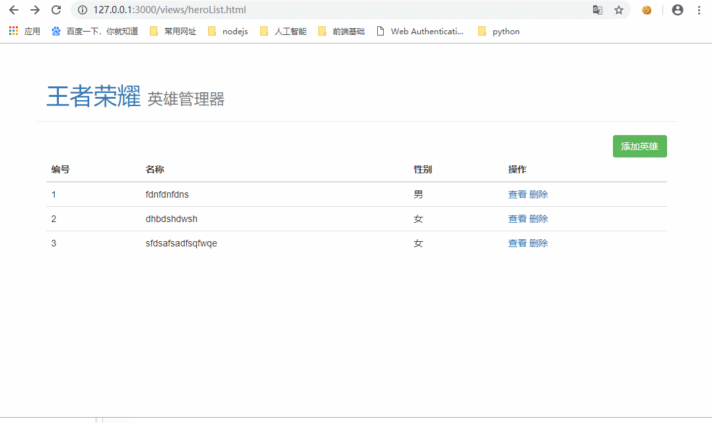

# 01-heroAdmin项目介绍

## 1.1-项目基本功能演示

* 英雄首页
  * 技术点：模板引擎渲染列表
* 添加英雄
  * 技术点：post提交表单数据
* 查看英雄
  * 技术点：get请求发送参数
  * 技术点:  前端页面间传参(将首页的英雄id传入英雄详情页面)
* 删除英雄
  * 技术点：服务端重定向刷新首页




## 1.2-Nodejs项目开发流程

* WEB开发本质
  * 请求
  * 处理
  * 响应


* 1.搭建服务器
  * 导入模块
  * 创建服务器
  * 启动服务器


* 2.设置路由（接口文档）
  * 1.确定每一个页面的网络请求的路径/参数/请求方法/返回值
    * 使用postman调试接口
  * 2.静态资源托管
  * 3.404错误页面


* 3.处理路由
  * 接收客户端请求参数
  * 处理请求（操作数据库增删查改）
  * 响应数据


## 1.3-项目数据库介绍


* 由于目前还没有学习数据库使用，老师暂时使用json文件代替数据库。并且已经提前封装好了一个模块来操作json文件增删改查。目前不用关心实现原理（后面会介绍）


## 1.4-项目目录结构介绍


# 02-搭建服务器与设计路由


```javascript
//1.导入模块
const http = require('http');
const fs = require('fs');
const path = require('path');
//url模块
const url = require('url');
//解析post参数模块
const querystring = require('querystring');
//操作hero.json文件模块(老师提前写好的，原理后面会讲)
const hero = require('./data/hero.js');


//2.创建服务器
let server = http.createServer((req, res) => {
    console.log(req.url + ":" + req.method);
    //使用url模块将路径解析出来
    var urlObjc = url.parse(req.url, true);
    //接口文档中的路由实际上是url的pathname部分
    var urlPath = urlObjc.pathname;

    //设计路由
    if (urlPath == '/' && req.method == 'GET') { //首页
        //服务端重定向到view/heroList.html
    } else if (urlPath == '/heroList' && req.method == 'GET') {
        //1.展示首页列表数据
    } else if (urlPath === '/heroAdd' && req.method === 'POST') {
        //2.添加英雄列表
    } else if (urlPath === '/heroInfo' && req.method === 'GET') {
        //3.查看英雄详情（参数英雄id）
    } else if (urlPath === '/heroDelete' && req.method === 'GET') {
        //4.删除英雄（参数英雄id）
    } else if (urlPath.indexOf('/node_modules') === 0 || urlPath.indexOf('/views') === 0) {
        //读取静态资源
        fs.readFile(path.join(__dirname, urlPath), function (err, data) {
            if (err) {
                throw err;
            }
            res.end(data);
        })
    } else {
        //404错误页面
        res.end('404 not found' + req.url);
    }
});

//3.启动服务器
server.listen(3000, () => {
    console.log('欢迎来到王者荣耀');
});


/*  我们自己封装的原生解析post请求参数的函数
    第一个参数：请求对象
    第二个参数：完成回调
        * postObject:post请求参数对象
*/
function postParse(req, callback) {
    console.log(req);
    //1.1 给req注册一个data事件
    let postData = "";
    req.on('data', function (chuck) {
        postData += chuck;
        console.log(postData);
    });
    //1.2给req注册一个end事件
    req.on('end', function () {
        //1.3 使用 querystring模块解析post参数
        let postObjc = querystring.parse(postData);
        //调用回调函数
        callback(postObjc);
    });
};
```


# 03-服务端路由处理


* ***作为后台人员，自己写好接口逻辑处理之后，千万不要马上告诉前端去开发，万一出现问题别人会怀疑你的技术。最好先自己用postman测试一下接口是否ok，确定没问题之后再告诉前端***

## 1.1-服务端重定向跳转首页


```javascript
//设计路由
    if (urlPath == '/' && req.method == 'GET') { //首页
        //服务端重定向到view/heroList.html
        res.writeHead(302, {
            'Location': 'views/heroList.html'
        });
        res.end();
    }
```


## 1.2-首页列表数据


```javascript
else if (urlPath == '/heroList' && req.method == 'GET') {
        //1.展示首页列表数据
        hero.find((err, jsonData) => {
            console.log(jsonData);
            if (err) {
                throw err;
            } else {
                res.end(jsonData);
            };

        });
    }
```


## 1.3-添加英雄列表


```javascript
//2.添加英雄列表
        postParse(req, (data) => {
            //完成解析之后，将得到的数据存入json文件
            hero.add(data, (err) => {
                if (err) {
                    //服务端不能直接返回js对象，因为服务器是给所有客户端使用，需要返回json对象
                    res.end(JSON.stringify({
                        err_code:500,
                        err_msg:err
                    }));
                } else {
                    res.end(JSON.stringify({
                        err_code:0,
                        err_msg:'success'
                    }));
                }
            });
        });
```


## 1.4-查看英雄详情


```javascript
else if (urlPath === '/heroInfo' && req.method === 'GET') {
        //3.查看英雄详情（参数英雄id）
        //1.获取get请求参数
        console.log(urlObjc.query);
        var heroID = urlObjc.query.id;
        //2.处理
        hero.find(heroID,(err,data)=>{
            if(err){
                throw err;
            }else{
                res.end(data);
            };
        });
    }
```


## 1.5-删除英雄

```javascript
else if (urlPath === '/heroDelete' && req.method === 'GET') {
        //4.删除英雄（参数英雄id）

        //(1)获取请求参数
        let heroID = urlObjc.query.id;
        //(2)处理请求
        hero.delete(heroID,(err)=>{
            if(err){
               throw(err);
            }else{
                //服务端重定向刷新首页
                res.writeHead(302, {
                    'Location': 'views/heroList.html'
                });
                res.end();
            }
        })
    }
```


## 1.6-服务端完整代码

```javascript

//1.导入模块
const http = require('http');
const fs = require('fs');
const path = require('path');
//url模块
const url = require('url');
//解析post参数模块
const querystring = require('querystring');
//操作hero.json文件模块(老师提前写好的，原理后面会讲)
const hero = require('./data/hero.js');


//2.创建服务器
let server = http.createServer((req, res) => {
    console.log(req.url + ":" + req.method);
    //使用url模块将路径解析出来
    var urlObjc = url.parse(req.url, true);
    //接口文档中的路由实际上是url的pathname部分
    var urlPath = urlObjc.pathname;

    //设计路由
    if (urlPath == '/' && req.method == 'GET') { //首页
        //服务端重定向到view/heroList.html
        res.writeHead(302, {
            'Location': 'views/heroList.html'
        });
        res.end();
    } else if (urlPath == '/heroList' && req.method == 'GET') {
        //1.展示首页列表数据
        hero.find((err, jsonData) => {
            console.log(jsonData);
            if (err) {
                throw err;
            } else {
                res.end(jsonData);
            };

        });
    } else if (urlPath === '/heroAdd' && req.method === 'POST') {
        //2.添加英雄列表
        postParse(req, (data) => {
            //完成解析之后，将得到的数据存入json文件
            hero.add(data, (err) => {
                if (err) {
                    //服务端不能直接返回js对象，因为服务器是给所有客户端使用，需要返回json对象
                    res.end(JSON.stringify({
                        err_code:100,
                        err_msg:err.err_msg
                    }));
                } else {
                    res.end(JSON.stringify({
                        err_code:0,
                        err_msg:'success'
                    }));
                }
            });
        });

    } else if (urlPath === '/heroInfo' && req.method === 'GET') {
        //3.查看英雄详情（参数英雄id）
        //1.获取get请求参数
        console.log(urlObjc.query);
        var heroID = urlObjc.query.id;
        //2.处理
        hero.find(heroID,(err,data)=>{
            if(err){
                throw err;
            }else{
                res.end(data);
            };
        });
    } else if (urlPath === '/heroDelete' && req.method === 'GET') {
        //4.删除英雄（参数英雄id）

        //(1)获取请求参数
        let heroID = urlObjc.query.id;
        //(2)处理请求
        hero.delete(heroID,(err)=>{
            if(err){
               throw(err);
            }else{
                //服务端重定向刷新首页
                res.writeHead(302, {
                    'Location': 'views/heroList.html'
                });
                res.end();
            }
        })
    } else if (urlPath.indexOf('/node_modules') === 0 || urlPath.indexOf('/views') === 0) {
        //读取静态资源
        fs.readFile(path.join(__dirname, urlPath), function (err, data) {
            if (err) {
                throw err;
            }
            res.end(data);
        })
    } else {
        //404错误页面
        res.end('404 not found' + req.url);
    }
});

//3.启动服务器
server.listen(3000, () => {
    console.log('欢迎来到王者荣耀');
});


/*  我们自己封装的原生解析post请求参数的函数
    第一个参数：请求对象
    第二个参数：完成回调
        * postObject:post请求参数对象
*/
function postParse(req, callback) {
    console.log(req);
    //1.1 给req注册一个data事件
    let postData = "";
    req.on('data', function (chuck) {
        postData += chuck;
        console.log(postData);
    });
    //1.2给req注册一个end事件
    req.on('end', function () {
        //1.3 使用 querystring模块解析post参数
        let postObjc = querystring.parse(postData);
        //调用回调函数
        callback(postObjc);
    });
};

```


# 04-前端功能开发(ajax+模板引擎)


## 1.1-art-template模板引擎渲染首页列表


* heroList.html
  * art-template客户端渲染流程
    * （1）写模板语法
    * （2）调用 `template(模板id，数据)` 来解析渲染替换模板
      * `let htmlStr = template('list', data);`
    * （3）展示解析好的模板html `$('#tbody').html(htmlStr);`
  * 查看按钮：使用href属性页面传参
  * 删除按钮：get请求发送数据给服务端，由服务端重定向来刷新首页

```html
<!DOCTYPE html>
<html lang="en">

<head>
    <meta charset="UTF-8">
    <!-- 导入jquery -->
    <script src="/node_modules/jquery/dist/jquery.min.js"></script>
    <!-- 导入bootstrap -->
    <link rel="stylesheet" href="/node_modules/bootstrap/dist/css/bootstrap.css">
    <script src="/node_modules/bootstrap/dist/js/bootstrap.js"></script>
    <!-- 导入art-template -->
    <script src="/node_modules/art-template/lib/template-web.js"></script>
    <title>王者荣耀英雄管理器</title>
</head>

<body>
    <header>
        <div class="page-header container">
            <h1>
                <a href="/">王者荣耀</a>
                <small>英雄管理器</small>
            </h1>
        </div>
    </header>
    <div class="container hero-list">
        <a class="btn btn-success pull-right" href="/views/heroAdd.html">添加英雄</a>
        <table class="table table-hover">
            <thead>
                <th>编号</th>
                <th>名称</th>
                <th>性别</th>
                <th>操作</th>
            </thead>
            <tbody id="tbody">
                <!-- 定义模板 -->
                <script id="list" type="text/html">
                    {{each heros}}
                    <tr>
                        <td>{{$value.id}}</td>
                        <td>{{$value.name}}</td>
                        <td>{{$value.gender}}</td>
                        <td>
                        <a class = "check" href="/views/heroInfo.html?id={{ $value.id }}" hero_id = "{{$value.id}}">查看</a>
                        <a class = "delete" href="/heroDelete?id={{$value.id}}">删除</a>
                        </td>
                    </tr>
                    {{/each}}
                </script>

            </tbody>
        </table>
    </div>


    <script>
        window.onload = function () {
            $.ajax({
                url: '/heroList',
                type: 'get',
                dataType: 'json',
                success: function (data) {
                    console.log(data);
                    //第一个参数：模板名字  第二个参数：要渲染的数据
                    let htmlStr = template('list', data);
                    $('#tbody').html(htmlStr);

                   
                }
            });
        }
    </script>
</body>

</html>
```


## 1.2-添加英雄


```html
<!DOCTYPE html>
<html lang="en">

<head>
  <meta charset="UTF-8">
  <title>Hero - Admin</title>
  <!-- 导入jquery -->
  <script src="/node_modules/jquery/dist/jquery.js"></script>
  <!-- bootstrap布局 -->
  <link rel="stylesheet" href="/node_modules/bootstrap/dist/css/bootstrap.css">
  <script src="/node_modules/bootstrap/dist/js/bootstrap.js"></script>
  <style>
    .hero-list img {
      width: 50px;
    }
  </style>
</head>

<body>
  <header>
    <div class="page-header container">
      <h1>
        <a href="/">王者荣耀</a>
        <small>英雄管理器</small>
      </h1>
    </div>
  </header>
  <div class="container hero-list">
    <form id="form">
      <div class="form-group">
        <label for="exampleInputEmail1">英雄名称</label>
        <input type="text" name="name" class="form-control" id="exampleInputEmail1" placeholder="请输入英雄名称">
      </div>
      <div class="form-group">
        <label for="exampleInputPassword1">英雄性别</label>
        <div class="radio">
          <label>
            <input type="radio" name="gender" id="optionsRadios1" value="男" checked>男
          </label>
          <label>
            <input type="radio" name="gender" id="optionsRadios1" value="女" checked>女
          </label>
        </div>
      </div>
      <button type="submit" class="btn btn-success">点击保存</button>
    </form>
  </div>
</body>
<script>
  $('#form').on('submit', function (e) {
    //禁用表单默认提交事件
    e.preventDefault();
    $.ajax({
      url: '/heroAdd',
      type: 'post',
      dataType: 'json',
      data: $(this).serialize(),
      success: function (data) {
        if(data.err_code == 0){
          //添加成功跳转回首页
          window.location.href = '/';

        }else{
        //添加失败 弹窗告诉用户原因
          alert(data.err_msa);
        }
      }
    });
  });

</script>

</html>
```


## 1.3-查看英雄详情


```html
<!DOCTYPE html>
<html lang="en">

<head>
  <meta charset="UTF-8">
  <title>Hero - Admin</title>

  <script src="/node_modules/jquery/dist/jquery.js"></script>
  <link rel="stylesheet" href="/node_modules/bootstrap/dist/css/bootstrap.css">
  <!-- 导入art-template -->
  <script src="/node_modules/art-template/lib/template-web.js"></script>
</head>

<body>
  <header>
    <div class="page-header container">
      <h1><a href="/">王者荣耀</a> <small>英雄管理器</small></h1>
    </div>
  </header>
  <div class="container hero-list">
    <script id="info" type="text/html">
      <p>ID：{{ id }}</p>
        <p>英雄名称：{{ name }}</p>
        <p>英雄性别：{{ gender }}</p>
      </script>
  </div>


  <script>
    window.onload = function () {
      $.ajax({
        url: '/heroInfo' + location.search,
        type: 'get',
        dataType: 'json',
        success: function (data) {
          let htmlString = template('info', data);
          $('.hero-list').html(htmlString);
        }
      });
    };
  </script>
</body>

</html>
```


