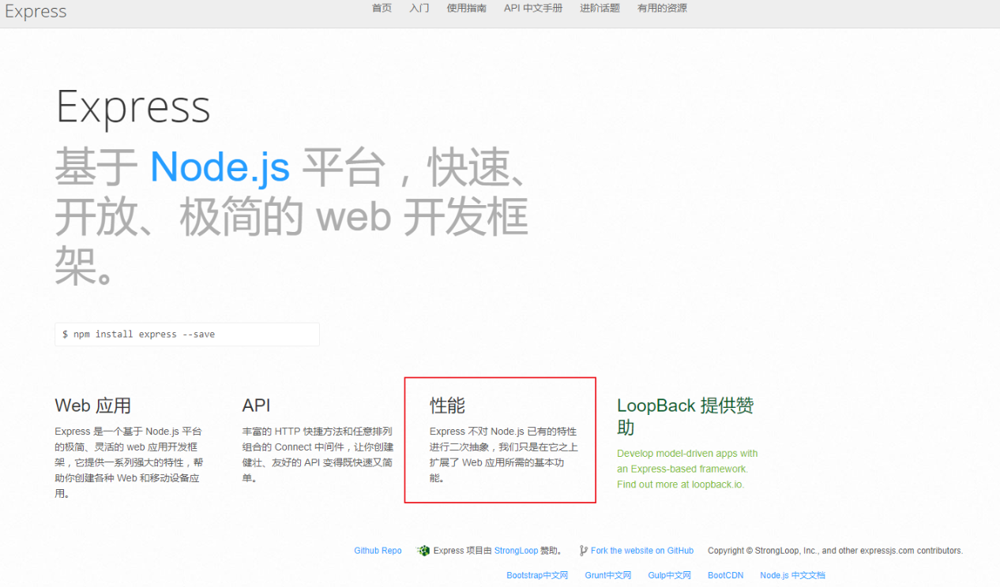
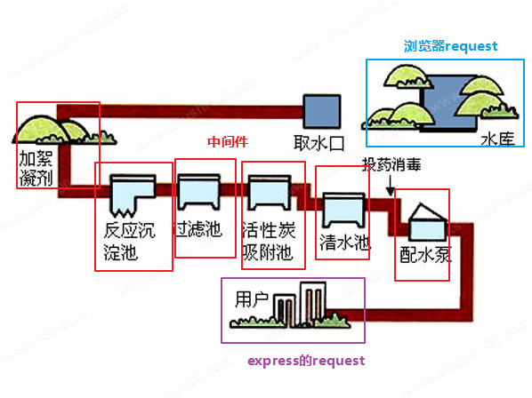
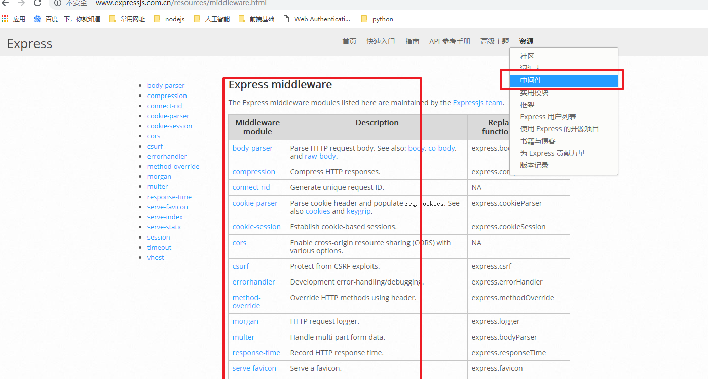
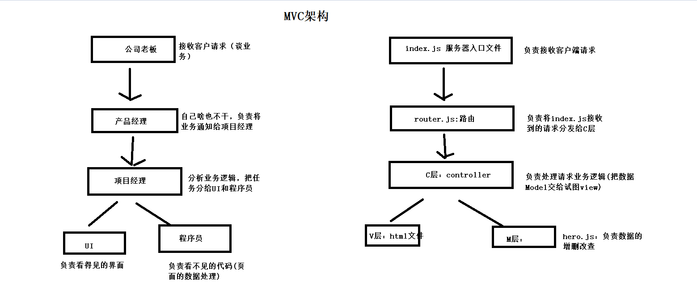
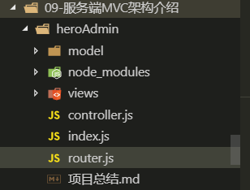
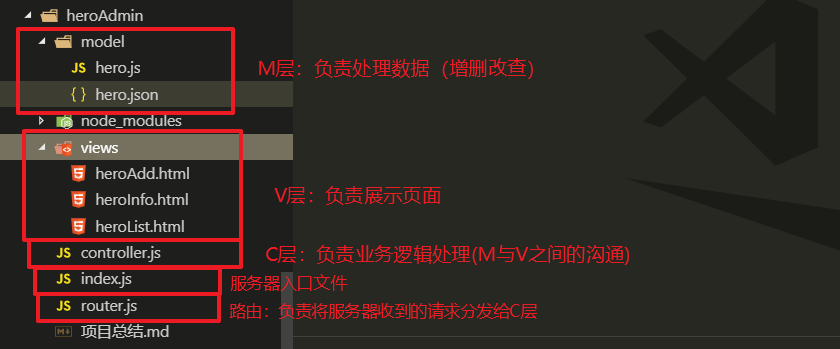

# ==01-Nodejs模块化介绍==


## 1.1-Nodejs三种模块


* 1.在nodejs中所有的js文件都是一个模块。换言之，所有的模块都是js文件组成（js文件 = 模块）
* 2.nodejs中只有三种模块
  * 第一种：原生模块/内置模块/核心模块
    * 原生模块就是nodejs官网中提供的模块，这些js文件随着node环境一起被下载安装
  * 第二种：第三方模块
    * 第三方模块就是npm网站下载的模块: 需要使用`npm install [模块名]`来安装
  * 第三方模块：文件模块(也就是我们自己写的js文件，在nodejs中只要是js文件就是模块)
    * 如果是我们自己写的js文件模块，导入时使用文件的路径`require('我们的js文件路径')`

```javascript
//nodejs模块化：在nodejs中，所有的js文件都是一个模块。换言之，所有的模块都是js文件组成

//nodejs中的模块只有三种

//1.内置模块/原生模块/核心模块：nodejs官方文档中的模块（随着安装node环境一并安装，直接使用）
const fs = require('fs');

//2.第三方模块：npm网站下载的模块（需要下载后使用 `npm i 模块名`）
const crawler = require('crawler');//爬虫模块

//3.js文件模块：我们自己写的js文件（只要是js文件都是模块）
/*如果是自定义模块
  a. require()参数是 js文件路径 
  b. require()返回值是 js文件中的 module.exports 对象
*/
const mokuai = require('./mokuai.js');

console.log(mokuai);


```


## 1.2-CommonJS规范


* 官网传送门:<http://www.commonjs.org/>


* 1.世界上的编程规范有很多种，CommonJS只是其中一种
* 2.CommonJS规范不是只为Nodejs服务，有很多平台都遵循CommonJS规范，Nodejs平台只是其中之一
* 3.CommonJS规范只有三句话
  * 1.导入模块使用:`require()`
  * 2.导出模块使用:`module.exports`
  * 3.导出模块一定要使用ZZZZS使用:`module.exports`(重要是事说两遍)


```javascript
/* 1.每一个js文件都是一个独立的作用域，外部无法访问*/

let name = '张三';

let age = 18;

let sayHi = ()=>{
    console.log('我是张三');
};

/* 2.每一个js文件都有一个默认的全局对象 module.exports，
当外部使用 require() 导入这个js文件模块，就会得到这个module.exports对象 */
module.exports = {
    name,
    age
};
```


* 课外拓展知识点介绍


* 1.CommonJS由来：JavaScript是一个强大面向对象语言，它有很多快速高效的解释器。官方JavaScript标准定义的API是为了构建基于浏览器的应用程序。其实JavaScript设计之初不仅仅是针对客户端设计的语言。后来只是由于Web的迅速流行，加之Netscape和微软之间之争过早的将JavaScipt标准化，导致目前JS仅仅包括基本的API，并不是具有服务端编程语言的特性。
  * CommonJS API定义很多普通应用程序（主要指非浏览器的应用，例如服务端）使用的API，从而填补了这个空白。它的终极目标是提供一个类似Python，Ruby和Java标准库。这样的话，开发者可以使用CommonJS API编写应用程序，然后这些应用可以运行在不同的JavaScript解释器和不同的主机环境中。在兼容CommonJS的系统中，你可以实用JavaScript程序开发
    * 服务器端JavaScript应用程序命令行工具
    * 图形界面应用程序
    * 混合应用程序（如，Titanium或Adobe AIR）
* 2.CommonJS规范：根据CommonJS规范，一个单独的文件就是一个模块。加载模块使用require方法，该方法读取一个文件并执行，最后返回文件内部的exports对象。
  * require - 用来引入依赖
  * export - 用来导出模块，包括标识符(identifier)和模块内容(contents)


* CommonJS与AMD及CMD的关系

* 这三个规范都是为javascript模块化加载而生的，都是在用到或者预计要用到某些模块时候加载该模块，使得大量的系统巨大的庞杂的代码得以很好的组织和管理。模块化使得我们在使用和管理代码的时候不那么混乱，而且也方便了多人的合作。
* CommonJS 加载模块是同步的，所以只有加载完成才能执行后面的操作。像Node.js主要用于服务器的编程，加载的模块文件一般都已经存在本地硬盘，所以加载起来比较快，不用考虑异步加载的方式，所以CommonJS规范比较适用。但如果是浏览器环境，要从服务器加载模块，这是就必须采用异步模式。所以就有了 AMD CMD 解决方案。

* 1.用途区别
  * CommonJS是服务端的模块化规范
  * AMD和CMD是客户端（浏览器）的模块化规范
* 2.加载区别
  * CommonJS和CMD都是同步加载模块化规范
  * AMD是异步加载模块化规范
* 3.平台区别
  * CommonJS是`Nodejs`使用的规范
  * AMD（Asynchronous Module Definition 异步模块定义）是 `RequireJS` 在推广过程中对模块定义的规范化产出
  * CMD（Common Module Definition通用模块定义） 是 SeaJS 在推广过程中对模块定义的规范化产出


## 1.3-Nodejs模块加载缓存机制

* 1.加载模块时，node会首先从缓存中查找，如果缓存中存在则从缓存中读取，如果不存在则读取并且放入缓存
* 2.也就是说，一个模块在第一次导入时会被node放入缓存中，第二次再导入不会重新加载而是从缓存中读取
  * （1）避免的重复导入模块的资源浪费
  * （2）从缓存中读取模块速度更快


```javascript
//nodejs模块缓存机制

/*每一个模块在第一次导入之后会被node放入缓存中，第二次导入不会重新加载而是从缓存中读取
    a.避免重复导入模块的资源浪费
    b.从缓存中读取模块速度更快
*/

//第一次加载：会执行模块中的代码，之后放入缓存中
const mokuai1 = require('./mokuai.js');

//第二次加载：直接从缓存中读取
const mokuai2 = require('./mokuai.js');


console.log(mokuai1 === mokuai2);//true


```


## 1.4-使用模块化思想重构项目


* 将路由功能封装到自定义模块中

```javascript

const fs = require('fs');
const path = require('path');
const url = require('url');
const querystring = require('querystring');
//操作hero.json文件模块（数据库）
const hero = require('./data/hero.js');

//导出一个函数
module.exports = (req, res) => {
    //使用url模块将路径解析出来
    var urlObjc = url.parse(req.url, true);
    //接口文档中的路由实际上是url的pathname部分
    var urlPath = urlObjc.pathname;
    //设计路由
    if (urlPath == '/' && req.method == 'GET') { //首页
        //服务端重定向到view/heroList.html
        res.writeHead(302, {
            'Location': 'views/heroList.html'
        });
        res.end();
    } else if (urlPath == '/heroList' && req.method == 'GET') {
        //1.展示首页列表数据
        hero.find((err, jsonData) => {
            console.log(jsonData);
            if (err) {
                throw err;
            } else {
                res.end(jsonData);
            };

        });
    } else if (urlPath === '/heroAdd' && req.method === 'POST') {
        //2.添加英雄列表
        postParse(req, (data) => {
            //完成解析之后，将得到的数据存入json文件
            hero.add(data, (err) => {
                if (err) {
                    //服务端不能直接返回js对象，因为服务器是给所有客户端使用，需要返回json对象
                    console.dir(err);
                    res.end(JSON.stringify({
                        err_code: 500, //500表示服务器内部错误
                        err_msg: err
                    }));
                } else {


                    res.end(JSON.stringify({
                        err_code: 0,
                        err_msg: 'success'
                    }));
                }
            });
        });

    } else if (urlPath === '/heroInfo' && req.method === 'GET') {
        //3.查看英雄详情（参数英雄id）
        //1.获取get请求参数
        console.log(urlObjc.query);
        var heroID = urlObjc.query.id;
        //2.处理
        hero.find(heroID, (err, data) => {
            if (err) {
                throw err;
            } else {
                res.end(data);
            };
        });
    } else if (urlPath === '/heroDelete' && req.method === 'GET') {
        //4.删除英雄（参数英雄id）

        //(1)获取请求参数
        let heroID = urlObjc.query.id;
        //(2)处理请求
        hero.delete(heroID, (err) => {
            if (err) {
                throw (err);
            } else {
                //服务端重定向刷新首页
                res.writeHead(302, {
                    'Location': 'views/heroList.html'
                });
                res.end();
            }
        })
    } else if (urlPath.indexOf('/node_modules') === 0 || urlPath.indexOf('/views') === 0) {
        //读取静态资源
        fs.readFile(path.join(__dirname, urlPath), function (err, data) {
            if (err) {
                throw err;
            }
            res.end(data);
        })
    } else {
        //404错误页面
        res.end('404 not found' + req.url);
    };
};


/*  我们自己封装的原生解析post请求参数的函数
    第一个参数：请求对象
    第二个参数：完成回调
        * postObject:post请求参数对象
*/
function postParse(req, callback) {
    console.log(req);
    //1.1 给req注册一个data事件
    let postData = "";
    req.on('data', function (chuck) {
        postData += chuck;
        console.log(postData);
    });
    //1.2给req注册一个end事件
    req.on('end', function () {
        //1.3 使用 querystring模块解析post参数
        let postObjc = querystring.parse(postData);
        //调用回调函数
        callback(postObjc);
    });
};
```


* index.js中导入路由模块

```javascript
//1.导入模块
const http = require('http');

const router = require('./router.js');

//2.创建服务器
let server = http.createServer((req, res) => {
    console.log(req.url + ":" + req.method);
    //使用路由模块处理请求
    router(req,res);
});

//3.启动服务器
server.listen(3000, () => {
    console.log('欢迎来到王者荣耀');
});


```


# ==02-Express框架学习==


## 1.1-Express框架介绍

* 1.Express是NodeJS开发中一个非常重量级的第三方框架，它对于NodeJS服务端就相当于Jquery对于HTML客户端。
  * **如果连Express都不会用，基本上都不好意思跟别人说你会NodeJS**


* 2.Express官网：
  * http://www.expressjs.com.cn/
  * http://expressjs.com/
    * 一般我们学习一个新的技术，都是去官网文档查看它的API，然后多多尝试，熟能生巧
* 3.Express的github地址:<https://github.com/expressjs/express>
  * Express的原作者TJ在node社区非常的有名，他写过200多个框架，目前他已经将Express交给了朋友维护，宣布不再维护NodeJS框架，转向Go语言<https://github.com/tj>
* 4.Express官网是这样介绍自己的:基于 Node.js 平台，快速、开放、极简的 web 开发框架。
  * *Express一个非常重要的亮点就是它没有改变nodejs已有的特性，而是在它的基础上进行了拓展*
    * **也就是说，使用Express你既可以使用nodejs原生的任何API，也能使用Express的API**





## 1.2-Express基本使用


```javascript
//1.导入模块
const express = require('express');

//2.创建服务器
/* express() 相当于http模块的http.createServer() */
let app = express();


//3.接收客户端请求
/*（1）express最大的特点就是自带路由功能，我们无需在一个方法中处理所有请求
    (2)在express中，每一个请求都是一个单独的方法
 */

app.get('/',(req,res)=>{
    //响应客户端数据

    //express响应数据 send方法:自动帮我们设置好了响应头,无需担心中文乱码问题
    res.send('欢迎来到黑马程序员');

    // //以前的做法；如果是中文，需要设置响应头解决乱码问题
    // res.writeHead(200,{
    //     'Content-Type':'text/plain;charset=utf8'
    // });
    // res.end('欢迎来到黑马程序员');
});

app.get('/heroInfo',(req,res)=>{
    //express自动帮我们解析了get请求参数，我们直接通过req.query获取即可
    console.log(req.query);
});

//4.开启服务器
app.listen(3000,()=>{
    console.log('服务器启动成功');
});
```


## 1.3-Express三大特性介绍

​	

* 1.托管静态资源
  * 第二天讲的nodejs实现静态服务器功能在express中只需要一行代码
* 2.路由
  * express自带路由功能,让Node服务端开发变得极其简单
  * express支持链式语法，可以让代码看起来更加简洁
* 3.中间件
  * Express最为核心的技术和思想，万物皆中间件
    * 中间件虽然理解起来有点困难，但是使用起来非常方便，类似于jquery的插件一样，由于jquery库自身的功能无法满足开发需求，所以通过插件来拓展功能


# 03-Express特性1-托管静态资源

* ***将第二天的nodejs实现静态服务器功能用Express实现***

  

```javascript
//1.导入模块
const express = require('express');

//2.创建服务器
let app = express();

//托管静态资源（相当于我们之前写的一大坨模拟apache服务器功能代码）
/* 
第一个参数：客户端请求路径（一般与托管文件夹名字一致）
第二个参数：要托管的文件夹绝对路径
*/
app.use('/resource',express.static( __dirname + '/resource'));

//3.处理请求
app.get('/',(req,res)=>{
    //res.sendFile:响应客户端文件   参数是文件路径
    res.sendFile(__dirname + '/resource/html/index.html');
});

//4.开启服务器
app.listen(3000,()=>{
    console.log('success');  
});
```


# ==04-Express特性2-中间件==


* 中间件是Express框架学习中最难的部分，同时也是最为核心的技术，我们的学习路线如下
  * 1.什么是中间件
  * 2.Express中间件的本质及工作原理
  * 3.自定义解析post请求参数的中间件
  * 4.第三方中间件使用


## 1.1-什么是中间件

* **下图是一个自来水净化的过程，这张图可以更好的理解什么是中间件**
* 水库的水并不是直接取出来就送到用户的家中使用，而是经过一些净化过滤处理之后才送到用户的家中，在这个过程中水还是水，本质上还是同一个东西，但是却多了一些东西
  * 水库中原始的水可以理解为是浏览器的原始请求request
  * 最终用户喝到的水可以理解为是express最终获取的请求request
  * 而过滤中的一些加絮凝剂、过滤池等操作就是中间件，可以理解为给我们原始的请求request添加了一些属性或者方法（如post参数解析之后的对象等）





## 1.2-中间件的本质及工作原理


* 1.中间件其实就是一个函数

  *  `function(req,res,next){  
            req:请求对象  
            res：响应对象  
            next：下一个中间件 
        }`

* 2.Express如何使用中间件?:三种方式

  ​	`app.use('pathname',中间件) :
  ​        pathname不写: 任何请求路径都会执行这个中间件
  ​        pathname写了：任何以pathname开头的请求路径都会执行这个中间件
  ​    app.get('pathname',中间件) :  请求路径为pathname的get请求会执行这个中间件
  ​    app.post('pathname',中间件) :  请求路径为pathname的post请求会执行这个中间件`

* 3.中间件工作流程（Express处理网络请求流程）

​     `a.从上往下依次匹配请求路径，如果匹配成功则执行该中间件
​    b.如果这个中间件中调用了：next() ，则会继续往下匹配
​    c.如果所有的中间件都无法匹配，则会自动进入一个兜底的中间件响应返回404 not found错误`


```javascript
//导入模块
const express = require('express');
//创建服务器
let app = express();

/*1.什么是express中间件？： 其实就是一个函数（这个函数有三个参数）
    function(req,res,next){  
        req:请求对象  
        res：响应对象  
        next：下一个中间件 
    }
*/

/*2.express如何使用中间件?: 三种方式  
    app.use('pathname',中间件) :
        pathname不写: 任何请求路径都会执行这个中间件
        pathname写了：任何以pathname开头的请求路径都会执行这个中间件
    app.get('pathname',中间件) :  请求路径为pathname的get请求会执行这个中间件
    app.post('pathname',中间件) :  请求路径为pathname的post请求会执行这个中间件
*/

/* 3.express处理网络请求的流程
    a.从上往下依次匹配请求路径，如果匹配成功则执行该中间件
    b.如果这个中间件中调用了：next() ，则会继续往下匹配
    c.如果所有的中间件都无法匹配，则会自动进入一个兜底的中间件响应返回404 not found错误
*/

app.use('/abc',(req,res,next)=>{
    //污水净化第一步：添加絮凝剂
    console.log(11111);
    req.a = '添加了絮凝剂';
    next();
});


app.use('/abc',(req,res,next)=>{
    //污水净化第二步：添加活性炭
    console.log(22222);
    req.b = '添加活性炭';
    next();
});

app.post('/abc',(req,res,next)=>{
    console.log(33333);
    next();
});

app.get('/abc',(req,res,next)=>{
    console.log(44444);
    //看下污水净化到这一步加了什么
    console.log(req.a);
    console.log(req.b);
    res.send('hello');
});


//express底层有一个默认的兜底中间件，如果上面所有的中间件都无法匹配或者没有结束响应，则会进入这个中间件
//自定义一个兜底中间件，覆盖默认的
app.use((req,res)=>{
    console.log(55555);
    
    res.send('你的路径是不是写错啦');
});


//开启服务器
app.listen(3000, () => {
    console.log('success');
});
```


## 1.3-自定义解析post请求参数中间件

* ***使用postman测试***

  

* bodyParse

```javascript
const querystring = require('querystring');

/*  导出中间件(函数)
    第一个参数：请求对象
    第二个参数：完成回调
        * postObject:post请求参数对象
*/
module.exports = (req, res, next) => {
    /*如果本次请求是post请求，则解析post请求参数，
    并且将解析好的参数对象作为req的属性传递给下一个中间件*/
    if (req.method == 'POST') {
        //1.1 给req注册一个data事件
        let postData = "";
        req.on('data', function (chuck) {
            postData += chuck;
        });
        //1.2给req注册一个end事件
        req.on('end', function () {
            //1.3 使用 querystring模块解析post参数
            let postObjc = querystring.parse(postData);
            //将解析好的参数对象添加到req的属性中
            req.body = postObjc;
            //执行下一个中间件
            next();
        });
    }

}
```


* index.js

```javascript
//导入模块
const express = require('express');
//创建服务器
let app = express();

//使用中间件
//任何请求都会进入我们自己写的中间件，并且只要是post请求就会帮你解析好参数放入req.body中
app.use(require('./bodyParse.js'));

app.post('/abc',(req,res,next)=>{
    console.log(req.body);
    //告诉客户端我收到的参数
    res.send(req.body);
});

app.post('/efg',(req,res,next)=>{
    console.log(req.body);
    //告诉客户端我收到的参数
    res.send(req.body);
});

//开启服务器
app.listen(3000, () => {
    console.log('success');
});
```


## 1.4-第三方中间件使用


* 1.在Express官网，有非常多得第三方中间件，它们可以让我们的Nodejs开发变得极其简单

* 2.所有的第三方框架学习套路都是一样的
  * 1.进官网，查文档
  * 2.CTRL+C 与 CTRL+V
* 3.第三方中间件使用步骤一般都是固定两步
  * 一： 安装 `npm i xxxx`（官网复制粘贴）
    * **第三方中间件都需要使用npm安装，可以理解为是一种特殊的第三方模块**
  * 二:   使用 `app.use(xxx)`（官网复制粘贴）




### body-parse第三方中间件：解析post请求参数


```javascript
//导入模块
const express = require('express');
//创建服务器
let app = express();

//使用第三方中间件
/*所有的第三方模块思路都是一样 
    1.进官网，查文档
    2.找examples（使用示例），复制粘贴
        a.安装第三方模块：`npm i body-parser`
        b.使用中间件: arr.use(具体用法请复制粘贴) 
使用body-parser中间件之后，你的req会增加一个body属性，就是你的post请求参数
*/
//（1）导入模块
var bodyParser = require('body-parser');//导入模块
// parse application/x-www-form-urlencoded 
//（2）使用中间件
app.use(bodyParser.urlencoded({ extended: false }))


app.post('/abc',(req,res,next)=>{
    console.log(req.body);
    //告诉客户端我收到的参数
    res.send(req.body);
});

app.post('/efg',(req,res,next)=>{
    console.log(req.body);
    //告诉客户端我收到的参数
    res.send(req.body);
});

//开启服务器
app.listen(3000, () => {
    console.log('success');
});
```


# 05-Express特性3-路由中间件


```javascript
/*路由中间件是express自带的中间件，使用步骤有4个

1.在router.js中导入express：  const express = require('express');
2.在router.js中创建路由容器：  let app = express();
3.在router.js中导出路由容器：  moudule.exports = app;
4.在index.js中使用路由容器：   app.use(require('./router.js'))

*/ 
```


* router.js

```javascript
/* express路由使用流程 */
//1.导入express模块
var express = require('express');
//2.创建路由容器（这个app相当于index.js中app的复制品）
var app = express();

//express支持链式语法
app.get('/abc',(req,res)=>{
    res.send('你的请求路径是/abc');
})
.get('/def',(req,res)=>{
    res.send('你的请求路径是/def');
});

//3.导出路由模块
module.exports = app;
```


* index.js

```javascript
//导入模块
const express = require('express');
//创建服务器
let app = express();

/* 1.index.js是服务器入口文件，所有的网络请求都会进入这里，假如我有100个请求，那这个文件
就会非常臃肿
   2.路由中间件作用：将网络请求分发到路由模块 
*/

/*路由中间件是express自带的中间件，使用步骤有4个

1.在router.js中导入express：  const express = require('express');
2.在router.js中创建路由容器：  let app = express();
3.在router.js中导出路由容器：  moudule.exports = app;
4.在index.js中使用路由容器：   app.use(require('./router.js'))

*/ 

//4.使用路由模块
app.use(require('./router.js'));

//开启服务器
app.listen(3000, () => {
    console.log('success');
});
```


# 06-使用Express框架三大特性来重构项目


* index.js
  * 1.导入express模块
  * 2.创建服务器
  * 3.配置各种中间件
    * 静态资源
    * body-parser
    * 路由
  * 4.启动服务器

```javascript
//1.导入模块
const express = require('express');
//2.创建服务器
let app = express();

//3.配置中间件
//3.1托管静态资源
app.use('/node_modules', express.static(__dirname + '/node_modules'));
app.use('/views', express.static(__dirname + '/views'));
//3.2 body-parser
//（1）导入模块
var bodyParser = require('body-parser');//导入模块
// parse application/x-www-form-urlencoded 
//（2）使用中间件
app.use(bodyParser.urlencoded({ extended: false }))

//3.3 配置路由中间件
app.use(require('./router.js'));

//如果客户端请求了服务器没处理的请求，express会自动返回404


//4.启动服务器
app.listen(3001, () => {
    console.log('欢迎来到王者荣耀');
});


```


* router.js

```javas
//操作hero.json文件模块
const hero = require('./data/hero.js');

/* express路由使用流程 */
//1.导入express模块
var express = require('express');
//2.创建路由
var app = express();


//处理请求

//首页
app.get('/', (req, res) => {

    console.log(1111);
    
    //服务端重定向到view/heroList.html
    res.writeHead(302, {
        'Location': 'views/heroList.html'
    });
    res.end();
});

//英雄列表
app.get('/heroList', (req, res) => {
    //1.展示首页列表数据
    hero.find((err, jsonData) => {
        console.log(jsonData);
        if (err) {
            throw err;
        } else {
            res.end(jsonData);
        };

    });
});

//添加英雄
app.post('/heroAdd', (req, res) => {
    //完成解析之后，将得到的数据存入json文件
    hero.add(req.body, (err) => {
        if (err) {
            //服务端不能直接返回js对象，因为服务器是给所有客户端使用，需要返回json对象
            res.end(JSON.stringify({
                err_code: 500,
                err_msg: err
            }));
        } else {
            res.end(JSON.stringify({
                err_code: 0,
                err_msg: 'success'
            }));
        }
    });
});

//查询英雄
app.get('/heroInfo', (req, res) => {
    var heroID = req.query.id;
    //2.处理
    hero.find(heroID, (err, data) => {
        if (err) {
            throw err;
        } else {
            res.end(data);
        };
    });
});

//删除英雄
app.get('/heroDelete',(req,res)=>{
    //(1)获取请求参数
    let heroID = req.query.id;
    //(2)处理请求
    hero.delete(heroID, (err) => {
        if (err) {
            throw (err);
        } else {
            //服务端重定向刷新首页
            res.writeHead(302, {
                'Location': 'views/heroList.html'
            });
            res.end();
        }
    });
});


//3.导出路由模块
module.exports = app;
```


# 07-服务端MVC架构介绍

MVC架构本质：确定每一个js文件的职责

 * index.js:负责接收请求
 * router.js:负责将请求分发给C层
 * controller.js:C层负责处理业务逻辑（V与M之间的沟通）
 * views：V层：负责展示页面
 * model： M层：负责处理数据（增删改查）










```javascript
/* 路由模块：只负责分发网络请求给C层，不处理 */
//导入C层
const controller = require('./controller.js');

//1.导入express模块
const express = require('express');
//2.创建路由
var app = express();


//路由分发
//Express支持链式语法
app.get('/',controller.showHeroList)
.get('/heroList',controller.getHeroList)
.post('/heroAdd',controller.doHeroAdd)
.get('/heroInfo',controller.getHeroInfo)
.get('/heroDelete',controller.doHeroDelete);


//3.导出路由模块
module.exports = app;
```


```javascript
/* C层：负责业务逻辑处理:M与C层之间的沟通 */

//M层：操作数据库增删改查
const hero = require('./model/hero.js');

module.exports = {
    showHeroList: (req, res) => {
        //服务端重定向到view/heroList.html
        res.writeHead(302, {
            'Location': 'views/heroList.html'
        });
        res.end();
    },
    getHeroList: (req, res) => {
        //1.展示首页列表数据
        hero.find((err, jsonData) => {
            console.log(jsonData);
            if (err) {
                throw err;
            } else {
                res.end(jsonData);
            };

        });
    },
    doHeroAdd: (req, res) => {
        //完成解析之后，将得到的数据存入json文件
        hero.add(req.body, (err) => {
            if (err) {
                //服务端不能直接返回js对象，因为服务器是给所有客户端使用，需要返回json对象
                res.end(JSON.stringify({
                    err_code: 100,
                    err_msg: err.err_msg
                }));
            } else {
                res.end(JSON.stringify({
                    err_code: 0,
                    err_msg: 'success'
                }));
            }
        });
    },
    getHeroInfo: (req, res) => {
        var heroID = req.query.id;
        //处理
        hero.find(heroID, (err, data) => {
            if (err) {
                throw err;
            } else {
                res.end(data);
            };
        });
    },
    doHeroDelete: (req, res) => {
        //(1)获取请求参数
        let heroID = req.query.id;
        //(2)处理请求
        hero.delete(heroID, (err) => {
            if (err) {
                throw (err);
            } else {
                //服务端重定向刷新首页
                res.writeHead(302, {
                    'Location': 'views/heroList.html'
                });
                res.end();
            }
        });
    }
}
```

