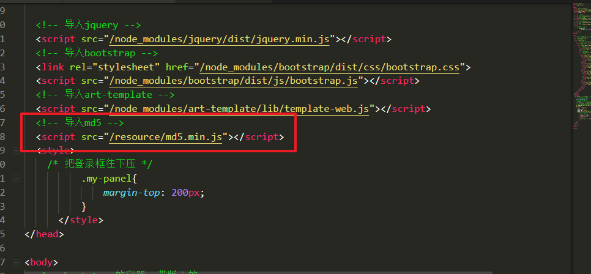
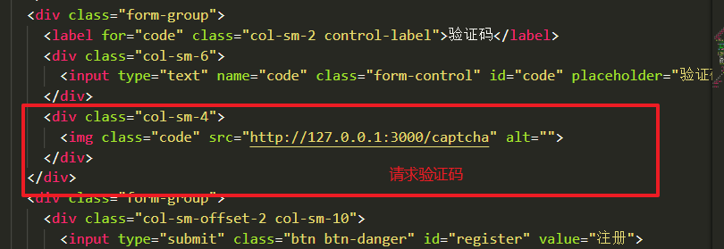
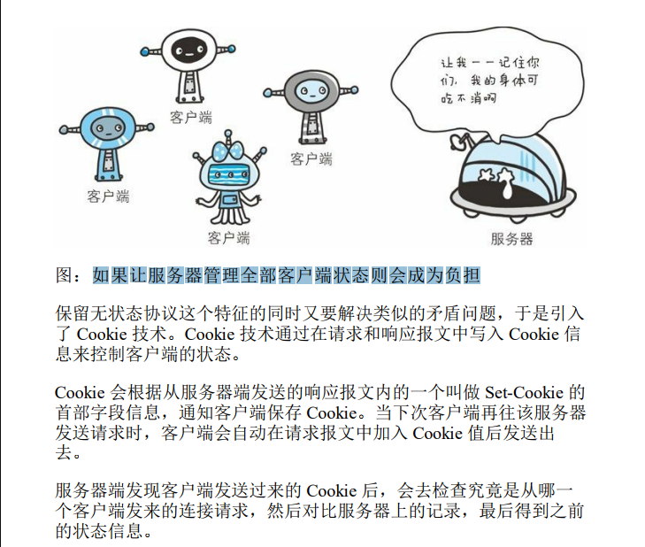
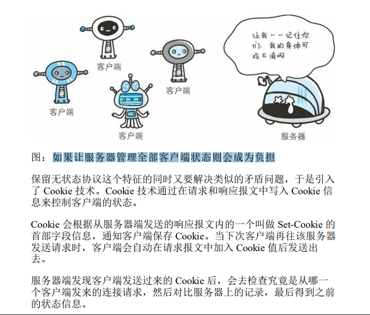
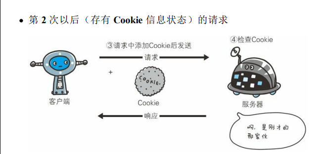
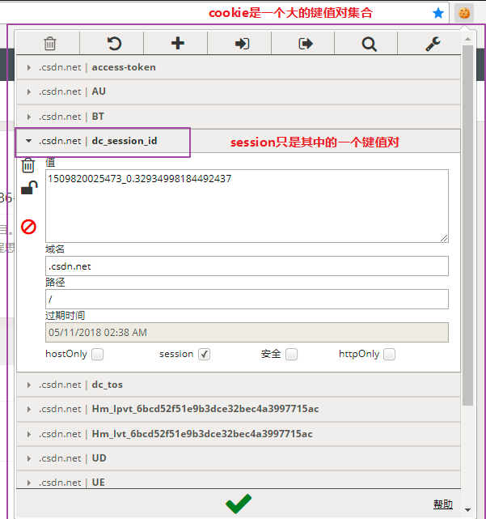
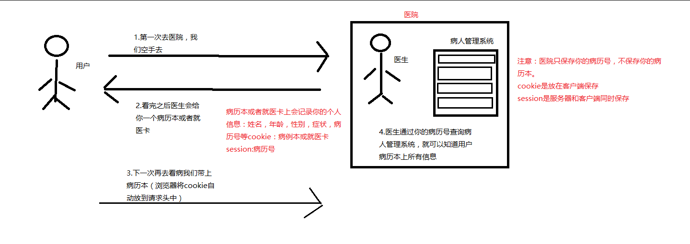

# ==01-用户模块1：注册功能实现==


## 服务端：svg-captcha第三方模块实现验证码功能

* 验证码功能思路
  * 1.服务端生成一个二进制验证码图片文件与对应的验证码文本
  * 2.服务端声明全局变量存储验证码文本（用于客户验证）
  * 3.客户端img标签发起网络请求，服务端响应验证码图片
  * 4.客户端提交注册数据，服务端处理
    * （1）先检查验证码是否正确
    * （2）再检查这个用户是否已经注册
    * （3）注册信息插入数据库
    * code: 0 成功   1：用户已注册  2：验证码错误  500：服务器内部错误

https://www.npmjs.com/search?q=svg-captcha


* 安装：`cnpm i svg-captcha --save`


* userController.js


```javascript
const svgCaptcha = require('svg-captcha'); //导入验证码模块

let captchaTxt; //声明一个全局变量存储服务端生成的验证码文本

//导入C层
const userModel = require('../model/userModel.js');

module.exports = {
    captcha: (req, res) => {
        //创建验证码对象
        var captcha = svgCaptcha.create();
        //获取验证码文本并保存
        captchaTxt = captcha.text;
        console.log(captcha.text);
        //将验证码图片响应给客户端
        res.type('svg');
        res.status(200).send(captcha.data);
    },
    register: (req, res) => {
        //1.获取post请求参数
        let body = req.body;
        console.log(body);
        //2.处理
        // code: 0 成功   1：用户已注册  2：验证码错误  500：服务器内部错误
        if (body.code.toLowerCase() != captchaTxt.toLowerCase()) { //全部转小写，不区分大小写
            //验证码错误
            res.send({
                err_code: 2,
                err_msg: '验证码错误'
            });
        } else {
            //检查是否已经注册
            userModel.find({
                userName: body.userName
            }, (err, docs) => {
                if (err) {
                    res.send({
                        err_code: 500,
                        err_msg: err
                    });
                } else if (docs.length != 0) {
                    res.send({
                        err_code: 1,
                        err_msg: '用户已存在'
                    });
                } else { //如果没有注册，则添加到数据库
                    userModel.create({
                        userName: body.userName,
                        passWord: body.passWord
                    }, (err) => {
                        if (err) {
                            res.send({
                                err_code: 500,
                                err_msg: err
                            });
                        } else {
                            res.send({
                                err_code: 0,
                                err_msg: 'success'
                            });
                        }
                    })
                }
            });
        }
    },
    login: (req, res) => {
    },
    logout: (req, res) => {
    }
};
```


## 客户端：md5加密与加盐技术实现数据传输加密

* 数据加密思路
  * 1.客户端点击提交的时候对密码进行md5加密（使用前端第三方包 md5.min.js）
  * 2.服务端接收到密文保存到数据库
    * 密码明文只存在于用户填写的表单input中
    * 无论是网络传输还是服务器都只存储密文
      * 防止http请求被攻击导致密码泄露
      * 防止数据库被攻击导致密码泄露
    * 下一次用户登录的时候，使用相同加密方式对登录密码进行加密。然后服务端只匹配两个密文是否一致








```javascript
$('#form').on('submit', function (e) {
      //禁用表单默认提交事件
      e.preventDefault();
      //对密码进行md5加密
      //第一个参数，要加密的字符串。 第二个参数：加盐（额外添加数据，让加密更加安全）
      let md5String = md5($('#passWord').val(),'add salt');
      //加密之后重新赋值给表单的文本，否则serialize提交的还是未加密的密码
      $('#passWord').val(md5String);
      $.ajax({
        url: '/register',
        type: 'post',
        dataType: 'json',
        data: $(this).serialize(),
        success: function (data) {
          // code: 0 成功   1：用户已注册  2：验证码错误  500：服务器内部错误
          if(data.err_code == 0){
            location.href = '/resource/view/login.html';//跳转登录
          }else{
            alert(data.err_msg);
          };
        }
      });
    });
```


# ==02-用户模块2：登录功能实现==

* 登录功能思路
  * 1.客户端对密码加密然后post提交
  * 2.服务器接收参数
  * 3.服务器处理
    * 1.先查询数据库判断用户名是否存在
    * 2.如果存在则匹配密码是否与注册的时候一致
    * // code: 0 成功   1：用户名错误 2：密码错误  500：服务器内部错误

## 客户端 login.html


```javascript
$('#form').on('submit', function (e) {
      //禁用表单默认提交事件
      e.preventDefault();
      //对密码进行md5加密
      //第一个参数，要加密的字符串。 第二个参数：加盐（额外添加数据，让加密更加安全）
      let md5String = md5($('#passWord').val(), 'add salt');
      //加密之后重新赋值给表单的文本，否则serialize提交的还是未加密的密码
      $('#passWord').val(md5String);
      $.ajax({
        url: '/login',
        type: 'post',
        dataType: 'json',
        data: $(this).serialize(),
        success: function (data) {
          // code: 0 成功   1：用户名错误 2：密码错误  500：服务器内部错误
          if (data.err_code == 0) {
            location.href = '/'; //跳转首页
          } else {
            alert(data.err_msg);
          };
        }
      });
    });
```


## 服务端 userController.js


```javascript
 login: (req, res) => {


        //1.获取post请求参数
        let body = req.body;
        console.log(body);
        //2.处理请求
        // code: 0 成功   1：用户名错误 2：密码错误  500：服务器内部错误
        //2.1 先检查用户名在不在
        userModel.find({
            userName: body.userName
        }, (err, docs) => {
            if (err) {
                res.send({
                    err_code: 500,
                    err_msg: err
                });
            } else if (docs.length == 0) { //用户不存在
                res.send({
                    err_code: 1,
                    err_msg: '用户名或密码错误'
                });
            } else {
                //2.2 检查密码是否正确
                let user = docs[0]; //如果可以查询到，则数组第一个元素就是用户数据
                if (user.passWord != body.passWord) {
                    res.send({
                        err_code: 2,
                        err_msg: '用户名或密码错误'
                    });
                } else {
                    //用户存在且密码一致，登录成功
                    //将用户信息存入session
                    req.session.user = req.body;
                    res.send({
                        err_code: 0,
                        err_msg: 'success'
                    });
                }
            };
        });
    },
```

# 03-Cookie介绍

* [1.1-什么是Cookie？](#1.1)
* [1.2-Cookie的工作原理](#1.2)
* [1.3-Cookie的与session的关系](#1.3)
* [1.4-举个栗子你就知道cookie和session的区别了](#1.4)
* [1.5-Cookie与sessionstorage和localstorage的区别](#1.5)

* ***第七天课程资料中有一本电子书：《图解HTTP》，里面对cookie的描述很到位，可以参考学习下***
    * ***谷歌浏览器快速查看cookie的插件也在课程资料中***

* ***1.cookie的本质就是一个包含多个键值对的json字符串***
* ***2.cookie的作用就是保持用户（浏览器）的状态（通常为登陆状态）***
    * cookie最经典的应用场景就是浏览器的免登录功能（第一次登陆之后，下一次访问该网页无需登录）

## 1.1-什么是Cookie？

* 1.cookie的定义：Cookie，有时也用其复数形式 Cookies，指某些网站为了辨别用户身份、进行 session 跟踪而储存在用户本地终端上的数据（通常经过加密）
    * Cookie最早是网景公司的前雇员Lou Montulli在1993年3月的发明
    * Cookie是由服务器端生成，发送给User-Agent（一般是浏览器），浏览器会将Cookie的key/value保存到某个目录下的文本文件内，下次请求同一网站时就发送该Cookie给服务器（前提是浏览器设置为启用cookie）。Cookie名称和值可以由服务器端开发自己定义，对于JSP而言也可以直接写入jsessionid，这样服务器可以知道该用户是否是合法用户以及是否需要重新登录等，服务器可以设置或读取Cookies中包含信息，借此维护用户跟服务器会话中的状态。

* 2.cookie的状态管理
    * HTTP 是无状态协议，它不对之前发生过的请求和响应的状态进行管理。也就是说，无法根据之前的状态进行本次的请求处理。
        * 任何浏览器都可以访问服务器，服务器根本不知道到底是哪一个用户访问自己
    * 假设要求登录认证的 Web 页面本身无法进行状态的管理（不记录已登录的状态），那么每次跳转新页面不是要再次登录，就是要在每次请求报文中附加参数来管理登录状态。
        * 不可否认，无状态协议当然也有它的优点。由于不必保存状态，自然可减少服务器的 CPU 及内存资源的消耗。从另一侧面来说，也正是因为 HTTP 协议本身是非常简单的，所以才会被应用在各种场景里。




## 1.2-Cookie的工作原理

* 1.当一个用户第一次访问浏览器时，服务器会生成一个cookie，并且在响应头中添加cookie后返回给浏览器
* 2.浏览器会自动将cookie保存在下次，当下一次访问同一服务器时会自动将cookie放入请求头中发给服务器，这样服务器就可以识别用户
    * （1）每一个服务器都有自己的cookie（cookie的域名识别）

    * （2）cookie是由服务器生成的

        * 虽然浏览器本身也可以添加cookie，但是保持用户状态的cookie一定是由服务器生成的（seesion）

    * （3）浏览器访问同一域名的请求时会自动将cookie发给服务器，我们开发人员无需编写任何代码
        * 如果有则发送，没有则不发
        * cookie是在请求头中的

        

        

        * 





```javascript

// 只要在响应头中加入 Set-Cookie 字段，客户端会把这个数据放到一个文件中然后保存到客户端电脑上
//服务器响应头添加cookie发给浏览器
  res.writeHead(200, {
    'Content-Type': 'text/plain; charset=utf-8',
    "Set-Cookie": 'userid=123456'
  })

```

## 1.3-Cookie的与session的关系

* cookie的本质就是一个字符串，通常我们会以`key=value`的形式来记录用户状态，而seesion可以理解为就是这个键值对中的某一个键值对，下图可以很好的说明cookie与session之间的关系
    * 其实session本身只是一个抽象的概念：在cookie中添加一个键值对专用于记录用户登陆状态的这种思想。
        * 你可以使用任何键值对来表示这种登陆状态，只是大家一个规范喜欢把这个键值对的键叫做`session`，不同的网站会有不同的名称，但是一般都会有`session`这个单词





## 1.4-举个栗子你就知道cookie和session的区别了

* 在下图看病过程中，用户相当于浏览器，医院相当于服务器
    * 1.用户第一次去医院看病时，是空手去的，医院并不知道你是谁，你要干什么
        * 浏览器第一次访问服务器，由于http是无状态协议，所以服务器无法识别用户
    * 2.看完病之后，医生会给你一个病历本或者就诊卡，上面记录了你的一些个人信息，如姓名、年龄、症状等，每一个病历本都有一个病历号，医生将你的信息录入医院管理系统之后就把病历本给你的（病历本不是你和医院一人一份，而是你一个人持有）
        * 服务器在响应头中添加cookie（病历本），并且保存用户的session（病历号）
            * cookie是放在浏览器保存的，session是服务器和浏览器同时保存
    * 3.下一次我们再去同一医院时，就会带上我们的病历本，此时医生只需要根据你的病历号查询医院管理系统就知道上一次给你记录的个人信息
        * 浏览器下一次访问相同域名的服务器时会自动带上cookie，服务器获取cookie中的session就可以知道用户的登陆状态
            * 这里说的服务器不保存cookie是指不会以cookie的方式去保存，服务器会有一个专门的数据库来保存cookie上的信息（病人管理系统），也就是说医院的病人管理系统虽然记录了你的病历本上的数据，但它不是病历本（cookie）




## 1.5-使用sessioc保持用户登录状态的完整流程


* **全程基本不用前端做什么事**
  * 1.服务端接收到登录请求之后，将登录信息写入cookie，发给客户端
  * 2.浏览器接收到服务器的cookie之后，自动存储到本地。
  * 3.下一次浏览器访问相同域名的服务器时，会自动将该网站cookie上传
    * 哪怕你谷歌浏览器关闭重启也会发送，因为cookie被浏览器写入本地文件去了
  * 4.服务器接收到客户端请求的时候，只需要获取cookie中的session就知道这个浏览器有没有登陆过，登录哪个用户了
    * 如果有登录，则将session响应给客户端。客户端根据需求修改页面UI即可


# 04-使用cookie-session实现用户会话保持

http://www.expressjs.com.cn/en/resources/middleware/cookie-session.html


* 安装：`cnpm i cookie-session --save`


### 1.app.js中配置中间件

```javascript
//3.5 cookie-session中间件：用户会话保持
var cookieSession = require('cookie-session')
app.set('trust proxy', 1) // trust first proxy 信任首次登录陌生用户
app.use(cookieSession({
    name: 'session',
    keys: ['11111'],//设置加密的钥匙
    // Cookie Options
    maxAge: 24*60*60*1000 // 24 hours 有效期
  }));

//写个中间件查看浏览器上传过来的cookie
app.use((req,res,next)=>{
    console.log(req.session);
    next(); 
});
```


### 2.在userController.js中如果用户登录成功，则将该信息写入cookie


```javascript
login: (req, res) => {


        //1.获取post请求参数
        let body = req.body;
        console.log(body);
        //2.处理请求
        // code: 0 成功   1：用户名错误 2：密码错误  500：服务器内部错误
        //2.1 先检查用户名在不在
        userModel.find({
            userName: body.userName
        }, (err, docs) => {
            if (err) {
                res.send({
                    err_code: 500,
                    err_msg: err
                });
            } else if (docs.length == 0) { //用户不存在
                res.send({
                    err_code: 1,
                    err_msg: '用户名或密码错误'
                });
            } else {
                //2.2 检查密码是否正确
                let user = docs[0]; //如果可以查询到，则数组第一个元素就是用户数据
                if (user.passWord != body.passWord) {
                    res.send({
                        err_code: 2,
                        err_msg: '用户名或密码错误'
                    });
                } else {
                    //用户存在且密码一致，登录成功
                    //将用户信息存入session
                    req.session.user = req.body;
                    res.send({
                        err_code: 0,
                        err_msg: 'success'
                    });
                }
            };
        });
    },
```


* ***从此浏览器以后再访问服务器会自动将cookie放到请求头中发给服务器***

  * 前端不用写一行代码

    

  

###   3.在heroComtroller.js中首页英雄列表中响应返回cookie（因为网站首页会请求英雄列表数据）

```javascript
getHeroList:(req,res)=>{//英雄列表
        heroModel.find((err,docs)=>{
            if(err){
                res.send({
                    err_code:500,
                    err_msg:err
                });
            }else{
                //1.计算页数(一页10个)
                let pageCount = Math.ceil(docs.length/10);
                //2.返回客户端 第一页数据 和 页数
                res.send({
                    heros:docs.slice(0,10),
                    pageCount,
                    user:req.session.user//将浏览器的cookie响应给客户端
                });
            }
        });
    },
```


### 4.在index.html中根据cookie来修改页面UI

```javascript

//1.英雄列表
      $.ajax({
        url: '/heroList',
        type: 'get',
        dataType: 'json',
        success: function (data) {
          console.log(data);
          $('tbody').html(template('heroListTmp', data)); //渲染列表
          $('.pagination').html(template('pageTmp', data)); //渲染页码

          //判断用户是否登录
          if(data.user){//已经登录过
            $('#userName').text(data.user.userName);
            $('#login').hide();
          }else{//未登录
             $('#userName').hide();//隐藏用户名
            $('#logout').hide();//隐藏登出按钮
            $('.manager').hide();//隐藏编辑和删除按钮
          }

          //2.分页查询(必须要等页码渲染之后才可以获取到页码li元素)
          $('.page').on('click', function () {
            $.ajax({
              url: '/heroPage?page=' + $(this).text(),
              type: 'get',
              dataType: 'json',
              success: function (data) {
                console.log(data);
                $('tbody').html(template('heroListTmp', data)); //渲染列表
              }
            });
          });
        }
      });

```


# 05--用户模块：登出功能实现


* 思路
  * 客户端发送无参get请求表示登出
  * 服务器清空cooie，重定向跳转首页
    * 此时客户端会自动清空
* index.html

```html
 <li><button class="btn btn-danger btn-exit" id="logout" onclick="location.href='/logout'">退出</button></li>
```


* userController.js

```javascript
logout: (req, res) => {
        //1.清空session
        req.session = null;
        //2.重定向显示首页
        res.writeHead(302, {
            'Location': '/resource/view/index.html'
        });
        res.end();
    },
```


# 06-[课外拓展]RSA完整流程总结

## 1.1-RSA加密介绍

* 1.RSA公钥加密算法是1977年由罗纳德·李维斯特（Ron Rivest）、阿迪·萨莫尔（Adi Shamir）和伦纳德·阿德曼（Leonard Adleman）一起提出的。1987年7月首次在美国公布，当时他们三人都在麻省理工学院工作实习。RSA就是他们三人姓氏开头字母拼在一起组成的。

* 2.RSA是目前最有影响力和最常用的公钥加密算法，它能够抵抗到目前为止已知的绝大多数密码攻击，已被ISO推荐为公钥数据加密标准。

* 3.今天只有短的RSA钥匙才可能被强力方式解破。到2008年为止，世界上还没有任何可靠的攻击RSA算法的方式。只要其钥匙的长度足够长，用RSA加密的信息实际上是不能被解破的。但在分布式计算和量子计算机理论日趋成熟的今天，RSA加密安全性受到了挑战和质疑。

* 4.RSA算法基于一个十分简单的数论事实：将两个大质数相乘十分容易，但是想要对其乘积进行因式分解却极其困难，因此可以将乘积公开作为加密密钥。

*** 也就是说RSA加密只要你的钥匙够长,是无解的***

## 1.2-关于公钥和私钥

* 参考网址<http://www.blogjava.net/yxhxj2006/archive/2012/10/15/389547.html>

* 1.公钥是谁所持有的？
    * 服务器和客户端

* 2.私钥是谁所持有的？
    * 服务器

* 3.哪一把钥匙用来加密？
    * 公钥

* 4.哪一把钥匙用来解密？
    * 私钥

## 1.3-RSA加密完整流程

* ***服务端需要准备两把钥匙，公钥和私钥***
    * 百度搜索：openssl.exe工具
        * 安装包路径默认在:`C:\OpenSSL-Win64\bin`

* 1.客户端需要加密时，先向服务端发起一个请求，请求RSA的公钥

* 2.服务端获取到请求之后，生成公钥，返回给客户端

* 3.客户端拿到公钥之后，使用公钥加密明文

* 4.客户端将公钥加密之后的密文发给服务器

* 5.服务端获取客户端密文，使用私钥解密可以得到明文

## 1.4-服务端生成公钥私钥流程

1.打开终端生成公私钥
    * `genrsa -out rsa_private_key.pem 1024`
        * 如果是java开发者则需要将私钥转成PKCS8格式,nodejs可以不用
            * `pkcs8 -topk8 -inform PEM -in rsa_private_key.pem -outform PEM -nocrypt -out rsa_private_key_pkcs8.pem`

* 2.生成公钥 `rsa -in rsa_private_key.pem -pubout -out rsa_public_key.pem`

* 3.退出程序    
    * `exit`:方便下一次继续生成，每一次进入和退出生成的公私钥都是不一样的

* 4.将刚刚生成的两个公私钥证书放入项目目录
    * 使用文件读写来读取公钥和私钥

## 1.5-服务端编写一个rsa模块用于RSA加密和解密

* 修改crypto的解密填充模式，并添加用于AES加密的钥匙
    * 关于rsa加密的填充模式可以参考这篇博客:http://www.cnblogs.com/lzl-sml/p/3501447.html

```javascript

//导入nodejs内置加密模块
var crypto = require('crypto');
//文件读写模块
var fs = require('fs');

//读取私钥pem证书文件
var privatePem = fs.readFileSync('./rsa_private_key.pem');
//读取公钥pem证书文件
var publicPem = fs.readFileSync('./rsa_public_key.pem');
//将公私钥转化为字符串
var prikey = privatePem.toString();
var pubkey = publicPem.toString();

///< rsa加解密  

///< 公钥加密  

var rsa = module.exports;

//浏览器只需要公钥
rsa.encrypt = function(){
    return pubkey;
};

//解密
rsa.decrypt = function(data){

    //1.由于jsencrypt加密之后是base64格式，所以这里需要转成base64格式的二进制
    var buff = new Buffer(data,'base64');
//     //使用私钥解密 第一个参数是私钥 第二个参数是密文（二进制）
    //console.log(crypto.constants);
    //padding是设置加密填充模式（文本不足时的填充），jsencrypts使用的是RSA_PKCS1_PADDING模式
    //（不同的模式对同样的字符串加密会得到不同的密文，所以使用什么模式加密就必须使用什么模式解密）
     var dedata = crypto.privateDecrypt({key:prikey,padding:crypto.constants.RSA_PKCS1_PADDING},buff);
console.log('解密' + dedata.toString());

     return dedata.toString();
};


//将base64格式钥匙转成16进制
// var cipher = crypto.createCipher('blowfish', publicPem);
// console.log(cipher.update(key,'base64','hex'));

//AES加密钥匙
rsa.AESKey = 'welcom to itheima learn big qianduan';

```

## 1.6-客户端RSA公钥加密流程

* 前端rsa加密我们需要借助npm第三方:https://www.npmjs.com/package/jsencrypt
    * npm install jsencrypt
        * 该第三方可以使用npm来安装，但是该第三方只能用于网页端，不支持node端

* 使用我们项目案例的注册界面来演示 

```html

<script src="/node_modules/jquery/dist/jquery.js"></script>
  <!-- rsa加密 -->
  <script src="/node_modules/jsencrypt/bin/jsencrypt.js"></script>
  <script>

    $('#form').on('submit', function (e) {
      e.preventDefault();
      //1.先获取公钥
      $.ajax({
          url: '/publicKey',
          type: 'get',
          dataType: 'json'
          }).then(function (data) {
            console.log(data.key);

          // 2.使用服务器返回的公钥加密 

          //2.1创建encrypt对象
          var encrypt = new JSEncrypt();
          //2.2设置公钥
          encrypt.setPublicKey(data.key);
          //2.3开始加密  这里动态获取密码输入框文本，原因是什么？
          var encrypted = encrypt.encrypt($('[name="password"]').val());
          //设置密码框的值为密文
          $('[name="password"]').val(encrypted);

          console.log(encrypted);
          //此时再获取表单数据就是已经加密好的数据
          //3.再一次提交注册表单
          $.ajax({
            url: '/register',
            type: 'post',
            data: $('#form').serialize(),
            dataType: 'json'
          }).then(function (data) {

            var err_code = data.err_code;
            if (err_code === 2000) {
              //暂时先跳转回首页
              window.location.href = '/';
            } else if (err_code === 2001) {
              window.alert(data.err_message);
            }
            else{
               window.alert(data.err_message);
            }
          });
      });

    });

  </script>

```

## 1.7-服务端RSA私钥解密流程

* 1.处理路由，如果请求路径是:`/publicKey`，返回公钥

* 2.处理路由：如果请求路径是：`/register`
    * （1）获取bosy数据
    * （2）将bosy的password使用私钥解密
        * RSA加密的最大特点就是只能用公钥加密，只能用私钥解密
    * （3）存入数据库