## MySQL数据库

学习目标：

 -  理解数据库作用
 -  理解数据表、字段、主键含义
 -  会使用基本增、删、查、改的SQL语句
 -  会用PHP操作数据库


### 1. 数据库作用 

#### 1.1 什么是数据库

- 数据库就是存数据的仓库。它能方便的让程序员保存数据、管理数据和共享数据。

#### 1.2 为什么需要数据库？

>  我们用一个文本文件、或者excel文件都能把数据存起来，那为什么还要用数据库呢？

- 文件形式管理数据有以下缺点：

```
	1.用文件形式保存数据，不安全，任何人能方便打开和修改删除
	2.所有对数据的操作不会留下记录，不知道是谁操作的
	3.不方便检索信息
	4.其他各种不便，不多枚举
```

- 数据库系统，就能方便解决上述问题。


- 常见数据库系统有：MySQL、Oracle、SQLServer等

### 2. MySQL管理界面

#### 2.1 打开界面

- 打开PHPStudy，然后点  `MySQL管理器`，在弹出的界面中选  `MySQL-Front`
- 如图：

 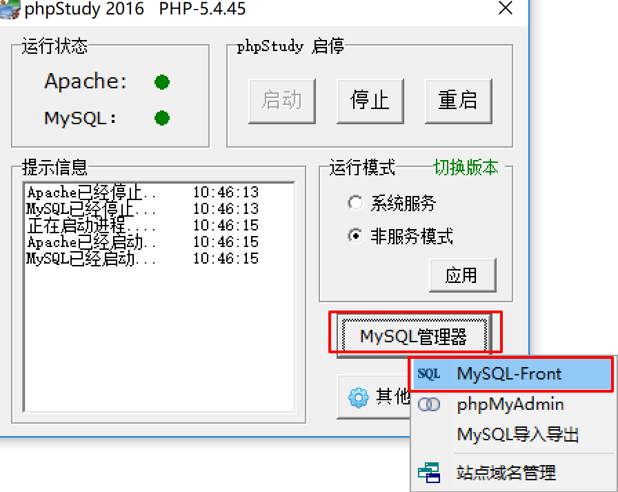

- 弹出的界面点打开即可


 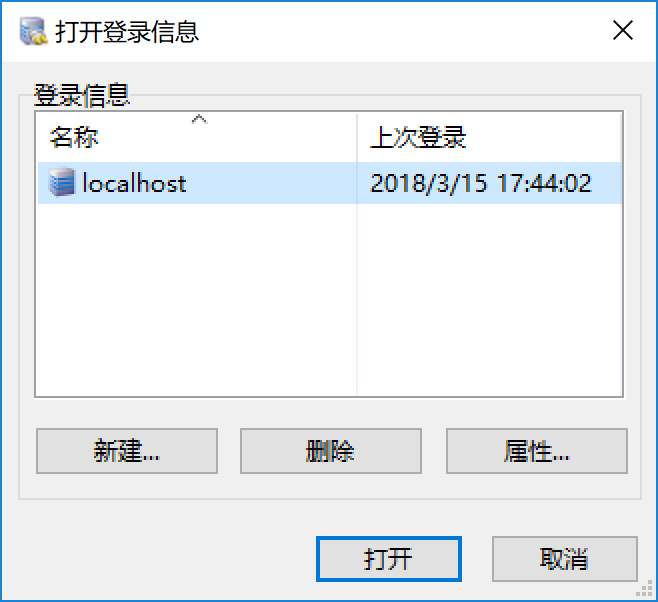


#### 2.2 新建数据库 

- 打开后，右键localhost，然后依次选新建、数据库。


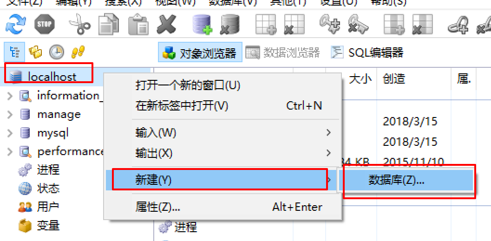	


- 输入数据库名字，再点确定就好。**注意：请使用英文名字。**

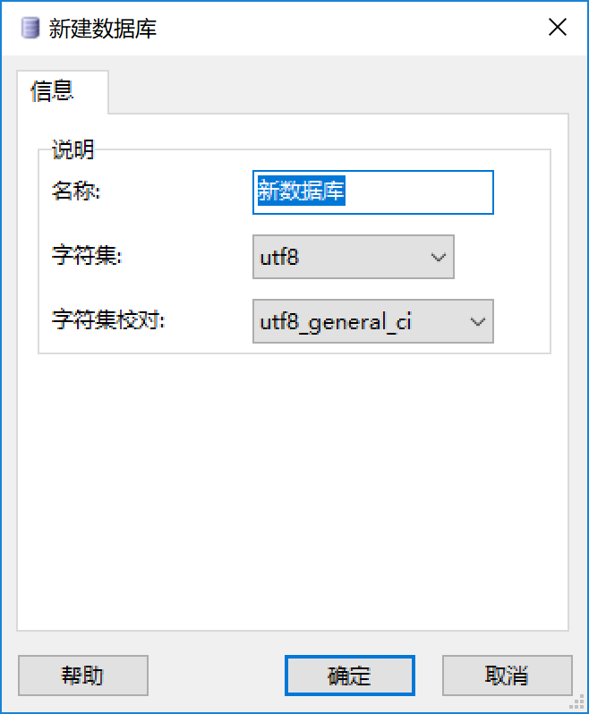


#### 2.3 数据表

##### 2.3.1 建表

- 为了更好的对数据进行分类，数据库提供了  `数据表`   。方便对这些数据归类。可以把  `数据表`  理解为一个  `表格`（如下图）。	

 


- 建表步骤
   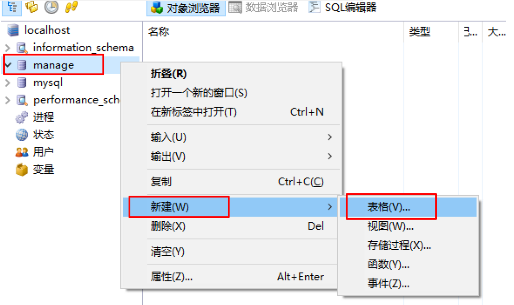


- 此处我们新建一个叫user的数据表，专门用来存每个用户的信息。


##### 2.3.2 字段

- 建好表后，我们看到有一块区域叫  `字段`
- 字段可以理解为是表格中的列名

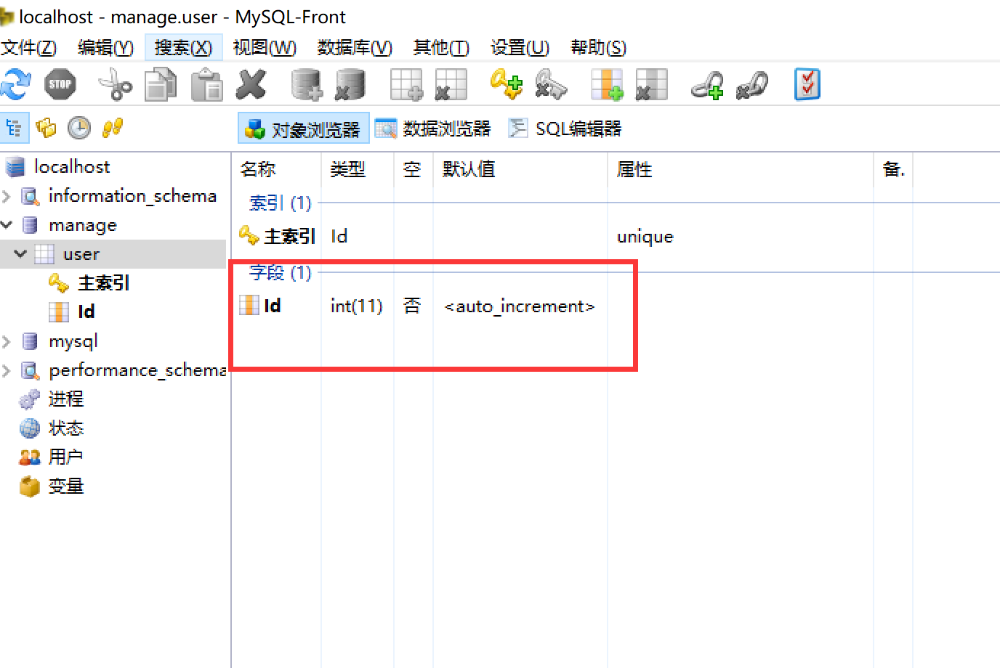

- 添加字段如图：

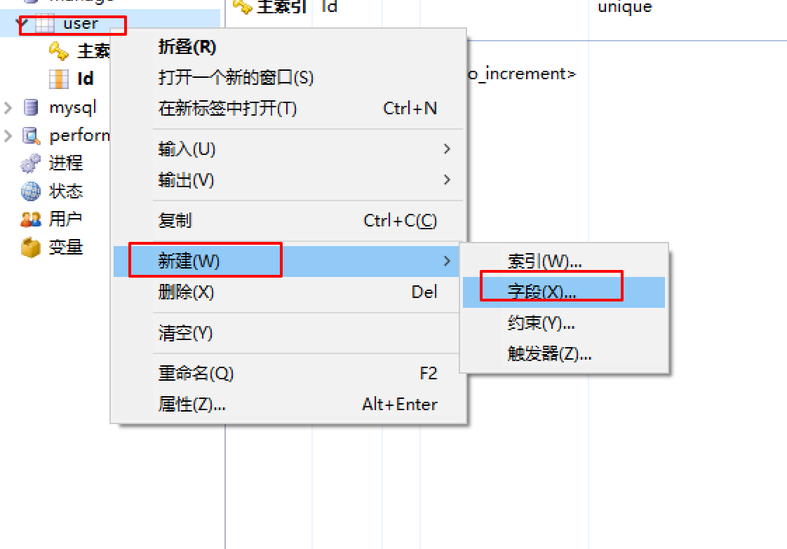

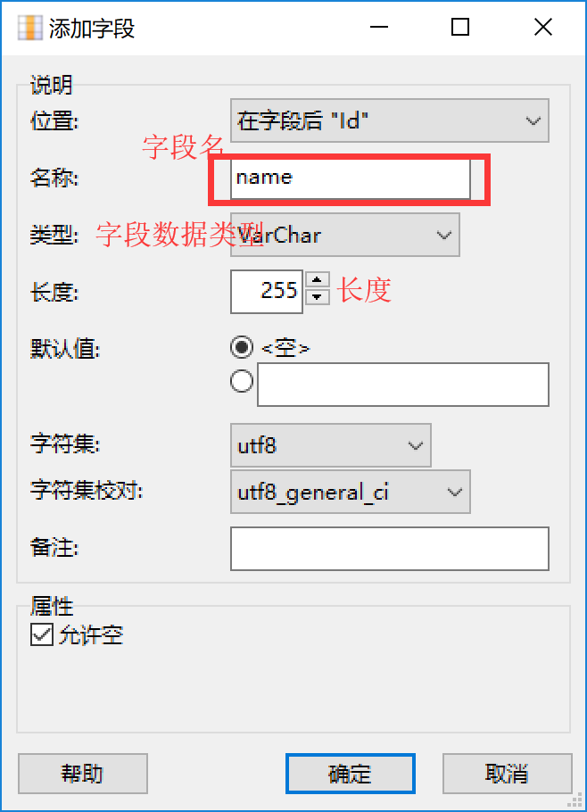


```
说明：
	1. 字段名可以理解为就是列名
	2. 类型根据实际情况选择对应类型，例如姓名一般是字符串，在数据库中选择VarChar（数据库中字符串类型）
	3. 长度就是说字符串最多允许多少位，长度越小，占用空间越小。（我们用默认长度即可）
```

- 然后我们再依次加  `age`  和  `description`  两个字段。


##### 2.3.3 插入一条数据

- 点中间的  `数据浏览器`

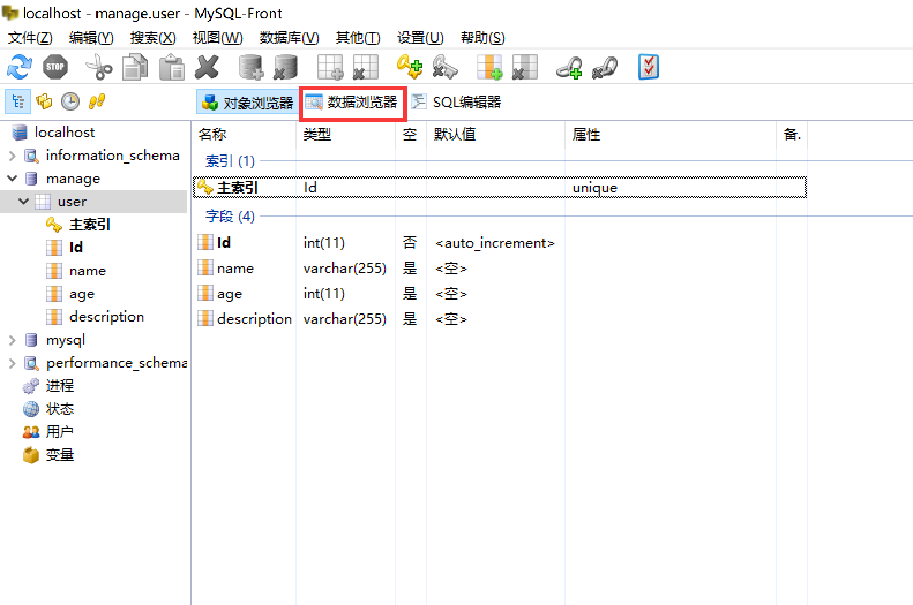


- 下图类似表格的界面就是新增数据的地方。

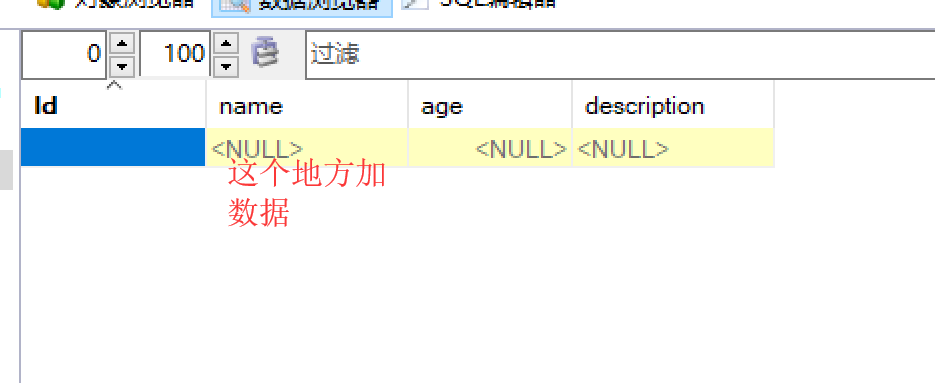


- 我们只在  `name`，`age`，`description ` 字段下加数据(Id不加，自动生成)

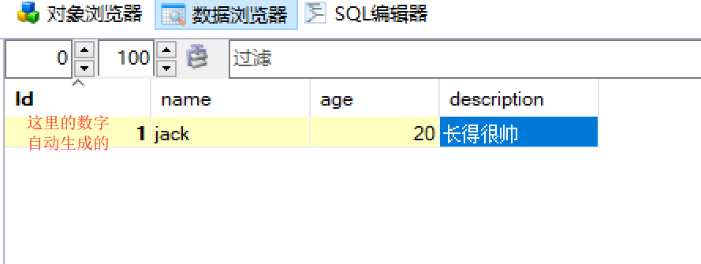


- 插入新纪录：对着任意记录  `右键`，再点  `插入新纪录`  即可

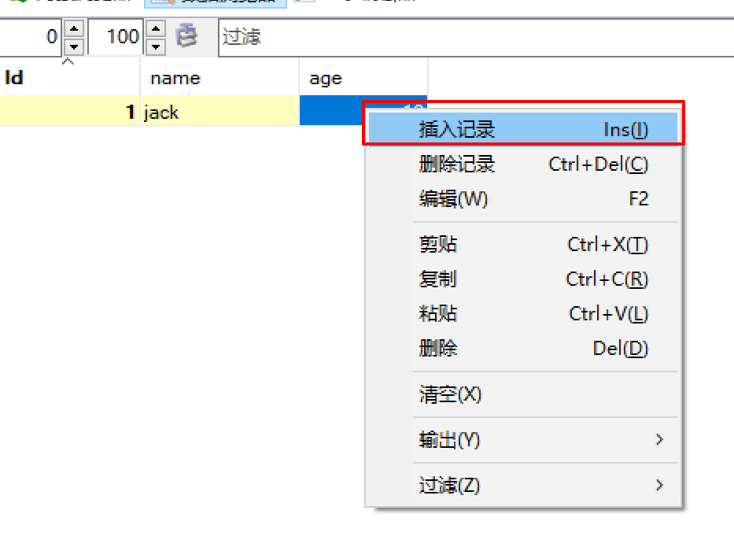


- 插入完成，如图

 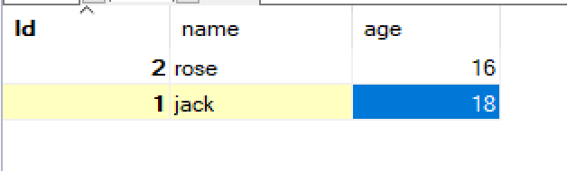


```
结论：
	1. Id这个字段里是自动生成的依次递增的整数。
	2. Id字段的作用就是作为某条数据的身份证,用来区分不同的数据
```


##### 2.3.4 主键/主索引

- 像  `Id`  这样用来区分不同数据的字段，叫  `主键`，或者叫  `主索引`


##### 2.3.5 建表练习

- 新建一个客户表，内容如下：
   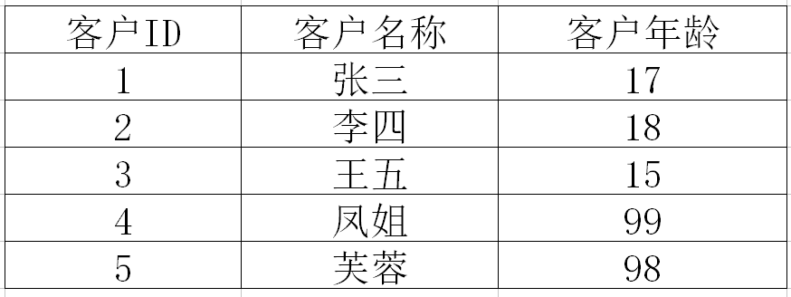


> 为了方便后面学习时使用，统一起名：
>
> ​	客户表的名称叫：customer
>
> ​	字段客户ID叫：cId
>
> ​	字段客户名称叫：cName
>
> ​	字段年龄叫：cAge


- 新建一个订单表，内容如下：


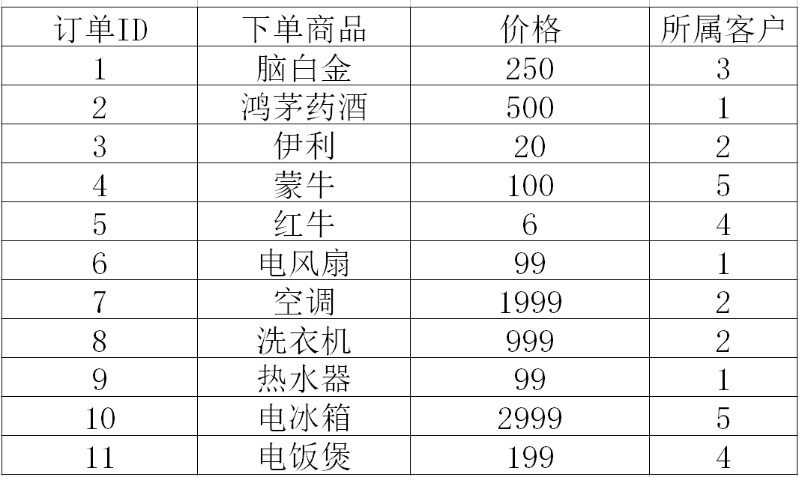

> 为了方便后面学习时使用，统一起名：
>
> 订单表的名称叫：horder
>
> ​	字段订单ID叫：oId
>
> ​	字段下单商品叫：goodsName
>
> ​	字段价格叫：price
>
> ​	所属客户叫：custormId

​	

### 3. SQL语句

#### 3.1 SQL语句介绍

> SQL语言，是一种专门对数据库进行操作的语言。
>
> 像我们刚刚通过右键就能插入一条数据，但其实它的本质就是执行一条SQL语句


#### 3.2 增删查改语句

##### 3.2.1 增删查改的意思

- 增：新增记录	


- 删：删除记录


- 查：查询记录


- 改：修改记录

##### 3.2.2 insert语句

>  insert语句对应的是“增”，也即新增数据

- 基本用法：

```sql
insert into 表名(字段名) values(值);
```

- 例：

```mysql
insert into user(name,age,desc) values('andy',20,'打酱油的');
```

> 代表给user表新增一条数据，name的值为andy，age的值为20。


##### 3.2.3 delete语句

> delete语句对应的是“删”，也即删除数据

- 用法（慎用）：

```mysql
delete from 表名;
```

- 例：

```mysql
delete from user;
```

- 在执行这条语句前我们user表里有三条数据

 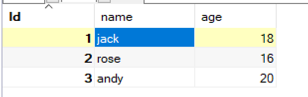

- 执行完后，我们发现，数据全没了

 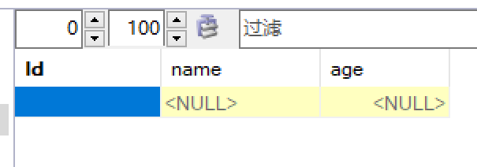


>  结论：delete语句默认会删除表格中的所有数据，要 `慎用` 

- 按条件删除，用法：（常用）

```mysql
delete from 表名 where 字段 = 某个值;
```

- 例：

```mysql
delete from user where id = 2;
```

>  说明：这代表删除user表下，id为2的那条记录

- 也可以按范围删除，例：

```mysql
delete from user where id <= 3;
```

> 说明：这代表删除user表下，id小于或等于3的那些记录


##### 3.2.4 select语句

> select语句对应的是“查”，即查询记录

**指定查询某些字段**

- 用法：

```mysql
select 字段 from 表名;
```

- 例：

```sql
select name,age from user;
```

说明：这会查询出user表下所有数据，只会包含`name`和`age`字段。如果还有其他字段，结果中不会包含。


**查询所有字段**

- 用法：

```sql
select * from 表名;
```

- 例：

```sql
select * from user;
```

>  默认会查询出表中的所有数据，如果想指定条件查询，也可以在后面加  `where`

- 例：

```sql
select * from user where id < 10;
```

>  说明：只查询出id小于10的数据，不包括10


##### 3.2.5 update语句

> update语句对应的是“改”，也即修改某条数据

- 用法（慎用）：

```sql
update 表名 set 字段 = 新值;
```

- 例：

```sql
update user set name = '黑马一哥';
```

>  说明：把user表中所有数据的name值改为黑马一哥，注意，此操作是修改所有，所以要小心使用！


- 指定条件修改，例：

```sql
update user set name = '黑马一哥' where id = 3;
```

>  只修改id为3的这条数据，把name改成黑马一哥


### 4. PHP操作数据库

#### 4.1 为什么需要

>  之前我们学的语句都是在MySQL自己的管理界面上操作，但有的时候我们需要在界面上显示一些数据
>
>  如下图所示：

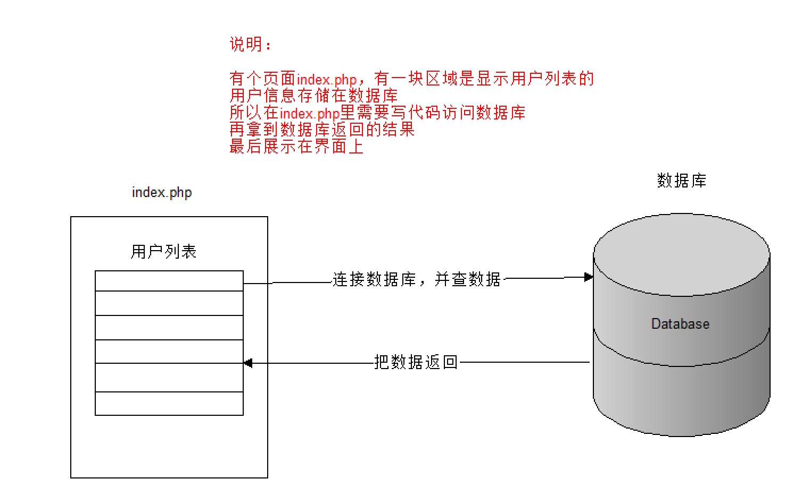

​	


#### 4.2 连接数据库的步骤

> 思考：把大象装进冰箱需要几步？
>
> ​	1.打开冰箱门
>
> ​	2.把大象塞进去
>
> ​	3.关闭冰箱门


- PHP操作数据库，其实也主要分为三大步：
  - 建立数据库连接
  - 操作数据库（增删改查）
  - 关闭数据库连接

  ​


#### 4.3 建立数据库连接

- 语法：

```php
mysqli_connect('数据库地址','账号','密码','数据名');
```

- 参数解释：

```
参数1：数据库的ip地址
参数2：数据库管理的账号
参数3：数据库管理的密码
参数4：数据库名，因为一个数据库服务器里可能有很多数据库，你需要告诉它连接哪个数据库的
```

- 例：

```php
$link = mysqli_connect('127.0.0.1','root','root','manage');
```

> 使用完此函数后，会有一个返回值，如果返回值为false代表连接失败
>
> 如果返回值不为false，那么会打印一个类似下图的数据

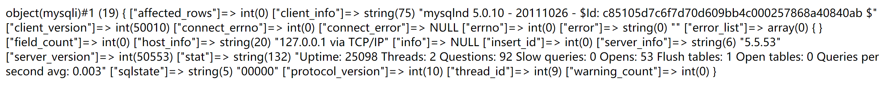这个返回值我们一般叫  `连接通道`，这个  `连接通道`  里面的内容是什么我们不需要关心，只需要知道，`连接通道`里包含了本次连接的各种信息，只要不是false就代表数据库连接成功。


#### 4.4 操作数据库

- 语法：

```php
mysqli_query(连接通道，SQL语句);
```

##### 4.4.1 查询数据

- 例：

```php
$result =  mysqli_query($link,"select * from user");
```

>说明：
>
>​	这句话执行完后会得到一个结果，结果包含了查询得到的数据，我们用一个变量    `$result`  接收
>
>但是，这个返回值我们不能直接拿来用，还需要用一个  `解析函数`  来把数据解析出来

- 用法：

```php
mysqli_fetch_all(查询结果,MYSQLI_ASSOC);
```

- 例：

```php
$users = mysqli_fetch_all($result,MYSQLI_ASSOC);
```

说明：

- 参数1：我们传之前用`mysqli_query`函数查询到的结果
- 参数2：固定写  `MYSQLI_ASSOC`   ，如果记不住，就写 `1`。

>  函数执行后，会把结果转成一个关联型数组。这样，我们要的数据就比较明确了。
>
>  注：参数2如果不传  `MYSQLI_ASSOC`，得到的会是一个普通数组，那样我们取数据时只能根据下标来取。


##### 4.4.2 增、删、改数据

> 增、删、改数据，也是用  `mysqli_query`  这个函数操作。只不过把SQL语句换成对应的语句

- 增加：

```php
$rows = mysqli_query($link,'insert into user(name,age,desc) values("新人",16,"新增加的一条数据")');
```

- 删除：

```php
$rows = mysqli_query($link,'delete from user where id=2');
```

- 修改：

```php
$rows = mysqli_query($link,'update user set name="修改",age=18,desc="我被改了" where id=2');
```

> 因为增、删、改不是为了获取结果，所以此时  `mysqli_query`  的返回值不再会是一堆数据，而是获得受影响的行数，我们根据受影响的行数是否大于0，就可以知道是否操作成功

- 用法：

```php
if($rows > 0){
  echo "登录成功!";
}
```

#### 4.5 关闭数据库连接

>  无论你是做增删查改中的哪一种，请记得最后一定要关闭数据库连接！

- 用法：

```php
mysqli_close($link);
```

>  注意：请记得一定要关闭数据库连接，否则会占用服务器资源。


### 5. PHP操作数据库步骤的封装

> 无论做增、删还是改，代码都是一样的，唯一不同的是SQL语句不同。
>
> 为了以后用起来方便和节省代码量，我们可以把增、删、改的代码封装成函数。

#### 5.1 增、删、改封装

- 代码如下：

```php
function my_Excute($sql){
    
    // 连接数据库
    $link = mysqli_connect('127.0.0.1', 'root', 'root', 'study');

    // 执行sql语句
    mysqli_query($link, $sql);

    // 获取受影响的行数
    $rowNum = mysqli_affected_rows($link);

    // 关闭连接
    mysqli_close($link);

    // 返回行数
    return $rowNum;
}
```

> 严格来讲，数据库的IP、用户名、密码也该当参数传进来，但是因为我们在学习阶段，所以此处我们就写死本地IP和用户密码。


#### 5.2 查询数据的封装

```php
function my_Query($sql){
    
    // 连接数据库
    $link = mysqli_connect('127.0.0.1', 'root', 'root', 'study');

    // 执行sql语句
    $result = mysqli_query($link, $sql);

    // 解析数据
    $data = mysqli_fetch_all($result);

    // 关闭连接
    mysqli_close($link);

    // 返回行数
    return $data;
}
```


### 6. 综合案例 --- 人员管理系统

- 效果如图：

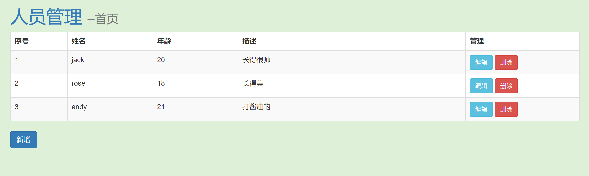


#### 6.1 需求说明：

- 用户打开首页时，会从数据库中查询到  `user`  表下的最新全部数据并显示在界面上

  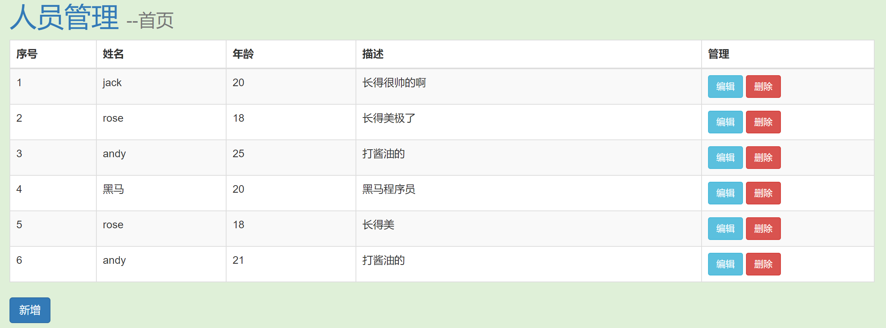

  ​

- 当用户点击`新增`时，会跳转到新增页面，如图

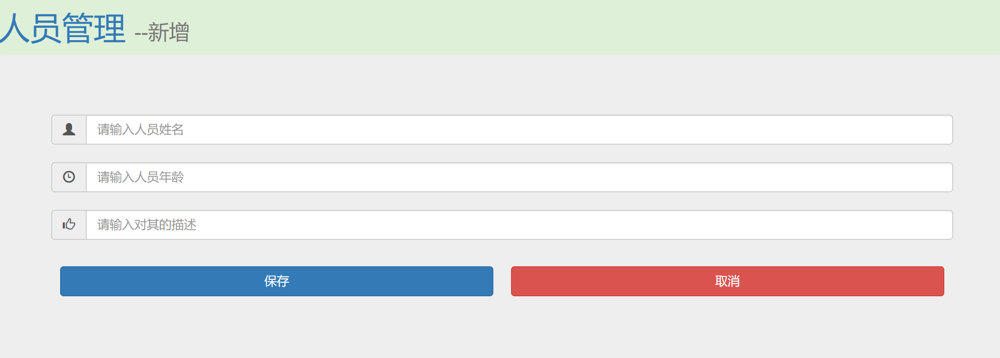


- 当用户点击某行的  `编辑 ` 时，会显示编辑页面，并把当前行的数据带入，如图

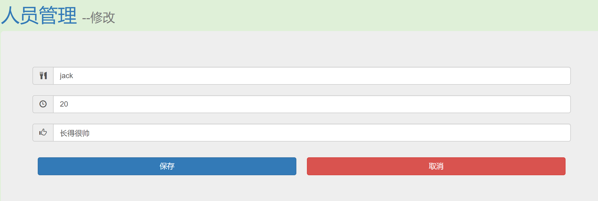


- 当用户点击 `删除`，则对应那行数据要删掉


#### 6.2 首页数据展示

> html和css部分不是重点，我们直接用写好的页面结构即可。
>
> 初始模板代码：[点我下载](usermanage.rar)

- 让  `index.php`  展示数据，代码如下：

```php+HTML
<tbody>
      <!-- 此处写生成表格的代码 -->
        <?php
            //建立数据库连接
            $link = mysqli_connect('127.0.0.1','root','root','manage');

            //查询数据库
            $result = mysqli_query($link,"select *from user");

            //解析成数组
            $data = mysqli_fetch_all($result,1);

            //关闭数据库连接
            mysqli_close($link);

            //数据有多少个，就循环多少次来创建tr
            for($i = 0; $i < count($data); $i++):
        ?>
          <tr>
            <td><?php echo $data[$i]['Id']; ?></td>
            <td><?php echo $data[$i]['name']; ?></td>
            <td><?php echo $data[$i]['age']; ?></td>
            <td><?php echo $data[$i]['description']; ?></td>
            <td>
              <a href='#' class="btn btn-sm btn-info">编辑</a>
              <a href='#' class="btn btn-sm btn-danger">删除</a>
            </td>
          </tr>
        <?php endfor;?>
</tbody>
```


#### 6.2 新增功能

> 思路：
>        	1. insert.html的表单提交到doAdd.php文件，所以我们需要创建这个文件
>        	2. doAdd.php里，拿到提交过来的用户名、年龄、描述等信息
>        	3. 用PHP操作数据库，把这些信息当做字段的值新增
>        	4. 新增完毕跳转回首页看效果

- `doAdd.php`  代码如下：

```php
<?php

    //1. 获得提交的数据
    $name = $_POST['userName'];
    $age = $_POST['userAge'];
    $desc = $_POST['userDesc'];

    //2. 建立数据库连接
    $link = mysqli_connect('127.0.0.1','root','root','manage');

    //3. 准备SQL语句
    $sql = "insert into user(name,age,description) values('$name','$age','$desc')";
    //4. 执行新增语句
    mysqli_query($link,$sql);

    //5. 获得影响的行数
    $rows = mysqli_affected_rows($link);

    //6. 关闭数据库连接
    mysqli_close($link);

    //7. 跳转回首页
    header('location:index.php');
?>
```

> 注意：写SQL语句时，values部分每个值都要用  `''` 包起来，不然插入数据库会失败


#### 6.3 编辑功能

```
需求：
	当点击index.php这个首页上的 编辑 按钮时，会跳转到修改界面，并且把被点击的那行数据带过去	
```

- 来到  `index.php`，找到编辑这个a标签，修改它的href属性，代码如下：

```php+HTML
<a href="./update.php?id=<?php echo $data[$i]['Id']; ?>" class="btn btn-sm btn-info">编辑</a>
```

> 说明：谁被点击，就会跳转到update.php文件，并把被点击的那条数据id传过去，因为为了方便update.php界面可以展示出这条被点击的数据。

- 修改update.php文件，核心代码如下：

```php+HTML
     <!-- 这里先根据id查询出对应的数据 -->
    <?php

      //获取传递过来的id
      $id = $_GET['id'];
      //打开数据库连接
      $link = mysqli_connect('127.0.0.1','root','root','manage');
      //准备SQL语句
      $sql = "select * from user where id = '$id'";
      //执行查询
      $result = mysqli_query($link,$sql);
      //解析结果
      $data = mysqli_fetch_all($result,1);
    ?>
     <!-- 后面还有段把查到数据显示到html元素的代码，因代码太多，讲义这里省略，课堂讲 -->
```

> 经过上面步骤后，发现当用户点保存后会跳转到doUpdate.php进行处理

- 新建doUpdate.php，核心代码如下：

```php
<?php
    //获取提交过来的数据
    $id = $_POST['id'];
    $name = $_POST['userName'];
    $age = $_POST['userAge'];
    $desc = $_POST['userDesc'];

    //打开数据库连接
    $link = mysqli_connect('127.0.0.1','root','root','manage');

    //准备SQL语句
    $sql = "update user set name='$name',age='$age',description='$desc' where id='$id'";
    //执行语句
    $result = mysqli_query($link,$sql);

    //获得行数
    $row = mysqli_affected_rows($link);

    //关闭连接
    mysqli_close($link);

    //跳转回首页
    header('location:index.php');
?>
```


#### 6.4 删除功能

```
需求：点击删除后，把删除所在那行的数据删掉
```

- 在首页修改  `删除`  这个a标签的href属性如下：

```php+HTML
<a href="./delete.php?deleteId=<?php echo $data[$i]['Id']; ?>" class="btn btn-sm btn-danger">删除</a>
```

- 新建delete.php文件，核心代码如下：

```php
<?php

    //获得传递过来的id
    $id = $_GET['deleteId'];

    //建立数据库连接
    $link = mysqli_connect('127.0.0.1','root','root','manage');

    //准备SQL语句
    $sql = "delete from user where id ='$id'";

    //执行语句
    $result = mysqli_query($link,$sql);

    //得到结果
    $row = mysqli_affected_rows($link);

    //关闭连接
    mysqli_close($link);

    //跳转回首页
    header('location:index.php');
?>
```


### 7. 总结前后端开发分工

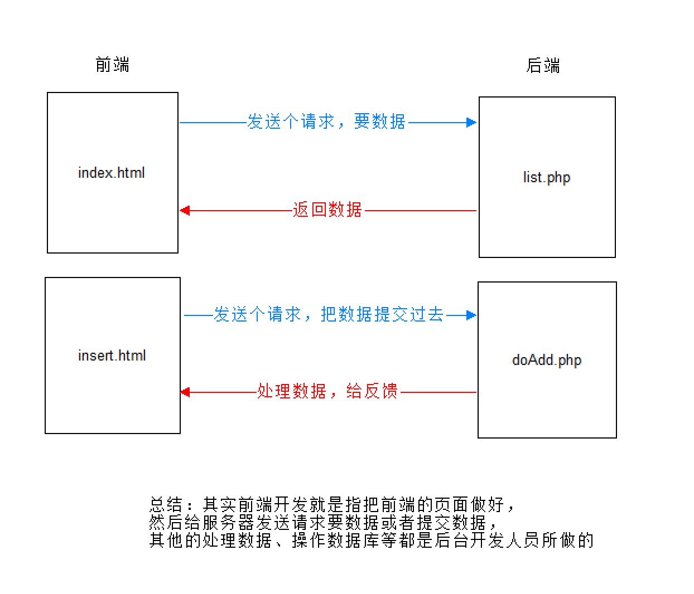

```
如图：左边部分为前端开发人员所做，右边部分为后台人员所做。

可以发现：前端开发主要是做用户直观看到的界面部分，以及跟服务器发请求（请求可以是要数据，也可以是提交数据）。而后端开发主要是处理数据、操作数据库等。
```


### 8. 扩展知识

#### 8.1 通配符-->模糊查询

> `%`为通配符，一般搭配 `like` 关键字使用。

##### 8.1.1 以什么开头

- 查询所有  `字段`  以 `关键字`  开头的数据

```mysql
select * from 表名 where 字段 like '关键字%'; 
```

- 例：

```mysql
-- 查询user表中name以j开头的所有数据
select *from user where name like 'j%';
```

##### 8.1.2 以什么结尾

- 查询所有  `字段`  以 `关键字` 结尾的数据

```mysql
select * from 表名 where 字段 like '%关键字''; 
```

- 例：

```mysql
-- 查询user表中name以y结尾的所有数据
select *from user where name like '%y';
```

##### 8.1.3 包含什么内容

- 查询所有  `字段`  包含 `关键字` 的数据

```mysql
select * from 表名 where 字段 like '%关键字%'; 
```

- 例:

```mysql
-- 查询user表中name中包含o的所有数据
select *from user where name like '%o%';
```


#### 8.2 并且条件

- 使用and关键字，例：

```mysql
-- 查询user表中name为jack，并且age为20的数据
select *from user where name='jack' and age='20'
```


#### 8.3 或者条件

- 使用or关键字，例

```mysql
-- 找到user表中age小于10，或者age大于100的数据
select *from user where age < 10 or age > 100;
```


#### 8.4 连表查询

- 很多时候同一个页面的数据是从多张表取出
- 例如：如果想展示所有用户的信息以及它下的订单商品，就需要找到两张表的数据联合起来。
- 如图：

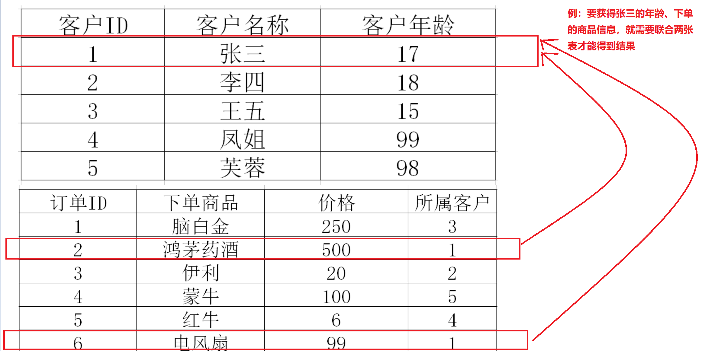


> 我们首先会想到，把两张表一起查，但这样做不会得到正确结果，例：

```mysql
select *from customer ,horder;
```

- 结果如图：

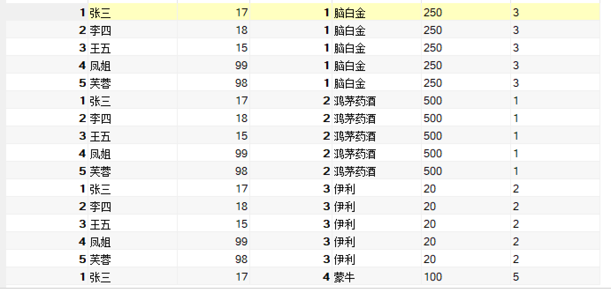

> 这相当于把两表的所有记录都联了一次（这叫交叉连接），如图说明

 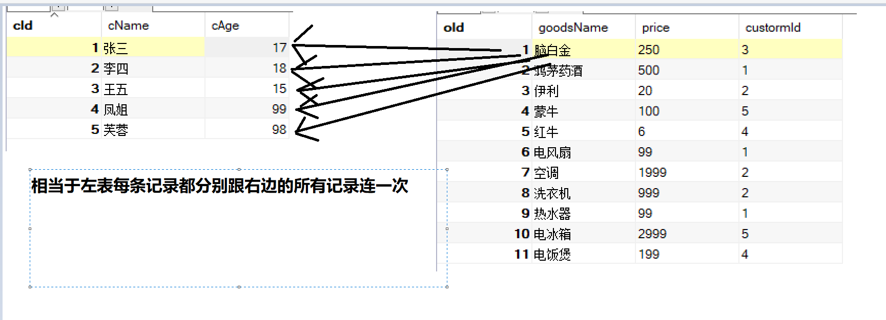

- 如果要起到左表张三，只跟右表属于张三的记录连接起来，我们需要用  `inner join ... on`   关键字
- 语法：

```mysql
select 字段 from 表1 inner join 表2 on 对应关系
```

- 例:

```mysql
-- 找到customer和horder双表结合的结果，只把customer中的cId字段和horder表中custormId字段相等的记录组合在一起
select *from customer inner join horder on customer.cId =  horder.custormId
```

- 如果觉得表名太长，可以给表名起别名，例：

```mysql
select *from customer c inner join horder h on c.cId =  h.custormId
```


#### 8.5 分页查询

- 有时候某张表里有大量数据，而我们只需要查中间的某几条，因此可以用下面的分页查询语句

```mysql
select * from 表名 limit 第几条开始,查几条;
```

- 例：

```mysql
-- 查询person表里第10条到第20条数据（一共查出来10条）
select * from person limit 10,10;
```

> 思考：为什么不直接用id>= 10 and id<20的写法 


#### 8.6 建表SQL语句

```mysql
CREATE TABLE 表名称
(
	列名称1 数据类型,
	列名称2 数据类型,
	列名称3 数据类型,
	....
)
```

注意：**不要记**，知道这是一条建表的语句即可。真正要建表直接用管理工具鼠标点击创建即可。


### 9. 延伸阅读

 [程序员的SQL金典](程序员的SQL金典.pdf) （按ctrl+鼠标左键）