# 表单与服务器交互

学习目标

- 掌握表单写法
- 掌握服务器如何拿到表单提交的数据
- 理解get和post两种请求方式


## 1. 表单与服务器交互初体验


### 1.1 表单介绍

- 表单，即`form`标签
- 它可以包含文本框、复选框、单选框、提交按钮等。
- 作用：向服务器提交一段数据。


### 1.2 表单语法

```html
<form action='地址'>
    <!-- 表单元素列表 -->
    <input type="submit">
</form>
```

> 说明：

- 表单元素列表里可以写文本框、密码框等一切你希望用户输入的数据。
- 一般情况下表单元素列表的最后会写个  `submit`  提交按钮，`submit`  标签不用写任何JS代码就可以在它被点击后把表单里的内容传给服务器。

> 例：

```html
 <!-- action填的是地址，代表提交到哪个服务器页面 -->
<form action="./result.php">
     <!-- 此文本框加了name属性，不加name属性无法把它的数据提交到服务器 -->
     <input type="text" name="star" placeholder="请输入你喜欢的明星！">
     <input type="submit">
</form>
```

> 注意：只有加了name属性的才能提交到服务器


### 1.3 action属性

- 表单数据提交到哪。

> 例： action="./result.php"  即把表单提交到同目录下的 `result.php` 文件


### 1.4 服务端拿到表单提交的数据

#### 1.4.1 超全局变量

- 就是一个默认存在的变量，类似于JS中的window
- 不需要声明，直接可以用

#### 1.4.2 $_GET变量

- 是一个超全局变量
- 能拿到默认情况下表单传递过来的数据

> 语法：

```php
$_GET['key']; 
```

> 例：

```php
$_GET['star']; //拿到表单提交过来的数据中name为star元素的值
```

#### 1.4.3 图解

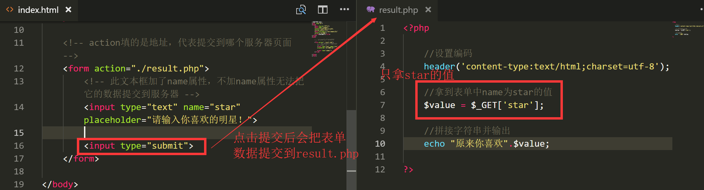


#### 1.4.4 判断数据是否存在


##### 1.4.4.1 写了不存在的key会报错

> 接上例，如果我不小心把  `$_GET`  里的key写错了，写成如下

```php
$_GET['star2'];//提交来的没有name为start2的数据
```

> 引发下图报错

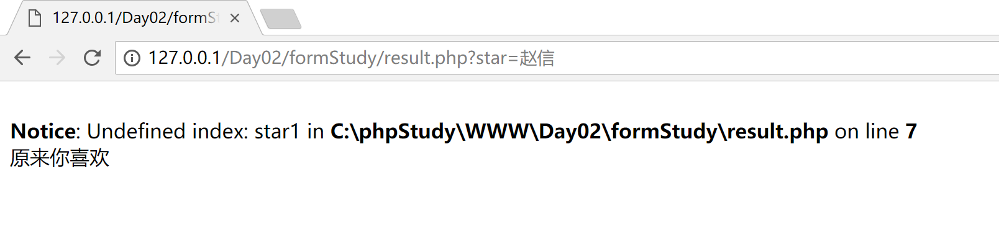


##### 1.4.4.2 isset使用

- isset可以用来判断是否存在某个值

> 语法：

```php
isset(变量);
```

> 例：

```php
isset($_GET['star']);   //判断$_GET中是否有以star为key的值，如果有返回true,如果没有返回false
```

> 修改上例的 `result.php` 代码

```php
<?php

    //设置编码
    header('content-type:text/html;charset=utf-8');

    if(isset($_GET['star'])){

        //取到name为star的值
        $value = $_GET['star'];
    
        //拼接字符串并输出
        echo "原来你喜欢".$value;

    }else{

        echo '数据有误';
    }
?>
```


## 2. 案例1：英雄查询

### 2.1 案例效果：


### 2.2 案例各文件说明


### 2.3 数据和思路分析

- 数据文件  `data_lol_detail.php`  内容和分析如下：

 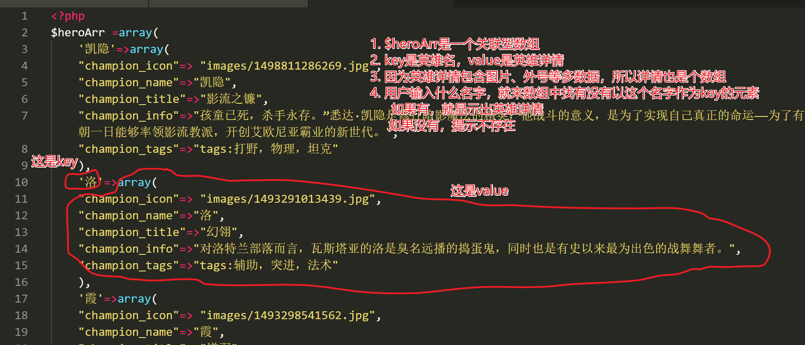


### 2.4 代码实现

- index.html 首页核心代码

```html
<!-- 提交到result.php  -->
<form action="result.php">
     <!-- 输入搜索英雄的文本框  -->
     <input type="text" placeholder="请输入您要查询的英雄" name="hero">
     <input type="submit" value="查询">
</form>
```

> 上面代码，对应下图页面

 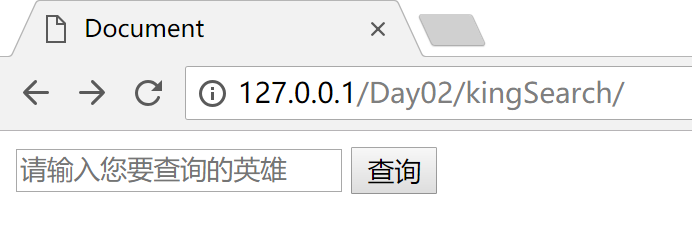

- result.php 核心代码

```php+HTML
   <!-- 导入英雄数据 -->
    <?php include 'data_lol_detail.php'; ?>

    <?php
       //判断输入的英雄名存不存在
       if(isset($heroArr[$_GET['hero']])):
          //如果存在取出数据
          $hero = $heroArr[$_GET['hero']];
    ?>
	<!-- 如果存在，则显示对应图片，和名字，介绍等 -->
    " alt="">
    <h2> <?php echo $hero['champion_name'];?> --- <span> <?php echo $hero['champion_title'] ?> </span> </h2>
    <h4> <?php echo $hero['champion_tags']?> </h4>
    <p> <?php echo $hero['champion_info']?> </p>

    <!-- 如果不存在 -->
    <?php else:?>
        <h3>没找到您输入的英雄，请换个英雄名重试！</h3>
    <?php endif?>
```

> 上面代码，对应查询出结果的详情页面，如下图

 


### 2.5 代码解释

- 先导入数组数据（没有这个数组，一切无从可查）
- 根据用户传递过来的名字，判断这个名字在不在数组中
  - 如果在，则显示对应html标签，并把这些标签的值设置为找到的英雄信息
  - 如果不在，提示没有这个英雄，请换个英雄


## 3.案例2：英雄列表+详情页

### 3.1 表单提交时，网址的变化

- 观察上例，可以看到：每次点击提交查询后，网址会有变化，会在后面多出一部分`?hero=XXX`
- 例：如果我输入**提莫** ，那么会在result.php后面多出  `?hero=提莫`  如图：

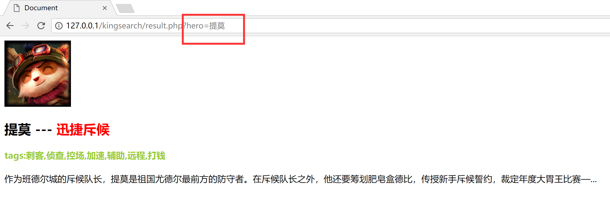

- 根据这个特点，我们可以不用再在表单输入，直接在url里输入网址写对应名字就能出结果。如下图：

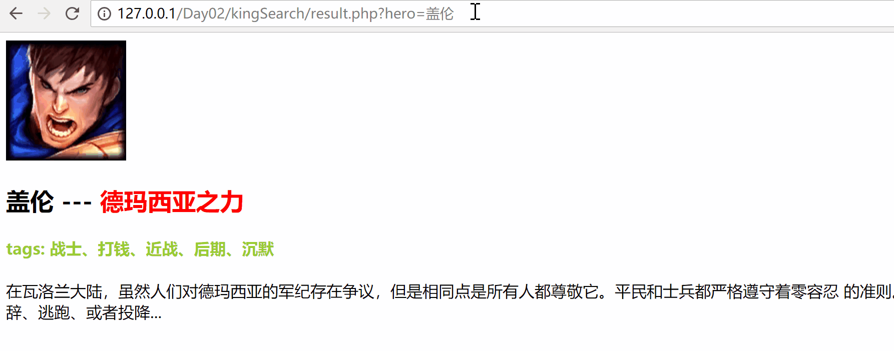

### 3.2 制作英雄列表 + 详情页

- 根据上面发现的特点，我们可以做一个如图功能的列表详情功能，如图


#### 3.2.1 分析思路

> 1. 首页钟每个英雄列表，都是一个div
> 2. 根据数组元素个数生成对应的div
> 3. 点击哪个英雄的  `瞅瞅`  就跳转到对应英雄的详情页，其实就是谁被点，就跳转到  `list.php?name=谁`  的网址

- 因代码太多，不写讲义里，上课讲师带着一步一步完成。
- 本案例完整[点我下载](lolList.rar)：


## 4.get请求和post请求

### 4.1 get请求

#### 4.1.1 get请求介绍

- 以网址的形式把数据提交到服务器，叫get请求

#### 4.1.2 用get请求做登录

- 界面代码如下：

```html
    <!-- 一个账号框，一个密码框，加一个登录按钮,提交到login.php -->
    <form action="login.php">
        <input type="text" name='id' placeholder="请输入账号">
        <input type="password" name='pwd' placeholder="请输入密码">
        <input type="submit" value='登录'>
    </form>
```

- login.php 代码如下：

```php+html
    <?php
      //拿到传递过来的账号和密码
      $id = $_GET['id'];
      $pwd = $_GET['pwd'];
	 //判断账号是否正确
	 if($id=='admin' && $pwd=='123456'):
    ?>
        <!-- 如果正确显示欢迎信息 -->
    	<h3>欢迎登录：<?php echo $id; ?></h3>
    <?php else: ?>
	    <!-- 如果错误 -->
         <h3>账号或密码错误，请重新登录！</h3>
    <?php endif; ?>
```


#### 4.1.3 get请求缺点 

- 网址有大小限制，而get请求就是通过浏览器发送数据，所以get请求不适合发送图片等大数据
- 所有发送的数据都明文显示在网址上，相对不安全，如下图：

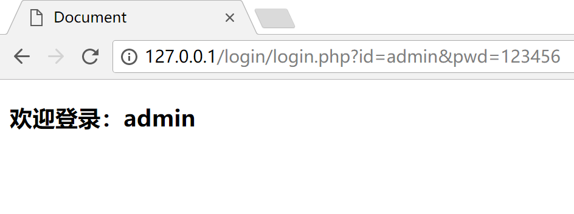

### 4.2 post请求

####4.2.1 post请求介绍

- post请求提交的数据在网址上看不到
- post能更好的提交图片等大数据


- form表单，默认采用的是get请求
- 要用post请求，需要设置

> 给form表单 加method属性，并指定为post，即为post请求

```html
<form action='网址' method='post'>
    
</form>
```

#### 4.2.2 用post请求做登录

- 界面代码如下

```html
	<!-- post请求 -->
    <form action="login.php" method="post">
        <input type="text" name='id' placeholder="请输入账号">
        <input type="password" name='pwd' placeholder="请输入密码">
        <input type="submit" value='登录'>
    </form>
```

- `login.php`  的代码如果暂时不变，再点登录会报错

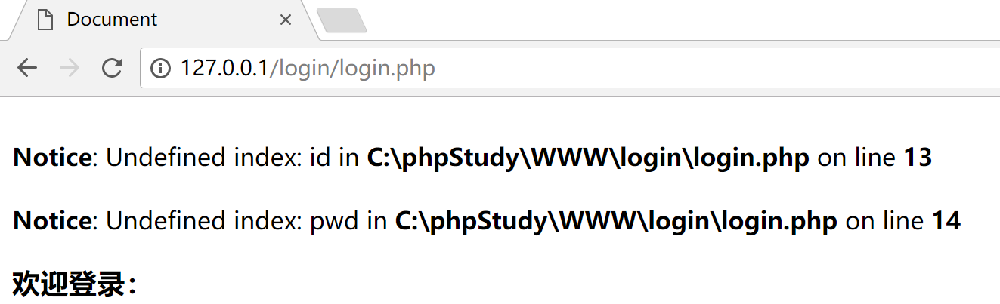


- 原因：
  - 之前浏览器提交过来的数据是get请求的，所以用`$_GET`这个超全局变量
- 用  `$_POST`  可以拿到post请求提交来的数据

`login.php`代码如下

```php+HTML
    <?php
      //拿到传递过来的账号和密码
      $id = $_POST['id'];
      $pwd = $_POST['pwd'];
	 //判断账号是否正确
	 if($id=='admin' && $pwd=='123456'):
    ?>
        <!-- 如果正确显示欢迎信息 -->
    	<h3>欢迎登录：<?php echo $id; ?></h3>
    <?php else: ?>
	    <!-- 如果错误 -->
         <h3>账号或密码错误，请重新登录！</h3>
    <?php endif; ?>
```


### 4.3 get和post总结

#### 4.3.1 相同点和不同点

> 相同点：两种都可以给服务器传递数据，都是通过`form`元素的`method`属性指定，默认是get
>
> 不同点：主要是侧重点不同
>
> ​	get请求侧重获取
>
> ​	post请求侧重提交

####4.3.2 使用建议

```
以后具体用哪种请求传递数据没有规定，get和post请求都会使用。
		例：
			英雄列表案例，用get请求写起来更方便，用post请求反而不太好做
			注册、登录等功能时，用post请求又更好。

   使用上都是具体看自己的需求来决定是get还是post。总之，如果涉及到密码等敏感信息的，决不能用get，并且，要想清楚自己是为了拿东西（get），还是为了送东西（post）。

		注：a标签的跳转，也可以理解为是一种get请求。因为get请求本身就是通过网址的跳转来进行的。像我们之前写的英雄列表案例里瞅瞅就是一个a标签，我们通过点击a标签的跳转，发起了get请求去获得结果。
```


## 5. 上传文件

> 在一些网站里，经常会看到一些选择文件上传的功能，例如上传附件、上传头像等。那怎样实现？

### 5.1 表单元素file

- 专门用来做上传的html标签

```html
<input type="file">
```

> 思考：我们上传文件，应该用get请求还是post请求？


### 5.2 使用post请求提交上传的文件

> 为什么用post请求

- post请求一般是给服务器提交数据，侧重于提交。上传文件就是要给服务器送数据
- get请求有长度限制，不适合传过大文件

### 5.3 上传初体验

- 界面代码如下：

```html
<!-- 表单里仅仅一个文件上传元素，提交到file.php -->
<form action="file.php" method='post' enctype='multipart/form-data'>
    <input type="file" name='icon'>
    <input type="submit">
</form>
```

> 注意：如果要上传文件，必须给form表单添加`enctype='multipart/form-data'`属性，否则无效


#### 5.3.1 $_FILES

- `$_POST`  此时取不到上传的文件，只能取到文件名。
- 要取文件，要用  `$_FILES`
- 代码如下：

```php
var_dump($_FILES); //打印看$_FILES里有什么
```

- 打印信息如下

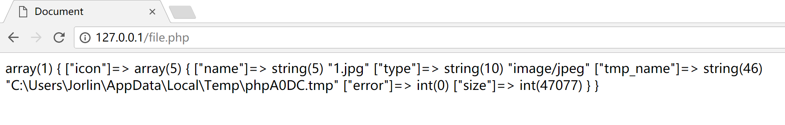

> 结论： `$_FILES`  也是一个关联型数组，这个数组下面 icon 对应的value又是一个关联型数组
>
> 几个key对应值的说明：
>
> ​		1.name：保存的是文件名
>
> ​		2.type：保存的是文件类型
>
> ​		3.tmp_name：保存的是客户端上传来的文件临时保存的路径
>
> ​		4.error：错误信息代码
>
> ​		5.size：文件大小


在这个数组中，我们最需要关注的是`tmp_name` 这个键里保存的临时目录，客户端上传文件提交到服务器后，是上传到服务器的**临时文件夹**，如果服务器不做任何处理，那么这个上传的文件会很快被系统**自动删掉**。

因此，如果我们要正确接收到客户端上传的文件，还必须想办法把这个文件移出临时文件夹！

#### 5.3.2 文件移动函数

```php
move_uploaded_file(文件原路径、目标路径);
```

> 参数1：代表要找到被移动的文件
>
> 参数2：代表把这个文件移动到哪
>
> 如果移动成功，返回值会为true，如果移动失败，返回值会为false

- 代码如下：

```php+HTML
<?php
         var_dump($_FILES);
		//参数1：移动哪个文件
		//参数2：移动到哪
         $success = move_uploaded_file($_FILES['icon']['tmp_name'],'./upload/'.$_FILES['icon']['name']);

         if($success):
            echo '上传成功！';
         else:
            echo '上传失败';
         endif;
?>
```


## 6. 文件操作

### 6.1 写入文件

- 如果需要把一段数据写入到文件，可以用  `file_put_contents`  函数
- 用法：

```php
file_put_contents(要写入的文件路径,文件的内容);
```

- 例：

```php
//这代表在C盘的123目录写入一个1.txt文件，这个文件的内容是abcd
file_put_contents('c:\123\1.txt',"abcd");
```

- 上面用的是绝对路径，也可以用相对路径，例：

```php
//写到当前目录的1.txt文件
file_put_contents('1.txt',"abcd");
```


### 6.2 读取文件内容

用法：

```php
//会把这个文件里的内容读取出来以返回值形式返回。
file_get_contents(文件路径);
```

例：

```php
//代表读取出1.txt中的内容，存到$content变量里
$content = file_get_contents('c:\123\1.txt');
```


### 6.3 判断文件是否存在

用法：

```php
//如果文件存在，则返回true,否则返回false
file_exists(文件路径);
```


## 7. 注册&登录功能简单体验

> 写一套注册账号、登录账号功能的案例

### 7.1 注册的实现逻辑

```markdown
在一个网站注册一个账号，就相当于一个消费在一个商家办一张会员卡一样。

需要把你的相关资料告诉给商家，例如名字、生日等。

然后商家把你的这些资料存起来，等用户下次要来店面时可以比对身份再判断让不让你享受会员价。

因此，注册账号的逻辑是：用户输入想注册的账号和密码，提交给 服务器 ，然后服务器把账号和密码存起来，方便下次验证身份。
```

### 7.2 注册界面和注册功能

- 效果如图：

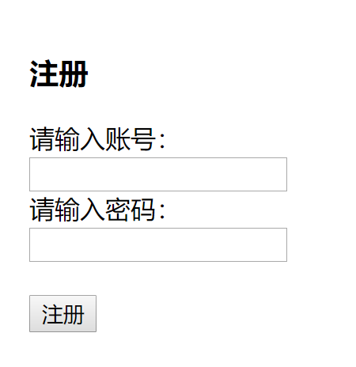

> 整个注册界面就只是一张表单，用来让用户填写想注册的账号和密码

- 新建  `register.html`  文件，核心代码如下：

```html
    <form action="write.php" method="POST">
        <h3>注册</h3>
        <label for="">请输入账号：</label>
        <input type="text" name="id">
        <br>
        <label for="">请输入密码：</label>
        <input type="password" name="pwd">
        <br>
        <br>
        <input type="submit" value="注册">
    </form>
```

- 用户点击注册后，会把账号密码发送到  `write.php`  这个文件。
- 新建  `write.php`  文件，用来处理用户注册的信息
- 代码如下：

```php
//获取传递过来的账号和密码
$id = $_POST['id'];
$pwd = $_POST['pwd'];

//把账号当文件名写入到data目录里，把密码当文件的内容
file_put_contents('./data/'.$id.'.txt',$pwd);

echo '<h2>注册成功！</h2>';

echo '<a href="login.html">点我去登录</a>';
```


### 7.3 登录的逻辑

```
登录就好比用户来商家消费了，先给商家报名字和密码，然后商家查询自己的小本子里看有没有这个记录，有的话，就让他进入消费。

因此，登录的逻辑是：用户输入之前注册好的账号和密码提交给服务器,然后服务器再查询自己记录的数据里，有没有这条数据，如果有，登录成功，如果没有，登录失败。
```


### 7.4 登录界面和登录功能

- 新建  `login.html`  文件，用来让用户登录。代码如下：

```html
<form action="read.php" method="POST">
    <h3>登录</h3>
    <label for="">请输入账号：</label>
    <input type="text" name="id">
    <br>
    <label for="">请输入密码：</label>
    <input type="password" name="pwd">
    <br>
    <br>
    <input type="submit" value="登录">
</form>
```

- 当点击登录后，会把数据提交到  `read.php`  文件。
- 新建  `read.php`  文件，代码如下

```php
   <?php
    	//获取用户输入的账号和密码
        $id = $_POST['id'];
        $pwd = $_POST['pwd'];
	    //判断文件是否存在
        $res = file_exists('./data/'.$id.'.txt');

        if($res):
		 //如果有这个文件，证明包含这个账号，取出文件里的内容
          $filePWD = file_get_contents('./data/'.$id.'.txt');
          //跟用户输入的密码进行比对，如果相等证明登录成功
          if($filePWD == $pwd):
            echo '登录成功!';
          else:
            echo '密码错误';
          endif;
	   //如果文件名不存在，代表没有这个账号
        else:
            echo '账号不存在';
        endif;
    ?>
```


## 7.扩展知识

### 7.1 $_REQUEST

- 这也是一个超全局变量
- 无论是用  `get`  还是  `post`  提交过来的数据，都可以用  `$_REQUEST`  拿到
- 用法

```php
$_REQUEST['name'];
```

- 例:

```php
$_REQUEST['id'];
```


### 7.2 网络基础知识

#### 7.2.1 IP 地址

> Internet Protocol Address

- 设备（计算机、手机等）在网络中的地址，要想精准的从网络上连接某台设备，靠的就是IP地址。
- 目前最常见的格式（IPV4）：`[0-255].[0-255].[0-255].[0-255]` 即为四组 0-255 数字组成的组合。 例：119.75.213.61
- 访问网页本质上也是通过IP地址访问的。例：访问百度可以直接输入  `119.75.213.61`  访问
- 特殊IP：127.0.0.1  是本地地址。


#### 7.2.2 域名 

- 因为IP地址是一堆无规律的数字，不方便记忆，因此，计算机中出现了域名这样的东西。相当于给IP地址起一个别名。
- 例：119.75.213.61 的别名（域名）是  www.baidu.com


#### 7.2.3 DNS

> 网络中只有靠IP地址才能找到另一台计算机。那么我们怎么又能通过域名找到计算机了呢？

- 在通过域名访问到网站之前会先经过**DNS服务器**


- DNS服务器：负责把域名解析成IP地址，然后再访问这个IP对应的网站
- 如图：

 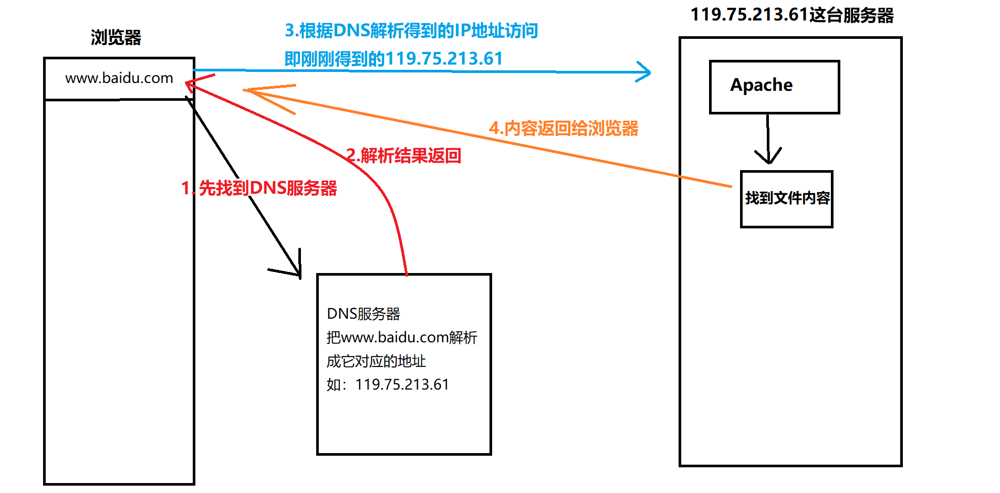


> 所以有的时候，电脑能上QQ，不能打开网页，那可能是DNS服务器出问题了
>
> 因为QQ是通过IP直连不经过DNS服务器，而网页是输入域名的，要先找到DNS服务器解析。
>
> DNS服务器不用自行设置，网络服务提供商会自动给指派。


#### 7.2.4 端口

- 服务器可以理解为一台封闭的大厦，端口相当于这个大厦开的门
- 可以指定0-65535之间的任意一个数字作为端口，每一个端口对应服务器中的一个门，通过门可以访问到门后的服务
- 网站端口默认是80


#### 7.2.5 host文件

- 本地的域名 -> IP的对应文件，这个文件可以自行指定某个域名与IP的对应。
- 文件内容

 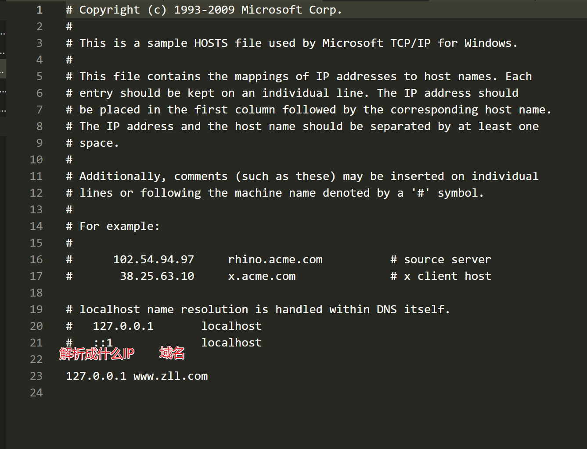

- DNS解析顺序
  - 先找到本机的host文件，看host文件里是否记录有这个域名对应的IP，如果有，就直接通过host记录的ip地址去访问
  - 如果host文件里没有记录，再去DNS服务器解析域名
- 如图：

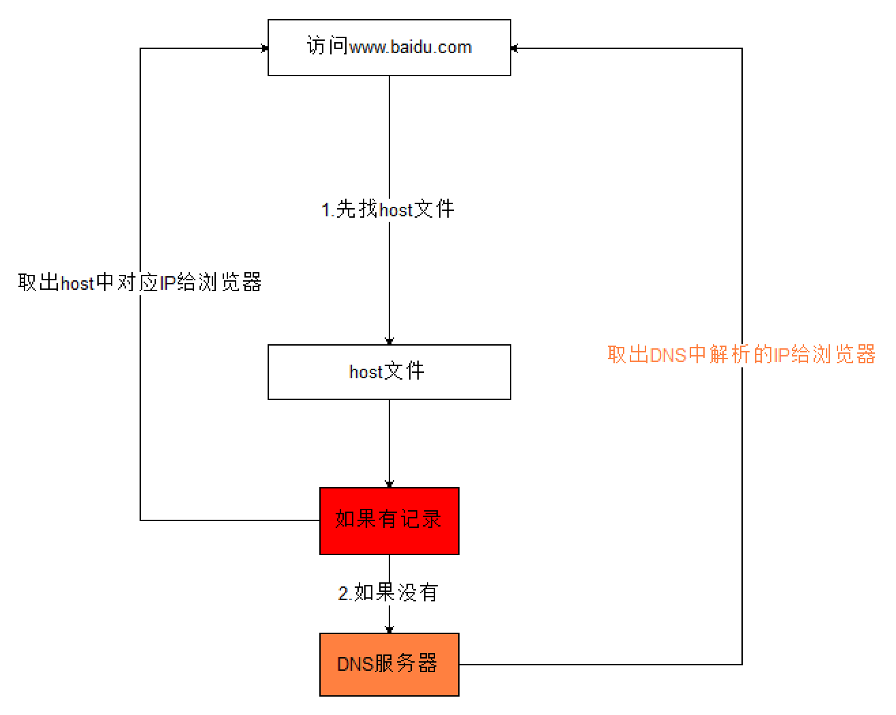

- host文件位置
  - windows：  `C:\Windows\System32\drivers\etc\hosts`
  - mac：  `/etc/hosts`

