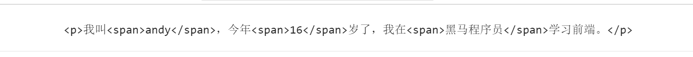
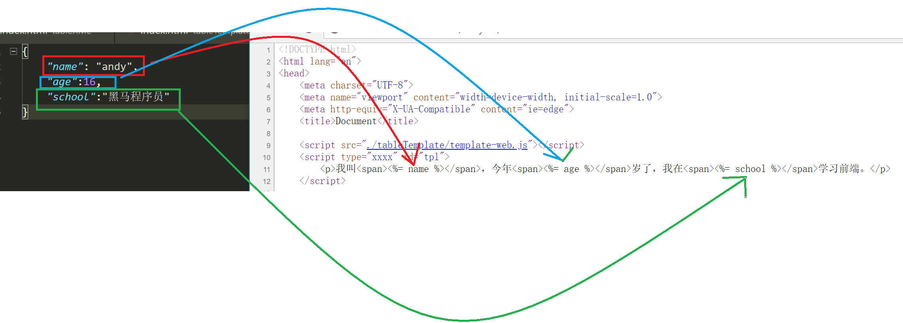
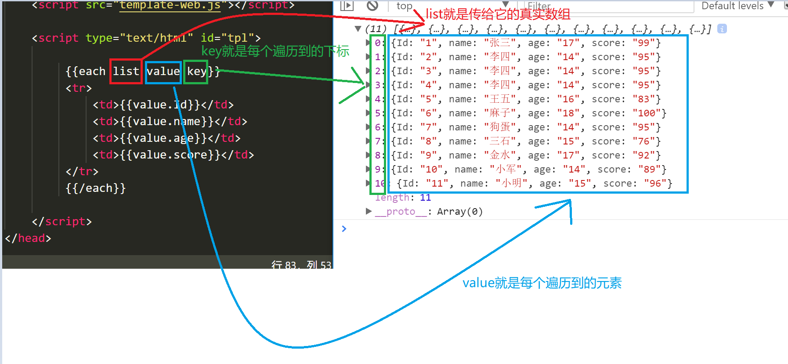
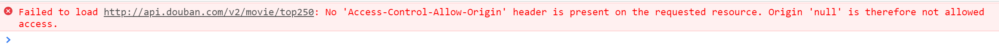
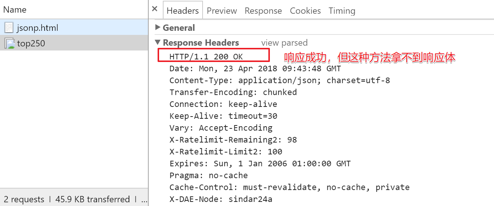
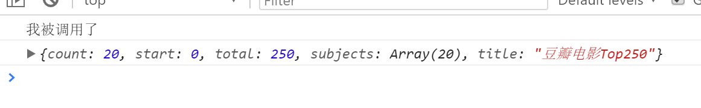
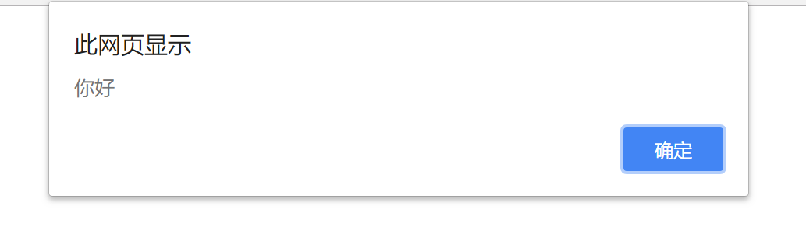
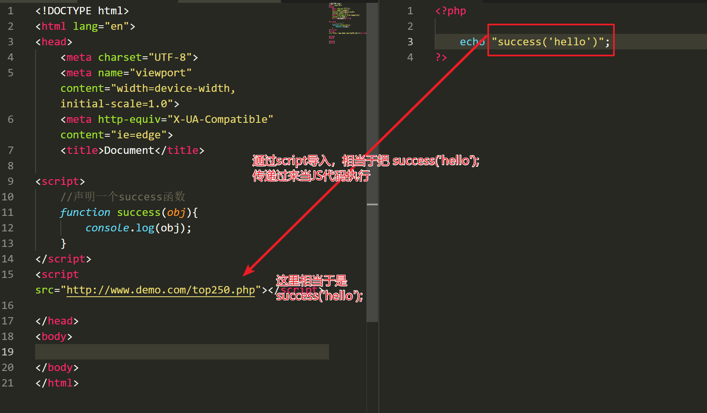
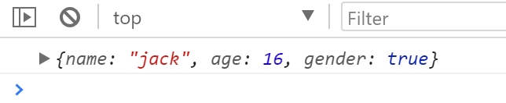

# 模板引擎、同源&跨域


## 1. JSON模板引擎--artTemplate

- 我们之前做的ajax请求数据，需要自己拼接字符串加到table里，比较麻烦
- 我们用模板引擎可以省却自己拼接字符串的过程

> 简介：其实就是预先写好html结构代码，然后调用模板引擎第三方库，会自动把数据填充到这个html里
>
> 我们这里用artTemplate这款模板框架，下载地址：https://aui.github.io/art-template/zh-cn/docs/installation.html


### 1.1 基本使用


#### 1.1.1 准备一个模板


```html
    <script type="xxxx" id="tpl">
        <p>我叫<span><%= name %></span>，今年<span><%= age %></span>岁了，我在<span><%= school %></span>学习前端。</p>
    </script>
```

- 说明：
  - 要用script标签，必须给type属性，但是值可以随便写，只要不是  `text/javascript`  就可以
  - 必须要给这个script标签加  `id`  ，因为后面需要找到标签内的模板
  - 模板里就是未来想显示的html代码，只是里面有些值不能写死，要根据json数据来填充，所以把不写死的数据用  `<%= 属性名 %>`  包起来

#### 1.1.2 导入框架

```html
 <script src="./template-web.js"></script>
```

#### 1.1.3 填充模板

```js
//JSON字符串转化为对象
var obj = JSON.parse(xhr.responseText);

//找到tpl，并用obj对象填充,填充后的结果是一段html代码
var html = template('tpl',obj);

//打印看结果
console.log(html);
```

打印结果为：



- 可以看到，当用了模板引擎后，会自动把JSON对应的属性值，填充到模板中同样属性名的地方，如下图



### 1.2 用模板填充JSON数组


#### 1.2.1 准备模板


```html
    <script type="text/html" id="tpl">
        <!-- list是我们自己起的虚拟数组名
            到时json数据一拿到，把json数组赋值给这个list
            就能自动把JSON数组每条数据都遍历成tr显示了
         -->
        <% for(var i = 0;i < list.length; i++){ %>

            <tr>
                <td><%= list[i]['Id'] %></td>
                <td><%= list[i]['name'] %></td>
                <td><%= list[i]['age'] %></td>
                <td><%= list[i]['score'] %></td>
            </tr>
        <% } %>
    </script>
```

- 说明：list这个名字可以随便起，用模板填充时，把真实JSON数组传递给list就可以填充了
- ​

#### 1.2.2 导入框架（跟基本使用一样，略）


#### 1.2.3 填充模板

```js
var data = JSON.parse(xhr.responseText);
//参数2：list:data  意思是把data这个真实的JSON数组替换掉模板里的list值
var html = template('tpl', { list: data });

document.querySelector('tbody').innerHTML = html;
```

- 注意：模板里的数组叫list,那么参数2也叫list，要注意别写错。


### 1.3 使用框架内置的遍历语法


#### 1.3.1 语法：

```js
{{each list value key}}
```

- 说明：
  - list是自己定义的虚拟数组或对象，使用模板时用真实JSON数组或对象替换
  - 如果list是对象，那么value就是属性值，如果list是数组，那么value得到的就是元素
  - 如果list是对象，那么key就是属性名，如果list是数组，那么key就是下标

例：

```html
    <script type="text/html" id="tpl">
     
         {{each list value key}}
         <tr>
             <td>{{value.Id}}</td>
             <td>{{value.name}}</td>
             <td>{{value.age}}</td>
             <td>{{value.score}}</td>
         </tr>
         {{/each}}
 
    </script>
```


#### 1.3.2 调用模板


```js
//把报文转换为JSON数组
var data = JSON.parse(xhr.responseText);
//使用模板替换
var html = template('tpl', { list: data });
//替换后的内容放到网页
document.querySelector('tbody').innerHTML = html;
```


#### 1.3.3 图解：





## 2. 同源&跨域

### 2.1 名词解释

- 同源：
  - 协议头、域名、端口完全一致就叫同源
- 跨域：
  - 协议头、域名、端口有一个不一样就叫跨域
- 判断是否同源，如下：

如：http://www.example.com/detail.html 与以下地址对比

| 对比地址                                 | 是否同源 | 原因           |
| ---------------------------------------- | -------- | -------------- |
| http://api.example.com/detail.html       | 不同源   | 域名不同       |
| https://www.example.com/detail.html      | 不同源   | 协议不同       |
| http://www.example.com:8080/detail.html  | 不同源   | 端口不同       |
| http://api.example.com:8080/detail.html  | 不同源   | 域名、端口不同 |
| https://api.example.com/detail.html      | 不同源   | 协议、域名不同 |
| https://www.example.com:8080/detail.html | 不同源   | 端口、协议不同 |
| http://www.example.com/other.html        | 同源     | 只是目录不同   |

### 2.2 跨域的影响


- 注：根据同源和跨域的意思，以后讲  `跨域`  就是指  `不同源`
- 如果要在  `localhost/test.html`  这个网站上访问  `http://api.douban.com/v2/movie/top250` 这个接口，那么浏览器会出现以下错误：



> 原因：浏览器本身从安全角度考虑，不支持**跨域**访问


## 3. JSONP


### 3.1 研究如何突破跨域请求限制


#### 3.1.1 使用img标签（拿不到响应体）


- 我们知道：`img` 标签，有个 `href` 属性，这个属性其实也是向服务器发送请求，我们看看这种方式是否可以跨越访问，代码如下：

```html

```

- 此时可以看到能正确收到响应，但拿不到响应体（返回的JSON数据），如图：




#### 3.1.2 使用link标签（拿不到响应体）

- `link` 标签，有个  `src`  属性，我们以前是用来外联css样式，其实它也是相当于发送请求

```html
 <link rel="stylesheet" src="http://api.douban.com/v2/movie/top250">
```

- 看浏览器响应报文，可以发现link标签也可以跨域请求，但是一样，没办法拿到响应体


#### 3.1.3 使用script标签（曲线拿到响应体）

- 代码如下：

```html
<script>
    function test(json) {
        console.log('我被调用了');
        console.log(json);
    }
</script>
<script src="http://api.douban.com/v2/movie/top250?callback=test"></script>
```

- 结果如下图



> 说明：我们可以看到，我们预先定义了一个函数叫test，再然后在src里加了一个参数callback=test，可以发现，当请求完成，会自动调用test这个函数，并且把响应体（JSON数据）当做参数传递过来


### 3.2 使用script标签拿到JSON数据详解


#### 3.2.1 script导入外部文件作用

- 使用script导入外部文件时，默认会把文件内容当JS代码执行，例：
- 新建  `1.txt` 文件，文件内容如下：

```js
alert('你好');
```

- 新建  `index.html`  文件，核心代码如下：

```html
<script src="1.txt"></script>
```

- 结果：

 

> 结论：script导入文件会默认把文件内容当JS代码执行，跟文件格式无关


#### 3.2.2 script标签曲线拿到响应体原理


- 新建  `index.html`  页面，代码如下

```html
<script>
    //声明一个success函数
    function success(obj){
        console.log(obj);
    }
</script>
<!-- script导入文件 -->
<script src="http://www.demo.com/top250.php"></script>
```

- 新建  `top250.php` 页面，代码如下

```php
echo "success('hello')";
```

- 结果

 


> 说明：请求的top250文件里，服务器最终返回的是 success('hello'); 这个当JS代码执行时，是调用函数并传递参数hello的语法，因此可以看到success函数被调用，并且打印了参数hello

- 图解：




> 思考：如果在上例中，把success函数的参数换成json对象，会怎样？

- 修改 `top250.php`  代码，如下:

```php
    $data = array('name' => 'jack','age'=>16,'gender'=>'true' );

    $json = json_encode($data);

    echo "success({$json})"; 
```

- 再次访问网页可以发现，打印的参数就编程了json对象

 


>  结论：script标签拿到JSON数据的原理就是在服务器端写 **调用浏览器端函数的语法** ，然后把JSON数据当参数传递过去


> 思考：现在服务端代码这么写，如果要解决跨域问题，是不是每个浏览器端都要准备一个名叫success的函数？能让浏览器端自己指定吗？怎么指定？


- 请求数据时加参数，修改  `index.html`

```html
<script>
    //声明函数
    function myFunc(obj){
        console.log(obj);
    }
</script>

<!-- 请求数据，并加入callback参数，值为myFunc -->
<script src="http://www.demo.com/top250.php?callback=myFunc"></script>
```

- 此时，除了请求  `top250.php` 外，还传递了个  `callback`  的参数过去，修改  `top250.php`，拿到这个参数

```php
<?php

    //拿到传递过来的参数，即函数名
    $funcName = $_GET['callback'];

    //准备数据
    $data = array('name' => 'jack','age'=>16,'gender'=>true );

    //转化为JSON
    $json = json_encode($data);

    //传过来的是什么函数名，就调用什么函数
    echo "$funcName($json)"; 
?>
```

> 结果：此时就完成了指定函数名让服务器调用传参的效果了。
>
> 这就是之前  `跨域`  拿豆瓣数据的原理，即服务器端调用浏览器端的函数，把参数传递过来即可


### 3.3 JSONP概念总结


- **JSONP**：

  - **JSON** with **P**adding，是一种借助于 `script` 标签发送跨域请求的技巧方案。

- 它不是一套新技术，只是聪明的程序员想出的一套方案

- 能不能用这套方案，要看服务器端代码怎么写，服务器端如果写了调用函数的代码，那么就能支持JSONP方案

- 以后服务器的接口会有接口文档进行说明是否支持  **JSONP**

- 建议：不要随意使用别人的接口，特别是别人写的支持jsonp的接口

  例:https://developers.douban.com/wiki/?title=api_v2

  

## 4. CORS

- Cross Origin Resource Share，跨域资源共享
- 直接从服务器端解决ajax无法跨域访问的问题（可以不要用jsonp了）

```php
// 允许远端访问
header('Access-Control-Allow-Origin: *');
```

>  这种方案无需客户端作出任何变化（客户端不用改代码），只是在服务端添加一个 `Access-Control-Allow-Origin` 的响应头，表示这个资源是否允许指定域请求（*代表任何网站都可以访问）。

