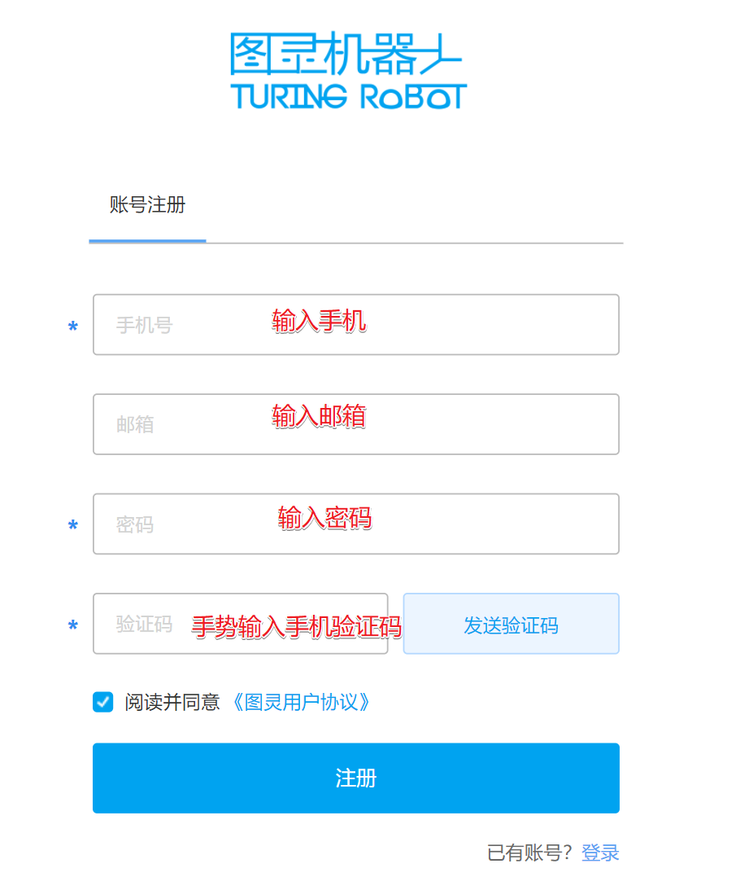
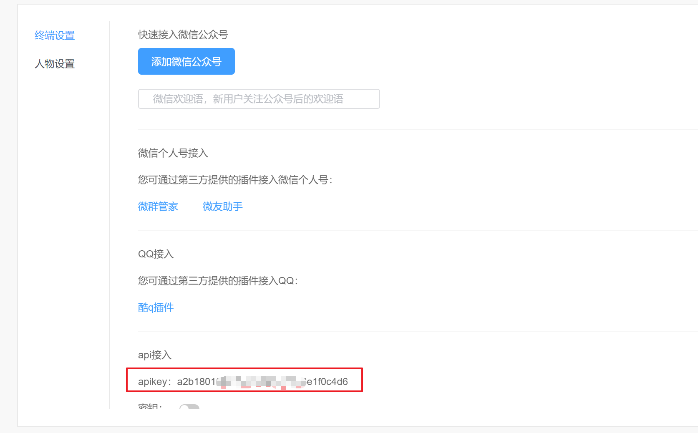
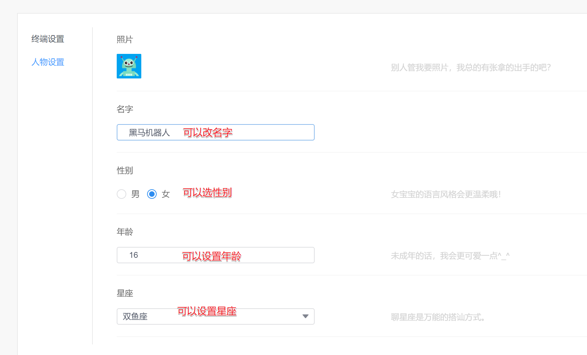

# 聊天机器人、天气预报案例

## 学习目标：

- 通过案例掌握接口开发
- 通过案例能理解前端开发主要是请求后台api，拿到数据填充界面


## 一、 聊天机器人

效果如图：

 


### 1. 搭建界面

- 界面主要是一个div，div里是一个ul，ul就是聊天面板，每条消息（不管是机器人的还是用户的）都是一个li标签。（CSS部分略，讲师可课堂带同学分析样式）
- CSS和HTML代码如下：

```html
<!DOCTYPE html>
<html lang="en">
<head>
    <meta charset="UTF-8">
    <meta name="viewport" content="width=device-width, initial-scale=1.0">
    <meta http-equiv="X-UA-Compatible" content="ie=edge">
    <title>Document</title>

    <style>
        .chatBox{
            width: 400px;
            border: 1px solid gainsboro;
            margin: 50px auto;
        }

        .container{
            width: 100%;
            height: 550px;
            background-color: #fff;
            padding: 0;
            list-style: none;
            overflow: auto;
        }

        .sendBox{
            width: 100%;
            text-align: center;
            padding: 10px;
        }

        .robot{
            margin-top: 15px;
            text-align: left;
        }

        .chat-icon{
            width: 40px;
            height: 40px;
            display:inline-block;
            border-radius: 20px;
        }

        .robot .text{
            border-radius: 8px;
            background-color: #f4f7f9;
            margin-left: 10px;
            max-width: 210px;
            line-height: 20px;
            word-break: break-all;
            word-wrap: break-word;
            display: inline-block;
            padding: 5px 0px 5px 5px;
        }

        .chat-icon{
            background: url('images/robot.png') 0% 0% / 100% 100% no-repeat;
        }

        .user{
            margin-top: 15px;
            text-align: right;
        }
        .user p{
            border-radius: 8px;
            background-color: #f4f7f9;
            margin-right: 10px;
            max-width: 210px;
            line-height: 20px;
            word-break: break-all;
            word-wrap: break-word;
            display: inline-block;
            padding: 5px;
            background-color:yellowgreen; 
        }
    </style>
</head>
<body>
    <div class="chatBox">

        <!-- 聊天记录区域 -->
        <ul class="container">
            <li class="robot">
                    <span class="chat-icon"></span>
                    <p class="text">我是黑马机器人，小主人，快来聊天吧！</p>
            </li>

            <!-- <li class="user">
                <p>你好！</p>
            </li> -->
        </ul>

        <!-- 输入文字区域 -->
        <div class="sendBox">
            <input type="text" id="msg">
            <input type="button" value="发送" id="send">
        </div>
    </div>
</body>
</html>
```

### 2. 准备机器人

- 核心思路：当用户点击发送后，需要根据用户输入的内容，提交到服务器，然后由服务器根据你输入的内容，返回对应的结果，我们拿到结果展示到界面上当做机器人的回答即可。
- 这个服务器端的代码，已经有团队写好了，并且只要你按照它的规则请求，即可使用完成某种功能，像这样的，我们一般也把它叫做  `接口`  或  `API`
- 提供这个接口的网站是：`http://www.tuling123.com`

#### 2.1 注册账号

​	点击界面右上方注册

 

 

#### 2.2 创建机器人

- 登录后，会看到如下界面，点击  `创建机器人`


- 然后按下图填写

 


- 点创建后，会在机器人管理里看到下图


#### 2.4 设置机器人

- 我们可以对机器人继续一些个性化设置，机器人管理界面点设置


- 我们可以看到  `终端设置`  下有个  `apikey` ，这个key在写代码时要复制好，因为我们如果要用机器人功能，必须用这个key



- 然后点  `人物设置`  这里可以给机器人做一些个性设置




### 3. 实现代码

- 找到  `聊天面板`  （为了后面给它加聊天记录），以及给  `发送按钮`  加点击事件

```js
// 找到聊天面板
var container = document.getElementsByClassName('container')[0];
// 发送按钮的点击事件
document.getElementById('send').onclick = function(){
    
}
```

#### 3.1 把用户输入的内容显示到界面上

-  在上面的点击事件里面，取到用户输入的内容，并把它当聊天内容展示到界面上，代码如下

```js
 // 1. 找到输入的文本框
 var msgTxt = document.getElementById('msg');
 // 2. 获取文本框中的内容
 var userMsg = msgTxt.value;
 // 3. 清空文本框内容
 msgTxt.value = "";
 // 4. 创建自己的li标签
 var myLi = document.createElement('li');
 // 5. 设置类名
 myLi.className = "user";
 // 6. 设置内容
 myLi.innerHTML = "<p>"+ userMsg +"</p>";

 // 7. 把自己这部分聊天加到面板
 container.appendChild(myLi);
```

- 到此，实现了用户输入什么，界面就显示什么


#### 3.2 根据用户输入内容发请求到服务器，拿到机器人回答

- 核心步骤：
  - 创建异步请求对象(xhr)
  - 设置请求行（请求到接口地址，用post请求）
  - 设置请求头（POST请求要设置）
  - 发送请求主体（请求体里要包含刚刚我们获取的   `apikey`  以及用户输入的内容）
  - 监听响应完成，拿到服务器返回的内容，显示到界面上

代码如下：

```js
// 1.创建请求对象
var xhr = new XMLHttpRequest();
// 2.设置请求行(get请求数据写在url后面)
xhr.open('POST','http://www.tuling123.com/openapi/api');
// 3.设置请求头(post请求要加)
xhr.setRequestHeader("Content-type","application/x-www-form-urlencoded");

// 4.请求主体发送 包含apikey和用户发送的聊天内容
xhr.send('key=a2b18016f0e44d12abc672c6e1f0c4d6&userid=123&info='+userMsg);
//5.监听响应完成
xhr.onload = function(){
    
    //5.1 得到返回结果
    var data = JSON.parse(xhr.responseText);
    
    //5.2 创建机器人的聊天框
    var robotLi = document.createElement('li');
    //5.3 设置类
    robotLi.className = "robot";
    //5.4 设置内容
    robotLi.innerHTML = '<span class="chat-icon"></span><p class="text">' + data.text + '</p>';
    //5.6 添加到页面上
    container.appendChild(robotLi);
}
```


#### 3.3 发送内容后自动滚到聊天框最下

- 虽然此时完成了机器人应答，但是如果内容一多，没有自动滚动到最后，因此，我们需要写代码，让聊天面板滚动到最下，看最新消息，代码如下:

```js
// 计算container内容总高度
var height = 0;
for(var i = 0; i < container.children.length;i++){
	height += container.children[i].offsetHeight;
}

// 聊天面板滚到最下
container.scrollTop = height;
```

## 二、天气查询


### 1. 搭建界面

- 界面主要是一个输入框、一个按钮、一个ul（ul里放5个li标签，li标签显示五日天气）

代码如下：

```html
<!DOCTYPE html>
<html lang="en">

<head>
    <meta charset="UTF-8">
    <title>Document</title>
    <style>
        * {
            margin: 0;
            padding: 0;
        }

        ul,
        li {
            list-style: none;
        }

        div {
            margin-top: 20px;
            width: 1366px;
        }

        ul {
            margin-top: 10px;
            padding-top: 50px;
            border: 2px solid #ddd;
            height: 200px;
        }

        li {
            text-align: center;
            width: 180px;
            background-color: #ccc;
            margin-left: 12px;
            float: left;
            padding: 15px 0;
        }
    </style>
</head>

<body>
    <input type="text" id="city">
    <button id="btn">查询天气</button>

    <div>
        <p id="cityname">城市名称：</p>
        <ul id="weather">
            <li>
                <p class="date">20日星期五</p>
                <p class="high">高温 25℃</p>
                <p class="low">低温 14℃</p>
            </li>
            <li>
                <p class="date">日期</p>
                <p class="high">高温 25℃</p>
                <p class="low">低温 14℃</p>
            </li>
            <li>
                <p class="date">日期</p>
                <p class="high">高温 25℃</p>
                <p class="low">低温 14℃</p>
            </li>
            <li>
                <p class="date">日期</p>
                <p class="high">高温 25℃</p>
                <p class="low">低温 14℃</p>
            </li>
            <li>
                <p class="date">日期</p>
                <p class="high">高温 25℃</p>
                <p class="low">低温 14℃</p>
            </li>
        </ul>
    </div>
</body>
</html>
```

### 2. 代码实现

- 思路分析：
  - 找出所有要用到的元素：
    - 文本框（拿到输入的城市）
    - 按钮（点击事件）
    - 所有显示日期的p标签
    - 所有显示最高温的p标签
    - 所有显示最低温的p标签
  - 给按钮加点击事件，点击事件做如下事：
    - 取到输入的城市
    - 发送ajax请求
    - 取到5日数据，把数据填充到各个p标签
- 代码如下：

```js
var txt = document.getElementById('city');
//找到所有显示日期的p标签
var dateList = document.getElementsByClassName('date');
//找到所有显示最高温的p标签
var highList = document.getElementsByClassName('high');
//找到所有显示最低温的p标签
var lowList = document.getElementsByClassName('low');

//查询的点击事件
document.getElementById('btn').onclick = function () {
    //取到输入的城市
    var city = txt.value;
    var xhr = new XMLHttpRequest();
    xhr.open('get', 'http://wthrcdn.etouch.cn/WeatherApi?city=' + city);
    xhr.send();
    xhr.onload = function () {
        //找到近五日数据
        var weatherList = xhr.responseXML.getElementsByTagName('weather');
        //遍历五日数据
        for (var i = 0; i < weatherList.length; i++) {
            //得到日期
            var date = weatherList[i].getElementsByTagName('date')[0];
            //得到最高温
            var high = weatherList[i].getElementsByTagName('high')[0];
            //得到最低温
            var low = weatherList[i].getElementsByTagName('low')[0];
            
            //赋值给对应的p标签
            dateList[i].innerHTML = date.innerHTML;
            highList[i].innerHTML = high.innerHTML;
            lowList[i].innerHTML = low.innerHTML;
        }
    }
}
```


