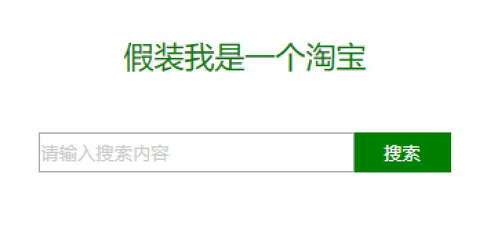
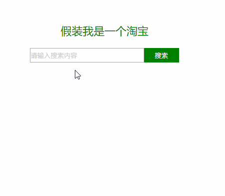
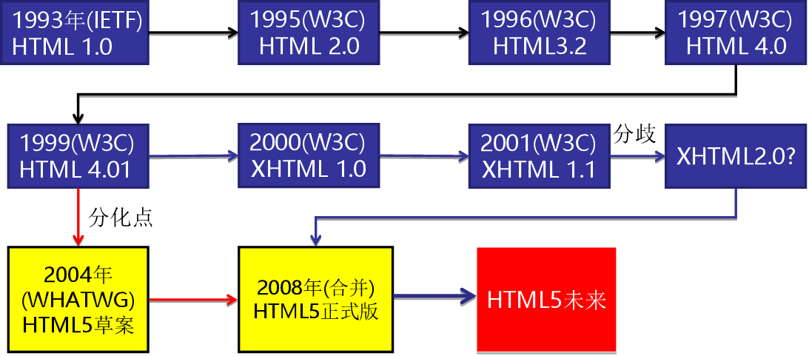
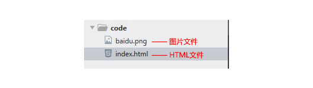

<span id="js"></span>

# Web基础
	web是运行在Internet上的应用，即网页(WWW)，能够将各类信息和服务进行连接并提供图形用户界面
		W3C： World Wide Web Consortium(万维网联盟)，负责制定和推广Web规范
>  
html -> Hyper Text Markup Language(超文本标记语言)  
    - 超文本：具有特殊功能个文本  
    - 标签：规范超文本的组成形式  
    - 语言：具备特定的语法规范   

**所谓超文本，有2层含义：** ````

1. 因为它可以加入图片、声音、动画、多媒体等内容（**超越文本限制 **）
2. 不仅如此，它还可以从一个文件跳转到另一个文件，与世界各地主机的文件连接（**超级链接文本 **）。

```html

```

**门外汉眼中的效果页面**


**我们要做的html页面**


>
Internet(因特网、国际互联网、网际网、交互网络) -> 全球性计算机互联网络
	- Telnet服务  
	- Email服务  
	- www(万维网)服务[Word wide web]  
	- BBS服务(论坛)  
	- ftp服务(文件传输协议)  
	- 基本实现技术  
		1、分组交换原理  
		2、TCP/IP协议簇  
http -> Hyper Text Transport Protocol(超文本传输协议)
	一种用来规范计算机之间通信格式的网络协议,规范数据如何打包及如何传递  
	- Request Message(请求)  
	- Response Message(响应)  
	- 报文: 出现在请求与响应之间  
url -> Uniform Resource Locator(统一资源定位符 )  
	对可以从互联网上得到的资源的位置和访问方法的一种简洁的表示  

## 常见浏览器内核（了解）
	浏览器内核(Rendering Engine)，中文翻译很多，排版引擎、解释引擎、渲染引擎，现在流行称为浏览器内核.
```
负责读取网页内容，整理讯息，计算网页的显示方式并显示页面.
```

浏览器占有的市场份额 : <a href="http://tongji.baidu.com/data/browser" target="_blank">http://tongji.baidu.com/data/browser</a>


| 浏览器  |      内核      | 备注                                                         |
| :------ | :------------: | :----------------------------------------------------------- |
| IE      |    Trident     | IE、猎豹安全、360极速浏览器、百度浏览器                      |
| firefox |     Gecko      | 可惜这几年已经没落了，打开速度慢、升级频繁、猪一样的队友flash、神一样的对手chrome。 |
| Safari  |     webkit     | 现在很多人错误地把 webkit 叫做 chrome内核（即使 chrome内核已经是 blink 了）。苹果感觉像被别人抢了媳妇，都哭晕再厕所里面了。 |
| chrome  | Chromium/Blink | 在 Chromium 项目中研发 Blink 渲染引擎（即浏览器核心），内置于 Chrome 浏览器之中。Blink 其实是 WebKit 的分支。大部分国产浏览器最新版都采用Blink内核。二次开发 |
| Opera   |     blink      | 现在跟随chrome用blink内核。                                  |

		浏览器内核包括两部分，渲染引擎和js引擎。渲染引擎负责读取网页内容，整理讯息，计算网页的显示方式并显示页面，js引擎是解析执行js获取网页的动态效果。 后来 JS 引擎越来越独立，内核就倾向于只指渲染引擎。
[五大主流浏览器内核的源起以及国内各大浏览器内核总结](http://blog.csdn.net/summer_15/article/details/71249203) 

**拓展阅读：**
```
移动端的浏览器内核主要说的是系统内置浏览器的内核。

Android手机而言，使用率最高的就是Webkit内核，大部分国产浏览器宣称的自己的内核，基本上也是属于webkit二次开发。

iOS以及WP7平台上，由于系统原因，系统大部分自带浏览器内核，一般是Safari或者IE内核Trident的
```

## Web的工作原理  
	1、基于 B/S 结构模式的程序  
		计算机程序模式：  
			- C/S  
			  C: Client 客户端
			  S: Server 服务器
			只能通过指定客户端	去访问服务器数据的一种方式  
				ex：QQ 微信  
			- B/S  
			  B: Browser 浏览器
			  S: Server 服务器
			通过浏览器去访问服务器数据的一种方式  
	2、由Web服务器(Server)、浏览器(Browser)、通信协议(http)组成  

## Web相关技术

	- 服务器技术
		php
		jsp
		asp
		asp.net
	- 客户端技术
		html
		css
		javascript

## Web标准

**构成：** 主要包括结构（Structure）、表现（Presentation）和行为（Behavior）三个方面。

| 标准 | 说明                                                         | 备注                           |
| :--- | :----------------------------------------------------------- | :----------------------------- |
| 结构 | 结构用于对**网页元素**进行整理和分类，咱们主要学的是HTML。   |   |
| 表现 | 表现用于设置网页元素的版式、颜色、大小等**外观样式**，主要指的是CSS |     |
| 行为 | 行为是指网页模型的定义及**交互**的编写，咱们主要学的是 Javascript |  |

 理想状态我们的源码： .HTML      .css      .js 
 * web标准有三层结构，分别是结构（html）、表现（css）和行为（javascript） 

# HTML基础  
		代码开发工具（IDE）[DW,sublimeText,vsCode,WebStorm10...]


[HTML5的崛起之路](http://www.chinaz.com/manage/2015/0720/424831.shtml)

## HTML与XHTML
		XHTML与html5几乎相同，但更严格、更纯净
### 什么是XHTML

XHTML 是更严格更纯净的 HTML 代码。

- XHTML 指**可扩展超文本标签语言**（EXtensible HyperText Markup Language）。
- XHTML 的目标是取代 HTML。
- XHTML 与 HTML 4.01 几乎是相同的。
- XHTML 是更严格更纯净的 HTML 版本。
- XHTML 是作为一种 XML 应用被重新定义的 HTML。
- XHTML 是一个 W3C 标准。

### HTML和 XHTML之间有什么区别?

- XHTML 指的是可扩展超文本标记语言
- XHTML 与 HTML 4.01 几乎是相同的
- XHTML 是更严格更纯净的 HTML 版本
- XHTML 是以 XML 应用的方式定义的 HTML
- XHTML 是 2001 年 1 月发布的 W3C 推荐标准
- XHTML 得到所有主流浏览器的支持
- XHTML 元素是以 XML 格式编写的 HTML 元素。XHTML是严格版本的HTML，例如它要求标签必须小写，标签必须被正确关闭，标签顺序必须正确排列，对于属性都必须使用双引号等。

## html骨架标签/固定结构代码

```html
<html>   
    <head>     
		<meta charset="utf-8" ; content="text/html">
        <title></title>
    </head>
    <body>
    </body>
</html>
```

| 标签名              |   定义   | 说明                             |
| ---------------- | :----: | :----------------------------- |
| <html></html>    | HTML标签 | 页面中最大的标签，我们成为  根标签             |
| <head></head>    | 文档的头部  | 注意在head标签中我们必须要设置的标签是title     |
| <title></title> | 文档的标题  | 让页面拥有一个属于自己的网页标题               |
| <body></body>    | 文档的主体  | 元素包含文档的所有内容，页面内容 基本都是放到body里面的 |

## 标记语法
	html中用于描述功能的符号称为标记
>  封闭类型标记
	- 双标签，必须成对出现
	* 该语法中“<标签名>”表示该标签的作用开始，一般称为“开始标签（start tag）”，“</标签名>” 表示该标签的作用结束，一般称为“结束标签（end tag）”。
	* 和开始标签相比，结束标签只是在前面加了一个关闭符“/”。
		<标记>内容</标记>	

>  非封闭类型标记
	- 单标记、空标记
		<标记>
		或
		<标记/>

## 字符集 

~~~html
<meta charset="UTF-8" />
~~~

~~~
字符集(Character set)是多个字符的集合。

计算机要准确的处理各种字符集文字，需要进行字符编码，以便计算机能够识别和存储各种文字。
~~~

utf-8是目前最常用的字符集编码方式，常用的字符集编码方式还有gbk和gb2312。

* gb2312 简单中文  包括6763个汉字  GUO BIAO
* BIG5   繁体中文 港澳台等用
* GBK包含全部中文字符    是GB2312的扩展，加入对繁体字的支持，兼容GB2312
* UTF-8则基本包含全世界所有国家需要用到的字符
* **这句代码非常关键， 是必须要写的代码，否则可能引起乱码的情况。**

## 元素
	元素,即标记
		ex：<a>Allen</a>
> 元素嵌套
	- 在一个元素中，允许出现另一个元素，形成更为复杂的语法结构
	ex：<a>
		​	
		</a>
> 块级元素
	- display:block
	- p标记不能嵌套块级元素
> 行内元素
	- display:inline

### 属性和值
	属性用来修饰元素
		<标签 属性=“值”></标签>
		ex：<p align="center"></p>
> 标准属性
	- 又称通用属性，页面元素都具备
		id、title、class、style

### 注释
	注释不会被浏览器所解释运行的 ctrl + /
		<!-- 内容 -->

## 文档结构
> 文档类型声明
	- 作用：指定文档的版本和类型
	- 语法：<!doctype html>
> html页面
	- 语法：<html></html>[HTML根标记]
	- 内容：
		<head></head>[网页头部]
			作用：定义页面中的全局信息
			内容：
				<tltie></title>[网页标题]
				<meta content="text/html";charset="utf-8"/>
					作用：指定网页编码格式
				<meta name="keywords";conten="关键词1,关键词2,关键词3"> 
					定义网页关键字
				<meta name="description";content="描述信息"> 
					定义网页描述信息
				以上两点针对搜索引擎
		<body></body>[网页主题]  

### 特殊字符  
		&lt;  <
		&gt;  >
		&nbsp;  空格
		&copy;  ©
		&yen;  ￥


### 文本样式
		<b></b> 加粗
		<i></i> 斜体
		<u></u> 下划线
		<s></s> 删除线
		<sup></sup> 上标
		<sub></sub> 下标
		<p></p> 段落


### 特殊元素
		<br/> 换行
		<hr/> 分割线
			size:大小
			width:宽度
			align:对齐方式
			color:颜色
	预格式化
		<pre></pre>[保留文档格式,即保留换行和空格]
	快分区元素
		<div></div>
	行内分区元素
		<span></span>[设置同行文字样式]

## 图像、链接、表格、列表
### 图像和链接
> URL --> web站点中存储文件的文件夹(严格区分大小写)
绝对路径
　　从文件所在的最高级目录下开始的完整路径
	* 访问互联网上的资源
		- 协议名称
		- 主机名（IP地址/域名）
		- 目录路径
		- 文件名
	* 访问本机资源
		- 从盘符所在位置出一直到资源文件所经过的路径
相对路径
　　从文件所在位置开始，查找资源文件所在位置所经过的路径
根相对路径

> 图像格式  
　　wen所支持的图像格式：  
	​	- jpeg(有损压缩)[*.jpg]
	​	- gif(动态图像)[*.gif]
	​	- png(无损压缩,有8/24/32颜色形式,支持透明色)[*.png]

+ 图像元素
```html
	
```

+ 链接
```html
	<a href="链接的url";target="指定打开新网页形式"></a>
```
| 属性   | 作用                                                         |
| ------ | :----------------------------------------------------------- |
| href   | 用于指定链接目标的url地址，（必须属性）当为标签应用href属性时，它就具有了超链接的功能 |
| target | 用于指定链接页面的打开方式，其取值有_self和_blank两种，其中_self为默认值，__blank为在新窗口中打开方式。 |

		target:
			_blank：在新标签页中打开
			_self：在自身页面中打开(默认值)
+ 链接形式
		- 点击下载资源
			<a href="*.zip/rar"></a>
		- 链接电子邮件
			<a href="mailto:邮箱地址"></a>
		- 返回页面顶部
			<a href="#"></a>
		- 连接到Javascript
			<a href="javascript:js脚本"></a>
+ 锚点
		在网页的任意位置处做记号，可由任意位置跳转
	​		* 定义锚点
	​			- a 标签的name 属性
	​				<a name="名称"></a>
	​			- 任意标记的id 属性
	​				<div id="锚点名称"></div>
	​		* 链接锚点
	​			- 当前页面
	​				<a href="#锚点名称"></a>
	​			- 其他页面
	​				<a href="页面URL#锚点名称"></a>

**注意：**

1. 外部链接 需要添加 http:// www.baidu.com
2. 内部链接 直接链接内部页面名称即可 比如 < a href="index.html"> 首页 </a >
3. 如果当时没有确定链接目标时，通常将链接标签的href属性值定义为“#”(即href="#")，表示该链接暂时为一个空链接。
4. 不仅可以创建文本超链接，在网页中各种网页元素，如图像、表格、音频、视频等都可以添加超链接。

### 表格
> 创建表格
```html
	<table></table>
```
		border：边框宽度
		cellpadding：单元格内边距
		cellspacing：单元格外边距
		bgcolor：背景颜色	


> 行
```html
	<tr></tr>
```
	valign：行内垂直对齐方式(top|middle|bottom)
>> 行分组  
	- 表头行分组,内部必须拥有 <tr> 标签
		<thead></thead>
	- 表主体行分组,用于定义表格的主体。放数据本体 。
		<tbody></tbody>
	- 表尾行分组,放表格的脚注之类。
		<tfoot></tfoot>

> 表头单元格标签th
- 作用：
  - 一般表头单元格位于表格的第一行或第一列，并且文本加粗居中
- 语法：
  - 只需用表头标签&lt;th&gt;&lt;/th&gt;替代相应的单元格标签&lt;td&gt;&lt;/td&gt;即可。 

 

**案例2：**

​	效果图


​	代码：

***

```html
<table width="500" border="1" align="center" cellspacing="0" cellpadding="0">
		<tr>  
			<th>姓名</th> 
			<th>性别</th>
			<th>电话</th>
		</tr>
		<tr>
			<td>小王</td>
			<td>女</td>
			<td>110</td>
		</tr>
		<tr>
			<td>小明</td>
			<td>男</td>
			<td>120</td>
		</tr>	
	</table>
```
* th 也是一个单元格   只不过和普通的 td单元格不一样，它会让自己里面的文字居中且加粗

> 列
```html
	<td></td>
```
	* colspan：列合并
	* rowspan：行合并

1. table用于定义一个表格标签。

2. tr标签 用于定义表格中的行，必须嵌套在 table标签中。

3. td 用于定义表格中的单元格，必须嵌套在<tr></tr>标签中。

4. 字母 td 指表格数据（table data），即数据单元格的内容，现在我们明白，表格最合适的地方就是用来存储数据的。


> 表格标题
```html
	<caption></caption>
```
	- 默认表格上方居中显示
	- <caption>必须紧跟<table>后面

| 标签名              | 定义           | 说明                                         |
| ------------------- | :------------- | :------------------------------------------- |
| <table></table>     | 表格标签       | 就是一个四方的盒子                           |
| <tr></tr>           | 表格行标签     | 行标签要再table标签内部才有意义              |
| <td></td>           | 单元格标签     | 单元格标签是个容器级元素，可以放任何东西     |
| <th></th>           | 表头单元格标签 | 它还是一个单元格，但是里面的文字会居中且加粗 |
| <caption></caption> | 表格标题标签   | 表格的标题，跟着表格一起走，和表格居中对齐   |
| clospan 和 rowspan  | 合并属性       | 用来合并单元格的                             |

1. 表格提供了HTML 中定义表格式数据的方法。
2. 表格中由行中的单元格组成。
3. 表格中没有列元素，列的个数取决于行的单元格个数。
4. 表格不要纠结于外观，那是CSS 的作用。
5. 表格的学习要求：  能手写表格结构，并且能简单合并单元格。

### 列表
	所有的列表都是由 列表类型 和 列表项
> 有序列表
	- <ol></ol>
		type：指定类型
		​	1(默认值)
		​	a(小写字母类型)
		​	A(大写字母类型)
		​	i(小写罗马数字类型)
		​	I(大写罗马数字)
		start：指定起始编号
		​	取值：数字
> 无序列表
	- <ul></ul>
		type：指定类型
		​	disc：实心圆(默认值)
		​	circle：空心圆
		​	square：实心矩形
		​	none：不显示列表项
> 列表项
	- <li></li>
```
 1. <ul></ul>中只能嵌套<li></li>，直接在<ul></ul>标签中输入其他标签或者文字的做法是不被允许的。
 2. <li>与</li>之间相当于一个容器，可以容纳所有元素。
 3. 无序列表会带有自己样式属性，放下那个样式，一会让CSS来！
```
> 定义列表　　
	- 用于要给出一类实物的定义情形<在图、文混排时优先使用>
		- <dl></dl> -- 定义一个定义列表
			- <dt></dt> -- 定义；劫镖中的“术语”
			- <dd></dd> -- 定义列表中“术语”的“解释”

| 标签名    |     定义     | 说明                                                   |
| --------- | :----------: | :----------------------------------------------------- |
| <ul></ul> | **无序标签** | 里面只能包含li    没有顺序，我们以后布局中最常用的列表 |
| <ol></ol> |   有序标签   | 里面只能包含li    有顺序， 使用情况较少                |
| <dl></dl> |  自定义列表  | 里面有2个兄弟， dt 和 dd                               |

### 路径 
* 相对路径 
	以引用文件之网页所在位置为参考基础，而建立出的目录路径。因此，当保存于不同目录的网页引用同一个文件时，所使用的路径将不相同，故称之为相对路径。

| 路径分类   | 符号  | 说明                                                         |
| ---------- | :---: | :----------------------------------------------------------- |
| 同一级路径 |       | 只需输入图像文件的名称即可，如&lt;img src="baidu.gif" /&gt;。 |
| 下一级路径 |  “/”  | 图像文件位于HTML文件同级文件夹下（例如文件夹名称为：images）                         如&lt;img src="images/baidu.gif" /&gt;。   |
| 上一级路径 | “../” | 在文件名之前加入“../” ，如果是上两级，则需要使用 “../ ../”，以此类推，                    如&lt;img src="../baidu.gif" /&gt;。  |

> 相对路径，是从代码所在的这个文件出发， 去寻找我们的目标文件的，而 我们所说的 上一级 下一级 同一级  简单说，就是 图片 位于 HTML 页面的位置

* 绝对路径
绝对路径以Web站点根目录为参考基础的目录路径。之所以称为绝对，意指当所有网页引用同一个文件时，所使用的路径都是一样的。

“D:\web\img\logo.gif”，或完整的网络地址，例如“http://www.itcast.cn/images/logo.gif”。

**注意：**

绝对路径用的较少，我们理解下就可以了。  但是要注意，它的写法 特别是符号  \  并不是 相对路径的   /    

## 结构标记
	用于表示页面中的布局，目的是为了提升标记的语义化
> header元素  
> - ```<header></header>```
>
>   定义html文档的页眉,可以用来表示任何位置的头部
>   nav元素  
> - ```<nav></nav>```
>
>   用于页面中的导航部分
>   section元素  
> - <setion></section>
> 	用于表示页面中的主体部分
> article元素  
> - ```<article></article>```
>
>   用于表示独立于文档的其他部分的内容
>   ex：新闻内容、帖子、音视频
>   footer元素
> - ```<footer></footer>```
>
>   用于表示网页底部的信息
>   aside元素
> - ```<aside></aside>```
>
>   用于表示网页中边栏信息（网页中在左边或右边的导航栏）

## 表单
	用来显示、收集用户信息，并将信息提交给服务器
### 表单元素
	- <form> </form>
		action：定义表单提交的动作，即服务器上处理数据的应用程序的url，默认值是提交给本页
		method：指定表单数据提交的方式
		​	get：向服务器端请求数据时使用 [用户数据可以显示字地址栏、提交数据有长度限制：2KB](默认值)
		​	post：向服务器传递数据时使用 [隐藏式提交、无数据大小限制]
		enctype：表单数据进行编码的方式
		​	application/x-www-form-urlencoded(默认值)：字符编码
		​	multipart/form-data：上传文件时使用
		​	text/plain
### 表单控件
	- 提供多种类的表单控件，并且具备可视化的外观，可以接收用户的数据
> inpput元素
	- <input>或<input/>
	  ```html
  		<input type="属性值" value="你好">
  	```
		type：用来创建各类型的输入字段
		​	- text：文本框		- password：密码框
		​		maxlenght：限制输入字符数
		​		readonly：只读,无值属性，出现即实现效果
		​		name以控件的缩写+功能名组成：文本框和密码框缩写为txt
		​		vlue 默认值    
		​		placeholder 占位符,起到提示作用
		```html
			用户名: <input type="text" /> 
			密  码：<input type="password" />
		```
		​	- radio：单选按钮		- checkbox：复选框
		​		缩写：rdo         	缩写：chk
		​		checked：设置默认被选中
		```html
			性    别:
			<input type="radio" name="sex" value="男" checked="checked" />男
			<input type="radio" name="sex" value="女" />女 
		```
		​		一组单选按钮或复选框name必须一致
		​	- submit：提交按钮	- reset：重置按钮	- button：普通按钮
		​		缩写：btn
		​		value：按钮上的现实文本
		​	- hidden：隐藏域
		​		缩写：txt
		​	- file：文件选择框[post、multipart/form-data]
		​		缩写：txt
		value：要提交给服务器的值
		```html
			用户名:<input type="text"  name="username" value="请输入用户名"> 
		```
		name：控件的名称，服务器端使用，没有无法提交数据
		disabled：禁用控件，无值，只要出现就表示禁用

 

> textarea元素
> - ```<textarea></textarea>``` 多行文本框
>
>   缩写：txt
>   cols：指定文本域列数（当前控件宽度）
>   rows：指定文本域的行数（当前控件高度）
>   选项框（select和option）	
> - 下拉选项框
> - 滚动列表
>   - ```<select> </select>``` 创建选项框或滚动列表
>
>     缩写：sel
>     size：当前默认的选项数量，大于1为滚动列表
>     multiple：设置多选，无值属性
>   - <option></option> 选项框中的选项
>   	value：值
>   	selected：预选中
>   其他元素
> - label元素
> 	关联文本与表单控件
> 	- <label></label>
> 		for：表示与该元素相关的表单控件的ID值
> ```html
> 	<label> 用户名： <input type="radio" name="usename" value="请输入用户名">   </label>
> ```
> ```html
> 	<label for="sex">男</label>
> 	<input type="radio"  id="sex">
> ```
> - fieldset元素
> 	为控件分组
> 	- <fieldset></fieldset>
> 		- <legend></legend>
> 			为分组指定标题
> - button元素
> 	- <button></button>
> 		放在form中为提交按钮，在form外是普通按钮（IE除外）

## 其他标记
> 浮动框架
> - 可以在一个浏览器窗口中同时显示多个页面文档
> - ```<iframe>内容</iframe>```
>
>   当浏览器不支持时将显示内容作为该出的内容
>   - src：浮动框架中的网页URL
>   - width
>   - height
>   - frameborder：边框，0为取消边框
>   摘要与细节
> - 允许将页面某部分内容进行展开或收缩
> - <details></details>
>   - <summary>标题</summary>
>   度量元素
> - 用于显示静态比例的信息
> - ```<meter>文本</meter>```
>   min：度量范围的最小值，默认为0
>   max：度量范围的最大值，默认为1
>   value：当前显示的度量值，默认为0
>   时间元素
> - 用于关联时间的不同表现形式
> - <time>时间显示文本</time>
>   datetime：关联的日期时间，可以只关联日期也可指关联时间，如果同时关联用 T 分割
>   高亮文本显示
> - 将页面中的某部分文本以特殊的颜色背景表现
>
>   ```<mark>文本 </mark>```

# CSS基础
	CSS -> Cascading Style Sheets（样式表）
		以统一的方式实现样式的定义，提高页面样式的可重用性和可维护性
> html引用外部CSS
```html
	<link type="text/css" rel="stylesheet" href="外部CSS地址" />
```
> html内部CSS
```html
	<style type="text/css">
	</style>
```
> html内联方式CSS
>
> - style属性 + 若干的样式声明
[CSS的发展史](https://mp.weixin.qq.com/s?__biz=MzAwNTAzMjcxNg%3D%3D&mid=2651424749&idx=1&sn=f58bca144f50bff00ba7d1675cc8b8e7&scene=4)

## css样式
### css样式表特征
> 继承性
	- 子级元素可以直接使用父级元素声明的样式，大部分样式可以继承	
> 层叠性
	- 可以为一个元素声明多个样式规则
> 优先级
	- 样式定义冲突时，按照不同样式的使用的“优先级”来应用样式
		- 浏览器缺省设置（User Agent Stylesheet）
		- 外部样式表或内部样式表（谁离元素近用谁）
		- 内联样式
> !important规则
	- 显示调整样式的优先级
	- 在属性值后面空格加 !important
		IE6及以下浏览器不支持
		打破默认的优先规则，尽量少用

### css基础选择器
	规范了页面中元素能够使用定义好的样式，及匹配页面元素
> 通用选择器
> - 匹配页面所有元素(效率低)
>   - *{
>
>     ​	样式声明
>
>     };
>     元素选择器(1)
>
> - 定义页面某一标签的默认样式
>   - 元素名称{
>
>     ​	样式声明
>
>     };
>     类选择器(10)
>
> - 由CSS定义好，可以被任意标记的class属性进行引用的选择器
>   - .类名{
>
>     ​	样式声明
>
>     };
>
>     - 不能以数字开头
>     - 除 _ 以外不能使用其他特殊符号
>     - 一个元素需要引用多个类选择器在class之中以空格相隔
>     分类选择器
>
> - 将元素选择器和类选择器结合起来使用，从而实现对某种元素不同样式的细分
>   - 元素选择器.类选择器{
>
>     ​	样式声明
>
>     };
>     ID选择器(100)
>
> - 针对指定ID值的元素去定义样式
>   - #ID值{
>
>     ​	样式名称
>
>     };
>     群组选择器
>
> - 选择器声明是以逗号相隔的选择器列表
>   - 选择器1,选择器2...{
>
>     ​	样式声明
>
>     };
>     后代选择器
>
> - 只要具备层级关系的元素，被嵌套的都可以称之为后代元素
>
>   - 选择器1  选择器2...{
>
>   ​	样式声明
>
>   };
>
>   子代选择器
>
> - 只具备一级层级关系的元素，被嵌套的称之为子代元素
>   - 选择器1>选择器2{
>
>     ​	样式声明
>
>     };
>     伪类选择器(10)
>
> - 匹配页面元素的不同状态的选择器
>   - 链接伪类
>   	- :link  匹配尚未访问的超链接状态
>   	- :visited  匹配访问过后的超链接状态
>   - 动态伪类
>   	- :hover  匹配鼠标悬停在元素上的状态
>   	- :action  匹配元素被激活(点击)的状态
>   	- :focus  匹配元素获取焦点时的状态[文本框、密码框、文本域]
>   - 目标伪类
>   - 元素状态伪类
>   - 结构伪类
>   - 结构伪类
>   - 否定伪类

### css样式
	color 颜色
		rgb(red,green,blue) (0 ~ 255)
		十六进制 : 0 1 2 3 4 5 6 7 8 9 a b c d e f
		pruple 紫色
		pink 粉色
		red 红色
		blue 蓝色
		silver 银灰色
		yellow 黄色
		green 绿色
		gray 灰色
		black 黑色
		white 白色
		orang 橙色
	widtn 元素宽度
	min-width 最小宽度
	max-width 最大宽度
	height 元素高度 同上	
	
	text-decoration:none 取消下划线 

> 溢出
	- 使用尺寸属性限制元素大小时，如果内容需要的空间大于元素本身，则出现溢出
		- overflow	
			- visible（默认值）溢出可见
			- hidden 溢出隐藏
			- scroll 溢出滚动查看
			- auto 内容溢出时显示滚动条，不溢出时隐藏滚动条
		- overflow-x (横向溢出处理)
		- overflow-y (纵向溢出处理)

> border 边框
	- border-方向 [top right bottom left]
		- solid 实线
		- dotted 虚线
		- dashed 虚线
		- transparent 透明[color]
	- none 或 0 取消元素边框
	- border-属性 [width color style]
	- border-方向-属性
	- 边框倒角
		- border-radius:（绝对数值 或 百分比）
	- 边框阴影
		- box-shadow
			- h-shadow 水平偏移距离[必须],+ 右，- 左
			- v-shadow 垂直偏移距离，+ 下，- 上
			- blur 模糊距离
			- spread 阴影尺寸
			- color 颜色
			- inset 值，默认的外阴影更改为内阴影
	- 轮廓
		- 绘制与元素周围的线，位于边框之外
		- outline:width tyle color;
		- outline:none; 取消轮廓

> 框模型
	- 页面的一切皆为框
	- Box-Model 定义了元素框处理元素内容，内边距以及外边距的方式
		- 对象实际宽度=左右外边距+左右边距+左右内边距+width
 	- 外边距
	 	- margin:value;[top right bottom left]
		 	- margin:v1 v2; v1上下外边距 v2左右外边距
		 	- margin:v1 v2 v3; v1上 v2左右 v3下
		 	- margin:v1 v2 v3 v4; 上 右 下 左
	 	- margin:auto;允许块级元素水平居中显示
	 	- 移动元素
		 	- margin-[方向]:数值; 
	- 内边距
		- padding:value;[top right bottom left]
	- box-sizing
		- 重新指定元素框架模型的计算模式
		- 元素边框内占地区域=左右边距+左右内边距+width
		- content-box （默认值）
		- border-box 元素尺寸将 包含边框和内边距
	- 背景属性
		- background-color: transparent;(透明) 
		- background-image: url(图像路径);
		- background-repeat
			- repeat(默认) 水平垂直平铺
			- repeat-x 水平方向平铺
			- repeat-y 垂直方向平铺
			- no-repeat 不平铺
		- background-size 背景图片尺寸
			- v1 v2 指定宽度和高度
			- cover 覆盖，等比放大
			- contain 将背景图等比放大，直到一边碰到边缘为止
		- background-attachment
			- 固定背景图片位置
			- scroll （默认值）随文档滚动
			- fixed 固定
		- background-position
			- 改变背景图片的默认位置
			- x y
				- 取值为正 向右 向下 取值为负 向左 向上
			- x% y%
				- 0% 0% 左上角
				- 100% 100% 右下角
			- 关键字 x y
				- left center right
				- top center bottom
		- Css Sprites
			- 将一些小的背景图合并到大的背景中
		- background
			- color url repeat attachment position
			- 以空格隔开 如果不设置值将是默认值

> 渐变
	- 两种或多种颜色间平滑过渡的效果
	- background-image
		- linear-gradient() 线性渐变
			- (angle,color-point,color-point,...)
				- angle 方向或角度-即渐变填充方向
					- to top 从下向上
					- to right 从左向右
					- to bottom 从上向上
					- to left 从右向左
					- 0deg ~ 360deg 角度
						- 0deg = to top
						- 90deg = to right
						- 180deg = to bottom
						- 270deg = to left
				- color-point 色标，表示颜色及出现位置
					- 颜色 + 位置[可用百分比或像素，如省略则默认平分区域] 中间用空格隔开
		- radial-gradient() 径向渐变
			- ([size at position],color-point,color-point,...)
				- size at position 径向渐变的半径和圆心位置（可省略）
					- v1 at v2 v3 单位为px，圆的半径加圆的位置
						- 0px 0px 圆心在左上角
						- 50% 50% 圆心在元素中间
						- top right bottom left center 关键字设置圆心位置
		- repeating-linear-gradient() 重复线性
		- repeating-radial-gradient() 重复径向
	- 浏览器兼容性问题
		- 对于不支持渐变的浏览器可以增加浏览器前缀去实现渐变
		- 浏览器前缀 
			- Firefox ： -moz-
			- Chrom、Safari ： -webkit-
			- Opera ： -o-
			- 前缀的加载位置：
				- 如果浏览器不支持属性，则将前缀加载在属性名称前
				- 如果浏览器支持属性但不支持值，则将前缀加载在值的前面
> 文本格式化
	- 字体属性
		- font-family 字体系列[默认宋体]
			- value1,vlaue2,... 字体取值时包含中文或特殊符号用“”
		- font-size 文字大小
			- px 或 pt 或 em [默认 16px] 
		- font-style 文字样式
			- italic 斜体
			- normal 正常体
		- font-weight 字体加粗
			- normal 正常体
			- bold 粗体
			- 400 ~ 900 [400相当于normal，900相当于bold]
		- font-variant 小型大写字母
			- 针对英文，将小写字符变成大写字符，但大小与小写一致
			- normal 正常体
			- small-caps 小型大写字母
		- font 字体属性
			- style varaint weight size family[family的值必须设定]
	- 文本属性
		- 文本排列方式
			- 指定当前元素中的文本，行内元素，行内块元素的水平对齐方式
			- text-align
				- left center right
		- 文字修饰
			- 指定文本线条样式
			- text-decoration
				- none 无
				- underline 下划线 <u></u>
				- overline 上划线
				- line-through 删除线 <s></s>
		- 行高
			- 指定元素一行的行高
			- 如果行高的高度高于文字本身，那么该行文本将在行高的范围内垂直居中
			- line-height
				- px
		- 首行文本缩进
			- text-indent
				- px
	```
		隐藏logo中h1标签的文字说明
		text-indent: -999px;
		overflow: hidden;
	```
		- 文本阴影
			- text-shadow
				- h-shadow v-shadow blur color

> 表格
	- 边距属性 padding
	- 尺寸属性 width、height
	- 文本格式化属性
	- 背景属性（背景图、背景色、渐变）
	- border属性
	- vertical-align
		- 在单元格中，设置文本的垂直对齐方式
		- top middle bottom
	- border-collapse
		- separate 默认值，分离边框模式
		- collapse 边框合并效果
	- 边框边距
		- border-spacing
			- 单元格之间的距离
			- 一个值 表示水平和垂直间距相同
			- 指定两个值 第一个值便是水平间距，第二个值表示垂直间距
	- 标题位置
		- caption-side
			- top 标题显示在表格之上
			- bottom 标题显示在表格之下
	- 显示规则
		- 指定表格的布局方式
		- 默认布局，自动表格布局，即由内容决定宽的
		- table-layout
			- auto 自动（默认值）
			- fixed 固定布局

> 浮动
	- 浮动定位 
		-  浮动元素会被排除在文档流之外 即 脱离文档流 元素不在占据页面控件，其他未浮动元素上前补位
		-  浮动元素将会停靠在父元素左边或右边，或停靠在其他已浮动元素的边缘
		-  浮动元素只会在当前行内浮动
		-  浮动元素依然位于父元素之内
			-  让多个块级元素在一行内现实 
		- float
			- none 默认值，无浮动定位
			- left 左浮动
			- right 右浮动
		- 元素浮动起来后将变成块级元素
			- 块级元素 允许修改尺寸
			- 行内元素 无法修改尺寸
		- 文本。行内元素、行内块元素采用环绕的方式排列，不会被浮动元素压在下面，会巧妙的避开浮动元素
	- 清除浮动
		- 元素浮动后，除了影响自己位置外，还会有影响后续元素
		- clear
			- none 默认值，不清除
			- left 清除当前元素的前面元素的左浮动带来的影响
			- right 清除当前元素的前面元素的右浮动带来的影响
			- both 清除左右浮动带来的影响

> 显示
	- 显示方式决定了元素在页面中如何摆放定位
		- display
			- none 隐藏元素，脱离文档流不占据页面空间
			- block 让元素变成块级元素
			- inline 让元素变成行内元素
			- inline-block 让元素变成行内块元素[多个元素一行显示，允许修改尺寸]
	- 显示效果控制元素可见性
		- visibility
			- visible 默认值，可见
			- hidden 隐藏，依然占据页面空间
			- collapse 使用在表格元素，删除一行或一列时不影响表格整体布局
		- opacity 
			- 改变元素透明度
			- 0.0（完全透明） ~ 1.0（完全显示）
		- vertical-align
			- top/middle/bottom/baseline（默认，基线对齐） 

> 光标
	- cursor
		- default 默认
		- pointer 小手
		- crosshair +
		- text I
		- wait 等待
		- help 帮助
> 列表
	- list-style-type
		- none 无标记显示
		- disc 实心圆
		- circle 空心圆
		- aquare 实心方块
	- list-style-image
		- 自定义图像显示标识
		- url(图像路径)
	- list-style-position
		- outside 默认值，标识的位置在列表项之外
		- inside 标识的位置放置列表项之内
	- list-style
		- type url() position
		- 常用 list-style:none;
> 定位
	- position
		- static 默认值，静态定位
		- relative 相对定位
		- absolute 绝对定位
		- fixed 固定定位
	- top bottom left right
		- 以px为单位的数值
	- z-index 堆叠顺序
		- 没有单位的数字，值越大越靠上

# node.js
	1、javascript语言通过node在服务器上运行
	2、node提供大量的工具库，使javascript语言与操作系统互动（文件操作、网络操作、系统操作...）
[Javascript标准参考](http://javascript.ruanyifeng.com/#nodejs)  
## 环境变量设置
> Win+R调出运行 -> sysdm.cpl(电脑系统属性面板)  
> 　cmd 用set [name]查看环境变量  
>
> > PowerShell用dir env:[name]查看环境变量  

## 控制台输入：(REPL环境，用于测试一些基本的代码)
	node （进入node.js程序）
	var a = 1； (赋值)
	consloe.log(a); (输出a的值)
	consloe.tome('main'); (代码计时器)
	console.timeEnd('main');
	node --use_strict (启用node严格模式，严格判断语法)
	_ (表示上一次执行的返回结果)
	.exit (退出node.js)
	node -e '' (直接执行代码)　　
	
	global (获取REPL环境下的全局变量)
			例： var a = 1;
			global.a 
	process (用于获取当前node进程信息)
		例:	process.arch (当前操作系统位数)
			process.argv (获取命令行输入的参数)
				var argvs = process.argv.slice(2);
				switch (argvs[0]) {
   					case 'init':
​        				console.log('You need INIT');
​        				break;
​    				case 'install':
​       					var installPackageName = argvs[1];
​        				console.log('正在安装' + installPackageName);
​      				  	break;
​    				case 'uninstall':
​       	 				consolr.log('uninstall');
​       				 	break;
​				}
​				node node.js init 
​					-> You need INIT
​				node node.js install NBA
​					-> 正在安装NBA
​				...
​			process.env (获取系统的环境变量)
​			process.stdin (标准输入)
​			process.stdout (标准输出)
​				例: process.stdout.write('');
​						等价于
​					var log = function(message) {
​						process.stdout.write(message + '\n');
​					};
​					或
​					var log = (message) => {
​    					process.stdout.write(message + '\n');
​					};
​			``(模板字符,，可取变量，可回车换行,tab键上面的键)
​				例:  var msg = 'hello';
​					process.stdout.write(`${msg} 
​					work!`); (已回车换行)
​	node调试
​		-> console,log();
​		-> $ npm install node-inspector -g
​		   $ npm install devtool -g
​		-> 开发工具测试
​			Visual Studio Code
​			或
​			WebStorm
[https://nodejs.org/api/debugger.html](https://nodejs.org/api/debugger.html)

# Node服务器开发

> 事件驱动和非阻塞、模块化、核心模块、NPM

*****

## 事件驱动和非阻塞

```javascript
 
// $.ajax()  
// $.get('/user/list',{order:'id'})  

$.get('/delete/user',{id:10},function(data){}); //function(data){} 可省略
$.get('/delete/user',{id:10}).success  
(function(data){  
    console.log(1);  
}).error(function(error){  
    console.log(0);  
});// 错误优先  

// $.get('',{},function(err,data){  
//     if(err)  
// }); 

```
# 文件监视
	利用文件监视实现自动 markdown 文件转移

- 相关链接  
[https://github.com/chjj/marked](https://github.com/chjj/marked)  
[https://github.com/Browsersync/browser-sync](https://github.com/Browsersync/browser-sync)

- 实现思路  
	1、利用 fs 模块的文件监视功能监视指定 MD文件  
	2、当文件发生改变后，借助'marked'包提供的'markdown' to 'html'功能将改变后的 MD文件转化为Html  
	3、再将得到的Html替换到模块中  
	4、最后利用BrowserSync模块实现浏览器自动刷新

```javascript
const fs = require('fs');  
const path = require('path');  
var marked = require('marked');
var bs = require('browser-sync').create();

```

[TOP](#js)

