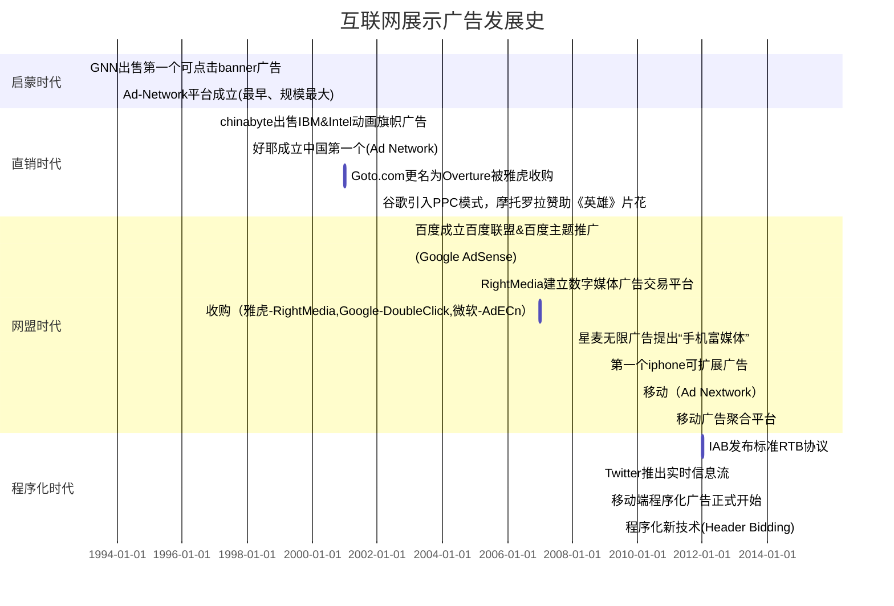
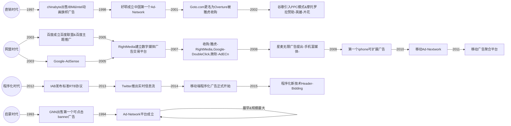

# Programmatic Advertising
---

```mermaid
	gantt
	dateFormat  YYYY
	title 互联网展示广告发展史
	section 启蒙时代
	
		GNN出售第一个可点击banner广告 	:active,des1,1993,3d
		Ad-Network平台成立(最早、规模最大)		:active,des2,1994,3d
	
	section 直销时代
	
		chinabyte出售IBM&Intel动画旗帜广告		:active,des3,1997,3d
		好耶成立中国第一个(Ad Network)		:active,des4,1998,3d
		Goto.com更名为Overture被雅虎收购		:active,des5,2001,3d
		谷歌引入PPC模式，摩托罗拉赞助《英雄》片花		:active,des6,2002,3d
	
	section 网盟时代
	
		百度成立百度联盟&百度主题推广		:active,des7,2003,3d
		(Google AdSense)		:active,des8,2003,3d
		RightMedia建立数字媒体广告交易平台		:active,des9,2005,3d
		收购（雅虎-RightMedia,Google-DoubleClick,微软-AdECn）		:active,des10,2007,3d
		星麦无限广告提出“手机富媒体”		:active,des11,2008,3d
		第一个iphone可扩展广告		:active,des12,2009,3d
		移动（Ad Nextwork）		:active,des13,2010,3d
		移动广告聚合平台		:active,des14,2011,3d
	
	section 程序化时代
	
		IAB发布标准RTB协议		:active,des15,2012,3d
		Twitter推出实时信息流		:active,des16,2013,3d
		移动端程序化广告正式开始		:active,des17,2014,3d
		程序化新技术(Header Bidding)		:active,des18,2015,3d
```

- 互联网展示广告发展史

```mermaid
graph LR

A((启蒙时代))
B((直销时代))
C((网盟时代))
D((程序化时代))
	
	A --> |1993| GNN出售第一个可点击banner广告
		--> |1994| Ad-Network平台成立
		--> |最早&规模最大| Ad-Network平台成立
	B
		--> |1997| chinabyte出售IBM&Intel动画旗帜广告
		--> |1998| 好耶成立中国第一个Ad-Network
		--> |2001| Goto.com更名为Overture被雅虎收购
		--> |2002| 谷歌引入PPC模式&摩托罗拉赞助-英雄-片花
	C
		--> |2003| 百度成立百度联盟&百度主题推广
		--> |2005| RightMedia建立数字媒体广告交易平台
	C --> |2003| Google-AdSense
		--> |2005| RightMedia建立数字媒体广告交易平台
		--> |2007| 收购:雅虎-RightMedia,Google-DoubleClick,微软-AdECn
		--> |2008| 星麦无限广告提出-手机富媒体-
		--> |2009| 第一个iphone可扩展广告
		--> |2010| 移动Ad-Nextwork
		--> |2011| 移动广告聚合平台
	D
		--> |2012| IAB发布标准RTB协议
		--> |2013| Twitter推出实时信息流
		--> |2014| 移动端程序化广告正式开始
		--> |2015| 程序化新技术Header-Bidding
```